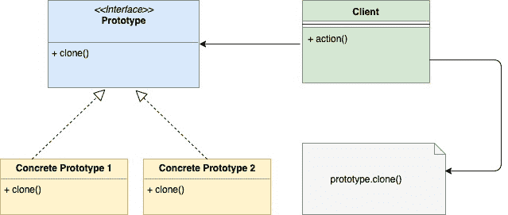

<!--yml

分类: 未分类

日期: 2024-10-13 06:01:53

-->

# Go (Golang)中的原型模式

> 来源：[https://golangbyexample.com/prototype-pattern-go/](https://golangbyexample.com/prototype-pattern-go/)

注意: 对于理解其他所有设计模式在GO中的实现有兴趣的人，请查看此完整参考 – [Go (Golang)中的所有设计模式](https://golangbyexample.com/all-design-patterns-golang/)

目录

**   [定义:](#Definition "Definition:")

+   [使用时机](#When_to_Use "When to Use")

+   [UML图](#UML_Diagram "UML Diagram")

+   [映射](#Mapping "Mapping")

+   [实际示例:](#Practical_Example "Practical Example:")*  *## **定义:**

这是一种创建型设计模式，允许你创建对象的副本。在此模式中，克隆对象的创建责任委托给实际的克隆对象。

要克隆的对象暴露一个克隆方法，该方法返回对象的克隆副本。

## **使用时机**

+   当克隆对象的创建过程复杂时，我们使用原型模式，即克隆可能涉及深拷贝、层次拷贝等处理。此外，可能还有一些私有成员也无法直接访问。

+   创建的是对象的副本，而不是从头创建一个新实例。这防止了在创建新对象时涉及的昂贵操作，例如数据库操作。

+   当你想要创建新对象的副本，但它仅作为接口可用时。因此，你不能直接创建该对象的副本。

## **UML图**



## **映射**

下表表示UML图中参与者到代码中实际实现参与者的映射。

| 原型接口 | inode.go |
| --- | --- |
| 具体原型 1 | file.go |
| 具体原型 2 | folder.go |
| 客户端 | main.go |

## **实际示例**:

在golang的上下文中，让我们尝试通过os文件系统的示例来理解它。os文件系统有文件和文件夹，文件夹本身也包含文件和文件夹。每个**文件**和**文件夹**可以由**inode**接口表示。**inode**接口还有**clone**()函数。

**inode.go**

```
package main

type inode interface {
    print(string)
    clone() inode
}
```

**文件**结构体表示为

**file.go**

```
package main

import "fmt"

type file struct {
	name string
}

func (f *file) print(indentation string) {
	fmt.Println(indentation + f.name)
}

func (f *file) clone() inode {
	return &file{name: f.name + "_clone"}
} 
```

**文件夹**结构体表示为

**folder.go**

```
package main

import "fmt"

type folder struct {
	childrens []inode
	name      string
}

func (f *folder) print(indentation string) {
	fmt.Println(indentation + f.name)
	for _, i := range f.childrens {
		i.print(indentation + indentation)
	}
}

func (f *folder) clone() inode {
	cloneFolder := &folder{name: f.name + "_clone"}
	var tempChildrens []inode
	for _, i := range f.childrens {
		copy := i.clone()
		tempChildrens = append(tempChildrens, copy)
	}
	cloneFolder.childrens = tempChildrens
	return cloneFolder
} 
```

由于**文件**和**文件夹**结构体都实现了**打印**和**克隆**函数，因此它们属于**inode**类型。此外，请注意文件和文件夹中的**克隆**函数。它们的**克隆**函数返回各自文件或文件夹的副本。在克隆时，我们为名称字段附加关键字“_clone”。让我们编写主函数来测试一下。

**main.go**

```
package main

import "fmt"

func main() {
    file1 := &file{name: "File1"}
    file2 := &file{name: "File2"}
    file3 := &file{name: "File3"}
    folder1 := &folder{
        childrens: []inode{file1},
        name:      "Folder1",
    }
    folder2 := &folder{
        childrens: []inode{folder1, file2, file3},
        name:      "Folder2",
    }
    fmt.Println("\nPrinting hierarchy for Folder2")
    folder2.print("  ")
    cloneFolder := folder2.clone()
    fmt.Println("\nPrinting hierarchy for clone Folder")
    cloneFolder.print("  ")
}
```

**输出:**

```
Printing hierarchy for Folder2
  Folder2
    Folder1
        File1
    File2
    File3

Printing hierarchy for clone Folder
  Folder2_clone
    Folder1_clone
        File1_clone
    File2_clone
    File3_clone
```

+   [设计模式](https://golangbyexample.com/tag/design-pattern/)*   [go](https://golangbyexample.com/tag/go/)*   [golang](https://golangbyexample.com/tag/golang/)*   [原型](https://golangbyexample.com/tag/prototype/)*
