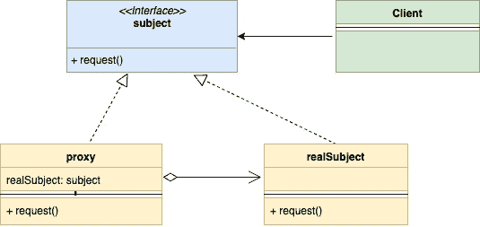
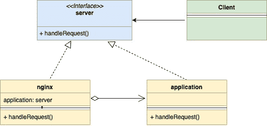

<!--yml

分类：未分类

日期：2024-10-13 06:03:09

-->

# Go（Golang）中的代理设计模式

> 来源：[`golangbyexample.com/proxy-design-pattern-in-golang/`](https://golangbyexample.com/proxy-design-pattern-in-golang/)

注意：想了解其他所有设计模式如何在 GO 中实现吗？请参见这个完整参考 – [Go（Golang）中的所有设计模式](https://golangbyexample.com/all-design-patterns-golang/)

目录

**   介绍：

+   UML 图：

+   映射

+   实际示例：

+   完整工作代码：

## **介绍：**

代理设计模式是一种结构设计模式。此模式建议为对主对象的受控和智能访问提供额外的间接层。

在这个模式中，创建了一个新的代理类，它实现了与主对象相同的接口。这使你可以在主对象的实际逻辑之前执行某些行为。让我们通过一个例子来更好地理解它。

1.  一张借记卡是你银行账户的代理。它遵循与银行账户相同的接口，更容易使用。

1.  像 Nginx 这样的网络服务器可以作为你的应用服务器的代理。它提供

    +   对你的应用服务器的受控访问 – 例如，它可以进行速率限制。

    +   附加行为 – 例如，它可以进行某些缓存。

让我们看看 UML 图。

## **UML 图：**

在下面的 UML 图中

+   **主题**：它表示代理和真实主题应遵循的接口。

+   **代理**：代理类嵌入真实主题，并在完成处理后将请求传递给真实主题。

+   **真实主题**：这是持有主业务逻辑的类，保存在代理之后。

+   **客户端：** 可以与代理和真实主题进行交互，因为它们都遵循相同的接口。

+   

下面是与上述 nginx 和应用服务器的实际示例相对应的映射 UML 图。

+   

## **映射**

下面的表格表示 UML 图中的参与者与代码中的实际实现参与者之间的映射。

| subject | server.go |
| --- | --- |
| proxy | nginx.go |
| realSubject | application.go |
| client | main.go |

## **实际示例：**

**server.go**

```go
package main

type server interface {
    handleRequest(string, string) (int, string)
}
```

**nginx.go**

```go
package main

type nginx struct {
    application       *application
    maxAllowedRequest int
    rateLimiter       map[string]int
}

func newNginxServer() *nginx {
    return &nginx{
        application:       &application{},
        maxAllowedRequest: 2,
        rateLimiter:       make(map[string]int),
    }
}

func (n *nginx) handleRequest(url, method string) (int, string) {
    allowed := n.checkRateLimiting(url)
    if !allowed {
        return 403, "Not Allowed"
    }
    return n.application.handleRequest(url, method)
}

func (n *nginx) checkRateLimiting(url string) bool {
    if n.rateLimiter[url] == 0 {
        n.rateLimiter[url] = 1
    }
    if n.rateLimiter[url] > n.maxAllowedRequest {
        return false
    }
    n.rateLimiter[url] = n.rateLimiter[url] + 1
    return true
}
```

**application.go**

```go
package main

type application struct {
}

func (a *application) handleRequest(url, method string) (int, string) {
    if url == "/app/status" && method == "GET" {
        return 200, "Ok"
    }
    if url == "/create/user" && method == "POST" {
        return 201, "User Created"
    }
    return 404, "Not Ok"
}
```

**main.go**

```go
package main

import "fmt"

func main() {
    nginxServer := newNginxServer()
    appStatusURL := "/app/status"
    createuserURL := "/create/user"
    httpCode, body := nginxServer.handleRequest(appStatusURL, "GET")
    fmt.Printf("\nUrl: %s\nHttpCode: %d\nBody: %s\n", appStatusURL, httpCode, body)
    httpCode, body = nginxServer.handleRequest(appStatusURL, "GET")
    fmt.Printf("\nUrl: %s\nHttpCode: %d\nBody: %s\n", appStatusURL, httpCode, body)
    httpCode, body = nginxServer.handleRequest(appStatusURL, "GET")
    fmt.Printf("\nUrl: %s\nHttpCode: %d\nBody: %s\n", appStatusURL, httpCode, body)
    httpCode, body = nginxServer.handleRequest(createuserURL, "POST")
    fmt.Printf("\nUrl: %s\nHttpCode: %d\nBody: %s\n", appStatusURL, httpCode, body)
    httpCode, body = nginxServer.handleRequest(createuserURL, "GET")
    fmt.Printf("\nUrl: %s\nHttpCode: %d\nBody: %s\n", appStatusURL, httpCode, body)
}
```

**输出：**

```go
Url: /app/status
HttpCode: 200
Body: Ok

Url: /app/status
HttpCode: 200
Body: Ok

Url: /app/status
HttpCode: 403
Body: Not Allowed

Url: /app/status
HttpCode: 201
Body: User Created

Url: /app/status
HttpCode: 404
Body: Not Ok
```

## **完整工作代码：**

```go
package main

import "fmt"

type server interface {
    handleRequest(string, string) (int, string)
}

type nginx struct {
    application       *application
    maxAllowedRequest int
    rateLimiter       map[string]int
}

func newNginxServer() *nginx {
    return &nginx{
        application:       &application{},
        maxAllowedRequest: 2,
        rateLimiter:       make(map[string]int),
    }
}

func (n *nginx) handleRequest(url, method string) (int, string) {
    allowed := n.checkRateLimiting(url)
    if !allowed {
        return 403, "Not Allowed"
    }
    return n.application.handleRequest(url, method)
}

func (n *nginx) checkRateLimiting(url string) bool {
    if n.rateLimiter[url] == 0 {
        n.rateLimiter[url] = 1
    }
    if n.rateLimiter[url] > n.maxAllowedRequest {
        return false
    }
    n.rateLimiter[url] = n.rateLimiter[url] + 1
    return true
}

type application struct {
}

func (a *application) handleRequest(url, method string) (int, string) {
    if url == "/app/status" && method == "GET" {
        return 200, "Ok"
    }
    if url == "/create/user" && method == "POST" {
        return 201, "User Created"
    }
    return 404, "Not Ok"
}

func main() {
    nginxServer := newNginxServer()
    appStatusURL := "/app/status"
    createuserURL := "/create/user"
    httpCode, body := nginxServer.handleRequest(appStatusURL, "GET")
    fmt.Printf("\nUrl: %s\nHttpCode: %d\nBody: %s\n", appStatusURL, httpCode, body)
    httpCode, body = nginxServer.handleRequest(appStatusURL, "GET")
    fmt.Printf("\nUrl: %s\nHttpCode: %d\nBody: %s\n", appStatusURL, httpCode, body)
    httpCode, body = nginxServer.handleRequest(appStatusURL, "GET")
    fmt.Printf("\nUrl: %s\nHttpCode: %d\nBody: %s\n", appStatusURL, httpCode, body)
    httpCode, body = nginxServer.handleRequest(createuserURL, "POST")
    fmt.Printf("\nUrl: %s\nHttpCode: %d\nBody: %s\n", appStatusURL, httpCode, body)
    httpCode, body = nginxServer.handleRequest(createuserURL, "GET")
    fmt.Printf("\nUrl: %s\nHttpCode: %d\nBody: %s\n", appStatusURL, httpCode, body)
}
```

**输出：**

```go
Url: /app/status
HttpCode: 200
Body: Ok

Url: /app/status
HttpCode: 200
Body: Ok

Url: /app/status
HttpCode: 403
Body: Not Allowed

Url: /app/status
HttpCode: 201
Body: User Created

Url: /app/status
HttpCode: 404
Body: Not Ok
```

+   [设计模式](https://golangbyexample.com/tag/design-pattern/)*   [go](https://golangbyexample.com/tag/go/)*   [golang](https://golangbyexample.com/tag/golang/)*   [代理设计模式](https://golangbyexample.com/tag/proxy-design-pattern/)*
