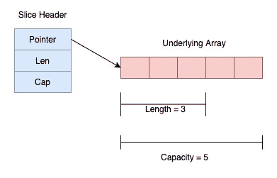
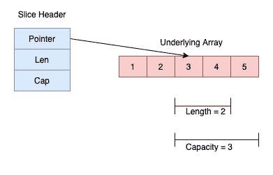

<!--yml

分类：未分类

日期：2024-10-13 06:19:00

-->

# Go 语言中的切片 (Golang)

> 来源：[`golangbyexample.com/slice-in-golang/`](https://golangbyexample.com/slice-in-golang/)

这是 golang 综合教程系列的第十八章。有关该系列其他章节，请参阅此链接 – [Golang 综合教程系列](https://golangbyexample.com/golang-comprehensive-tutorial/)

**下一个教程** – [映射](https://golangbyexample.com/maps-in-golang)

**上一个教程** – [数组](https://golangbyexample.com/understanding-array-golang-complete-guid)

现在让我们查看当前的教程。以下是当前教程的目录。

目录

**   概述

+   创建切片

    +   [使用 []<type>{} 格式](#Using_the_format "Using the []<type>{} format")

    +   从另一个切片或数组创建切片

        +   从数组创建切片

        +   从切片创建切片

    +   使用 make 函数

    +   使用 new 函数

+   长度与容量

+   访问和修改切片元素

+   切片的不同迭代方式

+   向切片添加元素

+   复制切片

+   空切片

+   多维切片

+   总结*  *# **概述**

数组的大小限制了其表达能力和在 Go 中的力量。这就是切片的用武之地。切片比数组更强大和方便使用。实际上，切片与其他编程语言中的数组更为相似。

切片指向底层数组，并通过切片头进行内部表示。与数组不同，切片的大小是灵活的，可以更改。

**切片的内部表示**

切片在内部由三部分表示。

+   指向底层数组的指针

+   底层数组的当前长度

+   总容量是底层数组可以扩展到的最大容量。

上述内部表示由**SliceHeader**结构描述，结构如下所示：

```go
type SliceHeader struct {
        Pointer uintptr
        Len  int
        Cap  int
}
```

切片头中的**指针**字段是指向底层数组的指针。Len 是切片的当前长度，Cap 是切片的容量。与数组类似，切片索引从**零**开始，到**length_of_slice-1**结束。因此，一个长度为 3、容量为 5 的切片如下所示：



# ****创建** 切片**

创建切片有四种方式。

+   使用 []<类型>{} 格式

+   从另一个切片或数组创建切片。

+   使用 make

+   使用 new

让我们逐个看一下上述每种方法。

## **使用 []<类型>{} 格式**

声明切片的最常用方法是这个。

```go
s := []int
```

它声明了一个长度为 0、容量为 0 的空切片。我们也可以在声明时初始化切片。

```go
s := []int{1,2}
```

它声明了一个长度为 2 的整数切片，容量也为 2。容量将等于指定的实际切片元素数量。我们还有两个由 Go 提供的库函数可以用来获取切片的 **长度** 和 **容量**。

+   **len()** 函数 – 用于切片的长度。

+   **cap()** 函数 – 用于切片的容量。

让我们看看一个展示上述要点的小程序。

```go
package main

import "fmt"

func main() {
    sample := []int{}
    fmt.Println(len(sample))
    fmt.Println(cap(sample))
    fmt.Println(sample)

    letters := []string{"a", "b", "c"}
    fmt.Println(len(letters))
    fmt.Println(cap(letters))
    fmt.Println(letters)
}
```

**输出**

```go
0
0
[]

3
3
[a b c]
```

当实际元素未指定时，切片的长度和容量均为零。当实际元素被指定时，长度和容量等于指定的实际元素数量。

## **从另一个切片或数组创建切片**

切片可以通过重新切片现有切片或数组来创建。

### **从数组创建切片**

通过重新切片现有数组创建新切片的格式是

```go
[n]sample[start:end]
```

上述操作将返回一个从索引 **开始** 到索引 **结束-1** 的新切片。因此，索引 **结束** 处的元素不包括在新创建的切片中。在重新切片时，起始和结束索引都是可选的。

+   起始索引的默认值为零。

+   结束索引的默认值是数组的长度。

让我们看一个例子。

```go
package main

import "fmt"

func main() {
    numbers := [5]int{1, 2, 3, 4, 5}

    //Both start and end
    num1 := numbers[2:4]
    fmt.Println("Both start and end")
    fmt.Printf("num1=%v\n", num1)
    fmt.Printf("length=%d\n", len(num1))
    fmt.Printf("capacity=%d\n", cap(num1))

    //Only start
    num2 := numbers[2:]
    fmt.Println("\nOnly start")
    fmt.Printf("num1=%v\n", num2)
    fmt.Printf("length=%d\n", len(num2))
    fmt.Printf("capacity=%d\n", cap(num2))

    //Only end
    num3 := numbers[:3]
    fmt.Println("\nOnly end")
    fmt.Printf("num1=%v\n", num3)
    fmt.Printf("length=%d\n", len(num3))
    fmt.Printf("capacity=%d\n", cap(num3))

    //None
    num4 := numbers[:]
    fmt.Println("\nOnly end")
    fmt.Printf("num1=%v\n", num4)
    fmt.Printf("length=%d\n", len(num4))
    fmt.Printf("capacity=%d\n", cap(num4))
}
```

**输出**

```go
Both start and end
num1=[3 4]
length=2
capacity=3

Only start
num1=[3 4 5]
length=3
capacity=3

Only end
num1=[1 2 3]
length=3
capacity=5

Only end
num1=[1 2 3 4 5]
length=5
capacity=5
```

请注意在上述示例中，

+   新创建切片的长度 = (**结束**–**开始**)

+   新创建切片的容量 = (**数组长度**–**开始**)

**num1** 切片看起来像



新创建的切片仍然指向原数组。要检查此更改，可以在数组的任一索引处更改元素，然后重新打印切片。

```go
numbers[3] = 8
fmt.Printf("num1=%v\n", num2)
fmt.Printf("num3=%v\n", num3)
fmt.Printf("num4=%v\n", num4)
```

这是输出：

```go
num1=[3 8 5]
num3=[1 2 3 8]
num4=[1 2 3 8 5]
```

这证明每个新切片仍然指向原始数组。

### **从切片创建切片**

我们讨论的从数组重新切片的内容在这里同样适用。请看下面的示例，它说明了同样的事情。

```go
package main

import "fmt"

func main() {
    numbers := []int{1, 2, 3, 4, 5}

    //Both start and end
    num1 := numbers[2:4]
    fmt.Println("Both start and end")
    fmt.Printf("num1=%v\n", num1)
    fmt.Printf("length=%d\n", len(num1))
    fmt.Printf("capacity=%d\n", cap(num1))

    //Only start
    num2 := numbers[2:]
    fmt.Println("\nOnly start")
    fmt.Printf("num1=%v\n", num2)
    fmt.Printf("length=%d\n", len(num2))
    fmt.Printf("capacity=%d\n", cap(num2))

    //Only end
    num3 := numbers[:3]
    fmt.Println("\nOnly end")
    fmt.Printf("num1=%v\n", num3)
    fmt.Printf("length=%d\n", len(num3))
    fmt.Printf("capacity=%d\n", cap(num3))

    //None
    num4 := numbers[:]
    fmt.Println("\nOnly end")
    fmt.Printf("num1=%v\n", num4)
    fmt.Printf("length=%d\n", len(num4))
    fmt.Printf("capacity=%d\n", cap(num4))
}
```

**输出**

```go
Both start and end
num1=[3 4]
length=2
capacity=3

Only start
num1=[3 4 5]
length=3
capacity=3

Only end
num1=[1 2 3]
length=3
capacity=5

Only end
num1=[1 2 3 4 5]
length=5
capacity=5
```

在这里，新创建的切片也指向原切片所引用的同一基础数组。要检查此更改，可以在原切片的任一索引处更改元素，然后重新打印所有新创建的切片。

```go
numbers[3] = 8
fmt.Printf("num1=%v\n", num2)
fmt.Printf("num3=%v\n", num3)
fmt.Printf("num4=%v\n", num4)
```

这是输出：

```go
num1=[3 8 5]
num3=[1 2 3 8]
num4=[1 2 3 8 5]
```

## **使用 make 函数**

**make** 是 Go 提供的一个内置函数，也可以用来创建切片。以下是 make 函数的签名。

```go
func make([]{type}, length, capacity int) []{type}
```

在使用 make 函数创建切片时，容量是一个可选参数。当省略容量时，切片的容量等于指定的长度。当使用 make 函数时，后台 Go 会分配一个等于容量的数组。所有分配的数组元素都初始化为该类型的默认零值。让我们看一个说明这一点的程序。

```go
package main

import "fmt"

func main() {
    numbers := make([]int, 3, 5)
    fmt.Printf("numbers=%v\n", numbers)
    fmt.Printf("length=%d\n", len(numbers))
    fmt.Printf("capacity=%d\n", cap(numbers))

    //With capacity ommited
    numbers = make([]int, 3)
    fmt.Println("\nCapacity Ommited")
    fmt.Printf("numbers=%v\n", numbers)
    fmt.Printf("length=%d\n", len(numbers))
    fmt.Printf("capacity=%d\n", cap(numbers))
}
```

**输出**

```go
numbers=[0 0 0]
length=3
capacity=5

Capacity Ommited
numbers=[0 0 0]
length=3
capacity=3
```

## **使用新函数**

**new**是 Go 提供的一个内置函数，也可以用来创建切片。这不是一种非常流行的创建切片的方法，因为**make**在功能上更灵活。它通常不被使用，使用**new**函数返回一个指向 nil 切片的指针。让我们看一个例子。在下面的例子中，我们使用解引用操作符**‘*’**，因为**new**函数返回一个指向 nil 切片的指针。

```go
package main

import "fmt"

func main() {
    numbers := new([]int)
    fmt.Printf("numbers=%v\n", *numbers)
    fmt.Printf("length=%d\n", len(*numbers))
    fmt.Printf("capacity=%d\n", cap(*numbers))
}
```

**输出**

```go
numbers=[]
length=0
capacity=0
```

# **长度与容量**

在继续之前，让我们强调理解长度和容量的注意事项。让我们创建一个容量大于长度的简单切片。

```go
numbers := make([]int, 3, 5)
```

+   访问切片超出其长度会导致运行时错误“索引超出范围”。即使访问的索引在容量内也无关紧要。因此，下面的行将导致运行时错误。

```go
numbers[4] = 5
```

+   切片的长度可以通过重新切片增加到其容量。因此，下面的重新切片将长度从 3 增加到 5。

```go
numbers = numbers[0:5]
```

+   切片的长度也可以通过重新切片来减少。所以下面的重新切片将长度从 3 减少到 2。

```go
numbers = numbers[0:2]
```

+   拥有容量的好处是可以在初始化期间预先分配容量大小的数组。这是一个性能提升，因为如果需要在此数组中包含更多元素，则已经为它们分配了空间。

让我们看一个说明上述要点的程序。

```go
package main

import "fmt"

func main() {
    numbers := make([]int, 3, 5)
    fmt.Printf("numbers=%v\n", numbers)
    fmt.Printf("length=%d\n", len(numbers))
    fmt.Printf("capacity=%d\n", cap(numbers))

    //This line will cause a runtime error index out of range [4] with length 3
    //numbers[4] = 5

    //Increasing the length from 3 to 5
    numbers = numbers[0:5]
    fmt.Println("\nIncreasing length from 3 to 5")
    fmt.Printf("numbers=%v\n", numbers)
    fmt.Printf("length=%d\n", len(numbers))
    fmt.Printf("capacity=%d\n", cap(numbers))

    //Decresing the length from 3 to 2
    numbers = numbers[0:2]
    fmt.Println("\nDecreasing length from 3 to 2")
    fmt.Printf("numbers=%v\n", numbers)
    fmt.Printf("length=%d\n", len(numbers))
    fmt.Printf("capacity=%d\n", cap(numbers))
}
```

**输出**

```go
numbers=[0 0 0]
length=3
capacity=5

Increasing length from 3 to 5
numbers=[0 0 0 0 0]
length=5
capacity=5

Decreasing length from 3 to 2
numbers=[0 0]
length=2
capacity=5
```

# **访问和修改切片元素**

可以通过指定索引访问切片元素。切片元素也可以通过索引分配一个新值。此外，请注意，任何对基础数组的更改都会在切片中反映出来，正如我们上面看到的。让我们看一个小例子，展示访问和修改。

```go
package main

import "fmt"

func main() {
    array := [5]int{1, 2, 3, 4, 5}
    slice := array[:]

    //Modifying the slice
    slice[1] = 7
    fmt.Println("Modifying Slice")
    fmt.Printf("Array=%v\n", array)
    fmt.Printf("Slice=%v\n", slice)

    //Modifying the array. Would reflect back in slice too
    array[1] = 2
    fmt.Println("\nModifying Underlying Array")
    fmt.Printf("Array=%v\n", array)
    fmt.Printf("Slice=%v\n", slice)
}
```

**输出**

```go
Modifying Slice
Array=[1 7 3 4 5]
Slice=[1 7 3 4 5]

Modifying Underlying Array
Array=[1 2 3 4 5]
Slice=[1 2 3 4 5]
```

# **不同的切片迭代方式**

数组可以通过以下方式迭代：

+   使用 for 循环

+   使用 for-range 循环

让我们看一个代码示例。

```go
package main

import "fmt"

func main() {
    letters := []string{"a", "b", "c"}
    //Using for loop
    fmt.Println("Using for loop")
    len := len(letters)
    for i := 0; i < len; i++ {
        fmt.Println(letters[i])
    }

    //Using for-range operator
    fmt.Println("\nUsing for-range loop")
    for i, letter := range letters {
        fmt.Printf("%d %s\n", i, letter)
    }
}
```

**输出**

```go
Using for loop
a
b
c

Using for-range loop
0 a
1 b
2 c
```

# **向切片追加元素**

Go 的**builtin**包提供了一个**append**函数，可以在切片末尾追加元素。下面是这个函数的签名。

```go
func append(slice []Type, elems ...Type) []Type
```

第一个参数是切片本身。第二个是可变数量的参数。

```go
elems ...Type
```

**'...'**运算符是可变语法。因此，基本上**...Type**意味着追加函数可以接受可变数量的类型为**Type**的参数。以下是使用该函数的方法。在下面的代码中，我们将 4 追加到一个有两个元素的切片中。它在末尾追加并返回原始切片。这就是为什么我们将结果再次收集到**numbers**变量中的原因。将结果分配给其他变量也是可以的。

```go
numbers := []int{1,2}
numbers = append(numbers, 4) //Slice will become [1, 2, 4]
```

追加多个元素也是可以的，因为第二个参数是可变参数。

```go
numbers := []int{1,2}
numbers = append(numbers, 3, 4, 5) //Slice will become [1, 2, 3, 4, 5]
```

此函数在后台会增加切片的长度和容量。有两种情况。

+   当切片长度小于容量时。

在这种情况下，使用追加函数时，切片的长度将增加 1，而容量保持不变。让我们看一个例子。

```go
package main

import "fmt"

func main() {
    numbers := make([]int, 3, 5)
    numbers[0] = 1
    numbers[1] = 2
    numbers[2] = 3
    fmt.Printf("numbers=%v\n", numbers)
    fmt.Printf("length=%d\n", len(numbers))
    fmt.Printf("capacity=%d\n", cap(numbers))

    //Append number 4
    numbers = append(numbers, 4)
    fmt.Println("\nAppend Number 4")
    fmt.Printf("numbers=%v\n", numbers)
    fmt.Printf("length=%d\n", len(numbers))
    fmt.Printf("capacity=%d\n", cap(numbers))

    //Append number 5
    numbers = append(numbers, 4)
    fmt.Println("\nAppend Number 5")
    fmt.Printf("numbers=%v\n", numbers)
    fmt.Printf("length=%d\n", len(numbers))
    fmt.Printf("capacity=%d\n", cap(numbers))
}
```

**输出**

```go
numbers=[1 2 3]
length=3
capacity=5

Append Number 4
numbers=[1 2 3 4]
length=4
capacity=5

Append Number 5
numbers=[1 2 3 4 4]
length=5
capacity=5
```

在所有情况下，容量都保持不变，都是 5，而长度增加了 1。

+   当切片长度大于容量时。

在这种情况下，由于没有更多的容量，所以无法容纳新的元素。因此在底层将分配一个容量翻倍的数组。当前切片指向的数组将被复制到这个新数组。现在切片将开始指向这个新数组。因此容量将翻倍，长度将增加 1。让我们看一个例子。

```go
package main

import "fmt"

func main() {
    numbers := make([]int, 3, 3)
    numbers[0] = 1
    numbers[1] = 2
    numbers[2] = 3

    fmt.Printf("numbers=%v\n", numbers)
    fmt.Printf("length=%d\n", len(numbers))
    fmt.Printf("capacity=%d\n", cap(numbers))

    //Append number 4
    numbers = append(numbers, 4)
    fmt.Println("\nAppend Number 4")
    fmt.Printf("numbers=%v\n", numbers)
    fmt.Printf("length=%d\n", len(numbers))
    fmt.Printf("capacity=%d\n", cap(numbers))
}
```

**输出**

```go
numbers=[1 2 3]
length=3
capacity=3

Append Number 4
numbers=[1 2 3 4]
length=4
capacity=6
```

请注意上面的例子中，容量是翻倍的。

也可以将一个切片追加到另一个切片。以下是该操作的格式。

```go
res := append(slice1, slice2...)
```

注意第二个切片后的**'...'**。**'...'**是运算符，表示该参数是可变参数。这意味着在运行时，slice2 将扩展为作为多个参数传递给追加函数的各个元素。

```go
package main

import "fmt"

func main() {
    numbers1 := []int{1, 2}
    numbers2 := []int{3, 4}
    numbers := append(numbers1, numbers2...)
    fmt.Printf("numbers=%v\n", numbers)
    fmt.Printf("length=%d\n", len(numbers))
    fmt.Printf("capacity=%d\n", cap(numbers))
}
```

**输出**

```go
numbers=[1 2 3 4]
length=4
capacity=4
```

# **复制切片**

Go 的**builtin**包提供了**copy**函数，可以用于复制切片。以下是该函数的签名。它接受两个切片**dst**和**src**，并将数据从**src**复制到**dst**。它返回复制的元素数量。

```go
func copy(dst, src []Type) int
```

使用复制函数时需要考虑两种情况：

+   如果**src**的长度大于**dst**的长度，则复制的元素数量为**dst**的长度。

+   如果**dst**的长度大于**src**的长度，则复制的元素数量为**src**的长度。

基本上，复制的元素数量是**(src, dst)**长度的最小值。

还需注意，一旦复制完成，对**dst**的任何更改将不会反映在**src**中，反之亦然。让我们看一个例子。

```go
package main

import "fmt"

func main() {
    src := []int{1, 2, 3, 4, 5}
    dst := make([]int, 5)

    numberOfElementsCopied := copy(dst, src)
    fmt.Printf("Number Of Elements Copied: %d\n", numberOfElementsCopied)
    fmt.Printf("dst: %v\n", dst)
    fmt.Printf("src: %v\n", src)

    //After changing numbers2
    dst[0] = 10
    fmt.Println("\nAfter changing dst")
    fmt.Printf("dst: %v\n", dst)
    fmt.Printf("src: %v\n", src)
}
```

**输出**

```go
Number Of Elements Copied: 5
dst: [1 2 3 4 5]
src: [1 2 3 4 5]

After changing dst
dst: [10 2 3 4 5]
src: [1 2 3 4 5]
```

# **Nil 切片**

切片的默认零值是 nil。nil 切片的长度和容量都是零。虽然将元素追加到 nil 切片也是可以的。让我们看一个例子。

```go
package main

import "fmt"

func main() {
    var numbers []int
    fmt.Printf("numbers=%v\n", numbers)
    fmt.Printf("length=%d\n", len(numbers))
    fmt.Printf("capacity=%d\n", cap(numbers))
    numbers = append(numbers, 1)
    fmt.Printf("numbers=%v\n", numbers)
    fmt.Printf("length=%d\n", len(numbers))
    fmt.Printf("capacity=%d\n", cap(numbers))
}
```

**输出**

```go
numbers=[]
length=0
capacity=0
numbers=[1]
length=1
capacity=1
```

# **多维切片**

由于多维数组是数组的数组，因此多维切片是切片的切片。为了理解这一点，让我们先看看切片的定义。

切片头中的**数据**字段是指向基础数组的指针。 对于一维切片，我们有以下声明。

```go
oneDSlice := make([]int, 2)
```

声明一个二维切片的声明应该是。

```go
twoDSlice = make([][]int, 2)
```

上述声明意味着我们想创建一个**切片**，包含 2 个切片。仔细理解这一点。但等一下，这里我们没有指定第二维，意味着每个内部 2 个切片的长度。在切片的情况下，每个内部切片必须像下面那样显式初始化。

```go
for i := range twoDSlice {
    twoDSlice[i] = make([]int, 3)
}
```

因此，通过原始切片上的范围，我们使用 make 指定每个 2 个切片的长度。 下面是另一种方法，但指定了切片元素。

```go
var twoDSlice = make([][]int, 2)
twoDSlice[0] = []int{1, 2, 3}
twoDSlice[1] = []int{4, 5, 6}
```

基本上，通过上述声明，我们创建了一个 2*3 维的切片，这是一个二维切片。相同的想法可以扩展到二维、三维等。

上述两点的完整工作示例

```go
package main

import "fmt"

func main() {
    twoDSlice1 := make([][]int, 3)
    for i := range twoDSlice1 {
        twoDSlice1[i] = make([]int, 3)
    }
    fmt.Printf("Number of rows in slice: %d\n", len(twoDSlice1))
    fmt.Printf("Number of columns in arsliceray: %d\n", len(twoDSlice1[0]))
    fmt.Printf("Total number of elements in slice: %d\n", len(twoDSlice1)*len(twoDSlice1[0]))
    fmt.Println("First Slice")
    for _, row := range twoDSlice1 {
        for _, val := range row {
            fmt.Println(val)
        }
    }
    twoDSlice2 := make([][]int, 2)
    twoDSlice2[0] = []int{1, 2, 3}
    twoDSlice2[1] = []int{4, 5, 6}
    fmt.Println()
    fmt.Printf("Number of rows in slice: %d\n", len(twoDSlice2))
    fmt.Printf("Number of columns in arsliceray: %d\n", len(twoDSlice2[0]))
    fmt.Printf("Total number of elements in slice: %d\n", len(twoDSlice2)*len(twoDSlice2[0]))
    fmt.Println("Second Slice")
    for _, row := range twoDSlice2 {
        for _, val := range row {
            fmt.Println(val)
        }
    }
}
```

**输出**

```go
Number of rows in slice: 2
Number of columns in arsliceray: 3
Total number of elements in slice: 6
First Slice
0
0
0
0
0
0

Number of rows in slice: 2
Number of columns in arsliceray: 3
Total number of elements in slice: 6
Second Slice
1
2
3
4
5
6
```

我们在上面提到我们正在创建一个 2*3 维的二维切片。 也就是说，您可能会想到的问题是，内部切片是否可以有不同的长度。 是的，这是可能的。 与内部数组具有相同长度的数组不同，在切片的情况下，由于我们单独初始化每个内部切片，因此可以拥有不同长度的内部切片。

让我们看看一个示例。

```go
package main

import "fmt"

func main() {
    twoDSlice := make([][]int, 2)
    twoDSlice[0] = []int{1, 2, 3}
    twoDSlice[1] = []int{4, 5}

    fmt.Printf("Number of rows in slice: %d\n", len(twoDSlice))
    fmt.Printf("Len of first row: %d\n", len(twoDSlice[0]))
    fmt.Printf("Len of second row: %d\n", len(twoDSlice[1]))
    fmt.Println("Traversing slice")
    for _, row := range twoDSlice {
        for _, val := range row {
            fmt.Println(val)
        }
    }
}
```

**输出**

```go
Number of rows in slice: 2
Len of first row: 3
Len of second row: 2
Traversing slice
1
2
3
4
5
```

让我们看看一个三维切片的小例子。在下面的程序中，我们正在创建一个 2*2*3 维的切片。

```go
package main

import "fmt"

func main() {
    sample := make([][][]int, 2)
    for i := range sample {
        sample[i] = make([][]int, 2)
        for j := range sample[i] {
            sample[i][j] = make([]int, 3)
        }
    }

    fmt.Printf("Length of first dimension: %d\n", len(sample))
    fmt.Printf("Length of second dimension: %d\n", len(sample[0]))
    fmt.Printf("Length of third dimension: %d\n", len(sample[0][0]))
    fmt.Printf("Overall Dimension of the slice: %d*%d*%d\n", len(sample), len(sample[0]), len(sample[0][0]))
    fmt.Printf("Total number of elements in slice: %d\n", len(sample)*len(sample[0])*len(sample[0][0]))
    for _, first := range sample {
        for _, second := range first {
            for _, value := range second {
                fmt.Println(value)
            }
        }
    }
}
```

**输出**

```go
Length of first dimension: 2
Length of second dimension: 2
Length of third dimension: 3
Overall Dimension of the slice: 2*2*3
Total number of elements in slice: 12
0
0
0
0
0
0
0
0
0
0
0
0
```

# **结论**

这就是 golang 中的切片。希望您喜欢这篇文章。请在评论中分享反馈/改进/错误。

**下一个教程** – [映射](https://golangbyexample.com/maps-in-golang)

**前一个教程** – [数组](https://golangbyexample.com/understanding-array-golang-complete-guid)

+   [完整指南](https://golangbyexample.com/tag/complete-guide/) *   [go](https://golangbyexample.com/tag/go/) *   [golang](https://golangbyexample.com/tag/golang/) *   [切片](https://golangbyexample.com/tag/slice/) *
