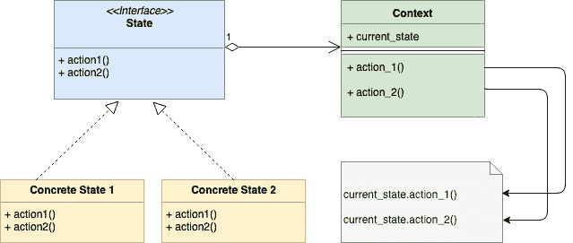

<!--yml

分类：未分类

日期：2024-10-13 06:01:16

-->

# Go 中的状态设计模式

> 来源：[https://golangbyexample.com/state-design-pattern-go/](https://golangbyexample.com/state-design-pattern-go/)

注意：如果想了解如何在 GO 中实现所有其他设计模式，请查看此完整参考 – [Go 中的所有设计模式 (Golang)](https://golangbyexample.com/all-design-patterns-golang/)

目录

**   [定义:](#Definition "Definition:")

+   [何时使用](#When_To_Use "When To Use")

+   [UML 图](#UML_Diagram "UML Diagram")

+   [映射](#Mapping "Mapping")

+   [解释:](#Explanation "Explanation:")

+   [实际示例:](#Practical_Example "Practical Example:")*  *## **定义:**

状态设计模式是一种基于有限状态机的行为设计模式。我们将以自动售货机的示例来解释状态设计模式。为了简单起见，假设自动售货机只有一种商品。同时，假设自动售货机可以处于四种不同状态。

1.  **有物品**

1.  **无物品**

1.  **itemRequested**

1.  **有钱**

自动售货机也会有不同的操作。为了简单起见，假设只有四个操作：

1.  **选择物品**

1.  **添加物品**

1.  **插入钱**

1.  **发放物品**

## **何时使用**

+   **当对象可以处于多种不同状态时，使用状态设计模式。根据当前请求，对象需要改变其当前状态**

    +   在上述示例中，自动售货机可以处于多种不同状态。假设自动售货机处于 **itemRequested** 状态，当“插入钱”操作完成后，它将转到 **有钱** 状态。

+   当一个对象对同一请求有不同响应时，根据当前状态使用。使用状态设计模式将减少许多条件语句。

    +   例如，在自动售货机的情况下，如果用户想购买一件商品，当机器处于 **有物品状态** 时将继续进行，如果处于 **无物品状态** 则会拒绝。注意，自动售货机在购买请求时根据是否处于 **有物品状态** 或 **无物品状态** 给出两种不同的响应。请注意下面的 vendingMachine.go 文件，它没有任何条件语句。所有逻辑由具体状态实现处理。

## **UML 图**



## **映射**

以下表格表示 UML 图中角色与代码中实际实现角色的映射。

| 上下文 | vendingMachine.go |
| --- | --- |
| 状态接口 | state.go |
| 具体状态 1 | noItemState.go |
| 具体状态 2 | hasItemState.go |
| 具体状态 3 | itemRequestedState.go |
| 具体状态 4 | hasMoneyState.go |

## **解释：**

+   我们有一个接口“State”，它定义了表示自动售货机上下文中动作的函数签名。以下是这些动作的函数签名

    1.  addItem(int) 错误

    1.  requestItem() 错误

    1.  insertMoney(money int) 错误

    1.  dispenseItem() 错误

+   每个具体状态实现都实现了上述所有4个功能，并在这些操作中移动到另一个状态或给出某种响应。

+   每个具体状态都嵌入了一个指向当前自动售货机对象的指针，以便在该对象上进行状态转换。

现在让我们看看代码

## **实际示例：**

**vendingMachine.go**

```
package main

import "fmt"

type vendingMachine struct {
    hasItem       state
    itemRequested state
    hasMoney      state
    noItem        state

    currentState state

    itemCount int
    itemPrice int
}

func newVendingMachine(itemCount, itemPrice int) *vendingMachine {
    v := &vendingMachine{
        itemCount: itemCount,
        itemPrice: itemPrice,
    }
    hasItemState := &hasItemState{
        vendingMachine: v,
    }
    itemRequestedState := &itemRequestedState{
        vendingMachine: v,
    }
    hasMoneyState := &hasMoneyState{
        vendingMachine: v,
    }
    noItemState := &noItemState{
        vendingMachine: v,
    }

    v.setState(hasItemState)
    v.hasItem = hasItemState
    v.itemRequested = itemRequestedState
    v.hasMoney = hasMoneyState
    v.noItem = noItemState
    return v
}

func (v *vendingMachine) requestItem() error {
    return v.currentState.requestItem()
}

func (v *vendingMachine) addItem(count int) error {
    return v.currentState.addItem(count)
}

func (v *vendingMachine) insertMoney(money int) error {
    return v.currentState.insertMoney(money)
}

func (v *vendingMachine) dispenseItem() error {
    return v.currentState.dispenseItem()
}

func (v *vendingMachine) setState(s state) {
    v.currentState = s
}

func (v *vendingMachine) incrementItemCount(count int) {
    fmt.Printf("Adding %d items\n", count)
    v.itemCount = v.itemCount + count
}
```

**state.go**

```
package main

type state interface {
    addItem(int) error
    requestItem() error
    insertMoney(money int) error
    dispenseItem() error
}
```

**noItemState.go**

```
package main

import "fmt"

type noItemState struct {
    vendingMachine *vendingMachine
}

func (i *noItemState) requestItem() error {
    return fmt.Errorf("Item out of stock")
}

func (i *noItemState) addItem(count int) error {
    i.vendingMachine.incrementItemCount(count)
    i.vendingMachine.setState(i.vendingMachine.hasItem)
    return nil
}

func (i *noItemState) insertMoney(money int) error {
    return fmt.Errorf("Item out of stock")
}
func (i *noItemState) dispenseItem() error {
    return fmt.Errorf("Item out of stock")
}
```

**hasItemState.go**

```
package main

import "fmt"

type hasItemState struct {
    vendingMachine *vendingMachine
}

func (i *hasItemState) requestItem() error {
    if i.vendingMachine.itemCount == 0 {
        i.vendingMachine.setState(i.vendingMachine.noItem)
        return fmt.Errorf("No item present")
    }
    fmt.Printf("Item requestd\n")
    i.vendingMachine.setState(i.vendingMachine.itemRequested)
    return nil
}

func (i *hasItemState) addItem(count int) error {
    fmt.Printf("%d items added\n", count)
    i.vendingMachine.incrementItemCount(count)
    return nil
}

func (i *hasItemState) insertMoney(money int) error {
    return fmt.Errorf("Please select item first")
}
func (i *hasItemState) dispenseItem() error {
    return fmt.Errorf("Please select item first")
}
```

**itemRequestedState.go**

```
package main

import "fmt"

type itemRequestedState struct {
    vendingMachine *vendingMachine
}

func (i *itemRequestedState) requestItem() error {
    return fmt.Errorf("Item already requested")
}

func (i *itemRequestedState) addItem(count int) error {
    return fmt.Errorf("Item Dispense in progress")
}

func (i *itemRequestedState) insertMoney(money int) error {
    if money < i.vendingMachine.itemPrice {
        fmt.Errorf("Inserted money is less. Please insert %d", i.vendingMachine.itemPrice)
    }
    fmt.Println("Money entered is ok")
    i.vendingMachine.setState(i.vendingMachine.hasMoney)
    return nil
}

func (i *itemRequestedState) dispenseItem() error {
    return fmt.Errorf("Please insert money first")
}
```

**hasMoneyState.go**

```
package main

import "fmt"

type hasMoneyState struct {
    vendingMachine *vendingMachine
}

func (i *hasMoneyState) requestItem() error {
    return fmt.Errorf("Item dispense in progress")
}

func (i *hasMoneyState) addItem(count int) error {
    return fmt.Errorf("Item dispense in progress")
}

func (i *hasMoneyState) insertMoney(money int) error {
    return fmt.Errorf("Item out of stock")
}

func (i *hasMoneyState) dispenseItem() error {
    fmt.Println("Dispensing Item")
    i.vendingMachine.itemCount = i.vendingMachine.itemCount - 1
    if i.vendingMachine.itemCount == 0 {
        i.vendingMachine.setState(i.vendingMachine.noItem)
    } else {
        i.vendingMachine.setState(i.vendingMachine.hasItem)
    }
    return nil
}
```

**main.go**

```
package main

import (
    "fmt"
    "log"
)

func main() {
    vendingMachine := newVendingMachine(1, 10)
    err := vendingMachine.requestItem()
    if err != nil {
        log.Fatalf(err.Error())
    }
    err = vendingMachine.insertMoney(10)
    if err != nil {
        log.Fatalf(err.Error())
    }
    err = vendingMachine.dispenseItem()
    if err != nil {
        log.Fatalf(err.Error())
    }

    fmt.Println()
    err = vendingMachine.addItem(2)
    if err != nil {
        log.Fatalf(err.Error())
    }

    fmt.Println()

    err = vendingMachine.requestItem()
    if err != nil {
        log.Fatalf(err.Error())
    }

    err = vendingMachine.insertMoney(10)
    if err != nil {
        log.Fatalf(err.Error())
    }

    err = vendingMachine.dispenseItem()
    if err != nil {
        log.Fatalf(err.Error())
    }
}
```

**输出：**

```
Item requestd
Money entered is ok
Dispensing Item

Adding 2 items

Item requestd
Money entered is ok
Dispensing Item
```

+   [设计](https://golangbyexample.com/tag/design/)*   [设计模式](https://golangbyexample.com/tag/designpattern/)*   [go](https://golangbyexample.com/tag/go/)*   [golang](https://golangbyexample.com/tag/golang/)*   [模式](https://golangbyexample.com/tag/patter/)*   [状态](https://golangbyexample.com/tag/state/)*   [状态设计模式](https://golangbyexample.com/tag/state-design-pattern/)*
