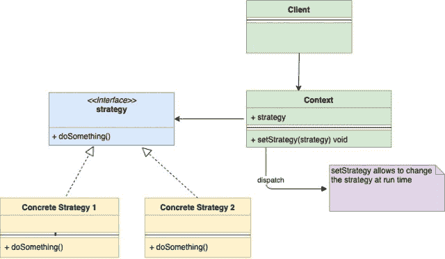
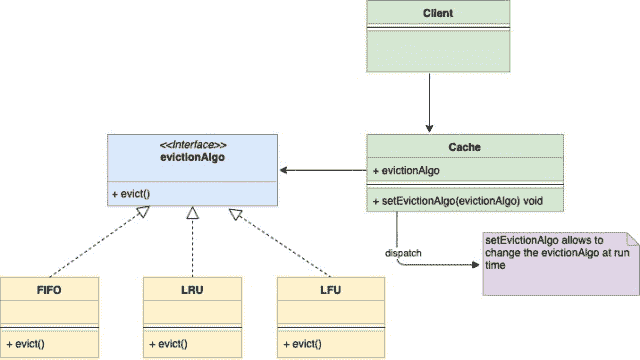

<!--yml

分类：未分类

日期：2024-10-13 06:02:48

-->

# Go（Golang）中的策略设计模式

> 来源：[https://golangbyexample.com/strategy-design-pattern-golang/](https://golangbyexample.com/strategy-design-pattern-golang/)

注意：有兴趣了解其他所有设计模式如何在 GO 中实现吗？请查看这个完整的参考 – [Go（Golang）中的所有设计模式](https://golangbyexample.com/all-design-patterns-golang/)

目录

**   [定义：](#Definition "定义： ")

+   [何时使用](#When_to_Use "何时使用")

+   [UML 图](#UML_Diagram "UML 图")

+   [映射](#Mapping "映射")

+   [实用例子](#Practical_Example "实用例子")*  *## **定义：**

策略设计模式是一种行为设计模式。该设计模式允许你在运行时更改对象的行为，而无需更改该对象的类。

让我们通过一个例子理解策略模式。假设你正在构建一个内存缓存。由于它是内存缓存，因此其大小有限。当它达到最大大小时，需要驱逐一些旧条目。驱逐可以通过几种算法进行。一些流行的算法包括

1.  **LRU** – 最近最少使用：移除最近最少使用的条目。

1.  **FIFO** – 先进先出：移除第一个创建的条目。

1.  **LFU** – 最少使用：移除使用频率最低的条目。

现在的问题是如何将我们的 Cache 类与算法解耦，以便我们能够在运行时更改算法。同时，在添加新算法时，Cache 类也不应改变。这就是策略模式发挥作用的地方。策略模式建议创建一组算法，每个算法都有自己的类。这些类遵循相同的接口，这使得算法在这个家族中是可以互换的。假设通用接口的名称是 **evictionAlgo**。

现在我们的主要 **Cache** 类将嵌入 **evictionAlgo** 接口。我们的缓存类不会在内部实现所有类型的驱逐算法，而是将所有任务委托给 **evictionAlgo** 接口。由于 evictionAlgo 是一个接口，我们可以在运行时将算法更改为 LRU、FIFO 或 LFU，而无需修改 Cache 类。

## **何时使用**

+   当一个对象需要支持不同的行为，并且你希望在运行时更改该行为时。

+   当你想避免大量选择运行时行为的条件语句时。

+   当你有不同的算法，它们相似但仅在执行某些行为的方式上有所不同时。

## **UML 图**

注意下面的 UML 图，上下文（Cache）嵌入了策略（evictionAlgo）接口。

+   

下面是与上述示例相对应的 UML 图

+   

## **映射**

以下表格表示UML图中的参与者与代码中实际实现参与者的映射。

| 上下文 | cache.go |
| --- | --- |
| 策略 | evictionAlgo.go |
| 具体策略对象 1 | lfu.go |
| 具体策略对象 2 | lru.go |
| 具体策略对象 3 | fifo.go |
| 客户端 | main.go |

## **实际示例**

**evictionAlgo.go**

```go
package main

type evictionAlgo interface {
    evict(c *cache)
}
```

**fifo.go**

```go
package main

import "fmt"

type fifo struct {
}

func (l *fifo) evict(c *cache) {
    fmt.Println("Evicting by fifo strtegy")
}
```

**lru.go**

```go
package main

import "fmt"

type lru struct {
}

func (l *lru) evict(c *cache) {
    fmt.Println("Evicting by lru strtegy")
}
```

**lfu.go**

```go
package main

import "fmt"

type lfu struct {
}

func (l *lfu) evict(c *cache) {
    fmt.Println("Evicting by lfu strtegy")
}
```

**cache.go**

```go
package main

type cache struct {
    storage      map[string]string
    evictionAlgo evictionAlgo
    capacity     int
    maxCapacity  int
}

func initCache(e evictionAlgo) *cache {
    storage := make(map[string]string)
    return &cache{
        storage:      storage,
        evictionAlgo: e,
        capacity:     0,
        maxCapacity:  2,
    }
}

func (c *cache) setEvictionAlgo(e evictionAlgo) {
    c.evictionAlgo = e
}

func (c *cache) add(key, value string) {
    if c.capacity == c.maxCapacity {
        c.evict()
    }
    c.capacity++
    c.storage[key] = value
}

func (c *cache) get(key string) {
    delete(c.storage, key)
}

func (c *cache) evict() {
    c.evictionAlgo.evict(c)
    c.capacity--
}
```

**main.go**

```go
package main

func main() {
    lfu := &lfu{}
    cache := initCache(lfu)
    cache.add("a", "1")
    cache.add("b", "2")
    cache.add("c", "3")
    lru := &lru{}
    cache.setEvictionAlgo(lru)
    cache.add("d", "4")
    fifo := &fifo{}
    cache.setEvictionAlgo(fifo)
    cache.add("e", "5")
}
```

**输出：**

```go
Evicting by lfu strtegy
Evicting by lru strtegy
Evicting by fifo strtegy
```

+   [设计模式](https://golangbyexample.com/tag/design-pattern/) *   [Go](https://golangbyexample.com/tag/go/) *   [Golang](https://golangbyexample.com/tag/golang/) *   [策略设计模式](https://golangbyexample.com/tag/strategy-design-pattern/) *   [Golang中的策略设计模式](https://golangbyexample.com/tag/strategy-design-pattern-in-golang/) *
