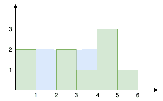

<!--yml

分类：未分类

日期：2024-10-13 06:44:10

-->

# Go (Golang)中的雨水困境问题

> 来源：[https://golangbyexample.com/trapping-rainwater-problem-golang/](https://golangbyexample.com/trapping-rainwater-problem-golang/)

目录

**   [概述](#Overview "Overview")

+   [程序](#Program "Program")*  *## **概述**

有一组宽度为1单位但高度不同的柱子并排放置。柱子的高度用数组表示

```go
[2, 0 , 2, 1, 3, 1]
```

数组表示的是

+   总共有5根柱子

+   第一根柱子的高度为2

+   第二根柱子的高度为0

+   第三根柱子的高度为2

+   第四根柱子的高度为1

+   第五根柱子的高度为3

+   第六根柱子的高度为1

目标是找到这些柱子之间可以困住的最大水量。



从上面的图中可以看出

+   1和3柱子之间可以困住2单位的水

+   3和6柱子之间可以困住1单位的水

因此，总共可以困住3单位的水

让我们看看相同的程序。策略是使用栈。

+   遍历给定的数组

+   对于当前元素，持续从栈中弹出，直到栈为空或栈顶元素的高度大于当前元素的高度。

+   对于每个弹出的元素，计算可以在弹出元素与当前元素之间困住的水量。

+   最后，将当前元素推入栈中，循环重复直到数组中的所有元素都被遍历。

## **程序**

```go
package main

import (
	"fmt"
	"sync"
)

func main() {
	output := trap([]int{2, 0, 2, 1, 3, 1})
	fmt.Println(output)

	output = trap([]int{0, 1, 0, 2, 1, 0, 1, 3, 2, 1, 2, 1})
	fmt.Println(output)

	output = trap([]int{4, 2, 0, 3, 2, 5})
	fmt.Println(output)
}

func trap(height []int) int {

	output := 0
	heightArrayLen := len(height)
	customStack := customStack{
		stack: make([]int, 0),
	}

	customStack.Push(0)

	for i := 1; i < heightArrayLen; i++ {

		for customStack.Size() != 0 {
			front, _ := customStack.Front()
			if height[front] <= height[i] {
				output = output + (i-front-1)*(height[front]-max(height, front+1, i-1))
				customStack.Pop()
			} else {
				output = output + (i-front-1)*(height[i]-max(height, front+1, i-1))
				break
			}
		}
		customStack.Push(i)
	}
	return output

}

func max(input []int, start, end int) int {

	if start > end {
		return 0
	}

	max := 0

	for i := start; i <= end; i++ {
		if input[i] > max {
			max = input[i]
		}
	}
	return max
}

type customStack struct {
	stack []int
	lock  sync.RWMutex
}

func (c *customStack) Push(name int) {
	c.lock.Lock()
	defer c.lock.Unlock()
	c.stack = append(c.stack, name)
}

func (c *customStack) Pop() error {
	len := len(c.stack)
	if len > 0 {
		c.lock.Lock()
		defer c.lock.Unlock()
		c.stack = c.stack[:len-1]
		return nil
	}
	return fmt.Errorf("Pop Error: Stack is empty")
}

func (c *customStack) Front() (int, error) {
	len := len(c.stack)
	if len > 0 {
		c.lock.Lock()
		defer c.lock.Unlock()
		return c.stack[len-1], nil
	}
	return 0, fmt.Errorf("Peep Error: Stack is empty")
}

func (c *customStack) Size() int {
	return len(c.stack)
}

func (c *customStack) Empty() bool {
	return len(c.stack) == 0
}
```

**输出**

```go
3
6
9
```

**注意：** 请查看我们的Golang高级教程。此系列教程详尽，我们尝试用示例覆盖所有概念。本教程适合那些希望获得Golang专业知识和扎实理解的人——[Golang高级教程](https://golangbyexample.com/golang-comprehensive-tutorial/)

如果你有兴趣了解如何在Golang中实现所有设计模式。如果是的话，那么这篇文章就是为你准备的——[所有设计模式 Golang](https://golangbyexample.com/all-design-patterns-golang/)

+   [go](https://golangbyexample.com/tag/go/)*   [golang](https://golangbyexample.com/tag/golang/)*
