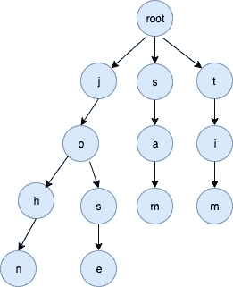

<!--yml

类别：未分类

日期：2024-10-13 06:06:33

-->

# Go (Golang) 中的 Trie 实现

> 来源：[https://golangbyexample.com/trie-implementation-in-go/](https://golangbyexample.com/trie-implementation-in-go/)

目录

**   [概述](#Overview "Overview")

+   [完整工作代码](#Full_Working_Code "Full Working Code")*  *# **概述**

Trie 是一种用于高效信息检索的数据结构。它是一种特殊类型的树，从根节点到特定节点的路径可以定义存储在此树中的单词。可以根据使用案例构建整个 ASCII_SIZE、字母和数字的 Trie。例如，下面将是支持小写字母的 Trie 数据结构的属性。

+   每个节点都有 ALBHABET_SIZE=26 个子节点。每个子节点本身也是一个 trie 节点，并且有 ALBHABET_SIZE=26 个子节点。

+   每个节点在其父节点的子节点数组中具有一个索引，并表示一个 ASCII 字符。例如，对于某个特定节点，第一个非空子节点表示字符 'a' 的存在，第二个非空子节点表示 'b' 的存在，依此类推。在某个索引上缺少子节点意味着没有值。

+   每个节点还有一个布尔字段，指示该节点是否为单词的结束。

+   根节点是起始节点，有 ALBHABET_SIZE=26 个子节点。根节点与一个空值相关联。

例如，对于关键字 [“sam”, “john”, “tim”, “jose”]，将创建以下 Trie。



# **完整工作代码**

```
package main

import "fmt"

const (
   //ALBHABET_SIZE total characters in english alphabet
    ALBHABET_SIZE = 26
)

type trieNode struct {
    childrens [ALBHABET_SIZE]*trieNode
    isWordEnd bool
}

type trie struct {
    root *trieNode
}

func initTrie() *trie {
    return &trie{
        root: &trieNode{},
    }
}

func (t *trie) insert(word string) {
    wordLength := len(word)
    current := t.root
    for i := 0; i < wordLength; i++ {
        index := word[i] - 'a'
        if current.childrens[index] == nil {
            current.childrens[index] = &trieNode{}
        }
        current = current.childrens[index]
    }
    current.isWordEnd = true
}

func (t *trie) find(word string) bool {
    wordLength := len(word)
    current := t.root
    for i := 0; i < wordLength; i++ {
        index := word[i] - 'a'
        if current.childrens[index] == nil {
            return false
        }
        current = current.childrens[index]
    }
    if current.isWordEnd {
        return true
    }
    return false
}

func main() {
    trie := initTrie()
    words := []string{"sam", "john", "tim", "jose", "rose",
        "cat", "dog", "dogg", "roses"}
    for i := 0; i < len(words); i++ {
        trie.insert(words[i])
    }
    wordsToFind := []string{"sam", "john", "tim", "jose", "rose",
        "cat", "dog", "dogg", "roses", "rosess", "ans", "san"}
    for i := 0; i < len(wordsToFind); i++ {
        found := trie.find(wordsToFind[i])
        if found {
            fmt.Printf("Word \"%s\" found in trie\n", wordsToFind[i])
        } else {
            fmt.Printf("Word \"%s\" not found in trie\n", wordsToFind[i])
        }
    }
}
```

**输出：**

```
Word "sam" found in trie
Word "john" found in trie
Word "tim" found in trie
Word "jose" found in trie
Word "rose" found in trie
Word "cat" found in trie
Word "dog" found in trie
Word "dogg" found in trie
Word "roses" found in trie
Word "rosess" not found in trie
Word "ans" not found in trie
Word "san" not found in trie
```

+   [数据结构](https://golangbyexample.com/tag/data-structure/)*   [Trie](https://golangbyexample.com/tag/trie/)*
