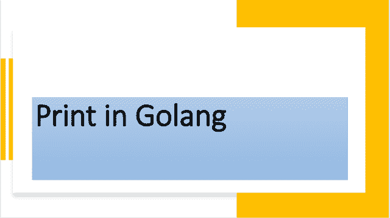

<!--yml

类别：未分类

日期：2024-10-13 06:37:50

-->

# 理解Go（Golang）中的Print函数

> 来源：[https://golangbyexample.com/print-function-golang/](https://golangbyexample.com/print-function-golang/)



目录

**   [概述](#Overview "Overview")

+   [程序](#Program "Program")*  *## **概述**

**Print**在**fmt**包中定义，用于格式化字符串并写入标准输出

```
https://golang.org/pkg/fmt/#Print
```

以下是**Print**的函数原型

```
func Print(a ...interface{}) (n int, err error)
```

**Print**使用默认格式说明符格式化字符串，但在字符串后不添加换行。**Print**接受可变数量的参数，每个参数都是一个空接口。它返回打印的字符数和发生的任何错误。由于参数类型是空接口，我们可以传递任何数据类型。我们可以传递字符串、整数、浮点数、结构体或任何其他数据类型。**Print**函数的每个参数根据该参数类型的默认格式说明符进行格式化。例如，结构体将根据以下说明符进行格式化

```
%v
```

此格式说明符仅打印结构体中的值部分。**fmt**包还提供了一个附加换行的函数——**Println**。**Print**函数与**Println**函数完全相同，除了两个区别

+   它不会在末尾添加换行。我们需要使用换行标识符来添加换行“\n”。

+   仅在操作数都不是字符串时，才会在参数之间添加空格

让我们看一个例子

## **程序**

让我们看一个相同的例子

```
package main

import "fmt"

type employee struct {
	Name string
	Age  int
}

func main() {
	name := "John"
	age := 21
	fmt.Print("Name is:", name, "\n")
	fmt.Print("Age is:", age, "\n")

	e := employee{
		Name: name,
		Age:  age,
	}

	fmt.Print(e, "\n")

	fmt.Print("a", 12, "b", 12.0, "\n")

	fmt.Print(12, 12.0, "\n")

        bytesPrinted, err := fmt.Print("Name is: ", name, "\n")
	if err != nil {
		log.Fatalln("Error occured", err)
	}
	fmt.Print(bytesPrinted)
}
```

**输出**

```
Name is:John
Age is:21
{John 21}
a12b12
12 12
Name is: John
14
```

关于**Print**函数的一些重要注意事项

+   它不会在末尾添加换行。这就是为什么需要使用**“\n”**来添加换行。

+   只有当两个参数都不是字符串时，它才会在两个参数之间添加空格。这就是原因

```
fmt.Print(12, 12.0, "\n")
```

打印

```
12 12
```

而

```
fmt.Print("a", 12, "b", 12.0, "\n")
```

打印

```
a12b12
```

+   它还返回打印的字符数和发生的任何错误

```
bytesPrinted, err := fmt.Print("Name is: ", name, "\n")
if err != nil {
    log.Fatalln("Error occured", err)
}
fmt.Print(bytesPrinted)
```

将输出以下内容

```
Name is: John
14
```

**bytesPrinted**的数量为14，因为输出了14个字符

此外，请查看我们的Golang高级教程系列——[Golang高级教程](https://golangbyexample.com/golang-comprehensive-tutorial/)*
