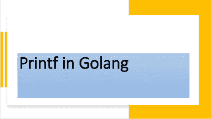

<!--yml

类别：未分类

日期：2024-10-13 06:37:45

-->

# 理解Go（Golang）中的Printf函数。

> 来源：[https://golangbyexample.com/printf-golang/](https://golangbyexample.com/printf-golang/)



目录

**   [概述](#Overview "Overview")

+   [程序](#Program "Program")*  *## **概述**

**Printf**定义在**fmt**包中，用于格式化字符串并写入标准输出。

[https://golang.org/pkg/fmt/#Printf](https://golang.org/pkg/fmt/#Printf)

下面是**Printf**的函数原型。

```go
func Printf(format string, a ...interface{}) (n int, err error)
```

**Printf**使用自定义说明符格式化字符串。它也不会添加新行。**Printf**也是一个可变参数函数，意味着它可以有多个参数。关于其参数列表有两个重要点。

+   请注意，第一个参数是**格式**或**模板**字符串。

+   下一个是可变数量的参数。此列表中的每个参数可以是字符串、整数、结构体或其他任何内容。因此，它是一个空接口。

**格式**或**模板**字符串包含需要格式化的实际字符串和一些格式动词。这些格式动词说明尾随参数在最终字符串中的格式化方式。因此，格式字符串参数包含某些符号，这些符号会被尾随参数替换。

示例

**打印字符串变量**

+   **%s**符号被使用

+   示例

```go
name := "John"
fmt.Printf("Name is: %s\n", name)
```

**打印整数**

+   **%d**符号被使用。

+   示例

```go
age := 21
fmt.Printf("Age is: %d\n", age)
```

**打印结构体**

例如，有三个格式说明符用于打印结构体。

+   **%v** – 它只会打印值。字段名称不会被打印。这是在使用Println时打印结构体的默认方式。

+   **%+v –**它将打印字段和值。

+   **%#v –**它将打印结构体，包括字段名称和值。

这就是原因。

```go
fmt.Printf("Employee is %v\n", e)
fmt.Printf("Employee is %+v\n", e)
fmt.Printf("Employee is %#v\n", e)
```

分别打印如下。

```go
Employee is {John 21}
Employee is {Name:John Age:21}
Employee is main.employee{Name:"John", Age:21}
```

这与上面的解释一致。

另外，请注意此函数返回打印的字符数以及发生的任何错误。与**Println**不同，它不会自动添加新行。你需要显式添加**“\n”**。

## 程序

这里是相应的工作程序。

```go
package main

import (
	"fmt"
	"log"
)

type employee struct {
	Name string
	Age  int
}

func main() {
	name := "John"
	age := 21

	fmt.Printf("Name is: %s\n", name)
	fmt.Printf("Age is: %d\n", age)

	fmt.Printf("Name: %s Age: %d\n", name, age)

	e := employee{
		Name: name,
		Age:  age,
	}

	fmt.Printf("Employee is %v\n", e)
	fmt.Printf("Employee is %+v\n", e)
	fmt.Printf("Employee is %#v\n", e)

	bytesPrinted, err := fmt.Printf("Name is: %s\n", name)
	if err != nil {
		log.Fatalln("Error occured", err)
	}
	fmt.Println(bytesPrinted)
}
```

**输出**

```go
Name is: John
Age is: 21
Name: John Age: 21
Employee is {John 21}
Employee is {Name:John Age:21}
Employee is main.employee{Name:"John", Age:21}
Name is: John
14
```

请注意下面的**Printf**

```go
fmt.Printf("Name: %s Age: %d\n", name, age)
```

+   **%s**被名称替换。

+   **%d**被年龄替换。

因此，格式字符串参数中的符号或动词按顺序被尾随参数替换。

如果格式字符串中的格式说明符数量与下一个可变参数的数量不匹配，则格式说明符将按原样打印。例如，在下面的代码中，我们有两个格式说明符。

+   %d

+   %s

而下一个可变数量的参数仅有一个。因此，当我们打印它时，它会如实打印第二个格式说明符，并显示“MISSING”作为警告。

```go
package main
import "fmt"
type employee struct {
    Name string
    Age  int
}
func main() {
    name := "John"
    fmt.Printf("Name is: %s %d\n", name)
}
```

**输出**

```go
Name is: John %!d(MISSING)
```

另外，查看我们的Golang高级教程系列 – [Golang高级教程](https://golangbyexample.com/golang-comprehensive-tutorial/)*
