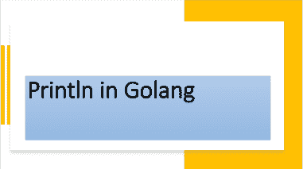

<!--yml

类别：未分类

日期：2024-10-13 06:37:39

-->

# 理解 Go (Golang) 中的 Println 函数

> 来源：[https://golangbyexample.com/println-golang/](https://golangbyexample.com/println-golang/)



目录

**   [概述](#Overview "Overview")

+   [程序](#Program "Program")*  *## **概述**

**Println** 定义在 **fmt** 包中，用于格式化字符串并写入标准输出。

[https://golang.org/pkg/fmt/#Println](https://golang.org/pkg/fmt/#Println)

以下是 **Println** 的函数原型。

```
func Println(a ...interface{}) (n int, err error)
```

**Println** 使用默认格式说明符格式化字符串，并在字符串后添加换行。**Println** 接受可变数量的参数，每个参数都是一个空接口。它返回打印的字符数量以及发生的任何错误。由于参数类型是空接口，我们可以传递任何数据类型。我们可以传递字符串、整数、浮点数、结构体或任何其他数据类型。**Println** 函数的每个参数都根据该参数类型的默认格式说明符进行格式化。例如，结构体将根据下面的说明符进行格式化。

```
%v
```

此格式说明符仅打印结构体中的值部分。让我们看一个例子。

## **程序**

```
package main
import "fmt"
type employee struct {
    Name string
    Age  int
}
func main() {
    name := "John"
    age := 21
    fmt.Println("Name is: ", name)
    fmt.Println("Age is: ", age)
    e := employee{
        Name: name,
        Age:  age,
    }
    fmt.Println(e)
    fmt.Println("a", 12, "b", 12.0)

    bytesPrinted, err := fmt.Println("Name is: ", name)
    if err != nil {
	log.Fatalln("Error occured", err)
    }
    fmt.Println(bytesPrinted)
}
```

**输出**

```
Name is: John
Age is: 21
{John 21}
a 12 b 12
Name is: John
14
```

关于 **Println** 函数的一些重要事项

+   它在末尾添加换行。这就是为什么每个输出都在不同的行上。

+   输出中的每个参数将用空格分隔。这就是为什么

```
fmt.Println("Name is: ", name)
```

打印

```
Name is: John
```

两个参数之间会自动引入空格。

+   它返回打印的字符数量或发生的任何错误。

```
bytesPrinted, err := fmt.Println("Name is: ", name)
if err != nil {
    log.Fatalln("Error occured", err)
}
fmt.Println(bytesPrinted)
```

将输出如下

```
Name is: John
14
```

**bytesPrinted** 的数量为 14，因为输出了 14 个字符。

另外，查看我们的 Golang 高级教程系列 – [Golang 高级教程](https://golangbyexample.com/golang-comprehensive-tutorial/)*
