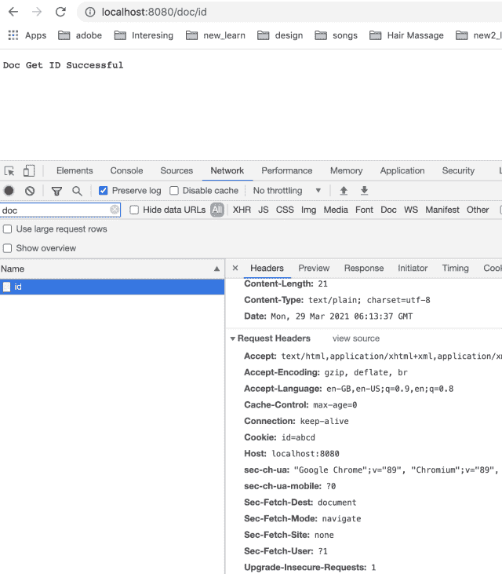

<!--yml

分类：未分类

日期：2024-10-13 06:34:34

-->

# 理解 Set-Cookie 响应头

> 来源：[`golangbyexample.com/set-cookie-response-header/`](https://golangbyexample.com/set-cookie-response-header/)

目录

**Set-Cookie 响应头概述**

+   示例

+   程序

# **Set-Cookie 响应头概述**

网页服务器可以将 Set-Cookie 头返回给客户端、浏览器或任何其他用户代理。然后，客户端应在其端存储此 cookie。该客户端将在每次请求时将此 cookie 发送给服务器。

您可以在这里阅读有关 HTTP cookie 的一般信息 – [`en.wikipedia.org/wiki/HTTP_cookie`](https://en.wikipedia.org/wiki/HTTP_cookie)

下面是 Set-Cookie 头的语法

```go
Set-Cookie: <cookie_name>=<cookie_value>; Expires={some_date}; Max-Age={some_integer}; Domain={some_domain}; Path={some_path}; 
SameSite={Strict/Lax/None}</cookie_value></cookie_name>
```

以下是 Set-Cookie 头的字段。这些字段通过 **‘;’** 连接以创建最终的 Set-Cookie 头值。

+   **name=value** – 这是表示 <cookie-name> 和 <cookie-value> 的名称-值对。名称和值由 **‘=’** 分隔。该字段是 cookie 的必填字段。所有其他字段为可选字段。

+   **Expires={some_date}** – 这指定了 cookie 的最大生命周期。它采用日期格式，并且 cookie 会在该日期后过期。

+   **Max-Age={some_integer}** – 它表示 cookie 过期的秒数。如果同时指定了 Expires 和 Max-Age，Max-Age 优先。

+   **Domain={some_domain}** – 它指定请求将发送到的域。

+   **Path={some_path}** – 客户端发送 cookies 的请求 URI 中存在的路径。如果路径与请求的 URI 不匹配，客户端将不发送 cookie。更高层次的路径匹配较低层次的路径。因此，/ 将匹配所有路径。而 /employee 将匹配 /employee、/employee/name、/employee/details。

+   **Secure** – 此标志意味着 cookie 仅在发出 HTTPS 请求时发送到服务器。

+   **HttpOnly** – 启用此标志后，javascript 将无法访问 cookie。这是为了防止 CSRF 攻击。

+   **SameSite**=**Strict** 或 **Lax** 或 **None** – 此选项控制在浏览器进行跨域调用时，是否可以发送 cookies。

如上所述，这些字段可以使用 **‘;’** 组合以创建最终的 Set-Cookie 头。这里需要注意的重要事项是，客户端仅会在后续调用服务器时将名称-值对发送回服务器。所有其他选项仅供客户端使用。另一个需要注意的重要点是，服务器也可以在响应中发送多个 **Set-Cookie** 头。所有 Set-Cookie 响应头中的名称-值对将在后续调用中发送给服务器。

# **示例**

这里有一些 Set-Cookie 头的示例

+   仅名称-值对

```go
show_pop=true
```

+   带有 Expires 字段的名称-值对

```go
show_pop=true; Expires=Tues, 27 Nov 2016 07:45:00 GMT
```

+   带有其他字段的名称-值对

```go
show_pop=true; Expires=Tues, 27 Nov 2016 07:45:00 GMT; Domain=foo_test.com; SameSite=Strict
```

# **程序**

让我们看看 **Set-Cookie** 头的实际效果。我们将看到 Golang 中的示例。为此，首先创建一个监听在 8080 端口的 Golang 服务器。创建两个 API。

+   **localhost:8080/doc** – 在这个 API 中，服务器将在响应中设置 **Set-Cookie** 头。我们将从浏览器发起这个调用。浏览器将在其端保存这个 cookie。然后，浏览器将在对 localhost:8080 的任何其他请求中将相同的 cookie 发送回服务器。

+   **localhost:8080/doc/id** – 这是示例 API，演示浏览器实际上在请求中发送的同一 cookie，它在 Set-Cookie 头中收到的响应中。

首先，我们创建一个服务器。

**go.mod**

```go
module sample.com/learn

go 1.16
```

**main.go**

```go
package main

import (
	"fmt"
	"net/http"
)

func main() {
	docHandler := http.HandlerFunc(docHandler)
	http.Handle("/doc", docHandler)

	docGetID := http.HandlerFunc(docGetID)
	http.Handle("/doc/id", docGetID)

	http.ListenAndServe(":8080", nil)
}

func docHandler(w http.ResponseWriter, r *http.Request) {
	cookie := &http.Cookie{
		Name:   "id",
		Value:  "abcd",
		MaxAge: 300,
	}
	http.SetCookie(w, cookie)
	w.WriteHeader(200)
	w.Write([]byte("Doc Get Successful"))
	return
}

func docGetID(w http.ResponseWriter, r *http.Request) {
	c, _ := r.Cookie("id")
	fmt.Println(c)
	w.WriteHeader(200)
	w.Write([]byte("Doc Get ID Successful"))
	return
}
```

从上面的代码可以看到我们有两个 API，如上所述。使用以下命令运行上述程序。

```go
go run main.go
```

服务器将在 8080 端口启动。

现在从浏览器发起 API 调用 **localhost:8080/doc**。服务器在响应中发送以下 **Set-Cookie**。

```go
Set-Cookie: id=abcd; Max-Age=300
```

这在 API 调用的响应头中也是可见的。请看下面的屏幕截图。


现在，从不同的标签页发起另一个 API 调用。注意，在响应中发送回的是相同的 cookie。同时注意，正如我们在文章中提到的，只发送名称-值对。



查看我们全面的 Golang 教程系列 – [Golang 综合教程](https://golangbyexample.com/golang-comprehensive-tutorial/)*
