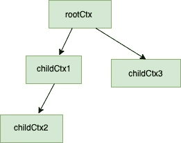
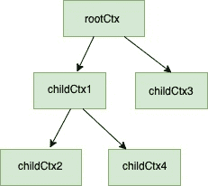

<!--yml

分类：未分类

日期：2024-10-13 06:05:57

-->

# 在 GO（Golang）中使用上下文包 – 完整指南

> 来源：[https://golangbyexample.com/using-context-in-golang-complete-guide/](https://golangbyexample.com/using-context-in-golang-complete-guide/)

# **介绍：**

## **定义：**

上下文是 GO 提供的一个包。让我们首先了解一些已经存在的问题，以及上下文包尝试解决的问题。

## **问题陈述：**

+   假设你启动了一个函数，需要将一些公共参数传递给下游函数。你不能将这些公共参数作为每个参数传递给所有下游函数。

+   你启动了一个 goroutine，进而又启动了更多的 goroutines。假设你正在进行的任务不再需要。那么，如何通知所有子 goroutines 优雅地退出，以便释放资源？

+   一个任务应在指定的超时时间内完成，例如 2 秒。如果没有，它应优雅地退出或返回。

+   一个任务应在截止时间内完成，例如它应在下午 5 点之前结束。如果未完成，则应优雅地退出并返回。

如果你注意到上述所有问题都适用于 HTTP 请求，但这些问题同样适用于许多不同的领域。

对于 web HTTP 请求，当客户端断开连接时，需要取消请求，或者请求必须在指定的超时时间内完成，同时请求范围的值如 request_id 需要对所有下游函数可用。

## **何时使用（一些用例）：**

+   将数据传递给下游。例如，一个 HTTP 请求创建了一个 **request_id，request_user**，需要在所有下游函数中传递以进行分布式跟踪。

+   当你想在中途停止操作时 – 由于客户端断开连接，HTTP 请求应被停止。

+   当你希望在启动后的一段特定时间内停止操作，即超时 – 例如，HTTP 请求应在 2 秒内完成，否则应被终止。

+   当你想在某个时间之前停止一个操作时 – 例如，如果没有完成，定时任务需要在 5 分钟内终止。

# **上下文接口**

理解上下文的核心是了解 **Context** 接口

```go
type Context interface {
    //It retures a channel when a context is cancelled, timesout (either when deadline is reached or timeout time has finished)
    Done() <-chan struct{}

    //Err will tell why this context was cancelled. A context is cancelled in three scenarios.
    // 1\. With explicit cancellation signal
    // 2\. Timeout is reached
    // 3\. Deadline is reached
    Err() error

    //Used for handling deallines and timeouts
    Deadline() (deadline time.Time, ok bool)

    //Used for passing request scope values
    Value(key interface{}) interface{}
}
```

# **创建新上下文**

## **context.Background():**

上下文包函数 Background() 返回一个空的 Context，它实现了 **Context** 接口。

1.  它没有值

1.  它从不被取消

1.  它没有截止日期

那么，context.Background() 的作用是什么？context.Background() 作为所有上下文的根，将从中派生。随着我们深入了解，这将变得更加清晰。

## **context.ToDo():**

+   context包中的ToDo函数返回一个空的Context。该上下文用于当周围函数没有传递上下文时，想要在当前函数中使用该上下文作为占位符，并计划在不久的将来添加实际上下文。将其作为占位符的一个用途是它有助于在静态代码分析工具中的验证。

+   它也是一个与context.Background()相同的空Context。

上述两种方法描述了一种创建新上下文的方法。可以从这些上下文中派生更多上下文。这就是上下文树的出现。

# **上下文树**

在理解上下文树之前，请确保在使用**context**时它在后台隐式创建。你将在Go的上下文包中找不到任何提及。

每当使用上下文时，从context.Background()获取的空上下文是所有上下文的根。context.ToDo()也充当根上下文，但如上所述，它更像是未来使用的上下文占位符。这个空上下文没有任何功能，我们可以通过从中派生新上下文来添加功能。基本上，通过包装已存在的不可变上下文并添加附加信息来创建新的上下文。让我们看看创建的上下文树的一些示例。

**两级树**

```go
rootCtx := context.Background()
childCtx := context.WithValue(rootCtx, "msgId", "someMsgId")
```

在上面

+   **rootCtx**是没有功能的空Context。

+   **childCtx**源自rootCtx，并具有存储请求范围值的功能。在上面的示例中，它存储键值对{"msgId" : "someMsgId"}。

**三级树**

```go
rootCtx := context.Background()
childCtx := context.WithValue(rootCtx, "msgId", "someMsgId")
childOfChildCtx, cancelFunc := context.WithCancel(childCtx)
```

在上面

+   **rootCtx**是没有功能的空Context。

+   **childCtx**源自rootCtx，并具有存储请求范围值的功能。在上面的示例中，它存储键值对{"msgId" : "someMsgId"}。

+   **childOfChildCtx**源自childCtx。它具有存储请求范围值的功能，并且还具有触发取消信号的功能。cancelFunc可用于触发取消信号。

**多级树**

```go
rootCtx := context.Background()
childCtx1 := context.WithValue(rootCtx, "msgId", "someMsgId")
childCtx2, cancelFunc := context.WithCancel(childCtx1)
childCtx3 := context.WithValue(rootCtx, "user_id", "some_user_id)
```

在上面：

+   **rootCtx**是没有功能的空Context。

+   **childCtx1**源自**rootCtx**，并具有存储请求范围值的功能。在上面的示例中，它存储键值对{"msgId" : "someMsgId"}。

+   **childCtx2**源自**childCtx1**。它具有触发取消信号的功能。cancelFunc可用于触发取消信号。

+   **childCtx3**源自**rootCtx**，具有存储当前用户的功能。

上述三级树如下所示。



由于它是树形结构，因此也可以为特定节点创建更多子节点。例如，我们可以从**childCtx1**派生一个新上下文**childCtx4**。

```go
childCtx4 := context.WithValue(childCtx1, "current_time", "some_time)
```

添加上述节点后的树如下所示：



目前，可能不清楚如何使用WithValue()或WithCancel()函数。现在只需理解，在使用上下文时，会创建一个以**emptyCtx**为根的上下文树。这些函数在我们继续时会更清晰

# **从上下文派生**

派生上下文可以通过4种方式创建

+   传递请求范围的值 - 使用**WithValue()**函数的上下文包

+   使用取消信号 - 使用**WithCancel()**函数的上下文包

+   使用截止日期 - 使用**WithDeadine()**函数的上下文包

+   使用超时 - 使用**WithTimeout()**函数的上下文包

让我们详细理解上述每一点

## **context.WithValue()**

用于传递请求范围的值。该函数的完整签名为

```go
withValue(parent Context, key, val interface{}) (ctx Context)
```

它接受一个父上下文、键、值并返回一个派生上下文。这个派生上下文与**值**关联的**键**。这里的父上下文可以是context.Background()或其他任何上下文。此外，任何从此上下文派生的上下文将具有此值。

```go
#Root Context
ctxRoot := context.Background() - #Root context 

#Below ctxChild has acess to only one pair {"a":"x"}
ctxChild := context.WithValue(ctxRoot, "a", "x") 

#Below ctxChildofChild has access to both pairs {"a":"x", "b":"y"} as it is derived from ctxChild
ctxChildofChild := context.WithValue(ctxChild, "b", "y") 
```

**示例：**

**withValue()**的完整工作示例。在下面的示例中，我们为每个传入请求注入一个msgId。如果你注意到下面的程序

+   injectMsgID是一个网络HTTP中间件函数，在上下文中填充**"msgID"**字段

+   HelloWorld是API "localhost:8080/welcome"的处理函数，它从上下文中获取msgID并作为响应头发送回去

```go
package main

import (
    "context"
    "net/http"
    "github.com/google/uuid"
)

func main() {
    helloWorldHandler := http.HandlerFunc(HelloWorld)
    http.Handle("/welcome", inejctMsgID(helloWorldHandler))
    http.ListenAndServe(":8080", nil)
}

//HelloWorld hellow world handler
func HelloWorld(w http.ResponseWriter, r *http.Request) {
    msgID := ""
    if m := r.Context().Value("msgId"); m != nil {
        if value, ok := m.(string); ok {
            msgID = value
        }
    }
    w.Header().Add("msgId", msgID)
    w.Write([]byte("Hello, world"))
}

func inejctMsgID(next http.Handler) http.Handler {
    return http.HandlerFunc(func(w http.ResponseWriter, r *http.Request) {
        msgID := uuid.New().String()
        ctx := context.WithValue(r.Context(), "msgId", msgID)
        req := r.WithContext(ctx)
        next.ServeHTTP(w, req)

    })
}
```

只需在运行上面的程序后对上述请求进行curl调用

```go
curl -v http://localhost/welcome
```

这里将是响应。注意响应头中填充的**MsgId**。injectMsgId函数作为中间件，向请求上下文注入唯一的msgId。

```go
curl -v http://localhost:8080/welcome
*   Trying ::1...
* TCP_NODELAY set
* Connected to localhost (::1) port 8080 (#0)
> GET /do HTTP/1.1
> Host: localhost:8080
> User-Agent: curl/7.54.0
> Accept: */*
> 
< HTTP/1.1 200 OK
< Msgid: a03ff1d4-1464-42e5-a0a8-743c5af29837
< Date: Mon, 23 Dec 2019 16:51:01 GMT
< Content-Length: 12
< Content-Type: text/plain; charset=utf-8
< 
* Connection #0 to host localhost left intact
```

## **context.WithCancel()**

用于取消信号。下面是**WithCancel()**函数的签名

```go
func WithCancel(parent Context) (ctx Context, cancel CancelFunc)
```

**context.WithCancel()**函数返回两个东西

+   具有新完成通道的父上下文的副本。

+   一个取消函数，当调用时关闭这个完成通道

只有上下文的创建者应该调用取消函数。强烈不建议传递**cancel**函数。让我们通过一个示例来理解**withCancel**。

**示例：**

```go
package main

import (
    "context"
    "fmt"
    "time"
)

func main() {
    ctx := context.Background()
    cancelCtx, cancelFunc := context.WithCancel(ctx)
    go task(cancelCtx)
    time.Sleep(time.Second * 3)
    cancelFunc()
    time.Sleep(time.Second * 1)
}

func task(ctx context.Context) {
    i := 1
    for {
        select {
        case <-ctx.Done():
            fmt.Println("Gracefully exit")
            fmt.Println(ctx.Err())
            return
        default:
            fmt.Println(i)
            time.Sleep(time.Second * 1)
            i++
        }
    }
}
```

**输出：**

```go
1
2
3
Gracefully exit
context canceled
```

在上面的程序中

+   一旦调用**cancelFunc**，任务函数将优雅地退出。一旦调用cancelFunc，上下文包将错误字符串设置为**"context cancelled"**。这就是**ctx.Err()**的输出为**"context cancelled"**的原因

## **context.WithTimeout()**

用于基于时间的取消。该函数的签名为

```go
func WithTimeout(parent Context, timeout time.Duration) (Context, CancelFunc)
```

**context.WithTimeout()**函数将

+   将返回具有新完成通道的父上下文的副本。

+   接受一个超时持续时间，在此之后这个完成通道将关闭，上下文将被取消

+   一个可以在上下文需要在超时之前取消时调用的取消函数。

让我们看一个例子

**示例：**

```go
package main

import (
    "context"
    "fmt"
    "time"
)

func main() {
    ctx := context.Background()
    cancelCtx, cancel := context.WithTimeout(ctx, time.Second*3)
    defer cancel()
    go task1(cancelCtx)
    time.Sleep(time.Second * 4)
}

func task1(ctx context.Context) {
    i := 1
    for {
        select {
        case <-ctx.Done():
            fmt.Println("Gracefully exit")
            fmt.Println(ctx.Err())
            return
        default:
            fmt.Println(i)
            time.Sleep(time.Second * 1)
            i++
        }
    }
}
```

**输出：**

```go
1
2
3
Gracefully exit
context deadline exceeded
```

在上面的程序中

+   一旦超时3秒到期，任务函数将优雅退出。错误字符串由上下文包设置为“上下文截止日期已超过”。这就是ctx.Err()输出为“上下文截止日期已超过”的原因。

## **context.WithDeadline()**

用于基于截止日期的取消。该函数的签名为

```go
func WithDeadline(parent Context, d time.Time) (Context, CancelFunc)
```

**context.WithDeadline()**函数

+   将返回一个带有新完成通道的父上下文副本。

+   接受一个截止日期，截止日期后此完成通道将关闭并取消上下文。

+   一个可以在上下文需要在截止日期之前被取消时调用的取消函数。

让我们看看一个例子。

**示例：**

```go
package main

import (
    "context"
    "fmt"
    "time"
)

func main() {
    ctx := context.Background()
    cancelCtx, cancel := context.WithDeadline(ctx, time.Now().Add(time.Second*5))
    defer cancel()
    go task(cancelCtx)
    time.Sleep(time.Second * 6)
}

func task(ctx context.Context) {
    i := 1
    for {
        select {
        case <-ctx.Done():
            fmt.Println("Gracefully exit")
            fmt.Println(ctx.Err())
            return
        default:
            fmt.Println(i)
            time.Sleep(time.Second * 1)
            i++
        }
    }
}
```

**输出：**

```go
1
2
3
4
5
Gracefully exit
context deadline exceeded
```

在上面的程序中

+   一旦超时5秒到期，任务函数将优雅退出，因为我们设定的截止日期为Time.now() + 5秒。错误字符串由上下文包设置为“上下文截止日期已超过”。这就是ctx.Err()输出为“上下文截止日期已超过”的原因。

# **我们学到了什么**

**如何创建上下文：**

+   使用context.Background()

+   使用context.Todo()

**上下文树**

**派生新的上下文**

+   context.WithValue()

+   context.WithCancel()

+   context.WithTimeout()

+   context.WithDeadline()

# **最佳实践与注意事项**

以下是你在使用上下文时可以遵循的最佳实践列表。

+   不要在结构体类型中存储上下文。

+   上下文应该在你的程序中流动。例如，在HTTP请求的情况下，可以为每个传入请求创建一个新的上下文，该上下文可以用于保存request_id或在上下文中放入一些公共信息，如当前登录用户，这在特定请求中可能会很有用。

+   始终将上下文作为函数的第一个参数传递。

+   每当你不确定是否使用上下文时，最好使用context.ToDo()作为占位符。

+   只有父级goroutine或函数应该取消上下文。因此，不要将**cancelFunc**传递给下游的goroutines或函数。Golang允许你将**cancelFunc**传递给子goroutines，但这不是推荐的做法。

+   [Golang中的上下文](https://golangbyexample.com/tag/context-in-golang/) *   [解释](https://golangbyexample.com/tag/explained/) *   [Golang上下文解释](https://golangbyexample.com/tag/golang-context-explained/) *   [sidetoc](https://golangbyexample.com/tag/sidetoc/)
