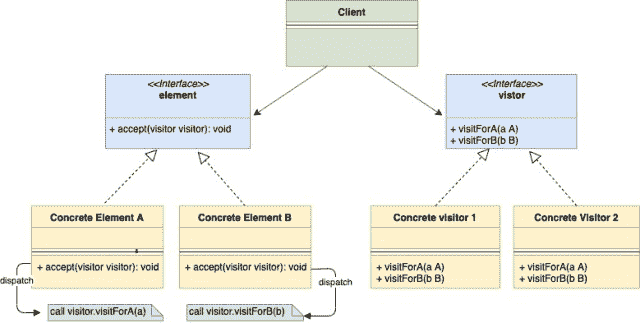
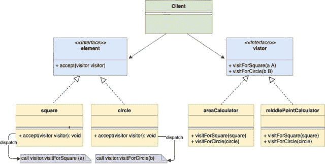

<!--yml

类别：未分类

日期：2024-10-13 06:04:34

-->

# Go语言中的访问者设计模式

> 来源：[https://golangbyexample.com/visitor-design-pattern-go/](https://golangbyexample.com/visitor-design-pattern-go/)

注：如果你有兴趣了解如何在GO中实现所有其他设计模式，请参阅此完整参考 – [Go语言中的所有设计模式](https://golangbyexample.com/all-design-patterns-golang/)

目录

**   [介绍：](#Introduction "介绍：")

+   [UML图：](#UML_Diagram "UML图：")

+   [映射](#Mapping "映射")

+   [示例](#Example "示例")

+   [完整工作代码：](#Full_Working_Code "完整工作代码：")*  *# **介绍：**

访问者设计模式是一种行为型设计模式，它允许你在不实际修改结构体的情况下，为结构体添加行为。

让我们通过一个例子理解访问者模式。假设你是一个库的维护者，该库有不同形状的结构体，例如

1.  正方形

1.  圆形

1.  三角形

上述每个形状结构体都实现了一个共同的接口**shape**。你公司中有很多团队在使用你的库。现在假设其中一个团队希望你为形状结构体添加一个新的行为(**getArea()**)。

解决这个问题有很多选项

**第一种选择**

第一个想到的选项是在**形状**接口中添加**getArea()**方法，然后每个形状结构体都可以实现getArea()方法。这看起来很简单，但有一些问题：

+   作为库的维护者，你不想通过添加额外的行为来更改库的高测试代码。

+   使用你的库的团队可能会有更多请求，想要更多行为，比如**getNumSides()**、**getMiddleCoordinates()**。在这种情况下，你不想不断修改你的库。但你希望其他团队在不实际修改代码的情况下扩展你的库。

**第二种选择**

第二种选择是请求特性的团队可以自己编写行为逻辑。因此，根据他们喜欢的形状结构体类型，可以使用以下代码

```go
if shape.type == square {
   //Calculate area for squre
} elseif shape.type == circle {
    //Calculate area of triangle 
} elseif shape.type == "triangle" {
    //Calculate area of triangle
} else {
   //Raise error
} 
```

上面的代码也存在问题，因为你无法充分利用接口，反而进行脆弱的显式类型检查。其次，运行时获取类型可能会影响性能，甚至在某些语言中可能不可行。

**第三种选择**

第三种选择是使用访问者模式来解决上述问题。我们可以定义一个访问者接口，如下所示

```go
type visitor interface {
   visitForSquare(square)
   visitForCircle(circle)
   visitForTriangle(triangle)
}
```

函数**visitforSquare(square)、visitForCircle(circle)、visitForTriangle(三角形)**允许我们分别为正方形、圆形和三角形添加功能。

现在脑海中浮现的问题是，为什么我们不能在访问者接口中使用单一方法visit**(shape)**。原因在于GO及其他一些语言支持方法重载。因此每个结构体都有不同的方法。

我们在形状接口中添加一个 accept 方法，其签名如下，每个形状结构需要定义此方法。

```go
func accept(v visitor)
```

但等一下，我们刚提到我们不想修改现有的形状结构。但是使用访客模式时，我们确实需要修改形状结构，但这种修改只需进行一次。在添加任何额外行为（如 **getNumSides()**、**getMiddleCoordinates()**）时，将使用上述相同的 **accept(v visitor)** 函数，而无需进一步更改形状结构。基本上，形状结构只需修改一次，所有未来对额外行为的请求将通过相同的 accept 函数处理。让我们看看。

square 结构将实现如下的 accept 方法：

```go
func (obj *squre) accept(v visitor){
    v.visitForSquare(obj)
}
```

同样，circle 和 triangle 也会定义一个如上所述的 accept 函数。

现在请求 **getArea()** 行为的团队可以简单定义访客接口的具体实现，并在该具体实现中编写面积计算逻辑。

**areaCalculator.go**

```go
type areaCalculator struct{
    area int
}

func (a *areaCalculator) visitForSquare(s *square){
    //Calculate are for square
}
func (a *areaCalculator) visitForCircle(s *square){
    //Calculate are for circle
}
func (a *areaCalculator) visitForTriangle(s *square){
    //Calculate are for triangle
}
```

要计算正方形的面积，我们首先创建一个正方形实例，他们可以简单调用。

```go
sq := &square{}
ac := &areaCalculator{}
sq.accept(ac)
```

同样，其他团队请求 **getMiddleCoordinates()** 行为可以定义类似于上述的访客接口的另一个具体实现。

**middleCoordinates.go**

```go
type middleCoordinates struct {
    x int
    y int
}

func (a *middleCoordinates) visitForSquare(s *square) {
    //Calculate middle point coordinates for square. After calculating the area assign in to the x and y instance variable.
}

func (a *middleCoordinates) visitForCircle(c *circle) {
    //Calculate middle point coordinates for square. After calculating the area assign in to the x and y instance variable.
}

func (a *middleCoordinates) visitForTriangle(t *triangle) {
    //Calculate middle point coordinates for square. After calculating the area assign in to the x and y instance variable.
}
```

# **UML 图：**



以下是与我们上面给出的形状结构和 areaCalculator 的实际示例对应的映射 UML 图



# **映射**

下表表示 **“示例”** 中 UML 图演员到实际实现演员的映射

| 元素 | shape.go |
| --- | --- |
| 具体元素 A | square.go |
| 具体元素 B | circle.go |
| 具体元素 C | rectangle.go |
| 访客 | visitor.go |
| 具体访客 1 | areaCalculator.go |
| 具体访客 2 | middleCoordinates.go |
| 客户端 | main.go |

# **示例**

**shape.go**

```go
package main

type shape interface {
    getType() string
    accept(visitor)
}
```

**square.go**

```go
package main

type square struct {
    side int
}

func (s *square) accept(v visitor) {
    v.visitForSquare(s)
}

func (s *square) getType() string {
    return "Square"
}
```

**circle.go**

```go
package main

type circle struct {
    radius int
}

func (c *circle) accept(v visitor) {
    v.visitForCircle(c)
}

func (c *circle) getType() string {
    return "Circle"
}
```

**rectangle.go**

```go
package main

type rectangle struct {
    l int
    b int
}

func (t *rectangle) accept(v visitor) {
    v.visitForrectangle(t)
}

func (t *rectangle) getType() string {
    return "rectangle"
}
```

**visitor.go**

```go
package main

type visitor interface {
    visitForSquare(*square)
    visitForCircle(*circle)
    visitForrectangle(*rectangle)
}
```

**areaCalculator.go**

```go
package main

import (
    "fmt"
)

type areaCalculator struct {
    area int
}

func (a *areaCalculator) visitForSquare(s *square) {
    //Calculate area for square. After calculating the area assign in to the area instance variable
    fmt.Println("Calculating area for square")
}

func (a *areaCalculator) visitForCircle(s *circle) {
    //Calculate are for circle. After calculating the area assign in to the area instance variable
    fmt.Println("Calculating area for circle")
}

func (a *areaCalculator) visitForrectangle(s *rectangle) {
    //Calculate are for rectangle. After calculating the area assign in to the area instance variable
    fmt.Println("Calculating area for rectangle")
}
```

**middleCoordinates.go**

```go
package main

import "fmt"

type middleCoordinates struct {
    x int
    y int
}

func (a *middleCoordinates) visitForSquare(s *square) {
    //Calculate middle point coordinates for square. After calculating the area assign in to the x and y instance variable.
    fmt.Println("Calculating middle point coordinates for square")
}

func (a *middleCoordinates) visitForCircle(c *circle) {
    //Calculate middle point coordinates for square. After calculating the area assign in to the x and y instance variable.
    fmt.Println("Calculating middle point coordinates for circle")
}

func (a *middleCoordinates) visitForrectangle(t *rectangle) {
    //Calculate middle point coordinates for square. After calculating the area assign in to the x and y instance variable.
    fmt.Println("Calculating middle point coordinates for rectangle")
}
```

**main.go**

```go
package main

import "fmt"

func main() {
    square := &square{side: 2}
    circle := &circle{radius: 3}
    rectangle := &rectangle{l: 2, b: 3}

    areaCalculator := &areaCalculator{}
    square.accept(areaCalculator)
    circle.accept(areaCalculator)
    rectangle.accept(areaCalculator)

    fmt.Println()
    middleCoordinates := &middleCoordinates{}
    square.accept(middleCoordinates)
    circle.accept(middleCoordinates)
    rectangle.accept(middleCoordinates)
}
```

**输出：**

```go
Calculating area for square
Calculating area for circle
Calculating area for rectangle

Calculating middle point coordinates for square
Calculating middle point coordinates for circle
Calculating middle point coordinates for rectangle
```

# **完整工作代码：**

```go
package main

import "fmt"

type shape interface {
    getType() string
    accept(visitor)
}

type square struct {
    side int
}

func (s *square) accept(v visitor) {
    v.visitForSquare(s)
}

func (s *square) getType() string {
    return "Square"
}

type circle struct {
    radius int
}

func (c *circle) accept(v visitor) {
    v.visitForCircle(c)
}

func (c *circle) getType() string {
    return "Circle"
}

type rectangle struct {
    l int
    b int
}

func (t *rectangle) accept(v visitor) {
    v.visitForrectangle(t)
}

func (t *rectangle) getType() string {
    return "rectangle"
}

type visitor interface {
    visitForSquare(*square)
    visitForCircle(*circle)
    visitForrectangle(*rectangle)
}

type areaCalculator struct {
    area int
}

func (a *areaCalculator) visitForSquare(s *square) {
    //Calculate area for square. After calculating the area assign in to the area instance variable
    fmt.Println("Calculating area for square")
}

func (a *areaCalculator) visitForCircle(s *circle) {
    //Calculate are for circle. After calculating the area assign in to the area instance variable
    fmt.Println("Calculating area for circle")
}

func (a *areaCalculator) visitForrectangle(s *rectangle) {
    //Calculate are for rectangle. After calculating the area assign in to the area instance variable
    fmt.Println("Calculating area for rectangle")
}

type middleCoordinates struct {
    x int
    y int
}

func (a *middleCoordinates) visitForSquare(s *square) {
    //Calculate middle point coordinates for square. After calculating the area assign in to the x and y instance variable.
    fmt.Println("Calculating middle point coordinates for square")
}

func (a *middleCoordinates) visitForCircle(c *circle) {
    //Calculate middle point coordinates for square. After calculating the area assign in to the x and y instance variable.
    fmt.Println("Calculating middle point coordinates for circle")
}

func (a *middleCoordinates) visitForrectangle(t *rectangle) {
    //Calculate middle point coordinates for square. After calculating the area assign in to the x and y instance variable.
    fmt.Println("Calculating middle point coordinates for rectangle")
}

func main() {
    square := &square{side: 2}
    circle := &circle{radius: 3}
    rectangle := &rectangle{l: 2, b: 3}
    areaCalculator := &areaCalculator{}
    square.accept(areaCalculator)
    circle.accept(areaCalculator)
    rectangle.accept(areaCalculator)

    fmt.Println()
    middleCoordinates := &middleCoordinates{}
    square.accept(middleCoordinates)
    circle.accept(middleCoordinates)
    rectangle.accept(middleCoordinates)
}
```

**输出：**

```go
Calculating area for square
Calculating area for circle
Calculating area for rectangle

Calculating middle point coordinates for square
Calculating middle point coordinates for circle
Calculating middle point coordinates for rectangle
```

+   [设计](https://golangbyexample.com/tag/design/) *   [go](https://golangbyexample.com/tag/go/) *   [访客](https://golangbyexample.com/tag/visitor/) *
