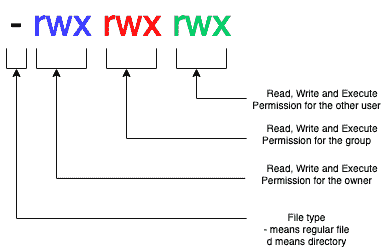

<!--yml

类别：未分类

日期：2024-10-13 06:50:02

-->

# chmod o-w 命令在 bash 或终端中是什么意思？

> 来源：[https://golangbyexample.com/chmod-ow-command/](https://golangbyexample.com/chmod-ow-command/)

目录

**   [概述](#Overview "Overview")

+   [权限组](#Permission_Groups "Permission Groups")

+   [权限类型](#Permission_Types "Permission Types")

+   [操作定义](#Operations_Definitions "Operations Definitions")

+   [示例](#Example "Example")*  *## **概述**

在管理文件权限时，图中有三个组件。

## **权限组**

+   **用户** – 简写为 **‘u’**

+   **组** – 简写为 **‘g’**

+   **其他** – 简写为 **‘o’**

+   **所有** – 简写为 **‘a’**

## **权限类型**

+   **读取权限 –** 简写为 **‘r’**

+   **写入权限 –** 简写为 **‘w’**

+   **执行权限 –** 简写为 **‘x’**

## ****操作定义****

***   **+** 用于添加权限。

+   **–** 用于移除权限。

+   **=** 用于设置权限。

所以 **o-w** 意味着从 **其他** 用户那里取消 **写入** 权限。

在我们查看示例之前，让我们先看看当你运行 **ls** 命令时，文件权限是如何表示的。



下面是关于上图的一些要点。

+   第一个字符表示文件类型。‘-’表示常规文件，‘d’表示目录。

+   第二到第四个字符表示拥有者的读取、写入和执行权限。

+   第四到第七个字符表示组的读取、写入和执行权限。

+   第八到第十个字符表示其他用户的读取、写入和执行权限。

## **示例**

+   创建一个文件 **temp.txt**。检查其权限。

```go
ls -all | grep temp.txt
-rw-r--r--    1 root  root      0 Aug  9 14:50 temp.txt
```

注意 **其他** 用户仅有 **读取** 权限。

+   现在运行命令以给予其他用户写入权限。

```go
chmod o+w temp.txt
ls -all | grep temp.txt
-rw-r--rw-    1 root  root      0 Aug  9 14:50 temp.txt
```

参见上面的输出。执行权限也被赋予了其他用户。

+   现在运行命令以取消其他用户的写入权限。

```go
chmod o-w temp.txt
ls -all | grep temp.txt
-rw-r--r--    1 root  root      0 Aug  9 14:50 temp.txt
```

注意其他用户的写入权限是如何被取消的。
