# 第一章：网络系统概述

在数字时代，越来越多的设备通过计算机网络进行通信。*计算机网络*是两个或更多设备（或*节点*）之间的连接，使每个节点能够共享数据。这些连接本身并不可靠或安全。幸运的是，Go 的标准库及其丰富的生态系统非常适合编写安全、可靠的网络应用程序。

本章将为你提供本书练习所需的基础知识。你将学习网络的结构以及网络如何使用协议进行通信。

## 选择网络拓扑

网络中节点的组织结构被称为其*拓扑*。网络的拓扑可以简单到两个节点之间的单一连接，也可以复杂到节点之间没有直接连接但仍能交换数据的布局。通常，这种情况适用于你计算机与互联网节点之间的连接。拓扑类型分为六大类：点对点、菊花链、总线、环形、星形和网状。

在最简单的网络中，*点对点*，两个节点共享一个连接（图 1-1）。这种类型的网络连接并不常见，但在需要两个节点之间直接通信时非常有用。

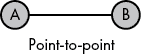

图 1-1：两个节点之间的直接连接

一系列点对点连接形成了*菊花链*。在 图 1-2 中的菊花链中，来自节点 C 的流量如果要传递到节点 F，必须经过节点 D 和 E。源节点和目标节点之间的中间节点通常称为*跳点*。在现代网络中，你不太可能遇到这种拓扑结构。

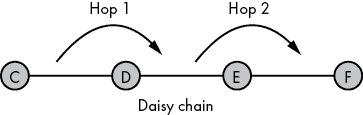

图 1-2：通过菊花链连接的点对点段

*总线*拓扑节点共享一个公共的网络链接。虽然有线总线网络不常见，但这种拓扑类型驱动了无线网络。处于有线网络中的节点可以看到所有的流量，并根据流量是否为它们所接收的内容，选择性地忽略或接受流量。当节点 H 在总线图 图 1-3 中向节点 L 发送流量时，节点 I、J、K 和 M 会接收到流量，但会忽略它。只有节点 L 会接受数据，因为它是预定的接收方。尽管无线客户端可以看到彼此的流量，但流量通常是加密的。

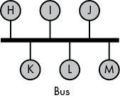

图 1-3：总线拓扑中连接的节点

*环形*拓扑曾在一些光纤网络部署中使用，它是一个封闭的环路，其中数据朝一个方向流动。例如，在图 1-4 中，节点 N 可以通过节点 O、P 和 Q 将信息发送到目标节点 R。节点 O、P 和 Q 会转发信息，直到它到达节点 R。如果节点 P 未能转发信息，它将永远无法到达目标。由于这种设计，最慢的节点会限制数据传输的速度。假设流量是顺时针流动的，而节点 Q 是最慢的，节点 Q 会减缓从节点 O 到节点 N 的数据流量。然而，从节点 N 到节点 O 的流量不受节点 Q 的慢速影响，因为这些流量并不经过节点 Q。

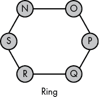

图 1-4：按环形排列的节点，数据朝一个方向流动

在*星型*拓扑中，一个中央节点与所有其他节点建立了单独的点对点连接。你可能会在有线网络中遇到这种拓扑。中央节点，如图 1-5 所示，通常是一个*网络交换机*，它接收来自源节点的数据，并将数据重新传输到目标节点，类似于邮政服务。增加节点只需将它们连接到交换机。数据在这种拓扑中只能进行一次跳跃。

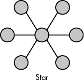

图 1-5：与中央节点连接的节点，中央节点处理节点间的流量

每个完全连接的*网状*网络中的节点都与其他所有节点直接连接（图 1-6）。这种拓扑消除了单点故障的风险，因为单个节点的故障不会影响网络中其他节点之间的流量。另一方面，随着节点数量的增加，成本和复杂性也会增加，使得这种拓扑在大规模网络中不可行。这是另一种你可能只在较大无线网络中遇到的拓扑。

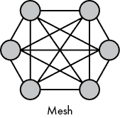

图 1-6：网状网络中相互连接的节点

你还可以通过将两种或更多基本拓扑结合起来创建混合网络拓扑。现实中的网络很少只由一种拓扑组成。相反，你很可能会遇到混合拓扑。图 1-7 展示了两个例子。*星型环形*混合网络是多个环形网络与一个中央节点相连。*星型总线*混合网络是通过结合总线和星型网络拓扑形成的分层拓扑。

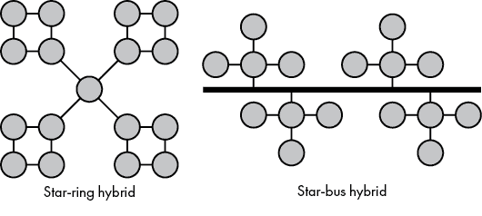

图 1-7：星型环形与星型总线混合拓扑

混合拓扑旨在通过利用每种拓扑的优势，同时将每种拓扑的缺点限制在单独的网络段内，从而提高可靠性、可扩展性和灵活性。

例如，图 1-7 中*星环*混合网络中中央节点的故障只会影响环间通信。每个环形网络将继续正常运行，尽管它们与其他环形网络隔离。环形网络中单个节点的故障，在星环混合网络中的诊断要比单一大型环形网络更为容易。此外，故障只会影响整体网络的一个子集。

## 带宽与延迟

网络*带宽*是指我们在一段时间内能够通过网络连接发送的数据量。如果您的互联网连接被宣传为*100Mbps 下载*，这意味着理论上您的互联网连接应该能够每秒从互联网服务提供商（ISP）向调制解调器传输最多 100 兆位的数据。

ISP 通过大量广告向我们宣传他们提供的带宽，以至于我们很容易将带宽与连接速度等同起来。然而，速度更快并不总是意味着性能更好。尽管这似乎违背直觉，但低带宽的网络连接可能表现得比高带宽连接更好，原因在于一个特性：延迟。

网络*延迟*是指发送网络资源请求与接收响应之间的时间间隔。延迟的一个例子是点击网站上的链接和网站呈现结果页面之间的延迟。你可能曾经历过点击链接后页面无法加载，直到你的浏览器放弃等待服务器的回复。这种情况发生在延迟大于浏览器等待回复的最大时间时。

高延迟会对用户体验产生负面影响，导致攻击使您的服务无法被用户访问，并驱使用户远离您的软件或服务。网络软件中延迟管理的重要性常常被软件开发人员低估。不要陷入认为带宽是优化网络性能的唯一因素的陷阱。

网站的延迟来源于多个方面：客户端与服务器之间的网络延迟、从数据存储中获取数据所需的时间、在服务器端编译动态内容的时间，以及网页渲染所需的时间。如果用户点击了一个链接，而页面渲染的时间过长，用户很可能不会等待结果，延迟将导致流量流失。保持最低的延迟，同时编写网络软件，无论是 Web 应用程序还是应用程序接口，都将通过改善用户体验和提高应用程序在热门搜索引擎中的排名带来回报。

你可以通过几种方式解决常见的延迟问题。首先，你可以通过使用内容分发网络（CDN）或云基础设施，将你的服务放置在离用户更近的地方，从而减少用户和服务之间的距离和跳数。优化请求和响应的大小将进一步减少延迟。在网络应用程序中引入缓存策略能显著提高性能。最后，利用 Go 的并发性来最小化服务器端的响应阻塞也有帮助。我们将在本书的后续章节中重点讨论这一点。

## 开放系统互联参考模型

在 1970 年代，随着计算机网络日益复杂，研究人员创建了*开放系统互联（OSI）参考模型*，以标准化网络通信。OSI 参考模型作为协议开发和沟通的框架。*协议*是确定网络中数据传输格式和顺序的规则和程序。例如，使用*传输控制协议（TCP）*的通信要求消息接收方回复确认收到消息。否则，TCP 可能会重新传输该消息。

尽管 OSI 如今不再像以前那样重要，但熟悉它仍然很有价值，因为它能帮助你理解常见的概念，比如低层次的网络和路由，尤其是在硬件相关的内容上。

### OSI 参考模型的分层结构

OSI 参考模型将所有网络活动分为一个严格的层级结构，由七层组成。OSI 参考模型的可视化表示，如图 1-8 所示，将这些层排列成一个堆栈，第 7 层位于顶部，第 1 层位于底部。

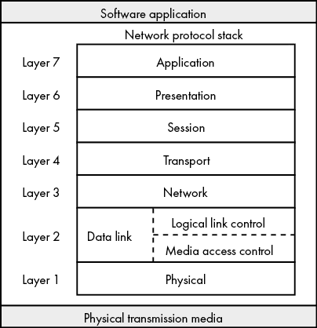

图 1-8：OSI 参考模型的七层

很容易将这些层的名称解读为独立的代码单元。实际上，它们描述的是我们归属给软件部分的抽象。例如，你无法将*第 7 层*库直接集成到软件中。但你可以说你编写的软件实现了一个第 7 层的服务。OSI 模型的七层如下：

1.  第 7 层——应用层 你的网络应用程序和库最常与应用层交互，应用层负责识别主机并获取资源。Web 浏览器、Skype 和 BT 客户端是应用层的例子。

1.  第 6 层——表示层 表示层在数据下行时为网络层准备数据，在数据上行时为应用层提供数据。加密、解密和数据编码是第 6 层功能的例子。

1.  第五层—会话层 会话层管理网络中节点之间连接的生命周期。它负责建立连接、管理连接超时、协调操作模式并终止连接。某些第七层协议依赖于第 5 层提供的服务。

1.  第四层—传输层 传输层控制并协调两个节点之间的数据传输，同时保持传输的可靠性。保持传输可靠性包括纠正错误、控制数据传输速度、分块或分段数据、重传丢失的数据以及确认接收到的数据。如果接收方没有确认接收到数据，本层协议通常会重传数据。

1.  第三层—网络层 网络层负责在节点之间传输数据。它允许你将数据发送到一个网络地址，而不需要与远程节点建立直接的点对点连接。OSI 并不要求这一层的协议提供可靠的传输或报告传输错误给发送方。网络层包含了涉及路由、寻址、多播和流量控制的网络管理协议。下一章将讨论这些内容。

1.  第二层—数据链路层 数据链路层处理两个直接连接的节点之间的数据传输。例如，数据链路层促进了计算机到交换机的传输，以及交换机到另一台计算机的传输。本层的协议会识别并尝试纠正物理层上的错误。

1.  数据链路层的重传和流量控制功能取决于底层的物理介质。例如，以太网不会重传错误数据，而无线网络会重传。这是因为以太网网络上的比特错误较少，而无线网络中则较为常见。如果该层无法保证数据传输的可靠性，网络协议栈中更高层的协议通常可以确保传输的可靠性，尽管效率较低。

1.  第一层—物理层 物理层将网络栈中的比特转换为适合底层物理介质的电信号、光信号或无线电信号，并将物理介质中的信号转换回比特。此层控制比特率。比特率是数据传输的速度限制。一千兆比特每秒的比特率意味着数据可以在源和目的地之间以每秒最多 10 亿比特的速度传输。

在讨论网络传输速率时，一个常见的误解是使用每秒字节数而不是每秒比特数。我们计算每秒可以传输的零和一，或者说是*比特*的数量。因此，网络传输速率是以每秒比特数来衡量的。讨论传输的数据量时，我们使用每秒字节数。

如果你的 ISP 宣传的下载速度是 100Mbps，这并不意味着你能在一秒钟内下载一个 100MB 的文件。实际上，在理想的网络条件下，可能需要接近八秒的时间。可以说，我们在 100Mbps 的连接上最多可以每秒传输 12.5MB。

### 使用数据封装发送流量

*封装*是一种隐藏实现细节或仅向接收方提供相关细节的方法。可以把封装想象成像通过邮政服务发送的包裹。我们可以说信封封装了其内容。在这个过程中，信封可能会包括目的地址或其他关键细节，这些信息会被用于包裹的下一段旅程。包裹的实际内容并不重要；只有包裹上的细节对于运输才是重要的。

当数据向下移动堆栈时，它会被下层封装。我们通常称沿着堆栈向下移动的数据为 *有效负载*，虽然你可能会看到它被称为 *消息体*。文献中使用的术语是 *服务数据单元*（SDU）。例如，传输层封装了来自会话层的有效负载，而会话层又封装了来自表示层的有效负载。当有效负载向上移动堆栈时，每一层都会去除来自上一层堆栈的头部信息。

即使是在单一 OSI 层中运行的协议也使用数据封装。例如，以 *超文本传输协议*（HTTP/1）第 1 版为例，这是一个第 7 层协议，客户端和服务器都使用它来交换网页内容。HTTP 定义了一个完整的消息，包括客户端从其第 7 层发送到服务器第 7 层的头部信息；网络堆栈将客户端的请求传递到 HTTP 服务器应用程序。HTTP 服务器应用程序发起响应，返回其网络堆栈，后者创建一个第 7 层有效负载并将其发送回客户端的第 7 层应用程序（图 1-9）。

客户端与服务器之间同一层的通信被称为 *水平通信*，这一术语让人感觉像是客户端上的单层协议直接与服务器上的对应层进行通信。实际上，在水平通信中，数据必须从客户端的堆栈一路向下，再返回服务器的堆栈。

例如，图 1-10 展示了一个 HTTP 请求如何遍历堆栈。

通常，一个有效负载会从客户端的网络栈向下传输，通过物理介质到达服务器，然后再向上传送至服务器的网络栈中的相应层。结果是，从源节点的某一层发送的数据最终到达目标节点的同一层。服务器的响应会沿相同的路径朝相反方向传输。在客户端一侧，第六层接收第七层的有效负载，然后使用头部封装有效负载，形成第六层的有效负载。第五层接收第六层的有效负载，添加自己的头部，并将其有效负载传递给第四层，在这里我们会介绍第一个传输协议：TCP。

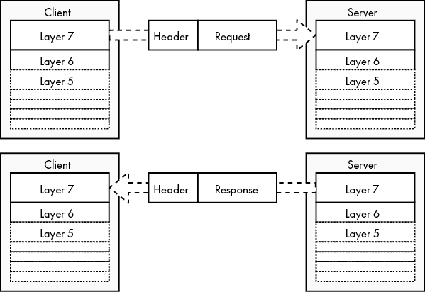

图 1-9：客户端与服务器之间的横向通信

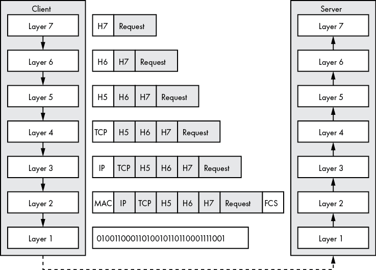

图 1-10：HTTP 请求从客户端的第七层到达服务器的第七层

TCP 是一个第四层协议，其有效负载也称为 *段* 或 *数据报*。TCP 接受第五层的有效负载，在发送段到第三层之前，会在其前面添加一个头部。第三层的 *互联网协议**(IP)* 接收到 TCP 段，并将其封装上一个头部，形成第三层的有效负载，即 *数据包*。第二层接收数据包，添加头部和尾部，生成其有效负载，称为 *帧*。第二层的头部将接收方的 IP 地址转换为 *媒体访问控制**(MAC)* 地址，这是分配给节点网络接口的唯一标识符。其尾部包含 *帧校验序列**(FCS)*，这是一个校验和，用于辅助错误检测。第一层接收第二层的有效负载（以比特流的形式），并将比特流发送到服务器。

服务器的第一层接收比特流，将其转换为帧，并将帧发送到第二层。第二层去除帧的头部和尾部，将数据包传递给第三层。每一层的封装逆向过程一直持续到有效负载到达第七层。最后，HTTP 服务器从网络栈接收客户端的请求。

## TCP/IP 模型

与此同时，正当研究人员在开发 OSI 参考模型时，美国国防部的国防高级研究计划局（DARPA）也在推动一项平行的工作，旨在开发协议。这一努力最终产生了一组我们现在称之为 *TCP/IP 模型* 的协议。该项目对美国军方，以及随后对全球通信的影响深远。TCP/IP 模型在 1990 年代初，微软将其纳入 Windows 95 时达到了关键的转折点。今天，TCP/IP 已在计算机网络中无处不在，它也是本书中我们将使用的协议栈。

TCP/IP——得名于传输控制协议（Transmission Control Protocol）和互联网协议（Internet Protocol）——促进了基于*端到端原则*设计的网络，其中每个网络段只包含足够的功能来正确传输和路由比特；所有其他功能都属于端点，即发送方和接收方的网络堆栈。与此相对的是现代蜂窝网络，在这些网络中，更多的网络功能必须由基站之间提供，以允许手机连接在基站之间跳转而不切断电话通话。TCP/IP 规范建议实现应具有鲁棒性；它们应发送格式良好的数据包，但应接受任何意图明确的数据包，无论该数据包是否遵循技术规范。

与 OSI 参考模型类似，TCP/IP 依赖于层封装来抽象功能。它由四个命名层组成：应用层、传输层、互联网层和链路层。TCP/IP 的应用层和链路层概括了它们在 OSI 中的对应层，如图 1-11 所示。

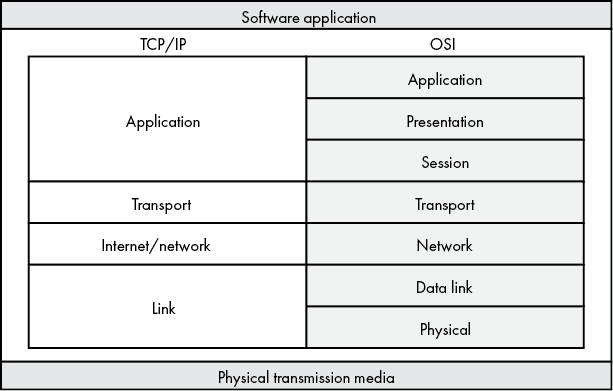

图 1-11：四层 TCP/IP 模型与七层 OSI 参考模型的比较

TCP/IP 模型将 OSI 的应用层、表示层和会话层简化为单一的应用层，主要因为 TCP/IP 的协议经常跨越 OSI 第 5 层到第 7 层的边界。同样，OSI 的数据链路层和物理层对应于 TCP/IP 的链路层。TCP/IP 和 OSI 的传输层及网络层有一一对应的关系。

这种简化的出现是因为研究人员首先开发了原型实现，然后正式标准化了最终的实现，导致了一个面向实际应用的模型。另一方面，委员会花费了大量时间制定 OSI 参考模型，以应对广泛的需求，然后才有人创建实现，这使得该模型的复杂性增加。

### 应用层

与 OSI 的应用层类似，TCP/IP 模型的*应用层*直接与软件应用程序交互。我们编写的大多数软件都使用这一层的协议，当你的网页浏览器检索网页时，它会读取堆栈中的这一层。

你会注意到，TCP/IP 的应用层涵盖了三个 OSI 层。这是因为 TCP/IP 没有定义具体的表示层或会话层功能。相反，具体的应用协议实现关注这些细节。如你所见，一些 TCP/IP 应用层协议很难完全符合 OSI 模型中的单一上层，因为它们具有跨越多个 OSI 层的功能。

常见的 TCP/IP 应用层协议包括 HTTP、*文件传输协议 (FTP)* 用于节点之间的文件传输，以及 *简单邮件传输协议 (SMTP)* 用于向邮件服务器发送电子邮件。*动态主机配置协议 (DHCP)* 和 *域名系统 (DNS)* 也在应用层中运行。DHCP 和 DNS 分别提供地址分配和名称解析服务，使其他应用层协议能够运行。HTTP、FTP 和 SMTP 是提供 TCP/IP 应用层中表示或会话功能的协议实现示例。我们将在后续章节中讨论这些协议。

### 传输层

*传输层* 协议处理两个节点之间的数据传输，类似于 OSI 的第 4 层。这些协议可以通过确保从源节点发送的所有数据完全且正确地到达目的地来帮助确保 *数据完整性*。请记住，数据完整性并不意味着目的地会收到我们通过传输层发送的所有分段。由于网络中丢包的原因太多，不能保证每个分段都会到达目的地。但这意味着 TCP 会特别确保目的地收到的数据是按正确顺序排列的，不会有重复数据或丢失数据。

本书中你将使用的主要传输层协议是 TCP 和 *用户数据报协议 (UDP)*。正如在第 10 页的《使用数据封装发送流量》一节中提到的，这一层处理的是分段或数据报。

我们的大多数网络应用程序依赖于传输层协议来处理每个分段的错误校正、流量控制、重传和传输确认。然而，TCP/IP 模型并不要求每个传输层协议都必须满足所有这些元素。UDP 就是一个例子。如果你的应用需要使用 UDP 以实现最大吞吐量，那么责任在你自己，必须实现某种错误检查或会话管理，因为 UDP 本身不提供这些功能。

### 互联网层

*互联网层* 负责将上层数据包路由从源节点传递到目的节点，通常跨越多个物理介质异构的网络。它的功能与 OSI 的第 3 层网络层相同。（有些资料可能将 TCP/IP 的互联网层称为 *网络层*。）

*互联网协议版本 4 (IPv4)*、*互联网协议版本 6 (IPv6)*、*边界网关协议 (BGP)*、*互联网控制消息协议 (ICMP)*、*互联网组管理协议 (IGMP)* 和 *互联网协议安全 (IPsec)* 套件等，提供主机标识和路由功能，作用于 TCP/IP 的互联网层。我们将在下一章讨论这些协议，届时我们将涉及主机寻址和路由。现在，请了解这一层在确保我们发送的数据能够到达目的地时起着至关重要的作用，不论源头和目的地之间的复杂性如何。

### 链路层

*链路层*对应于 OSI 参考模型的第 1 层和第 2 层，是核心 TCP/IP 协议与物理媒体之间的接口。

链路层的*地址解析协议**(ARP)*将节点的 IP 地址转换为其网络接口的 MAC 地址。链路层在将数据帧传递到物理网络之前，会将 MAC 地址嵌入每个数据帧的头部。我们将在下一章讨论 MAC 地址及其路由意义。

并非所有的 TCP/IP 实现都包括链路层协议。年长的读者可能还记得通过模拟调制解调器使用电话线路连接互联网的乐趣。模拟调制解调器通过串行连接到 ISP（互联网服务提供商）。这些串行连接并没有通过串行驱动程序或调制解调器实现链路层支持。相反，它们需要使用链路层协议，如*串行线路互联网协议**(SLIP)*或*点对点协议**(PPP)*，来填补这一空白。不实现链路层的通常依赖于底层的网络硬件和设备驱动程序来承担这部分任务。本书中将使用的以以太网、无线网络和光纤网络为基础的 TCP/IP 实现依赖于设备驱动程序或网络硬件来完成 TCP/IP 协议栈中的链路层部分。

## 你所学到的

在本章中，你学习了常见的网络拓扑结构以及如何结合这些拓扑以最大化它们的优势并最小化它们的劣势。你还了解了 OSI 和 TCP/IP 参考模型、它们的层次结构以及数据封装。你应该已经能够熟练掌握每一层的顺序以及数据如何从一层传递到另一层。最后，你了解了每一层的功能以及它在网络节点之间发送和接收数据时所扮演的角色。

本章的目标是让你掌握足够的网络知识，以便理解下一章的内容。然而，深入探讨这些主题非常重要，因为对网络原理和架构的全面了解有助于你设计更好的算法。我将在本章涵盖的每个主要主题后推荐一些额外的阅读材料，以帮助你入门。我还建议在完成本书中的一些例子后，重新回顾本章内容。

OSI 参考模型可以在线阅读，链接地址为[`www.itu.int/rec/T-REC-X.200-199407-I/en/`](https://www.itu.int/rec/T-REC-X.200-199407-I/en/)。有两篇《请求评论》（RFC）文献—旨在描述互联网技术的详细出版物—概述了 TCP/IP 参考模型：RFC 1122 和 RFC 1123（[`tools.ietf.org/html/rfc1122/`](https://tools.ietf.org/html/rfc1122/) 和 [`tools.ietf.org/html/rfc1123/`](https://tools.ietf.org/html/rfc1123/)）。RFC 1122 涵盖了 TCP/IP 模型的前三层，而 RFC 1123 描述了应用层及支持协议，如 DNS。如果你想要更全面的 TCP/IP 模型参考，*查尔斯·M·科泽罗克（Charles M. Kozierok）*的《TCP/IP 指南》（No Starch Press，2005 年）无疑是一个不错的选择。

网络延迟困扰了无数网络应用，并催生了一个行业。一些 CDN 提供商在延迟话题以及改进服务时遇到的有趣问题上写了大量文章。提供有见地的 CDN 博客包括 Cloudflare 博客（[`blog.cloudflare.com/`](https://blog.cloudflare.com/)）、KeyCDN 博客（[`www.keycdn.com/blog/`](https://www.keycdn.com/blog/)）和 Fastly 博客（[`www.fastly.com/blog/`](https://www.fastly.com/blog/)）。如果你纯粹是想了解更多关于延迟及其来源的信息，可以从维基百科上的“延迟（工程学）”（[`en.wikipedia.org/wiki/Latency_(engineering)`](https://en.wikipedia.org/wiki/Latency_(engineering)））和 Cloudflare 的术语表（[`www.cloudflare.com/learning/performance/glossary/what-is-latency/`](https://www.cloudflare.com/learning/performance/glossary/what-is-latency/)）开始。
