# 第二章：资源位置和流量路由


要编写有效的网络程序，您需要了解如何使用人类可读的名称来标识互联网节点，这些名称如何被转换成网络设备可用的地址，以及流量如何在互联网上的节点之间传递，即使它们位于地球的两端。本章将涵盖这些主题以及更多内容。

我们将首先看看 IP 地址如何标识网络上的主机。然后我们将讨论*路由*，即在没有直接连接的网络主机之间发送流量，并介绍一些常见的路由协议。最后，我们将讨论*域名解析*（将人类可读名称转换为 IP 地址的过程）、DNS 的潜在隐私影响以及克服这些隐私问题的解决方案。

您需要理解这些主题，以便提供全面的网络服务，并定位您的服务所使用的资源，例如第三方应用程序编程接口（APIs）。这些信息还应帮助您调试代码中可能遇到的网络中断或性能问题。例如，假设您提供一个服务，该服务集成了 Google Maps API 来提供互动地图和导航。您的服务需要正确定位 API 端点并将流量路由到该端点。或者，您的服务可能需要通过 Amazon S3 API 将档案存储在 Amazon Simple Storage Service (S3) 桶中。在每个示例中，名称解析和路由都发挥着至关重要的作用。

## 互联网协议

*互联网协议（IP）*是一组规则，规定了在网络上传输数据的格式——特别是互联网。*IP 地址*在 TCP/IP 协议栈的互联网层中标识网络上的节点，您可以使用它们来促进节点之间的通信。

IP 地址的功能与邮政地址相似；节点通过将数据包发送到目标节点的 IP 地址来将数据包发送到其他节点。就像邮政邮件中通常会包括一个回邮地址一样，数据包头也包括了源节点的 IP 地址。某些协议要求确认成功送达，目标节点可以使用源节点的 IP 地址来发送送达确认。

有两种版本的 IP 地址在公共使用中：IPv4 和 IPv6。本章将涵盖这两者。

## IPv4 地址

*IPv4* 是第四版互联网协议。它是 1983 年在互联网的前身 ARPANET 上使用的第一个 IP 版本，也是今天最常用的版本。IPv4 地址是 32 位数字，按八位（称为*八位字节*）一组分为四组，并以十进制点分隔。

32 位数字的总范围限制了我们只能拥有略多于 40 亿个可能的 IPv4 地址。图 2-1 显示了 IPv4 地址的二进制和十进制表示。

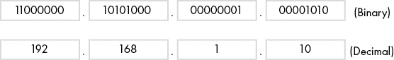

图 2-1：以二进制和十进制格式表示的四个 8 位字节，构成一个 IPv4 地址

图 2-1 的第一行展示了一个 IPv4 地址的二进制形式。第二行是该 IPv4 地址的十进制等价。我们通常在展示 IPv4 地址时，或在代码中使用时，使用更易读的十进制格式。我们将在本节稍后讨论网络寻址时，使用它们的二进制表示。

### 网络 ID 和主机 ID

组成一个 IPv4 地址的 32 位表示两个组件：网络 ID 和主机 ID。*网络 ID*通知负责传送数据包到达目的地的网络设备关于下一跳的适当位置。这些设备被称为*路由器*。路由器就像网络中的邮件投递员，它们从设备接收数据，检查目的地址的网络 ID，并决定将数据发送到何处以到达目的地。你可以把网络 ID 想象成邮寄地址中的邮政编码。

一旦数据到达目标网络，路由器使用*主机 ID*将数据传递给特定的接收方。主机 ID 就像你的街道地址。换句话说，网络 ID 标识的是一组节点，其地址属于同一网络。我们将在本章稍后看到网络和主机 ID 的样子，但图 2-2 展示了共享相同网络 ID 的 IPv4 地址。

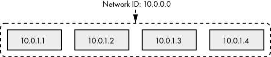

图 2-2：共享相同网络 ID 的节点组

图 2-3 展示了 32 位 IPv4 地址中常见的网络 ID 和主机 ID 大小的分解。

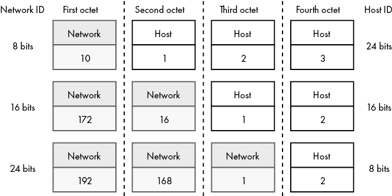

图 2-3：常见的网络 ID 和主机 ID 大小

IPv4 地址的网络 ID 部分总是从最左边的位开始，其大小由它所属的网络的大小决定。剩余的位指定主机 ID。例如，IPv4 地址的前 8 位代表一个 8 位网络中的网络 ID，而剩余的 24 位代表主机 ID。

图 2-4 展示了 IP 地址 192.168.156.97 被划分为网络 ID 和主机 ID。这一 IP 地址属于一个 16 位网络。这告诉我们，前 16 位构成网络 ID，剩余的 16 位构成主机 ID。

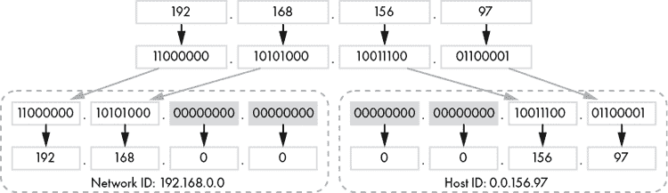

图 2-4：从 16 位网络中的 IPv4 地址推导出网络 ID 和主机 ID

为了推导出这个示例的网络 ID，你需要取前 16 位，并为剩余的位补充零，形成 32 位的网络 ID 192.168.0.0。然后，你将零填充到最后 16 位，得到 32 位的主机 ID 0.0.156.97。

### IPv4 地址的子网划分

IPv4 的网络 ID 和主机 ID 允许您*细分*或划分超过 40 亿个 IPv4 地址到更小的组中，以保持网络的安全性并使其更易于管理。所有这些较小网络中的 IP 地址，称为*子网*，共享相同的网络 ID，但具有独特的主机 ID。网络的大小决定了主机 ID 的数量，因此也决定了网络中 IP 地址的数量。

确定单独的网络可以让您控制网络之间信息流动的方式。例如，您可以将网络分为一个用于公共服务的子网和一个用于私有服务的子网。然后，您可以允许外部流量访问公共服务，同时防止外部流量访问私有网络。另一个例子是，您的银行提供在线银行、客户支持和手机银行等服务。这些是公共服务，您在成功认证后可以与之交互。但您无法访问银行的内部网络，那里管理着电子转账、余额账本、内部邮件等系统。这些服务仅通过私有网络供银行员工访问。

#### 使用 CIDR 分配网络

您可以使用一种叫做*无类域间路由*(CIDR)的方法来分配网络。在 CIDR 中，您通过将一个*网络前缀*附加到每个 IP 地址上，指示网络 ID 中有多少位，网络前缀由一个斜杠和一个整数组成。尽管它附加在 IP 地址的末尾，但它被称为*前缀*而不是*后缀*，因为它表示 IP 地址的前几个最重要的位，或者说是前缀位，构成了网络 ID。例如，您可以将图 2-4 中的 IP 地址 192.168.156.97 写作 CIDR 表示法中的 192.168.156.97/16，表示它属于一个 16 位网络，并且网络 ID 是 IP 地址的前 16 位。

从那里，您可以通过应用子网掩码推导出网络 IP 地址。子网掩码在其十进制表示中编码了 CIDR 网络前缀。它们通过位与运算（bitwise AND）应用于 IP 地址，以推导出网络 ID。

表 2-1 详细列出了最常见的 CIDR 网络前缀、对应的子网掩码、每个网络前缀的可用网络，以及每个网络中的可用主机数量。

表 2-1：CIDR 网络前缀长度及其对应的子网掩码

| **CIDR 网络前缀长度** | **子网掩码** | **可用网络** | **每个网络的可用主机** |
| --- | --- | --- | --- |
| 8 | 255.0.0.0 | 1 | 16,777,214 |
| 9 | 255.128.0.0 | 2 | 8,388,606 |
| 10 | 255.192.0.0 | 4 | 4,194,302 |
| 11 | 255.224.0.0 | 8 | 2,097,150 |
| 12 | 255.240.0.0 | 16 | 1,048,574 |
| 13 | 255.248.0.0 | 32 | 524,286 |
| 14 | 255.252.0.0 | 64 | 262,142 |
| 15 | 255.254.0.0 | 128 | 131,070 |
| 16 | 255.255.0.0 | 256 | 65,534 |
| 17 | 255.255.128.0 | 512 | 32,766 |
| 18 | 255.255.192.0 | 1,024 | 16,382 |
| 19 | 255.255.224.0 | 2,048 | 8,190 |
| 20 | 255.255.240.0 | 4,096 | 4,094 |
| 21 | 255.255.248.0 | 8,192 | 2,046 |
| 22 | 255.255.252.0 | 16,384 | 1,022 |
| 23 | 255.255.254.0 | 32,768 | 510 |
| 24 | 255.255.255.0 | 65,536 | 254 |
| 25 | 255.255.255.128 | 131,072 | 126 |
| 26 | 255.255.255.192 | 262,144 | 62 |
| 27 | 255.255.255.224 | 524,288 | 30 |
| 28 | 255.255.255.240 | 1,048,576 | 14 |
| 29 | 255.255.255.248 | 2,097,152 | 6 |
| 30 | 255.255.255.252 | 4,194,304 | 2 |

你可能已经注意到，每行中的每个网络可用的主机数比预期少了两个，因为每个网络都有两个特殊地址。网络中的第一个 IP 地址是网络地址，最后一个 IP 地址是广播地址。（我们将在本章稍后介绍广播地址。）以 192.168.0.0/16 为例。网络中的第一个 IP 地址是 192.168.0.0，这就是网络地址。网络中的最后一个 IP 地址是 192.168.255.255，这是广播地址。目前，理解你不会将网络 IP 地址或广播 IP 地址分配给主机的网络接口。这些特殊的 IP 地址分别用于在网络之间路由数据和广播。

31 位和 32 位的网络前缀故意未包含在表 2-1 中，主要是因为它们超出了本书的范围。如果你对 31 位网络前缀感兴趣，可以查阅 RFC 3021 了解其应用。32 位网络前缀表示一个单主机网络。例如，192.168.1.1/32 表示一个只有地址为 192.168.1.1 的单一节点子网络。

#### 分配不在字节边界断开的网络

有些网络前缀不会在字节边界处断开。例如，图 2-5 在 19 位网络中推导出 192.168.156.97 的网络 ID 和主机 ID。CIDR 表示法中的完整 IP 地址为 192.168.156.97/19。

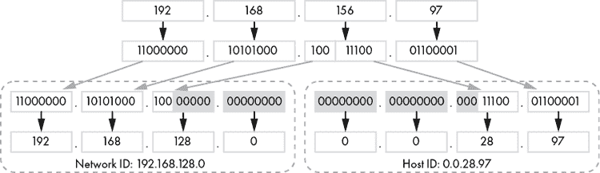

图 2-5：从 IPv4 地址中推导出网络 ID 和主机 ID（在 19 位网络中）

在这种情况下，由于网络前缀不是 8 位的倍数，一个字节的位被分割到网络 ID 和主机 ID 之间。在图 2-5 中的 19 位网络示例中，网络 ID 为 192.168.128.0，主机 ID 为 0.0.28.97，其中网络 ID 从第三个字节借用了 3 位，剩下 13 位用于主机 ID。

将零化的主机 ID 附加到网络 ID 后，得到网络地址。以类似的方式，将所有位都是 1 的主机 ID 附加到网络 ID 后，得到广播地址。但第三个字节等于 156 可能有点令人困惑。我们只关注第三个字节。网络 ID 的第三个字节是 1000 0000。所有位都是 1 的主机 ID 的第三个字节是 0001 1111（前 3 位是网络 ID 的一部分，记住）。如果我们将网络 ID 的第三个字节附加到主机 ID 的第三个字节，结果是 1001 1111，即十进制的 156。

#### 私有地址空间与本地主机

RFC 1918 详细说明了 10.0.0.0/8、172.16.0.0/12 和 192.168.0.0/16 的私有地址空间，供本地网络使用。大学、公司、政府和住宅网络可以使用这些子网进行本地寻址。

此外，每个主机都有 127.0.0.0/8 子网作为其本地子网。该子网中的地址是主机的本地地址，通常称为*localhost*。即使你的计算机不在网络上，它仍然应该有一个 127.0.0.0/8 子网中的地址，最有可能是 127.0.0.1。

### 端口与套接字地址

如果你的计算机只能与网络中的一个节点进行通信，这将不会提供高效或愉快的体验。如果每次你在网页浏览器中点击一个链接时，音乐流媒体就停止，因为浏览器需要中断流媒体以获取请求的网页，那将非常烦人。幸运的是，TCP 和 UDP 允许我们通过使用*端口*来实现数据传输的复用。

操作系统使用端口来唯一标识节点之间的数据传输，以实现对外发应用数据的复用和对进入数据的解复用。IP 地址和端口号的组合被称为*套接字地址*，通常以*地址:端口*的格式表示。

端口是 16 位无符号整数。端口号 0 至 1023 是由*互联网号码分配局**(IANA)* 分配给常见服务的著名端口。IANA 是一个美国非营利性私营组织，负责全球 IP 地址和端口号的分配。例如，HTTP 使用端口 80。端口 443 是 HTTPS 端口。SSH 服务器通常监听端口 22。（这些著名端口只是指南。HTTP 服务器可以监听任何端口，而不仅仅是端口 80。）

尽管这些端口是众所周知的，但服务使用哪些端口没有限制。例如，想要将服务隐藏在不同端口上的管理员，可以配置 SSH 服务器监听端口 22422，而不是默认的 22 端口。IANA 将端口 1024 至 49151 定义为半保留端口，用于较不常见的服务。端口 49152 至 65535 是短暂端口，用于客户端套接字地址，这是 IANA 的建议。（客户端套接字地址使用的端口范围依赖于操作系统。）

一个常见的端口使用示例是您的网页浏览器与网页服务器之间的交互。您的网页浏览器与操作系统打开一个套接字，操作系统为该套接字分配一个地址。您的网页浏览器通过该套接字向网页服务器的 80 端口发送请求。网页服务器将其响应发送到与您的网页浏览器监视的套接字对应的套接字地址。您的操作系统接收到响应并通过套接字将其传递给网页浏览器。您的网页浏览器的套接字地址和网页服务器的套接字地址（服务器 IP 和 80 端口）唯一标识此事务。这使得您的操作系统能够正确地进行响应的解复用，并将其传递给正确的应用程序（即您的网页浏览器）。

### 网络地址转换

四十亿个 IPv4 地址看起来可能很多，但考虑到根据 2020 年 6 月的爱立信移动报告（[`www.ericsson.com/en/mobility-report/reports/june-2020/iot-connections-outlook/`](https://www.ericsson.com/en/mobility-report/reports/june-2020/iot-connections-outlook/)），到 2025 年，预计将有 246 亿个物联网（IoT）设备，情况就不一样了。实际上，我们已经耗尽了未预留的 IPv4 地址。IANA 于 2011 年 1 月 31 日分配了最后一个 IPv4 地址块。

解决 IPv4 地址短缺的一种方式是使用*网络地址转换（NAT）*，这是一种允许多个节点共享同一公共 IPv4 地址的过程。它需要一个设备，例如防火墙、负载均衡器或路由器，能够跟踪进出流量，并将传入的流量正确路由到正确的节点。

图 2-6 展示了私有网络与互联网之间的 NAT 过程。

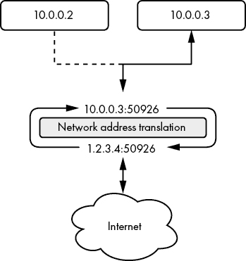

图 2-6：私有网络与互联网之间的网络地址转换

在图 2-6 中，一个支持 NAT 的设备接收到来自客户端套接字地址 10.0.0.3:50926 的连接，目标是互联网上的一个主机。首先，NAT 设备使用其公共 IP 1.2.3.4 打开与目标主机的连接，同时保持客户端的套接字地址端口。此事务的套接字地址为 1.2.3.4:50926。如果客户端已经使用了端口 50926，NAT 设备会为其套接字地址选择一个随机端口。然后，NAT 设备将请求发送到目标主机，并在其 1.2.3.4:50926 套接字上接收响应。NAT 设备通过将其套接字地址转换为建立连接的客户端套接字地址，知道哪个客户端接收到响应。最后，客户端从 NAT 设备接收到目标主机的响应。

关于网络地址转换，重要的是要记住，位于 NAT 设备后面的节点的私有 IPv4 地址对网络地址转换后的网络段外的其他节点不可见或不可直接访问。如果你正在编写一个需要为客户端提供公共地址的服务，你可能无法依赖节点的私有 IPv4 地址，特别是在它位于 NAT 设备后面时。NAT 设备外的主机无法建立传入连接。只有私有网络中的客户端才能通过 NAT 设备建立连接。相反，你的服务必须依赖于 NAT 设备将端口从其公共 IP 正确转发到你节点的套接字地址。

### 单播、多播和广播

从一个 IP 地址发送数据包到另一个 IP 地址被称为*单播寻址*。但 TCP/IP 的互联网层支持 IP *多播*，即将单条消息发送给一组节点。你可以将其视为一个自愿加入的邮件列表，例如报纸订阅。

从网络编程的角度来看，多播很简单。路由器和交换机通常为我们复制消息，如图 2-7 所示。我们将在本书后面讨论多播。

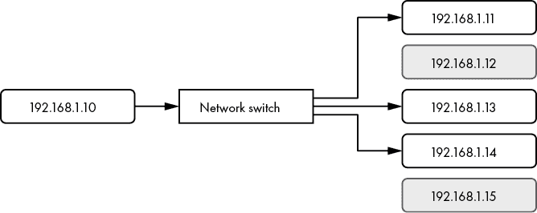

图 2-7：192.168.1.10 节点向一部分网络地址发送数据包

*广播*是将消息同时发送给网络中所有 IP 地址的能力。为此，网络上的节点将数据包发送到子网的*广播地址*。然后，网络交换机或路由器将数据包传播到子网中的所有 IPv4 地址（图 2-8）。

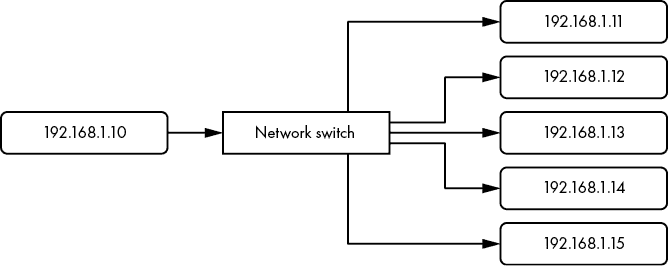

图 2-8：192.168.1.10 节点向其子网中的所有地址发送数据包

与多播不同，子网中的节点不需要首先选择接收广播消息。如果图 2-8 中的 192.168.1.10 节点向其子网的广播地址发送数据包，网络交换机会将该数据包的副本传递给同一子网中其他五个 IPv4 地址。

### 将 MAC 地址解析到物理网络连接

回想一下第一章提到的，每个网络接口都有一个 MAC 地址，唯一标识节点与网络的物理连接。MAC 地址只与本地网络相关，因此路由器无法使用 MAC 地址在网络边界之间路由数据。相反，它们可以使用 IPv4 地址跨越网络边界进行路由。一旦数据包到达目标节点的本地网络，路由器会将数据发送到目标节点的 MAC 地址，最终到达目标节点的物理网络连接。

*地址解析协议*（ARP），详见 RFC 826（[`tools.ietf.org/html/rfc826/`](https://tools.ietf.org/html/rfc826/)），用于查找给定 IP 地址的适当 MAC 地址——这个过程被称为 *解析* MAC 地址。节点维护 ARP 表，将 IPv4 地址映射到 MAC 地址。如果一个节点的 ARP 表中没有目标 IPv4 地址的条目，它将向本地网络的广播地址发送请求，询问：“谁拥有这个 IPv4 地址？请发送你的 MAC 地址。哦，这里是我的 MAC 地址。”目标节点将接收 ARP 请求并以 ARP 回复回应源节点。源节点随后会将数据发送到目标节点的 MAC 地址。网络中监听此对话的其他节点通常会更新它们的 ARP 表。

## IPv6 地址分配

解决 IPv4 地址短缺的另一种方法是迁移到下一代 IP 地址，即 IPv6。*IPv6 地址* 是 128 位数字，按八个以冒号分隔的 16 位组排列，或称为 *六元组*。IPv6 地址的总数超过 340 万亿（2¹²⁸）个。

### 编写 IPv6 地址

在二进制形式下，IPv6 地址写起来有点荒谬。为了可读性和紧凑性，我们通常使用小写的十六进制值来表示 IPv6 地址。

一个十六进制（hex）数字代表 IPv6 地址的 4 位，或称为 *四位组*。例如，我们可以将两个四位组 1111 1111 转换为其十六进制等效值 `ff`。图 2-9 展示了相同的 IPv6 地址在二进制和十六进制中的表示。

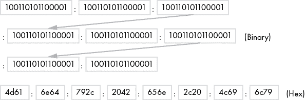

图 2-9：相同 IPv6 地址的二进制和十六进制表示

尽管十六进制的 IPv6 地址比其二进制等效地址稍显简洁，但我们仍然有一些技术可以进一步简化它们。

#### 简化 IPv6 地址

一个 IPv6 地址看起来像这样：fd00:4700:0010:0000:0000:0000:6814:d103。比起 IPv4 地址，它确实更难记住。幸运的是，你可以通过遵循一些规则来改善 IPv6 地址的表示，使其更易读。

首先，你可以去掉每个六元组中的所有前导零。这将简化你的地址，同时不会改变其值。现在它看起来像这样：fd00:4700:10:0:0:0:6814:d103。更简洁了，但还是比较长。

其次，你可以将最左边一组连续的零值六元组替换为双冒号，从而生成更短的地址 fd00:4700:10::6814:d103。如果你的地址中有多个连续零值六元组组，你只能去掉最左边的一组。否则，路由器将无法准确确定在重新生成完整地址时需要插入多少个六元组。例如，fd00:4700:0000:0000:ef81:0000:6814:d103 重写为 fd00:4700::ef81:0:6814:d103。对于第六个六元组，你能做的最好的优化就是去掉前导零。

#### IPv6 网络和主机地址

和 IPv4 地址一样，IPv6 地址也有网络地址和主机地址。IPv6 的主机地址通常被称为 *接口 ID*。网络地址和主机地址各占 64 位，如图 2-10 所示。网络地址的前 48 位被称为 *全局路由前缀*（GRP），网络地址的最后 16 位被称为 *子网 ID*。48 位的 GRP 用于全球细分 IPv6 地址空间，并在这些组之间路由流量。子网 ID 用于进一步细分每个 GRP 唯一的网络，形成特定站点的网络。如果你运营一个大型 ISP，你会被分配一个或多个 GRP 唯一的 IPv6 地址块。然后，你可以在每个网络中使用子网 ID 来进一步细分分配给客户的 IPv6 地址。


图 2-10：IPv6 全局路由前缀、子网 ID 和接口 ID

当你从互联网服务提供商（ISP）请求一块 IPv6 地址时，GRP 会为你自动确定。IANA 将 GRP 的第一个十六位组分配给一个区域互联网注册机构（负责全球区域地址分配的组织）。该区域互联网注册机构随后将 GRP 的第二个十六位组分配给一个 ISP。ISP 最后分配 GRP 的第三个十六位组，然后将一个 48 位子网的 IPv6 地址分配给你。

IPv6 地址的第一个十六位组能为你提供地址用途的线索。以前缀 2000::/3 开头的地址用于全球范围，意味着互联网上的每个节点都会有一个以 2 或 3 开头的 IPv6 地址。前缀 fc00::/7 指定了类似 IPv4 中的 127.0.0.0/8 子网的唯一本地地址。

假设你的 ISP 分配给你 2600:fe56:7891::/48 网络块。你的 16 位子网 ID 允许你将网络块进一步细分为最多 65,536 个子网（2¹⁶）。每个子网支持超过 18 亿亿个主机（2⁶⁴）。如果你将子网设置为 1，如图 2-10 所示，那么完整的网络地址将是 2600:fe56:7891:1::/64，删除前导零并压缩零值十六位组后，地址为 2600:fe56:7891:1::/64。进一步细分你的网络块可能如下所示：2600:fe56:7891:**2**::/64，2600:fe56:7891:**3**::/64，2600:fe56:7891:**4**::/64。

### IPv6 地址类别

IPv6 地址分为三类：任播（anycast）、多播（multicast）和单播（unicast）。请注意，不像 IPv4 中那样有广播类型。在 IPv6 中，任播和多播地址承担了广播的角色。

#### 单播地址

*单播* IPv6 地址唯一地标识一个节点。如果源节点将消息发送到单播地址，只有拥有该地址的节点会收到该消息，如图 2-11 所示。

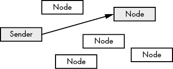

图 2-11：发送到单播地址

#### 多播地址

*多播*地址表示一组节点。IPv4 广播地址会将消息传播到网络上的所有地址，而多播地址则会同时将消息发送给网络地址的一个子集，而不一定是所有地址，正如 图 2-12 所示。

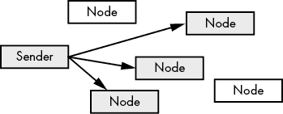

图 2-12：发送到多播地址

多播地址使用前缀 ff00::/8。

#### 任播地址

请记住，IPv4 地址在每个网络段必须是唯一的，否则会发生网络通信问题。但 IPv6 支持多个节点使用相同的网络地址。*任播*地址表示一组监听相同地址的节点。发送到任播地址的消息会传递给离该地址最近的节点。图 2-13 展示了一组监听相同地址的节点，其中离发送方最近的节点接收消息。发送方可以将消息发送给虚线所代表的任一节点，但会选择发送给离其最近的节点（实线所示）。

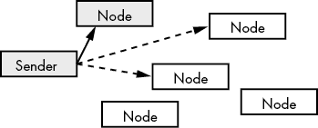

图 2-13：发送到任播地址

最近的节点并不总是物理上最接近的节点。由路由器决定哪个节点接收消息，通常是选择源和目的地之间延迟最小的节点。除了减少延迟，任播寻址还能增加冗余性，并可以进行地理定位服务。

全球范围内传输数据需要一定的时间，距离服务提供商服务器越近，性能越好。通过地理定位服务来确保服务器尽可能靠近用户，是优化全球用户性能的常见方法。例如，当你观看 Netflix 时，几乎不可能通过跨越大洋的服务器进行访问。相反，Netflix 会将服务器地理定位到离你更近的地方，从而确保你拥有最佳的观看体验。

### IPv6 相较于 IPv4 的优势

除了极其庞大的地址空间，IPv6 在效率、自动配置和安全性等方面也相较于 IPv4 具有固有优势。

#### 为了更高效的路由，IPv6 采用了简化的报头格式。

IPv6 报头相比 IPv4 报头有所改进。IPv4 报头包含了一些强制性的但很少使用的字段，而 IPv6 将这些字段设为可选。IPv6 报头是可扩展的，意味着可以在不破坏向后兼容性的情况下增加新功能。此外，IPv6 报头的设计更高效，且比 IPv4 报头更简化。

IPv6 还通过确保报头需要最小处理，从而减少了路由器和其他跳点的负载，避免了每个跳点都需要进行校验和计算。

#### 无状态地址自动配置

管理员手动为网络上的每个节点分配 IPv4 地址，或依赖于某个服务动态分配地址。使用 IPv6 的节点可以通过*无状态地址自动配置**(SLAAC)*自动配置或推导其 IPv6 地址，从而减少管理开销。

当连接到一个 IPv6 网络时，一个节点可以使用*邻居发现协议**(NDP)*向路由器请求其网络地址参数。NDP 利用后续章节将讨论的互联网控制消息协议进行路由器请求。它执行与 IPv4 的 ARP 相同的功能。一旦节点收到路由器的回复并获得 64 位网络地址，节点可以使用分配给其网络接口的 48 位 MAC 地址自行推导出其 IPv6 地址的 64 位主机部分。节点将 16 位的十六进制 FFFE 附加到 MAC 地址的前三个八位字节，这三个字节称为*最初唯一标识符（OUI）*。接着，节点将 MAC 地址的剩余三个八位字节，即网络接口控制器（NIC）标识符，附加在后面。结果是一个独特的 64 位接口 ID，如图 2-14 所示。SLAAC 仅在存在可以响应路由器广告包的路由器时工作。*路由器广告包*包含客户端自动配置其 IPv6 地址所需的信息，包括 64 位网络地址。

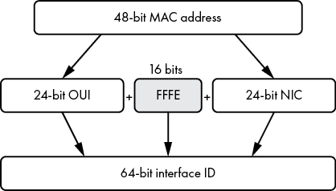

图 2-14：从 MAC 地址推导接口 ID

如果你重视隐私，SLAAC 推导唯一接口 ID 的方法应该引起你的关注。无论你的设备在哪个网络上，SLAAC 都会确保你的 IPv6 地址的主机部分包含你的 NIC 的 MAC 地址。MAC 地址是一个独特的指纹，它揭示了你使用的硬件，并允许任何人追踪你的在线活动。幸运的是，许多人提出了这些隐私问题，SLAAC 获得了隐私扩展（[`tools.ietf.org/html/rfc4941/`](https://tools.ietf.org/html/rfc4941/)），该扩展可以随机化接口 ID。由于这种随机化，网络上的多个节点有可能生成相同的接口 ID。幸运的是，NDP 会自动检测并修复任何重复的接口 ID。

#### 原生 IPsec 支持

IPv6 原生支持*IPsec*，这是一种允许多个节点之间动态创建安全连接的技术，确保流量加密。

## 互联网控制消息协议

互联网协议依赖于*互联网控制消息协议**(ICMP)*来反馈本地网络的信息。ICMP 可以告知网络问题、无法到达的节点或网络、本地网络配置、正确的流量路由和网络超时。IPv4 和 IPv6 都有各自的 ICMP 实现，分别被指定为 ICMPv4 和 ICMPv6。

网络事件通常会导致 ICMP 响应消息。例如，如果您试图向一个不可达节点发送数据，路由器通常会用 ICMP *目标不可达*消息作出响应，通知您数据无法到达目标节点。如果节点耗尽资源或无法路由到节点，该节点可能会变得不可达。将节点从网络断开将立即使其不可访问。

路由器使用 ICMP 来帮助通知您更好的路由到达目标节点的方式。如果您向一个不适合或最佳的路由器发送数据，它可能会在将数据转发到正确的路由器后，用 ICMP *重定向*消息回复。ICMP 重定向消息是路由器告诉您将来将数据发送到适当路由器的方式。

您可以通过使用 ICMP 的*回显*请求（也称为*ping*）来确定节点是否在线和可达。如果目标可达并接收到您的 ping，则会用自己的 ICMP *回显回复*消息（也称为*pong*）进行回复。如果目标不可达，则路由器将用目标不可达消息作出响应。

ICMP 还可以在数据传递前通知您其寿命已到。每个 IP 数据包都有一个*生存时间*值，该值规定了数据包在其寿命到期之前可以经过的最大跳数。数据包的生存时间是一个计数器，每经过一个跳数就减一。如果您发送的数据包在其生存时间值达到零之前未能到达目的地，则会收到 ICMP *超时*消息。

IPv6 的 NDP 依赖于 ICMP 路由器请求消息，以正确配置节点的网络接口控制器（NIC）。

## 互联网流量路由

现在您已经了解了一些关于互联网协议地址的知识，让我们探讨一下数据包如何通过互联网从一个节点到另一个节点，利用这些地址。在第一章中，我们讨论了数据如何沿着起始节点的网络堆栈传输，通过物理介质跨越，然后通过目标节点的堆栈上升。但是在大多数情况下，节点之间没有直接连接，因此它们必须利用中间节点来传输数据。图 2-15 展示了这个过程。

中间节点（图 2-15 中的节点 1 和 2）通常是路由器或防火墙，它们控制数据从一个节点到另一个节点的路径。*防火墙*主要用于控制网络中进出流量的流向，以保护网络安全。

无论它们是什么类型的节点，中间节点都有一个与每个网络接口关联的网络协议栈。在图 2-15 中，节点 1 在其接收网络接口上接收到数据。数据沿着协议栈上升到第 3 层，然后被交给发送网络接口的协议栈。接着，数据到达节点 2 的接收网络接口，最终被路由到服务器。

节点 1 和节点 2 的接收和发送网络接口可能会通过不同的媒介类型使用 IPv4 发送数据，因此它们必须使用封装来隔离每种媒介类型的实现细节与正在发送的数据。假设节点 1 从客户端通过无线网络接收数据，并通过以太网连接将数据发送到节点 2。节点 1 的接收第 1 层知道如何将无线网络的无线信号转换为比特。第 1 层将比特发送到第 2 层。第 2 层将比特转换为帧，并提取数据包，将其发送到第 3 层。

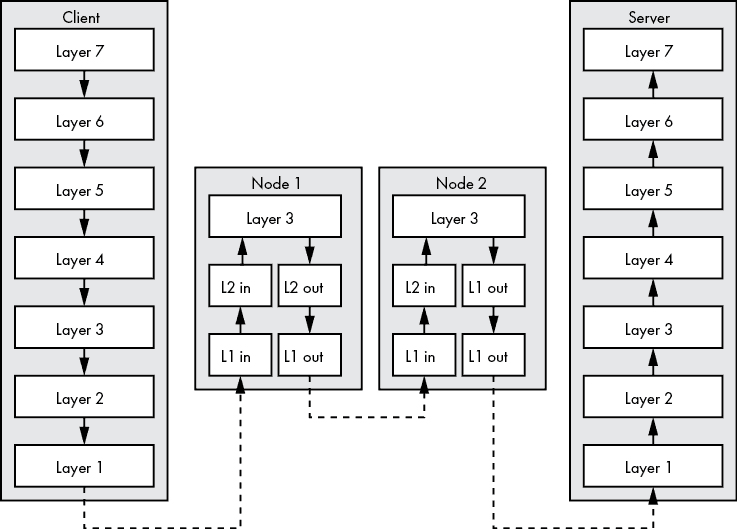

图 2-15：通过两跳路由数据包

无论是接收的还是发送的网络接口卡（NIC）的第 3 层都使用 IPv4，它将数据包在两个接口协议栈之间进行路由。发送的网络接口卡的第 2 层从其第 3 层接收数据包，并在将帧发送到第 1 层之前对其进行封装。发送的第 1 层将比特转换为适合通过以太网传输的电信号。尽管数据在到达目标服务器的过程中经过了多个节点和不同的媒介，但客户端的第 7 层中的数据在传输过程中始终没有发生变化。

## 路由协议

图 2-15 中的路由概览让这个过程看起来很简单，但路由过程依赖于一系列协议的协作，以确保每个数据包无论经过何种物理媒介或在途中是否出现网络故障，都能到达目标。路由协议有各自的标准来决定节点之间的最佳路径。有些协议基于跳数来决定路由的效率。有些可能使用带宽，而另一些则可能使用更复杂的方式来确定哪条路径最有效。

路由协议可以分为内部路由协议和外部路由协议，具体取决于它们是否在自治系统内部或外部路由数据包。*自治系统*是管理一个或多个网络的组织。互联网服务提供商（ISP）就是一个自治系统的例子。每个自治系统都会被分配一个自治系统编号（ASN），如 RFC 1930 中所述（[`tools.ietf.org/html/rfc1930/`](https://tools.ietf.org/html/rfc1930/)）。这个 ASN 用于通过外部路由协议向其他自治系统广播 ISP 的网络信息。*外部路由协议*在自治系统之间路由数据。我们将要讨论的唯一路由协议是 BGP，因为它是互联网的“胶水”，将所有分配了 ASN 的 ISP 连接在一起。你不需要深入理解 BGP，但熟悉它可以帮助你更好地调试与代码相关的网络问题，并提高代码的可靠性。

### 边界网关协议

*边界网关协议（BGP）*允许分配了 ASN 的 ISP 交换路由信息。BGP 依赖于 ISP 之间的信任。也就是说，如果一个 ISP 声明它管理某个特定的网络，并且所有指向该网络的流量应该发送到它，其他 ISP 会信任这一声明并相应地转发流量。因此，BGP 配置错误或*路由泄漏*往往会导致非常公开的网络故障。

2008 年，巴基斯坦电信公司通过 BGP 有效地让全球的 YouTube 服务中断，原因是巴基斯坦通信部要求该国封锁*youtube.com*，以抗议一段 YouTube 视频。巴基斯坦电信使用 BGP 将所有指向 YouTube 的请求发送到一个空路由，该路由会丢弃所有数据而不通知发送方。但巴基斯坦电信错误地将其 BGP 路由泄漏到了全球，而不是仅限于该国。其他 ISP 信任了这个更新，将来自其客户的 YouTube 请求都丢弃，使得*youtube.com*在全球范围内无法访问，持续了两个小时。

2012 年，Google 的服务在 27 分钟内被重新路由到印度尼西亚，当时 ISP Moratel 共享了一条 BGP 路由，将所有 Google 流量指向 Moratel 的网络，仿佛 Moratel 正在托管 Google 的网络基础设施。当时有人猜测路由泄漏是恶意的，但 Moratel 归咎于硬件故障。

BGP 通常只有在出现问题时才成为新闻焦点。其他时候，它默默地发挥着重要作用，在减轻分布式拒绝服务（DDOS）攻击中扮演着重要角色。在*DDOS 攻击*中，恶意行为者将来自成千上万个被攻陷节点的流量引导到受害者节点，目的是压垮受害者并消耗其所有带宽，实际上拒绝了合法客户的服务。专门从事 DDOS 攻击缓解的公司使用 BGP 将所有指向受害者节点的流量重新路由到他们的 AS 网络，过滤掉恶意流量与合法流量，最后将净化后的流量返回给受害者，从而抵消攻击的效果。

## 名称与地址解析

*域名系统*(DNS)是一种将 IP 地址与*域名*匹配的方式，域名是我们在地址栏中输入的名称，用于访问网站。虽然互联网协议使用 IP 地址来定位主机，但域名（如*google.com*）更容易被人类理解和记住。如果我给你一个 IP 地址 172.217.6.14，你可能不知道这个 IP 地址的所有者是谁，或者我让你访问的是哪个网站。但如果我给你*google.com*，你就完全知道我让你访问的是哪里。DNS 允许你记住主机名，而不是它的 IP 地址，就像你智能手机的联系人列表让你无需记住所有电话号码一样。

所有域名都是*顶级域名*的子域名，例如*.com*、*.net*、*.org*等。以*nostarch.com*为例。No Starch Press 在具有 IANA 注册*.com*域名授权的注册商处注册了*nostarch*域名。现在，No Starch Press 拥有独占权限来管理*nostarch.com*的 DNS 记录，并在其 DNS 服务器上发布记录。这包括 No Starch Press 发布*子域名*的能力——即一个域名的细分——在其域名下。例如，*maps.google.com*是*google.com*的一个子域名。更长的示例是*sub3.sub2.sub1.domain.com*，其中*sub3*是*sub2.sub1.domain.com*下的子域名，*sub2*是*sub1.domain.com*下的子域名，而*sub1*则是*domain.com*下的子域名。

如果你在网页浏览器中输入`https://nostarch.com`，你的计算机会查询其配置的*域名解析器*，这是一个知道如何检索你查询答案的服务器。解析器首先会向 13 个由 IANA 维护的根名称服务器之一询问*nostarch.com*的 IP 地址。根名称服务器会检查你请求的域的顶级域，并将*.com*名称服务器的地址提供给你的解析器。然后，解析器会向*.com*名称服务器请求*nostarch.com*的 IP 地址，后者会检查域名部分并指示解析器去询问 No Starch Press 的名称服务器。最后，解析器会向 No Starch Press 的名称服务器请求并获得与*nostarch.com*对应的 IP 地址。你的网页浏览器将与该 IP 地址建立连接，获取网页并呈现给你。这个域名解析的层级过程让你能够精确地定位到特定的网页服务器，而你只需要知道域名即可。No Starch Press 可以自由将服务器迁移到新的 ISP，并使用新的 IP 地址，但你仍然能够通过使用*nostarch.com*访问它的网站。

### 域名资源记录

域名服务器为它们所服务的域名维护*资源记录*。资源记录包含特定于域的相关信息，用于满足域名查询，比如 IP 地址、邮件服务器主机名、邮件处理规则和身份验证令牌。有很多种资源记录，但本节仅关注最常见的几种：地址记录、授权起始记录、名称服务器记录、规范名称记录、邮件交换记录、指针记录和文本记录。

我们对每个资源记录的探索将使用一个名为*dig*的工具来查询域名服务器。这个工具可能已经包含在你的操作系统中，但如果你没有安装 dig，可以在网页浏览器中使用 G Suite 工具箱中的 Dig 工具([`toolbox.googleapps.com/apps/dig/`](https://toolbox.googleapps.com/apps/dig/))，并获得类似的输出。你将看到的所有域名都是*完全限定*的，这意味着它们以句点结束，显示了域名从根区域开始的完整层级结构。*根区域*是顶级的 DNS 命名空间。

Dig 的默认输出包含一些与查询相关但与研究输出无关的数据。因此，我决定在接下来的每个示例中将 dig 输出中的头部和尾部信息剪切掉。请注意，本书中展示的具体输出是我执行每个查询时的快照。你执行这些命令时，输出可能会有所不同。

#### 地址记录

*地址 (A) 记录* 是你最常查询的记录。A 记录将解析为一个或多个 IPv4 地址。当你的计算机请求其解析器获取*nostarch.com*的 IP 地址时，解析器最终会向域名服务器请求*nostarch.com*的地址(A)资源记录。清单 2-1 展示了你查询*google.com* A 记录时的提问和回答部分。

```
$ **dig google.com. a**
`-- snip --`
1 ;QUESTION
2 google.com. 3IN 4A
5 ;ANSWER
6 google.com. 7299 IN A 8172.217.4.46
`-- snip --`
```

清单 2-1：*google.com* A 资源记录的 DNS 响应

DNS 回复的每个部分都以头部 1 开始，前缀为分号，表示这一行是注释而不是需要处理的代码。在查询部分中，你向域名服务器请求域名*google.com*2，并使用类`IN`3，表示该记录与互联网相关。你还使用`A`专门请求 A 记录 4。

在响应部分 5 中，域名服务器将*google.com*的 A 记录解析为六个 IPv4 地址。每个返回行的第一个字段是你查询的域名 6。第二个字段是记录的 TTL 值 7。*TTL 值* 告诉域名解析器该记录应该缓存多长时间，或者记住该记录，它也告诉你缓存记录将过期的时间。当你请求 DNS 记录时，域名解析器会首先检查其缓存。如果答案已经在缓存中，它将直接返回缓存中的答案，而不是再次向域名服务器请求答案。这提高了对于不太可能频繁更改的记录的域名解析性能。在本例中，记录将在 299 秒后过期。最后一个字段是 IPv4 地址 8。你的网页浏览器可以使用这六个 IPv4 地址中的任何一个与*google.com*建立连接。

AAAA 资源记录是 A 记录的 IPv6 等效项。

#### 授权起始记录

*授权起始记录 (SOA)* 包含有关域名的权威性和管理细节，如清单 2-2 所示。所有域名必须拥有一个 SOA 记录。

```
$ **dig google.com. soa**
`-- snip --`
;QUESTION
google.com. IN SOA
;ANSWER
google.com. 59 IN SOA 1ns1.google.com. 2dns-admin.google.com. 3248440550 900 900 1800 60
`-- snip --`
```

清单 2-2：*google.com* SOA 资源记录的 DNS 响应

SOA 记录的前四个字段与 A 记录中的字段相同。SOA 记录还包括主名称服务器 1、管理员的电子邮件地址 2 以及第 3 个字段，这是次级名称服务器在本书范围外使用的字段。域名服务器主要使用 SOA 记录。然而，如果你希望联系域名管理员，电子邮件地址非常有用。

#### 名称服务器记录

*名称服务器 (NS) 记录* 返回该域名的权威名称服务器。*权威名称服务器* 是能够为域名提供解答的名称服务器。NS 记录将包括来自 SOA 记录的主名称服务器和任何为该域名回答 DNS 查询的次级名称服务器。清单 2-3 是*google.com*的 NS 记录示例。

```
$ **dig google.com. ns**
`-- snip --`
;QUESTION
google.com. IN NS
;ANSWER
google.com. 21599 IN NS 1ns1.google.com.
google.com. 21599 IN NS ns2.google.com.
google.com. 21599 IN NS ns3.google.com.
google.com. 21599 IN NS ns4.google.com.
`-- snip --`
```

清单 2-3：*google.com* NS 资源记录的 DNS 响应

与接下来讨论的 CNAME 记录类似，NS 记录将返回一个完全合格的域名 1，而不是 IP 地址。

#### 规范名称记录

*规范名称（CNAME）记录*将一个域名指向另一个域名。列表 2-4 展示了 CNAME 记录的响应。CNAME 记录可以使管理工作变得更加简单。例如，你可以创建一个名为*mail.yourdomain.com*的域名，并将其指向 Gmail 的登录页面。这不仅使得你的用户更容易记住，而且你还可以在未来将 CNAME 指向另一个邮件提供商，而无需通知你的用户。

```
$ **dig mail.google.com. a**
`-- snip --`
;QUESTION
mail.google.com. IN A
;ANSWER
1 mail.google.com. 21599 IN CNAME 2googlemail.l.google.com.
googlemail.l.google.com. 299 IN A 172.217.3.229
`-- snip --`
```

列表 2-4：*mail.google.com* CNAME 资源记录的 DNS 回答

请注意，你向域名服务器请求子域名*mail.google.com*的 A 记录。但在这种情况下，你收到的是 CNAME 记录。这意味着*googlemail.l.google.com*2 是*mail.google.com*1 的规范名称。幸运的是，你收到了*googlemail.l.google.com*的 A 记录响应，这使得你不必再进行第二次查询。现在你知道目标 IP 地址是 172.217.3.229。Google 的域名服务器能够在同一回复中同时返回 CNAME 答案和相应的地址答案，因为它也对 CNAME 答案的域名有权威性。否则，你只会得到 CNAME 答案，然后需要进行第二次查询来解析 CNAME 答案的 IP 地址。

#### 邮件交换记录

*邮件交换（MX）记录*指定了在向该域的收件人发送邮件时应联系的邮件服务器主机名。远程邮件服务器会查询该域部分的收件人电子邮件地址中的 MX 记录，以确定应将邮件发送到哪些服务器。列表 2-5 展示了邮件服务器会收到的响应。

```
$ **dig google.com. mx**
`-- snip --`
;QUESTION
google.com. IN MX
;ANSWER
google.com. 599 IN MX 110 aspmx.l.google.com.
google.com. 599 IN MX 50 alt4.aspmx.l.google.com.
google.com. 599 IN MX 30 alt2.aspmx.l.google.com.
google.com. 599 IN MX 20 alt1.aspmx.l.google.com.
google.com. 599 IN MX 40 alt3.aspmx.l.google.com.
`-- snip --`
```

列表 2-5：*google.com* MX 资源记录的 DNS 回答

除了域名、TTL 值和记录类型外，MX 记录还包含*优先级字段*1，用于表示每个邮件服务器的优先级。数字越低，邮件服务器的优先级越高。邮件服务器会尝试将邮件投递到优先级最高的服务器，如果需要，才会转向下一个优先级较高的服务器。如果多个邮件服务器共享相同的优先级，则会随机选择一个邮件服务器。

#### 指针记录

*指针（PTR）记录*允许你通过提供 IP 地址并返回其对应的域名来执行反向查找。列表 2-6 展示了 8.8.4.4 的反向查找。

```
$ **dig 4.4.8.8.in-addr.arpa. ptr**
`-- snip --`
;QUESTION
1 4.4.8.8.in-addr.arpa. IN PTR
;ANSWER
4.4.8.8.in-addr.arpa. 21599 IN PTR 2google-public-dns-b.google.com.
`-- snip --`
```

列表 2-6：8.8.4.4 PTR 资源记录的 DNS 回答

要执行查询，你需要向域名服务器请求反向顺序的 IPv4 地址 1，并附加特殊域名 *in-addr.arpa*，因为反向 DNS 记录都位于 *.arpa* 顶级域下。例如，查询 IP 1.2.3.4 的指针记录意味着你需要请求 *4.3.2.1.in-addr.arpa*。列表 2-6 中的查询告诉你，IPv4 地址 8.8.4.4 会反向解析为域名 *google-public-dns-b.google.com* 2。如果你正在执行 IPv6 地址的反向查找，你需要像处理 IPv4 地址那样，将特殊域名 *ip6.arpa* 附加到反向的 IPv6 地址上。

#### 文本记录

*文本（TXT）记录* 允许域名所有者返回任意文本。这些记录可以包含证明域名所有权的值、远程邮件服务器可以用来授权邮件的值，以及指定哪些 IP 地址可以代表该域名发送邮件的条目等用途。列表 2-7 显示了与 *google.com* 关联的文本记录。

```
$ **dig google.com. txt**
`-- snip --`
;QUESTION
google.com. IN TXT
;ANSWER
google.com. 299 IN TXT
  1"facebook-domain-verification=22rm551cu4k0ab0bxsw536tlds4h95"
google.com. 299 IN TXT "docusign=05958488-4752-4ef2-95eb-aa7ba8a3bd0e"
google.com. 299 IN TXT 2"v=spf1 include:_spf.google.com ~all"
google.com. 299 IN TXT
    "globalsign-smime-dv=CDYX+XFHUw2wml6/Gb8+59BsH31KzUr6c1l2BPvqKX8="
`-- snip --`
```

列表 2-7：google.com TXT 资源记录的 DNS 答复

域名查询和答案现在应该开始变得熟悉。TXT 记录中的最后一个字段是 TXT 记录值 1 的一串字符串。在这个示例中，该字段包含一个 Facebook 验证密钥，它向 Facebook 证明 Google 的企业 Facebook 账户就是他们所说的那个，并且有权对 Google 在 Facebook 上的内容进行修改。它还包含 *发送者策略框架* 规则 2，告知远程邮件服务器哪些 IP 地址可以代表 Google 发送电子邮件。

### 多播 DNS

*多播 DNS*（mDNS）是一种协议，能在没有 DNS 服务器的情况下，通过局域网（LAN）实现名称解析。当一个节点想要将域名解析为 IP 地址时，它会向一个 IP 多播组发送请求。监听该组的节点会接收查询，请求该域名的节点会向 IP 多播组返回其 IP 地址。你可能在上次搜索和配置网络打印机时使用过 mDNS。

### DNS 查询的隐私和安全考虑

DNS 流量通常在穿越互联网时是未加密的。一个潜在的例外情况是，如果你连接到虚拟私人网络（VPN），并且确保所有的 DNS 流量都通过其加密隧道传输。由于 DNS 的未加密传输，某些不道德的互联网服务提供商（ISP）或中间提供商可能会获取你 DNS 查询中的敏感信息，并将这些细节与第三方共享。你可以专门访问仅支持 HTTPS 的网站，但你的 DNS 查询可能会暴露你本应安全的浏览习惯，从而使 DNS 服务器的管理员了解你访问的站点。

安全性在明文 DNS 流量中也是一个问题。攻击者可以通过插入对你的 DNS 查询的响应，诱使你的网页浏览器访问恶意网站。考虑到实施这种攻击的难度，这不是你可能会遇到的攻击，但无论如何还是令人担忧。由于 DNS 服务器通常会缓存响应，这种攻击通常发生在你的设备和它所配置使用的 DNS 服务器之间。RFC 7626（[`tools.ietf.org/html/rfc7626/`](https://tools.ietf.org/html/rfc7626/)）更详细地覆盖了这些话题。

#### 域名系统安全扩展

通常，你可以通过两种方式确保通过网络发送数据的真实性：认证内容和认证通道。*域名系统安全扩展**（DNSSEC）*是一种通过使用数字签名来认证响应，从而防止在传输过程中对 DNS 响应进行隐秘修改的方法。DNSSEC 通过认证内容来确保数据的真实性。DNS 服务器对它们提供的资源记录进行加密签名，并将这些签名提供给你。然后，你可以根据这些签名验证来自权威 DNS 服务器的响应，以确保响应没有被篡改。

DNSSEC 没有解决隐私问题。DNSSEC 查询仍然是明文传输的，允许进行被动观察。

#### 基于 TLS 的 DNS

基于 TLS 的 DNS（DoT），在 RFC 7858 中有详细说明（[`tools.ietf.org/html/rfc7858/`](https://tools.ietf.org/html/rfc7858/)），通过使用*传输层安全协议**（TLS）*在客户端和其 DNS 服务器之间建立加密连接，解决了安全性和隐私问题。TLS 是一种常用的协议，用于提供网络节点之间加密的安全通信。使用 TLS，DNS 请求和响应在传输过程中完全加密，使得攻击者无法窃听或篡改响应。DoT 通过认证通道来确保数据的真实性。它不需要像 DNSSEC 那样依赖加密签名，因为 DNS 服务器和客户端之间的整个对话都是加密的。

DoT 使用与常规 DNS 流量不同的网络端口。

#### 基于 HTTPS 的 DNS

*基于 HTTPS 的 DNS（DoH）*，在 RFC 8484 中有详细说明（[`tools.ietf.org/html/rfc8484/`](https://tools.ietf.org/html/rfc8484/)），旨在解决 DNS 安全性和隐私问题，同时使用一个被广泛使用的 TCP 端口。与 DoT 一样，DoH 通过加密连接传输数据，认证通道。DoH 使用一个常见的端口，并将 DNS 请求和响应映射到 HTTP 请求和响应。通过 HTTP 的查询可以利用所有 HTTP 特性，如缓存、压缩、代理和重定向。

## 你学到的内容

本章内容涉及广泛。你学习了 IP 地址分配，从 IPv4 的多播、广播、TCP 和 UDP 端口、套接字地址、网络地址转换到 ARP 等基础知识。然后，你了解了 IPv6、其地址类别以及相较于 IPv4 的优势。

你了解了主要的网络路由协议，ICMP 和 DNS。我再次推荐 Charles M. Kozierok 的 *TCP/IP Guide*（No Starch Press，2005），它对本章主题进行了广泛的覆盖。
