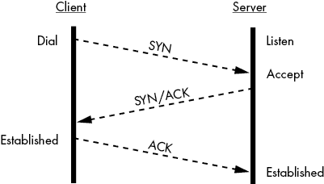
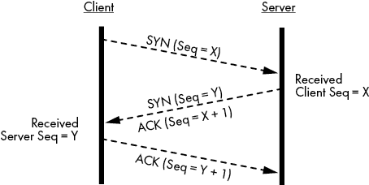
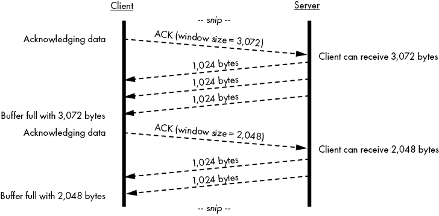
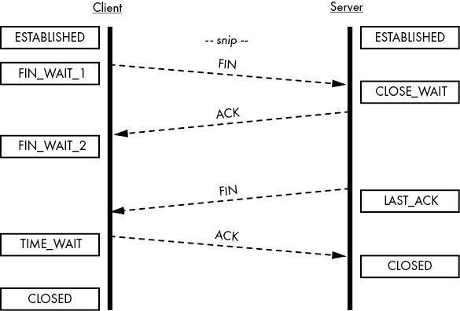

# 第三章：可靠的 TCP 数据流


TCP 允许你在网络上可靠地流式传输数据。本章将深入探讨该协议，重点介绍直接受我们为建立 TCP 连接和通过这些连接传输数据的代码影响的方面。这些知识将帮助你调试程序中的网络相关问题。

我们将首先介绍 TCP 握手过程、序列号、确认、重传和其他特性。接下来，我们将使用 Go 实现 TCP 会话的步骤，从拨号、监听、接受到会话终止。然后，我们将讨论超时和临时错误，如何检测它们，以及如何利用它们让用户满意。最后，我们将讨论如何早期检测不可靠的网络连接。Go 的标准库使你能够编写健壮的基于 TCP 的网络应用程序。但它不会手把手地教你。如果你没有注意管理传入数据或正确关闭连接，你的程序中会出现隐蔽的 bug。

## 什么使得 TCP 可靠？

TCP 之所以可靠，是因为它克服了数据包丢失或接收乱序数据包的影响。*数据包丢失*发生在数据未能到达目标——通常是由于数据传输错误（如无线网络干扰）或网络拥塞。*网络拥塞*发生在节点试图通过网络连接发送超出连接处理能力的数据，导致节点丢弃多余的数据包。例如，你无法通过一个 10 兆比特每秒（Mbps）的连接以每秒 1 千兆比特（Gbps）的速率发送数据。10Mbps 的连接很快就会饱和，参与数据流的节点会丢弃超出的数据。

TCP 会调整其数据传输速率，确保尽可能快速地传输数据，同时将丢包量保持在最小，即使网络状况发生变化——例如，Wi-Fi 信号减弱，或者目标节点的数据过载。这一过程被称为*流量控制*，它尽力弥补底层网络媒体的不足。TCP 无法在糟糕的网络上发送良好的数据，它依赖于网络硬件的支持。

TCP 还会跟踪已接收的数据包，并根据需要重新传输未确认的数据包。如果数据在传输过程中被重新路由，接收方也可能会接收到乱序的数据包。记住在第二章提到的，路由协议使用度量来确定如何路由数据包。这些度量会随着网络状况的变化而变化。不能保证在整个 TCP 会话期间，所有发送的数据包都会采取相同的路由。幸运的是，TCP 会组织乱序的数据包，并按顺序处理它们。

配合流量控制和重传机制，这些特性使 TCP 能够克服数据包丢失并确保数据能够成功传输到接收方。因此，TCP 使你不必担心这些错误。你可以专注于发送和接收数据。

## 处理 TCP 会话

*TCP 会话* 使你能够将任何大小的数据流发送到接收方，并收到接收方已接收数据的确认。这避免了你发送大量数据时，网络传输完成后才发现接收方并未接收到数据的低效问题。

就像人们偶尔点头表示他们在听对方说话一样，流媒体传输允许你在传输过程中接收接收方的反馈，这样你可以实时纠正任何错误。实际上，你可以把 TCP 会话看作是两个节点之间的对话。它从问候开始，进入对话，最后以告别结束。

在讨论 TCP 的具体细节时，我希望你明白 Go 会为你处理实现细节。当你处理 TCP 连接时，你的代码将会利用 `net` 包的接口。

### 使用 TCP 三次握手建立会话

TCP 连接使用三次握手来引导客户端与服务器建立联系，同时也将服务器与客户端连接起来。三次握手创建了一个已建立的 TCP 会话，客户端与服务器可以通过该会话交换数据。图 3-1 展示了握手过程中发送的三条消息。



图 3-1：三次握手过程，最终建立 TCP 会话

在建立 TCP 会话之前，服务器必须监听来自客户端的连接请求。（在本章中，我将 *服务器* 和 *客户端* 用于分别表示监听节点和拨号节点。TCP 本身并没有客户端和服务器的概念，而是指两个节点之间通过一个已建立的会话，其中一个节点联系另一个节点以建立该会话。）

握手的第一步，客户端发送一个带有 *同步（SYN）标志* 的数据包给服务器。这个 SYN 数据包告诉服务器客户端的能力以及对话期间的窗口设置。稍后我们会讨论接收窗口。接下来，服务器回应自己的数据包，数据包中同时设置了 *确认（ACK）* 和 SYN 标志。ACK 标志告诉客户端服务器已收到客户端的 SYN 数据包。服务器的 SYN 数据包告知客户端它同意的会话设置。最后，客户端回复一个 ACK 数据包，确认服务器的 SYN 数据包，从而完成三次握手。

完成三次握手过程后，TCP 会话建立，节点可以开始交换数据。TCP 会话保持空闲状态，直到一方有数据要传输。未管理的长时间空闲 TCP 会话可能导致内存的浪费。我们将在本章后面讨论如何在代码中管理空闲连接的技巧。

当你在代码中发起连接时，Go 会返回一个连接对象或一个错误。如果你收到连接对象，则表示 TCP 握手成功。你无需自己管理握手过程。

### 使用数据包的序列号确认接收数据包

每个 TCP 数据包都包含一个*序列号*，接收方用它来确认接收到每个数据包，并正确地对数据包进行排序，以便展示给你的 Go 应用程序（图 3-2）。



图 3-2：客户端和服务器交换序列号

客户端的操作系统决定初始序列号（X，在图 3-2 中），并在握手过程中将其发送到服务器的 SYN 数据包中。服务器通过在其 ACK 数据包中包含该序列号来确认收到该数据包。同样，服务器在其 SYN 数据包中将生成的序列号 Y 发送给客户端。客户端则通过 ACK 数据包回复服务器。

ACK 数据包使用序列号告诉发送方：“我已接收到所有数据包，直到包括该序列号的包为止。”一个 ACK 数据包可以确认接收到一个或多个发送方的数据包。发送方使用 ACK 数据包中的序列号来确定是否需要重新传输任何数据包。例如，如果发送方传输了多个序列号为 1 到 100 的数据包，但接收到来自接收方的序列号为 90 的 ACK，发送方就知道它需要重新传输序列号为 91 到 100 的数据包。

在编写和调试网络程序时，经常需要查看你的代码发送和接收的流量。为了捕获和检查 TCP 数据包，我强烈建议你熟悉 Wireshark（[`www.wireshark.org/`](https://www.wireshark.org/)）。这个程序将极大帮助你理解你的代码如何影响网络上传输的数据。欲了解更多信息，请参阅 Chris Sanders 所著的《*Practical Packet Analysis*》（第三版，No Starch，2017）。

如果你在 Wireshark 中查看应用程序的网络流量，你可能会注意到*选择性确认（SACKs）*。这些是用于确认接收到*部分*发送数据包的 ACK 数据包。例如，假设发送方传输了 100 个数据包，但只有数据包 1 到 59 和 81 到 100 到达接收方。接收方可以发送 SACK 数据包，告知发送方它接收到的部分数据包。

在这里，Go 处理了底层细节。你的代码无需关心序列号和确认信息。

### 接收缓冲区和窗口大小

由于 TCP 允许单个 ACK 报文确认多个传入的数据包，因此接收方必须在发送确认之前，告知发送方其接收缓冲区还有多少可用空间。*接收缓冲区*是为网络连接上的传入数据保留的内存块。接收缓冲区允许节点在不要求应用程序立即读取数据的情况下，接受一定量的数据。客户端和服务器都维护着各自的每个连接的接收缓冲区。当你的 Go 代码从网络连接对象中读取数据时，它是从该连接的接收缓冲区读取数据。

ACK 报文包含一个特别重要的信息：*窗口大小*，即发送方可以在不需要确认的情况下发送给接收方的字节数。如果客户端向服务器发送一个窗口大小为 24,537 的 ACK 报文，服务器就知道它可以向客户端发送 24,537 字节的数据，而无需客户端发送另一个 ACK 报文。窗口大小为零表示接收方的缓冲区已满，无法再接收更多数据。我们将在本章稍后讨论这种情况。

客户端和服务器都跟踪彼此的窗口大小，并尽力填满彼此的接收缓冲区。这种方法——在 ACK 报文中接收窗口大小，发送数据，在下一个 ACK 中接收更新后的窗口大小，然后发送更多数据——被称为*滑动窗口*，如图 3-3 所示。连接的每一方都提供了一个可以在任何时刻接收的数据窗口。



图 3-3：客户端的 ACK 广告，表示它能接收的数据量

在这段通信片段中，客户端发送了一个确认报文（ACK），用于确认之前接收到的数据。这个 ACK 包含了一个窗口大小为 3,072 字节。服务器现在知道，在收到客户端的确认之前，它最多可以发送 3,072 字节的数据。服务器发送了三个数据包，每个数据包大小为 1,024 字节，用以填充客户端的接收缓冲区。然后，客户端发送了另一个 ACK，并更新了窗口大小为 2,048 字节。这意味着客户端运行的应用程序在发送确认报文之前，从接收缓冲区读取了 2,048 字节的数据。然后，服务器再发送两个 1,024 字节的数据包来填充客户端的接收缓冲区，并等待另一个 ACK。

在这里，你只需要关心的是在建立 TCP 连接时，Go 为你提供的连接对象的读写操作。如果发生了问题，Go 肯定会通过返回错误通知你。

### 优雅地终止 TCP 会话

像握手过程一样，优雅地终止 TCP 会话也需要交换一系列数据包。连接的任何一方都可以通过发送 *finish (FIN)* 数据包来启动终止序列。在图 3-4 中，客户端通过向服务器发送 FIN 数据包来发起终止。



图 3-4：客户端向服务器发起 TCP 会话终止。

客户端的连接状态从 ESTABLISHED 变为 FIN_WAIT_1，表示客户端正在从自身端拆除连接，并等待服务器的确认。服务器确认客户端的 FIN 后，将连接状态从 ESTABLISHED 变为 CLOSE_WAIT。服务器发送自己的 FIN 数据包，连接状态变为 LAST_ACK，表示它在等待客户端的最终确认。客户端确认服务器的 FIN 后进入 TIME_WAIT 状态，目的是让客户端的最后一个 ACK 数据包能够到达服务器。客户端等待最大报文段生存时间的两倍（根据 RFC 793，报文段生存时间默认是两分钟，但操作系统可能允许你调整此值），然后将连接状态改为 CLOSED，且不再需要服务器的任何进一步输入。*最大报文段生存时间*是指 TCP 报文段在传输中可以存在的最长时间，超过此时间发送方会认为它已经丢失。收到客户端最后一个 ACK 数据包后，服务器立即将连接状态改为 CLOSED，完全终止 TCP 会话。

像初始握手一样，当你关闭连接对象时，Go 会处理 TCP 连接拆除过程中的细节。

### 处理不太优雅的连接终止

并非所有连接都能礼貌地终止。在某些情况下，打开 TCP 连接的应用程序可能会崩溃或因为某种原因突然停止运行。这时，TCP 连接会立即关闭。来自原连接另一端的任何数据包都会触发关闭一端返回 *reset (RST) 数据包*。RST 数据包通知发送方，接收方的连接已关闭，不再接受数据。发送方应该关闭连接的一侧，知道接收方忽略了任何未确认的数据包。

中间节点，如防火墙，能够向连接中的每个节点发送 RST 数据包，从而在中间终止连接。

## 使用 Go 标准库建立 TCP 连接

Go 标准库中的`net`包提供了良好的支持，用于创建基于 TCP 的服务器和客户端，并能够连接到这些服务器。尽管如此，确保正确处理连接仍然是你的责任。你的软件应该时刻关注传入的数据，并始终努力优雅地关闭连接。让我们编写一个 TCP 服务器，能够监听传入的 TCP 连接，客户端发起连接，接受并异步处理每个连接，交换数据，并终止连接。

### 绑定、监听和接受连接

要创建一个能够监听传入连接的 TCP 服务器（称为*监听器*），使用`net.Listen`函数。这个函数将返回一个实现了`net.Listener`接口的对象。列表 3-1 展示了如何创建一个监听器。

```
package ch03

import (
    "net"
    "testing"
)

func TestListener(t *testing.T) {
  1listener, err := net.Listen("2tcp", "3127.0.0.1:0")
    if err != nil {
        t.Fatal(err)
    }
   4  defer func() { _ = listener.Close() }()

    t.Logf("bound to %q", 5listener.Addr())
}
```

列表 3-1：使用随机端口在 127.0.0.1 上创建监听器 (*listen_test.go*)

`net.Listen`函数接受一个网络类型 2 和一个由冒号分隔的 IP 地址和端口 3。该函数返回一个`net.Listener`接口 1 和一个`error`接口。如果函数成功返回，监听器将绑定到指定的 IP 地址和端口。*绑定*意味着操作系统已将给定 IP 地址上的端口专门分配给监听器。操作系统不允许其他进程在绑定的端口上监听传入的流量。如果你尝试将监听器绑定到当前已绑定的端口，`net.Listen`将返回错误。

你可以选择将 IP 地址和端口参数留空。如果端口为零或为空，Go 将为你的监听器随机分配一个端口号。你可以通过调用其`Addr`方法 5 来检索监听器的地址。同样，如果省略 IP 地址，监听器将绑定到系统上的所有单播和任播 IP 地址。如果同时省略 IP 地址和端口，或者将冒号作为第二个参数传递给`net.Listen`，则会导致监听器绑定到所有单播和任播 IP 地址，并使用随机端口。

在大多数情况下，你应该将`tcp`作为`net.Listener`第一个参数的网络类型。你可以通过传入`tcp4`来限制监听器仅绑定到 IPv4 地址，或者通过传入`tcp6`来专门绑定到 IPv6 地址。

你应该始终小心优雅地关闭监听器，调用其`Close`方法 4，通常如果对你的代码有意义，可以在`defer`中进行。诚然，这是一个测试用例，Go 会在测试完成时拆除监听器，但这仍然是良好的实践。不关闭监听器可能会导致内存泄漏或死锁，因为对监听器的`Accept`方法的调用可能会无限期阻塞。立即关闭监听器会解除`Accept`方法的阻塞。

列表 3-2 演示了监听器如何接受传入的 TCP 连接。

```
 1  for {
      2conn, err := 3listener.Accept()
        if err != nil {
            return err
        }

       4  go func(c net.Conn) {
       5      defer c.Close()

            // Your code would handle the connection here.
        }(conn)
    }
```

列表 3-2：接受并处理传入的 TCP 连接请求

除非你只想接受单个传入连接，否则你需要使用 `for` 循环 1，这样你的服务器就会接受每个传入连接，并在 goroutine 中处理它，然后继续循环，准备接受下一个连接。串行接受连接是完全可以接受的，而且效率也不错，但超出这个范围后，你应该使用 goroutine 来处理每个连接。如果你的用例要求你可以写出串行化的代码来接受连接，但那样做会非常低效，并且无法充分发挥 Go 的优势。我们通过调用监听器的 `Accept` 方法 2 来启动 `for` 循环。这个方法会阻塞，直到监听器检测到传入的连接并完成客户端和服务器之间的 TCP 握手过程。该调用返回一个 `net.Conn` 接口 3 和一个 `error`。例如，如果握手失败或监听器关闭，错误接口将为非 `nil`。

连接接口的底层类型是指向 `net.TCPConn` 对象的指针，因为你正在接受 TCP 连接。连接接口代表服务器端的 TCP 连接。在大多数情况下，`net.Conn` 提供了与客户端进行一般交互所需的所有方法。然而，如果你需要更多的控制，`net.TCPConn` 对象提供了额外的功能，我们将在第四章讨论这些功能。

为了并发处理客户端连接，你会启动一个 goroutine 异步处理每个连接 4，这样监听器就可以为下一个传入的连接做好准备。然后，在 goroutine 退出之前，你调用连接的 `Close` 方法 5，以通过发送 FIN 数据包来优雅地终止与服务器的连接。

### 与服务器建立连接

从客户端的角度来看，Go 的标准库 `net` 包使得与服务器建立连接变得非常简单。清单 3-3 是一个示例，演示了如何发起与监听在 127.0.0.1 上的服务器的 TCP 连接，端口是随机选择的。

```
package ch03

import (
    "io"
    "net"
    "testing"
)

func TestDial(t *testing.T) {
    // Create a listener on a random port.
    listener, err := net.Listen("tcp", "127.0.0.1:")
    if err != nil {
        t.Fatal(err)
    }

    done := make(chan struct{})
   1  go func() {
        defer func() { done <- struct{}{} }()

        for {
            conn, err := 2listener.Accept()
            if err != nil {
                t.Log(err)
                return
            }

 3  go func(c net.Conn) {
                defer func() {
                    c.Close()
                    done <- struct{}{}
                }()

                buf := make([]byte, 1024)
                for {
                    n, err := 4c.Read(buf)
                    if err != nil {
                        if err != io.EOF {
                            t.Error(err)
                        }
                        return
                    }

                    t.Logf("received: %q", buf[:n])
                }
            }(conn)
        }
    }()

  5conn, err := net.Dial("6tcp", 7listener.Addr().String())
    if err != nil {
        t.Fatal(err)
    }

   8  conn.Close()
    <-done
   9  listener.Close()
    <-done
}
```

清单 3-3：建立与 127.0.0.1 的连接 (*dial_test.go*)

首先，你在 IP 地址 127.0.0.1 上创建一个监听器，客户端将连接到该地址。你完全省略了端口号，因此 Go 会随机选择一个可用的端口。然后，你将监听器放入一个 goroutine 1 中，这样你就可以在测试的后续部分处理客户端的连接。监听器的 goroutine 包含类似 清单 3-2 的代码，用于循环接受传入的 TCP 连接，并将每个连接放入自己的 goroutine 中。（我们通常称这个 goroutine 为 *handler*。我稍后会解释 handler 的实现细节，但它会一次从套接字读取最多 1024 字节，并记录它接收到的内容。）

标准库的`net`.`Dial`函数与`net.Listen`函数类似，都会接受一个网络协议（如`tcp`）以及一个 IP 地址和端口的组合——在此案例中，是目标监听器的 IP 地址和端口。你可以用主机名代替 IP 地址，用服务名（如*http*）代替端口号。如果主机名解析为多个 IP 地址，Go 会按顺序尝试每一个，直到成功连接或所有 IP 地址尝试完毕。由于 IPv6 地址包含冒号分隔符，因此必须将 IPv6 地址用方括号括起来。例如，`"[2001:ed27::1]:https"`表示 IPv6 地址 2001:ed27::1 的 443 端口。`Dial`返回一个连接对象和一个`error`接口值。

现在你已经成功连接到监听器，从客户端一侧启动优雅关闭连接。接收到 FIN 包后，`Read`方法会返回`io.EOF`错误，通知监听器代码你已经关闭了连接的一端。连接的处理程序会退出，并在退出时调用连接的`Close`方法。这将向你的连接发送一个 FIN 包，完成 TCP 会话的优雅终止。

最后，你关闭监听器。监听器的`Accept`方法会立即解除阻塞并返回一个错误。这个错误不一定是失败，所以你只需记录它并继续。这不会导致你的测试失败。监听器的 goroutine 退出，测试完成。

#### 理解超时和临时错误

在理想的世界里，你的连接尝试会立即成功，所有的读写尝试永远不会失败。但你需要期望最好的同时准备最坏的情况。你需要一种方式来判断一个错误是否是临时的，或者是否需要完全终止连接。`error`接口提供的信息不足以做出这种判断。幸运的是，Go 的`net`包提供了更多的洞察，只要你知道如何使用它。

从`net`包中的函数和方法返回的错误通常实现了`net.Error`接口，其中包括两个重要的方法：`Timeout`和`Temporary`。当操作系统告诉 Go 资源暂时不可用、调用会被阻塞，或连接超时时，`Timeout`方法会返回`true`，在 Unix 系统和 Windows 中都是如此。稍后我们会讨论如何利用超时。`Temporary`方法会在错误的`Timeout`函数返回`true`、函数调用被中断，或者系统中打开的文件过多时返回`true`，通常是因为你超过了操作系统的资源限制。

由于`net`包中的函数和方法返回的是更通用的`error`接口，因此你会看到本章的代码使用类型断言来验证是否收到`net.Error`，如 Listing 3-4 所示。

```
if nErr, ok := err.(net.Error); ok && !nErr.Temporary() { return err }
```

Listing 3-4：断言`net.Error`以检查错误是否是临时的

稳健的网络代码不会仅仅依赖于`error`接口。相反，它会充分利用`net.Error`的方法，甚至进一步深入并断言底层的`net.OpError`结构体，该结构体包含有关连接的更多细节，如导致错误的操作、网络类型、源地址等。我鼓励你阅读`net.OpError`的文档（可以在[`golang.org/pkg/net/#OpError/`](https://golang.org/pkg/net/#OpError/)找到），以了解`net.Error`接口之外的具体错误。

#### 使用`DialTimeout`函数进行连接超时处理

使用`Dial`函数有一个潜在的问题：你只能依赖操作系统来超时每个连接尝试。例如，如果你在交互式应用程序中使用`Dial`函数，而你的操作系统在两个小时后超时连接尝试，那么应用程序的用户可能不想等这么久，更不用说给你的应用程序打五星好评了。

为了保持应用程序的可预测性并让用户满意，最好自己控制超时。例如，你可能希望连接到一个低延迟的服务，该服务在可用时会迅速响应。如果该服务没有响应，你将希望快速超时并切换到下一个服务。

一种解决方案是显式定义每个连接的超时时间，并改用`DialTimeout`函数。Listing 3-5 实现了这个解决方案。

```
package ch03

import (
    "net"
    "syscall"
    "testing"
    "time"
)

func 1DialTimeout(network, address string, timeout time.Duration,
) (net.Conn, error) {
    d := net.Dialer{
       2  Control: func(_, addr string, _ syscall.RawConn) error {
            return &net.DNSError{
                Err:         "connection timed out",
                Name:        addr,
                Server:      "127.0.0.1",
                IsTimeout:   true,
                IsTemporary: true,
            }
        },
        Timeout: timeout,
    }
    return d.Dial(network, address)
}

func TestDialTimeout(t *testing.T) {
    c, err := DialTimeout("tcp", "10.0.0.1:http", 35*time.Second)
    if err == nil {
        c.Close()
        t.Fatal("connection did not time out")
    }
    nErr, ok := 4err.(net.Error)
    if !ok {
        t.Fatal(err)
    }
 if 5!nErr.Timeout() {
        t.Fatal("error is not a timeout")
    }
}
```

Listing 3-5：在发起 TCP 连接时指定超时持续时间（*dial_timeout_test.go*）

由于`net.DialTimeout`函数 1 没有让你控制其`net.Dialer`来模拟拨号器的输出，你正在使用我们自己实现的、符合签名的版本。你的`DialTimeout`函数重写了`net.Dialer`的`Control`函数 2 以返回一个错误。你在模拟 DNS 超时错误。

与`net.Dial`函数不同，`DialTimeout`函数包含一个额外的参数——超时持续时间 3。由于此处的超时持续时间为五秒，如果连接未在五秒内成功建立，则连接尝试将超时。在这个测试中，你拨号到 10.0.0.0，这是一个不可路由的 IP 地址，意味着你的连接尝试必然会超时。为了使测试通过，你需要首先使用类型断言来验证你已经收到`net.Error`4，然后才能检查它的`Timeout`方法 5。

如果你拨打一个解析到多个 IP 地址的主机，Go 会在每个 IP 地址之间启动连接竞争，给主要 IP 地址一个先发优势。第一个成功的连接将继续存在，其余的竞争者会取消连接尝试。如果所有连接都失败或超时，`net.DialTimeout`会返回一个错误。

#### 使用带有截止时间的上下文来超时连接

一个更现代的解决方案是使用标准库的`context`包中的上下文来超时连接尝试。*上下文*是一个对象，你可以用它向异步进程发送取消信号。它还允许你在达到截止时间或计时器到期后发送取消信号。

所有可取消的上下文在实例化时都会返回一个相应的`cancel`函数。`cancel`函数提供了更大的灵活性，因为你可以选择在上下文达到截止时间之前取消上下文。你还可以将其`cancel`函数传递给其他部分的代码，以移交取消控制。例如，你可以监听操作系统发出的特定信号，例如在用户按下 ctrl-C 键组合时发送到应用程序的信号，以便在终止应用程序之前优雅地中止连接尝试并拆除现有连接。

示例 3-6 展示了一个测试，它使用`context`代替`DialTimeout`实现相同的功能。

```
package ch03

import (
    "context"
    "net"
    "syscall"
 "testing"
    "time"
)

func TestDialContext(t *testing.T) {
    1 dl := time.Now().Add(5 * time.Second)
    2 ctx, cancel := context.WithDeadline(context.Background(), dl)
    3 defer cancel()

    var d net.Dialer // DialContext is a method on a Dialer
    d.Control = 4func(_, _ string, _ syscall.RawConn) error {
        // Sleep long enough to reach the context's deadline.
        time.Sleep(5*time.Second + time.Millisecond)
        return nil
    }
    conn, err := d.DialContext(5ctx, "tcp", "10.0.0.0:80")
    if err == nil {
        conn.Close()
        t.Fatal("connection did not time out")
    }
    nErr, ok := err.(net.Error)
    if !ok {
        t.Error(err)
    } else {
        if !nErr.Timeout() {
            t.Errorf("error is not a timeout: %v", err)
        }
    }
   6  if ctx.Err() != context.DeadlineExceeded {
        t.Errorf("expected deadline exceeded; actual: %v", ctx.Err())
    }
}
```

示例 3-6：使用带有截止时间的上下文来超时连接尝试（*dial_context_test.go*）

在你进行连接尝试之前，你创建一个未来五秒的截止时间上下文 1，之后上下文会自动取消。接着，你使用`context.WithDeadline`函数 2 创建上下文及其`cancel`函数，并在过程中设置截止时间。良好的实践是延迟调用`cancel`函数 3，以确保上下文尽快被垃圾回收。然后，你重写拨号器的`Control`函数 4，稍微延迟连接，确保超过上下文的截止时间。最后，你将上下文作为第一个参数传递给`DialContext`函数 5。测试末尾的健全性检查 6 确保是达到截止时间取消了上下文，而不是错误地调用了`cancel`。

与`DialTimeout`一样，如果一个主机解析到多个 IP 地址，Go 会在每个 IP 地址之间启动连接竞争，给主要 IP 地址一个先发优势。第一个成功的连接将继续存在，其余的竞争者会取消连接尝试。如果所有连接都失败或上下文达到截止时间，`net.Dialer.DialContext`会返回一个错误。

#### 通过取消上下文来中止连接

使用上下文的另一个好处是`cancel`函数本身。你可以使用它按需取消连接尝试，而无需指定截止时间，如示例 3-7 所示。

```
package ch03

import (
    "context"
    "net"
    "syscall"
    "testing"
    "time"
)

func TestDialContextCancel(t *testing.T) {
    ctx, cancel := 1context.WithCancel(context.Background())
    sync := make(chan struct{})

   2  go func() {
        defer func() { sync <- struct{}{} }()

        var d net.Dialer
        d.Control = func(_, _ string, _ syscall.RawConn) error {
            time.Sleep(time.Second)
            return nil
        }
        conn, err := d.DialContext(ctx, "tcp", "10.0.0.1:80")
        if err != nil {
            t.Log(err)
            return
        }

        conn.Close()
        t.Error("connection did not time out")
    }()

   3  cancel()
    <-sync

    if ctx.Err() != 4context.Canceled {
        t.Errorf("expected canceled context; actual: %q", ctx.Err())
    }
}
```

示例 3-7：直接取消上下文以中止连接尝试

(*dial_cancel_test.go*)

你可以使用`context.WithCancel`来返回一个上下文和一个取消该上下文的函数，而不是创建一个带有截止日期的上下文并等待截止日期中止连接尝试 1。由于你是手动取消上下文，因此你需要创建一个闭包，并在一个 goroutine 中启动它来处理连接尝试 2。一旦拨号器尝试连接并与远程节点进行握手，你调用`cancel`函数 3 来取消上下文。这将导致`DialContext`方法立即返回一个非`nil`错误，从而退出 goroutine。你可以检查上下文的`Err`方法，以确保取消调用是导致上下文被取消的原因，而不是示例 3-6 中的截止日期。在这种情况下，上下文的`Err`方法应返回一个`context.Canceled`错误 4。

#### 取消多个拨号器

你可以将相同的上下文传递给多个`DialContext`调用，并通过执行上下文的`cancel`函数同时取消所有调用。例如，假设你需要通过 TCP 检索一个位于多个服务器上的资源。你可以异步地拨打每个服务器，将相同的上下文传递给每个拨号器。然后，在收到其中一个服务器的响应后，你可以中止其余的拨号器。

在示例 3-8 中，你将相同的上下文传递给多个拨号器。当你收到第一个响应时，你取消上下文并中止剩余的拨号器。

```
package ch03

import (
    "context"
    "net"
    "sync"
    "testing"
    "time"
)

func TestDialContextCancelFanOut(t *testing.T) {
   1  ctx, cancel := context.WithDeadline(
        context.Background(),
        time.Now().Add(10*time.Second),
    )

    listener, err := net.Listen("tcp", "127.0.0.1:")
    if err != nil {
        t.Fatal(err)
    }
    defer listener.Close()

   2  go func() {
            // Only accepting a single connection.
            conn, err := listener.Accept()
            if err == nil {
                conn.Close()
            }
    }()

   3  dial := func(ctx context.Context, address string, response chan int,
        id int, wg *sync.WaitGroup) {
        defer wg.Done()

        var d net.Dialer
 c, err := d.DialContext(ctx, "tcp", address)
        if err != nil {
            return
        }
        c.Close()

        select {
        case <-ctx.Done():
        case response <- id:
        }
    }

    res := make(chan int)
    var wg sync.WaitGroup

   4  for i := 0; i < 10; i++ {
        wg.Add(1)
        go dial(ctx, listener.Addr().String(), res, i+1, &wg)
    }

   5  response := <-res
    cancel()
    wg.Wait()
    close(res)

    if ctx.Err() != 6context.Canceled {
        t.Errorf("expected canceled context; actual: %s",
            ctx.Err(),
        )
    }

    t.Logf("dialer %d retrieved the resource", response)
}
```

示例 3-8：在收到第一个响应后取消所有未完成的拨号器 (*dial_fanout_test.go*)

你使用`context.WithDeadline`1 创建一个上下文，因为你希望在检查上下文的`Err`方法时得到三种可能的结果：`context.Canceled`、`context.DeadlineExceeded`或`nil`。你预计`Err`将返回`context.Canceled`错误，因为你的测试通过调用`cancel`函数中止了拨号器。

首先，你需要一个监听器。这个监听器接受一个连接，并在成功握手后关闭该连接 2。接下来，你创建你的拨号器。由于你要启动多个拨号器，因此将拨号代码抽象到一个独立的函数中是合理的 3。这个匿名函数使用`DialContext`拨打给定的地址。如果成功，它会将拨号器的 ID 通过响应通道发送出去，前提是你还没有取消上下文。你通过在不同的 goroutine 中使用`for`循环调用`dial`来启动多个拨号器 4。如果`dial`在调用`DialContext`时被阻塞，因为另一个拨号器赢得了竞赛，你会取消上下文，无论是通过`cancel`函数还是截止日期，导致拨号函数提前退出。你使用一个等待组来确保在取消上下文后，测试不会继续，直到所有`dial`的 goroutine 终止。

一旦 goroutine 开始运行，其中一个将赢得比赛并成功连接到监听器。你会在`res`通道 5 上收到获胜拨号器的 ID，然后通过取消上下文来中止失败的拨号器。此时，`wg.Wait`的调用会阻塞，直到被中止的拨号器 goroutine 返回。最后，你确保是你调用的`cancel`导致了上下文的取消 6。调用`cancel`并不能保证`Err`返回`context.Canceled`。截止时间可以取消上下文，此时调用`cancel`将变为无操作，`Err`将返回`context.DeadlineExceeded`。在实际操作中，这个区别可能对你来说无关紧要，但如果你需要，它还是存在的。

### 实现截止时间

Go 的网络连接对象允许你为读取和写入操作设置截止时间。截止时间允许你控制网络连接在没有数据包传输的情况下能保持空闲多久。你可以通过在连接对象上使用`SetReadDeadline`方法来控制`Read`截止时间，使用`SetWriteDeadline`方法来控制`Write`截止时间，或者通过`SetDeadline`方法同时控制两者。当连接达到其读取截止时间时，所有当前阻塞的和未来对网络连接`Read`方法的调用会立即返回超时错误。同样，当连接达到写入截止时间时，网络连接的`Write`方法会返回超时错误。

Go 的网络连接默认不设置读取和写入操作的截止时间，这意味着你的网络连接可能会长时间保持空闲。这可能导致你无法及时发现网络故障，例如断开连接的电缆，因为当没有流量传输时，检测两个节点之间的网络问题会更加困难。

清单 3-9 中的服务器实现了其连接对象的截止时间。

```
package ch03

import (
    "io"
    "net"
    "testing"
    "time"
)

func TestDeadline(t *testing.T) {
    sync := make(chan struct{})

    listener, err := net.Listen("tcp", "127.0.0.1:")
    if err != nil {
        t.Fatal(err)
    }

    go func() {
        conn, err := listener.Accept()
        if err != nil {
            t.Log(err)
            return
 }
        defer func() {
            conn.Close()
            close(sync) // read from sync shouldn't block due to early return
        }()

       1  err = conn.SetDeadline(time.Now().Add(5 * time.Second))
        if err != nil {
            t.Error(err)
            return
        }

        buf := make([]byte, 1)
        _, err = conn.Read(buf) // blocked until remote node sends data
        nErr, ok := err.(net.Error)
        if !ok || 2!nErr.Timeout() {
            t.Errorf("expected timeout error; actual: %v", err)
        }

        sync <- struct{}{}

       3  err = conn.SetDeadline(time.Now().Add(5 * time.Second))
        if err != nil {
            t.Error(err)
            return
        }

        _, err = conn.Read(buf)
        if err != nil {
            t.Error(err)
        }
    }()

    conn, err := net.Dial("tcp", listener.Addr().String())
    if err != nil {
        t.Fatal(err)
    }
    defer conn.Close()

    <-sync
    _, err = conn.Write([]byte("1"))
    if err != nil {
        t.Fatal(err)
    }

    buf := make([]byte, 1)
    _, err = conn.Read(buf) // blocked until remote node sends data
    if err != 4io.EOF {
        t.Errorf("expected server termination; actual: %v", err)
    }
}
```

清单 3-9：服务器强制截止时间终止网络连接（*deadline_test.go*）。

一旦服务器接受客户端的 TCP 连接，你就为连接设置了读取截止时间 1。由于客户端不会发送数据，`Read`方法的调用会阻塞，直到连接超过读取截止时间。五秒钟后，`Read`返回一个错误，你验证它是一个超时错误 2。对连接对象的任何未来读取操作将立即导致另一个超时错误。然而，你可以通过再次将截止时间推迟来恢复连接对象的功能 3。这样做之后，第二次调用`Read`会成功。服务器关闭其网络连接的一端，这会启动与客户端的终止过程。客户端当前在`Read`调用上被阻塞，当网络连接关闭时，返回`io.EOF`4。

我们通常使用截止时间来提供一个窗口，在这个时间窗口内远程节点可以通过网络连接发送数据。当你从远程节点读取数据时，会将截止时间往后推。远程节点发送更多数据时，你再次将截止时间推后，以此类推。如果在规定的时间内没有收到远程节点的消息，你可以假设远程节点已消失且没有收到其 FIN，或者它处于空闲状态。

#### 实现心跳

对于可能经历长时间空闲期的长期网络连接，明智的做法是在节点之间实现心跳，以便延长截止时间。这样可以让你迅速识别网络问题，并及时重新建立连接，而不是等到应用程序开始传输数据时才发现网络错误。通过这种方式，你可以确保应用程序在需要时始终拥有良好的网络连接。

对我们来说，*心跳*是向远程端发送的一条消息，目的是引发一个回复，我们可以利用这个回复来延长网络连接的截止时间。节点以定期的间隔发送这些消息，像心跳一样。这个方法不仅可以在各种操作系统上移植，而且还确保使用网络连接的应用程序正在响应，因为应用程序实现了心跳功能。此外，这种技术通常与可能阻塞 TCP 保活的防火墙兼容。我们将在第四章讨论保活技术。

首先，你需要一些代码，可以在 goroutine 中定期 ping。你不想在最近从远程节点收到数据时无谓地 ping 它，因此你需要一种重置 ping 定时器的方式。清单 3-10 是一个简单的实现，来自名为 *ping.go* 的文件，符合这些要求。

在我的心跳示例中，我使用了 *ping* 和 *pong* 消息，其中接收到 ping 消息—挑战—通知接收方应该回复 pong 消息—响应。挑战和响应消息是任意的。你可以在这里使用任何你想要的内容，只要远程节点知道你的目的是引发它的回复。

```
package ch03

import (
 "context"
    "io"
    "time"
)

const defaultPingInterval = 30 * time.Second

func Pinger(ctx context.Context, w io.Writer, reset <-chan time.Duration) {
    var interval time.Duration
    select {
    case <-ctx.Done():
        return
   1  case interval = <-reset: // pulled initial interval off reset channel
    default:
    }
    if interval <= 0 {
        interval = defaultPingInterval
    }

   2  timer := time.NewTimer(interval)
    defer func() {
        if !timer.Stop() {
            <-timer.C
        }
    }()

    for {
        select {
       3  case <-ctx.Done():
            return
       4  case newInterval := <-reset:
            if !timer.Stop() {
                <-timer.C
            }
            if newInterval > 0 {
                interval = newInterval
            }
       5  case <-timer.C:
            if _, err := w.Write([]byte("ping")); err != nil {
                // track and act on consecutive timeouts here
                return
            }
        }

       6  _ = timer.Reset(interval)
    }
}
```

清单 3-10：一个定期发送网络连接 ping 请求的函数（*ping.go*）

`Pinger` 函数定期向给定的写入器发送 ping 消息。因为它是为了在 goroutine 中运行的，`Pinger` 将上下文作为第一个参数，这样你就可以终止它并防止其泄漏。它的其余参数包括一个 `io.Writer` 接口和一个信号重置定时器的通道。你创建一个缓冲通道并设置一个持续时间，以确定定时器的初始间隔 1。如果间隔不大于零，则使用默认的 ping 间隔。

你将定时器初始化为间隔 2，并设置了一个延迟调用来清空定时器的通道，以避免必要时的泄漏。这个无尽的 `for` 循环包含一个 `select` 语句，在这里你会阻塞，直到发生以下三件事之一：上下文被取消、接收到重置定时器的信号，或定时器到期。如果上下文被取消 3，函数返回，并且不再发送任何 ping。如果代码选择了 `reset` 通道 4，你不应该发送 ping，定时器会在再次迭代 `select` 语句之前重置 6。

如果定时器到期 5，你将 ping 消息写入写入器，定时器会在下一次迭代前重置。如果你想的话，你可以使用这个 `case` 来跟踪在写入器写入过程中发生的任何连续超时。为此，你可以传入上下文的 `cancel` 函数，并在达到连续超时阈值时调用它。

清单 3-11 演示了如何使用 清单 3-10 中介绍的 `Pinger` 函数，给它一个写入器并在 goroutine 中运行。然后，你可以在预期的间隔内从读取器读取 ping 数据，并使用不同的间隔重置 ping 定时器。

```
package ch03

import (
    "context"
    "fmt"
    "io"
    "time"
)

func ExamplePinger() {
    ctx, cancel := context.WithCancel(context.Background())
    r, w := io.Pipe() // in lieu of net.Conn
    done := make(chan struct{})
   1  resetTimer := make(chan time.Duration, 1)
    resetTimer <- time.Second // initial ping interval

    go func() {
        Pinger(ctx, w, resetTimer)
        close(done)
    }()

    receivePing := func(d time.Duration, r io.Reader) {
        if d >= 0 {
            fmt.Printf("resetting timer (%s)\n", d)
            resetTimer <- d
        }

        now := time.Now()
        buf := make([]byte, 1024)
        n, err := r.Read(buf)
 if err != nil {
            fmt.Println(err)
        }

        fmt.Printf("received %q (%s)\n",
            buf[:n], time.Since(now).Round(100*time.Millisecond))
    }

   2  for i, v := range []int64{0, 200, 300, 0, -1, -1, -1} {
        fmt.Printf("Run %d:\n", i+1)
        receivePing(time.Duration(v)*time.Millisecond, r)
    }

    cancel()
    <-done // ensures the pinger exits after canceling the context

    // Output:
   3  // Run 1:
    // resetting timer (0s)
    // received "ping" (1s)
   4  // Run 2:
    // resetting timer (200ms)
    // received "ping" (200ms)
   5  // Run 3:
    // resetting timer (300ms)
    // received "ping" (300ms)
   6  // Run 4:
    // resetting timer (0s)
    // received "ping" (300ms)
   7  // Run 5:
    // received "ping" (300ms)
    // Run 6:
    // received "ping" (300ms)
    // Run 7:
    // received "ping" (300ms)

}
```

清单 3-11：测试 pinger 并重置其 ping 定时器间隔（*ping_example_test.go*）

在这个例子中，你创建了一个缓冲通道 1，用于发送重置 `Pinger` 定时器的信号。在将通道传递给 `Pinger` 函数之前，你先在 `resetTimer` 通道中设置了一个初始的 ping 间隔为一秒。你将使用这个持续时间来初始化 `Pinger` 的定时器，并决定何时将 ping 消息写入写入器。

你在循环 2 中运行一系列毫秒级的持续时间，将每个持续时间传递给 `receivePing` 函数。此函数将 ping 定时器重置为给定的持续时间，然后等待在给定的读取器上接收 ping 消息。最后，它会打印接收 ping 消息所花费的时间到标准输出。Go 会将标准输出与示例中的预期输出进行比较。

在第一次迭代 3 中，你传入了零的持续时间，这告诉 `Pinger` 使用先前的持续时间来重置定时器——在这个例子中为一秒。正如预期的那样，读取器在一秒后接收到 ping 消息。第二次迭代 4 将 ping 定时器重置为 200 毫秒。一旦这个时间到期，读取器将接收到 ping 消息。第三次运行将 ping 定时器重置为 300 毫秒 5，ping 消息会在 300 毫秒时到达。

你为运行 4 6 传递了一个零时长，从而保留了上次运行的 300 毫秒 ping 计时器。我发现使用零时长来表示“使用上一个计时器时长”这一技巧很有用，因为我不需要追踪初始的 ping 计时器时长。我可以简单地用我想要在 TCP 会话剩余部分使用的时长来初始化计时器，并且每次需要预 empt 传输下一个 ping 消息时，通过传递零时长来重置计时器。将来要更改 ping 计时器时长，只需修改一行，而不是每次发送`resetTimer`通道时都进行修改。

运行 5 到 7 次只需监听传入的 ping，而不重置 ping 计时器。如预期所示，读者在最后三次运行时每隔 300 毫秒接收一次 ping。

将清单 3-10 保存为名为*ping.go*的文件，并将清单 3-11 保存为名为*ping_example_test.go*的文件，你可以通过执行以下命令运行示例：

```
$ **go test ping.go ping_example_test.go**
```

#### 通过使用心跳来提前截止时间

网络连接的每一方都可以使用`Pinger`来提前推送截止时间，如果另一方变得空闲，而之前的示例只展示了单方使用`Pinger`。当任一节点在网络连接中收到数据时，其 ping 计时器应重置，以防止发送不必要的 ping。清单 3-12 是一个新文件，名为*ping_test.go*，展示了如何使用传入消息来提前推送截止时间。

```
package ch03

import (
    "context"
    "io"
    "net"
    "testing"
    "time"
)

func TestPingerAdvanceDeadline(t *testing.T) {
    done := make(chan struct{})
    listener, err := net.Listen("tcp", "127.0.0.1:")
    if err != nil {
        t.Fatal(err)
    }

    begin := time.Now()
    go func() {
        defer func() { close(done) }()
 conn, err := listener.Accept()
        if err != nil {
            t.Log(err)
            return
        }
        ctx, cancel := context.WithCancel(context.Background())
        defer func() {
            cancel()
            conn.Close()
        }()

        resetTimer := make(chan time.Duration, 1)
        resetTimer <- time.Second
        go Pinger(ctx, conn, resetTimer)

        err = conn.SetDeadline(time.Now().Add(15 * time.Second))
        if err != nil {
            t.Error(err)
            return
        }

        buf := make([]byte, 1024)
        for {
            n, err := conn.Read(buf)
            if err != nil {
                return
            }
            t.Logf("[%s] %s", 
                time.Since(begin).Truncate(time.Second), buf[:n])

           2  resetTimer <- 0
            err = 3conn.SetDeadline(time.Now().Add(5 * time.Second))
            if err != nil {
                t.Error(err) 
                return
            }
        }
    }()

    conn, err := net.Dial("tcp", listener.Addr().String())
    if err != nil {
        t.Fatal(err)
    }
    defer conn.Close()

    buf := make([]byte, 1024)
   4  for i := 0; i < 4; i++ { // read up to four pings
        n, err := conn.Read(buf)
        if err != nil {
            t.Fatal(err)
        }
        t.Logf("[%s] %s", time.Since(begin).Truncate(time.Second), buf[:n])
    }
    _, err = 5conn.Write([]byte("PONG!!!")) // should reset the ping timer
    if err != nil {
 t.Fatal(err)
    }
   6  for i := 0; i < 4; i++ { // read up to four more pings
        n, err := conn.Read(buf)
        if err != nil {
            if err != io.EOF {
                t.Fatal(err)
            }
            break
        }
        t.Logf("[%s] %s", time.Since(begin).Truncate(time.Second), buf[:n])
    }
    <-done
    end := time.Since(begin).Truncate(time.Second)
    t.Logf("[%s] done", end)
    if end != 79*time.Second {
        t.Fatalf("expected EOF at 9 seconds; actual %s", end)
    }
}
```

清单 3-12：接收数据会提前截止时间（*ping_test.go*）

你启动一个监听器，接受一个连接，启动一个每秒 ping 一次的`Pinger`，并将初始截止时间设置为五秒。 从客户端的角度来看，它会收到四个 ping 消息，然后当服务器达到其截止时间并终止连接时，会收到一个`io.EOF`。然而，客户端可以通过在服务器达到截止时间之前发送数据，提前推送服务器的截止时间。

如果服务器从连接中读取数据，它可以确认网络连接仍然良好。因此，它可以通知`Pinger`重置其计时器并将连接的截止时间推后。为了避免套接字终止，客户端会在发送明确的 pong 消息之前，监听服务器发出的四个 ping 消息。这应该能为客户端争取五秒钟，直到服务器达到其截止时间。客户端会再读取四个 ping 消息，然后等待不可避免的结果。你可以检查到服务器终止连接时，总共已经过去了九秒，表明客户端的 pong 消息成功触发了 ping 计时器的重置。

实际上，这种提前调整 ping 计时器的方法可以减少不必要的 ping 对带宽的消耗。如果你刚刚收到数据连接，通常不需要挑战网络连接的远程端。

字符串`"ping"`和`"pong"`是任意的。你可以使用更小的负载，比如一个字节，来达到相同的目的，只要网络连接的两端都达成共识，确定什么值表示 ping 和 pong。

## 你所学到的

本章内容涵盖了很多内容。我们从深入探讨 TCP 的握手、序列和确认、滑动窗口、以及连接终止开始。接着，我们介绍了使用 Go 的标准库建立 TCP 连接的过程。我们讨论了临时错误、超时、监听传入连接和拨打远程服务的情况。最后，我们讲解了帮助你检测和及时修正网络完整性问题的技术。

我强烈推荐阅读 Chris Sanders 的《实用数据包分析》（Practical Packet Analysis）（No Starch Press，2017）并安装 Wireshark。操控你的网络代码，看看它如何在 Wireshark 中影响 TCP 流量，是加深理解 TCP 和 Go 网络包的一个极好的方式。下一章将讲解如何通过 TCP 连接发送和接收数据。Wireshark 将帮助你深入理解你发送的数据，包括每个负载对滑动窗口的影响。现在熟悉 Wireshark，将为你带来丰厚的回报。
