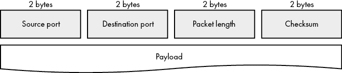

# 第五章：不可靠的 UDP 通信


尽管大多数网络应用利用了 TCP 的可靠性和流量控制，但不那么流行的用户数据报协议（UDP）仍然是 TCP/IP 协议栈中的重要组成部分。UDP 是一个简单的协议，具有最小的功能。一些应用程序不需要 TCP 的特性和会话开销。像域名解析服务这样的应用选择使用 UDP。

本章首先通过将 UDP 与 TCP 进行比较，重点讨论在何种情况下 UDP 可能比 TCP 更合适。接下来，你将学习如何在 Go 中发送和接收 UDP 数据包。最后，你将了解为什么最好限制你在网络上传输的 UDP 数据包大小，以及如何确定最佳的数据包大小。

## 使用 UDP：简单且不可靠

UDP 是不可靠的，因为它不包含许多使 TCP 如此可靠的机制。它提供的内容仅仅是一个套接字地址（IP 地址和端口）。实际上，该协议如此简单，以至于 RFC 768 用大约三页内容就描述了整个协议。与 TCP 不同，UDP 不提供会话支持，甚至不确认目的地是否可访问；它只是尽力尝试发送数据包。接收方不会自动确认 UDP 数据包，因此 UDP 没有固有的交付确认。UDP 不进行拥塞管理、不控制数据流，也不重新传输数据包。最后，UDP 不能保证目的地接收数据包的顺序与它们的发送顺序一致。UDP 仅仅是应用程序与 IP 层之间的一个通道。正是这种简洁性使得 UDP 在某些应用中快速且具有吸引力。

UDP 相对于 TCP 有一些优势。TCP 必须在每个节点与组中的每个节点之间建立会话，才能开始传输数据，而 UDP 可以向一组节点发送单个数据包，而无需重复发送数据包，这个过程被称为*组播*。由于 UDP 不需要在每个节点之间建立会话，它还可以将数据包广播到子网中的所有成员。

当丢失的数据包对整体通信没有重大影响时，UDP 是理想的选择，因为最新接收到的数据包可以替代之前丢失的数据包。天气数据就是一个很好的例子。如果你正在通过流式天气数据追踪你所在地区的龙卷风，你并不太关心丢失的数据包表示两分钟前龙卷风的位置，只要你已经接收到表示龙卷风当前位置的数据包。

如果你的应用程序不需要 TCP 提供的所有功能，你应该考虑使用 UDP。对于大多数网络应用，TCP 是正确的协议选择。但如果 UDP 的速度和简洁性更适合你的使用场景，并且可靠性权衡不至于产生严重后果，UDP 也是一个可选方案。

UDP 的数据包结构包括一个 8 字节的头部和一个负载。头部包含 2 个字节表示源端口，2 个字节表示目标端口，2 个字节表示数据包长度（以字节为单位），以及 2 个字节的校验和。最小的数据包长度是 8 字节，用于表示头部和一个空的负载。图 5-1 展示了 UDP 数据包的组织结构。



图 5-1：UDP 数据包头部和负载

尽管最大数据包长度为 65,535 字节，但应用层协议通常会限制数据包长度，以避免数据包碎片化，具体内容请参见第 115 页的“避免碎片化”一节。

## 发送和接收 UDP 数据

在发送和接收数据时，UDP 相比 TCP 显得更加粗糙。例如，假设你的邻居烤了一个馅饼并想要给你。使用 TCP 进行通信就像是你的邻居从她的窗户（她的套接字地址）向你敞开的窗户（你的套接字地址）大声喊个问候。你听到她的问候并回应一个问候（TCP 握手）。然后你的邻居把馅饼送到你那里。你接受它并感激地确认收到馅饼（数据传输）。接着你们互道告别，各自继续忙自己的事（连接终止）。相比之下，使用 UDP 进行通信就像是你的邻居突然把馅饼扔向你的窗户，无论窗户开没开，也不等待你确认收到。

在第 74 页的“使用 net.Conn 接口”一节中，介绍了`net.Conn`接口，用于处理面向流的连接，如 TCP 连接，客户端和服务器之间。但这个接口不适合 UDP 连接，因为 UDP 不是面向流的协议。UDP 没有像 TCP 那样维持会话或进行握手过程。UDP 没有确认、重传或流控制的概念。

相反，UDP 主要依赖于面向数据包的`net.PacketConn`接口。本章稍后我们会讨论一个 UDP 与`net.Conn`结合使用的案例，但对于大多数 UDP 应用程序来说，`net.PacketConn`是更好的选择。

### 使用 UDP 回显服务器

发送和接收 UDP 数据包的过程几乎与发送和接收 TCP 数据包相同。但由于 UDP 不支持会话，你必须能够处理从连接对象读取数据时的附加返回值，即发送者的地址，正如列表 5-1 中 UDP 回显服务器实现所示。

```
package echo

import (
    "context"
    "net"
)

func echoServerUDP(1ctx context.Context, addr string) (net.Addr, error) {
    s, err := 2net.ListenPacket("udp", addr)
    if err != nil {
        return nil, fmt.Errorf("binding to udp %s: %w", addr, err)
    }

    3 go func() {
        go func() {
            4 <-ctx.Done()
            _ = s.Close()
        }()

        buf := make([]byte, 1024)
 for {
            n, 5clientAddr, err := 6s.ReadFrom(buf) // client to server
            if err != nil {
                return
            }

            _, err = 7s.WriteTo(buf[:n], 8clientAddr) // server to client
            if err != nil {
                return
            }
        }
    }()

    return s.LocalAddr(), nil
}
```

列表 5-1：一个简单的 UDP 回显服务器实现（*echo.go*）

这段代码允许你启动一个 UDP 服务器，能够将接收到的任何 UDP 数据包回显给发送者。在本章中，你会频繁使用这段代码，因此理解它的作用是很重要的。

该函数接收一个上下文 1，以便调用者取消回显服务器，以及一个熟悉的*host:port*格式的字符串地址。它返回一个`net.Addr`接口和一个`error`接口。调用者使用`net.Addr`接口向回显服务器发送消息。如果在实例化回显服务器时出现任何问题，返回的`error`接口将不为`nil`。

你通过调用`net.ListenPacket`2 为服务器创建一个 UDP 连接，该方法返回一个`net.PacketConn`接口和一个`error`接口。`net.ListenPacket`函数类似于你在第三章和第四章中用于创建 TCP 监听器的`net.Listen`函数，不同之处在于`net.ListenPacket`只返回一个`net.PacketConn`接口。

一个 goroutine 管理你回显服务器 3 的异步消息回显。第二个 goroutine 阻塞在上下文的`Done`通道 4 上。一旦调用者取消上下文，接收`Done`通道的操作会解除阻塞，服务器关闭，销毁此 goroutine 以及父 goroutine 3。

要从 UDP 连接中读取数据，你将一个字节切片传递给`ReadFrom`方法 6。该方法返回读取的字节数、发送者的地址以及一个错误接口。请注意，你的 UDP 连接没有像前面章节中的基于 TCP 的监听器那样具有`Accept`方法。这是因为 UDP 不使用握手过程。在这里，你只是创建一个监听 UDP 端口的 UDP 连接，并读取任何传入的消息。由于没有适当的介绍和建立会话，你依赖返回的地址 5 来确定是哪一个节点发送了消息。

要写入一个 UDP 数据包，你将一个字节切片和一个目标地址 8 传递给连接的`WriteTo`方法 7。`WriteTo`方法返回写入的字节数和一个错误接口。与读取数据时一样，你需要告诉`WriteTo`方法数据包的发送位置，因为你与远程节点没有建立会话。在清单 5-1 中，你将消息写入原始发送者。但你也可以轻松地将消息转发到另一个节点，使用你现有的 UDP 连接对象。你无需像使用 TCP 时那样建立一个新的 UDP 连接对象来转发消息。

### 从回显服务器接收数据

现在你已经熟悉了基于 UDP 的回显服务器，我们来看看一些与回显服务器交互的客户端代码。清单 5-2 展示了与回显服务器的简单交互。

```
package echo

import (
    "bytes"
    "context"
    "net"
    "testing"
)

func TestEchoServerUDP(t *testing.T) {
    ctx, cancel := context.WithCancel(context.Background())
    1 serverAddr, err := echoServerUDP(ctx, "127.0.0.1:")
    if err != nil {
        t.Fatal(err)
    }
    defer cancel()

    2 client, err := net.ListenPacket("udp", "127.0.0.1:")
    if err != nil {
        t.Fatal(err)
    }
    defer func() { _ = client.Close() }()

    msg := []byte("ping")
    _, err = 3client.WriteTo(msg, serverAddr)
    if err != nil {
        t.Fatal(err)
    }

    buf := make([]byte, 1024)
    n, 4addr, err := 5client.ReadFrom(buf)
    if err != nil {
        t.Fatal(err)
    }

    if addr.String() != serverAddr.String() {
        t.Fatalf("received reply from %q instead of %q", addr, serverAddr)
    }

 if !bytes.Equal(msg, buf[:n]) {
        t.Errorf("expected reply %q; actual reply %q", msg, buf[:n])
    }
}
```

清单 5-2：向回显服务器发送 UDP 数据包并接收回复（*echo_test.go*）

你将一个上下文和地址字符串传递给`echoServer`函数，并接收服务器的地址 1 对象。你推迟调用上下文的`cancel`函数，该函数会通知服务器退出并关闭其 goroutines。在实际应用中，使用上下文来取消长期运行的进程非常有用，确保你不会泄漏资源，如内存或不必要地保持文件打开。

你以与实例化回声服务器的`net.PacketConn`相同的方式实例化客户端的`net.PacketConn` 2。`net.ListenPacket`函数为客户端和服务器创建连接对象。在这里，你还需要告诉客户端每次调用其`WriteTo`方法 3 时该向哪里发送消息。在将消息发送给回声服务器后，客户端应该立即通过其`ReadFrom`方法 5 接收一条消息。你可以检查`ReadFrom`方法返回的地址 4 来确认回声服务器发送了该消息。

需要注意的是，列表 5-2 中的测试在某些情况下可能会失败。即使你正在从计算机的本地网络栈读取数据包并向其写入数据包，这些数据包仍然受到所有使 UDP 在节点间网络中不可靠的条件的影响。例如，发送或接收缓冲区已满，或可用 RAM 不足，都可能导致数据包丢失；较大的 UDP 数据包可能会受到分片的影响（在本章后面讨论）；并且使用多个线程传递 UDP 数据包的操作系统可能会导致数据包乱序。

### 每个 UDP 连接都是一个监听器

回想一下第三章，Go 的`net`包区分了 TCP 连接对象（`TCPConn`）和 TCP 监听器（`TCPListener`）。TCP 监听器接受连接并返回一个表示监听器端连接的对象，以便监听器可以向客户端发送消息。

UDP 没有与`TCPListener`等价的东西，因为 UDP 缺乏会话。这意味着当接收数据包时，你的代码需要进行更多的管理。你需要验证发送方的地址，因为你不能再相信所有传入连接对象的数据包都是来自同一发送方。

接下来的几个列表是一个测试的一部分，测试单个 UDP 连接对象是否能够从多个发送方接收数据包。列表 5-3 启动了一个回声服务器和一个客户端进行测试。

```
package echo

import (
    "bytes"
    "context"
    "net"
    "testing"
)

func TestListenPacketUDP(t *testing.T) {
    ctx, cancel := context.WithCancel(context.Background())
    1 serverAddr, err := echoServerUDP(ctx, "127.0.0.1:")
    if err != nil {
        t.Fatal(err)
    }
    defer cancel()

    2 client, err := net.ListenPacket("udp", "127.0.0.1:")
    if err != nil {
        t.Fatal(err)
    }
    defer func() { _ = client.Close() }()
```

列表 5-3：创建回声服务器和客户端（*listen_packet_test.go*）

你首先创建回声服务器 1 和客户端连接 2。列表 5-4 添加了第二个网络连接来与客户端进行交互。

```
`--snip--`

    1 interloper, err := net.ListenPacket("udp", "127.0.0.1:")
    if err != nil {
        t.Fatal(err)
    }

    interrupt := []byte("pardon me")
    2 n, err := interloper.WriteTo(interrupt, client.LocalAddr())
    if err != nil {
        t.Fatal(err)
    }
    _ = interloper.Close()

    if l := len(interrupt); l != n {
        t.Fatalf("wrote %d bytes of %d", n, l)
    }
```

列表 5-4：添加一个中断者并用消息中断客户端（*listen_packet_test.go*）

然后，你创建一个新的 UDP 连接 1，用于在客户端和回声服务器之间插入并中断客户端 2。此消息应排队进入客户端的接收缓冲区。

客户端将其 ping 消息发送到回声服务器，并在清单 5-5 中对回复进行调解。

```
`--snip--`

    ping := []byte("ping")
    _, err = 1client.WriteTo(ping, serverAddr)
    if err != nil {
        t.Fatal(err)
    }

    buf := make([]byte, 1024)
    n, addr, err := 2client.ReadFrom(buf)
    if err != nil {
        t.Fatal(err)
    }

    if !bytes.Equal(3interrupt, buf[:n]) {
        t.Errorf("expected reply %q; actual reply %q", interrupt, buf[:n])
    }

    if addr.String() != interloper.LocalAddr().String() {
        t.Errorf("expected message from %q; actual sender is %q",
            interloper.LocalAddr(), addr)
    }

    n, addr, err = client.ReadFrom(buf)
    if err != nil {
        t.Fatal(err)
    }

    if !bytes.Equal(4ping, buf[:n]) {
        t.Errorf("expected reply %q; actual reply %q", ping, buf[:n])
    }

    5 if addr.String() != serverAddr.String() {
        t.Errorf("expected message from %q; actual sender is %q",
            serverAddr, addr)
    }
}
```

清单 5-5：接收来自多个发送者的 UDP 数据包（*listen_packet_test.go*）

与此同时，客户端向回声服务器 1 写入 ping 消息，并迅速读取一个传入的消息 2。UDP 客户端连接的独特之处在于，它首先读取来自非法连接的中断消息 3，然后是来自回声服务器的回复 4。如果这是一个 TCP 连接，客户端将永远不会接收到非法连接的消息。因此，你的代码应始终通过评估 `ReadFrom` 方法的第二个返回值 5（发送者的地址）来验证每个读取的包的发送者。

### 在 UDP 中使用 net.Conn

你可以建立一个实现 `net.Conn` 接口的 UDP 连接，这样你的代码表现得就像是一个 TCP 的 `net.Conn`。你通过将 `udp` 作为第一个参数传递给在前两章中使用的 `net.Dial` 函数来实现这一点。使用 `net.Conn` 与基于 UDP 的连接可以防止非法连接发送消息给你，并消除在收到每个回复时检查发送方地址的需要。

清单 5-6 创建了基于 UDP 的 `net.Conn`，并演示了 `net.Conn` 如何封装 UDP 的实现细节，从而模拟面向流的网络连接。

```
package echo

import (
    "bytes"
    "context"
    "net"
    "testing"
    "time"
)

func TestDialUDP(t *testing.T) {
    ctx, cancel := context.WithCancel(context.Background())
    1 serverAddr, err := echoServerUDP(ctx, "127.0.0.1:")
    if err != nil {
        t.Fatal(err)
    }
    defer cancel()

    client, err := 2net.Dial("udp", serverAddr.String())
    if err != nil {
        t.Fatal(err)
    }
    defer func() { _ = client.Close() }()
```

清单 5-6：创建回声服务器和客户端（*dial_test.go*）

连接的客户端可以通过 UDP 利用 `net.Conn` 的面向流的功能，但 UDP 监听器仍然必须使用 `net.PacketConn`。你为回声服务器 1 创建了一个实例，目的是向客户端发送回复。然后，你通过将 `udp` 作为第一个参数传递给 `net.Dial`2 来通过 UDP 拨号回声服务器。与 TCP 不同，回声服务器在调用 `net.Dial` 时不会接收到任何流量，因为无需握手。

清单 5-7 通过在回声服务器发送其回复之前向客户端发送消息来中断客户端。

```
`--snip--`

    interloper, err := net.ListenPacket("udp", "127.0.0.1:")
    if err != nil {
        t.Fatal(err)
    }

 interrupt := []byte("pardon me")
    1 n, err := interloper.WriteTo(interrupt, client.LocalAddr())
    if err != nil {
        t.Fatal(err)
    }
    _ = interloper.Close()

    if l := len(interrupt); l != n {
        t.Fatalf("wrote %d bytes of %d", n, l)
    }
```

清单 5-7：中断客户端（*dial_test.go*）

就像在清单 5-4 中一样，你从一个非法连接 1 向客户端发送了一条消息。

清单 5-8 详细说明了使用 `net.Conn` 的 UDP 连接与使用 `net.PacketConn` 的连接之间的区别，如清单 5-5 所示。

```
`--snip--`

    ping := []byte("ping")
    _, err = 1client.Write(ping)
    if err != nil {
        t.Fatal(err)
    }

    buf := make([]byte, 1024)
    n, err = 2client.Read(buf)
    if err != nil {
        t.Fatal(err)
    }

    if !bytes.Equal(ping, buf[:n]) {
        t.Errorf("expected reply %q; actual reply %q", ping, buf[:n])
    }

    err = 3client.SetDeadline(time.Now().Add(time.Second))
    if err != nil {
        t.Fatal(err)
    }

    _, err = 4client.Read(buf)
    if err == nil {
        t.Fatal("unexpected packet")
    }
}
```

清单 5-8：使用 `net.Conn` 管理 UDP 流量（*dial_test.go*）

客户端通过使用`net.Conn`的`Write`方法 1 向回显服务器发送 ping 消息。`net.Conn`客户端会将其消息写入`net.Dial`调用中指定的地址。你不需要为每个通过客户端连接发送的数据包指定目标地址。同样，你通过客户端的`Read`方法 2 读取数据包。客户端只会从`net.Dial`调用中指定的发送方地址读取数据包，就像使用面向流的连接对象一样。客户端永远不会读取干扰连接发送的消息。为了确保，你设置了一个充足的截止时间 3，并尝试读取另一条消息 4。

对于你的目的，使用`net.Conn`而不是`net.PacketConn`可能会使你的 UDP 连接代码更简洁。只是要意识到权衡的利弊。使用`net.Conn`与 UDP 时，并不会提供与使用`net.Conn`与 TCP 时相同的功能。例如，基于 UDP 的`net.Conn`的`Write`方法不会在目标未能接收数据包时返回错误。使用 UDP 时，确保数据包交付的责任仍然在你的应用程序代码中。

## 避免分片

*分片*是一个第 3 层 IP 过程，将数据包拆分成适合在网络上高效传输的小块。所有网络媒介都有数据包大小限制，称为*最大传输单元（MTU）*。大于媒介最大传输单元的数据包需要进行分片，以便每个片段的大小小于或等于媒介的 MTU，然后节点才能通过媒介传输它们。一旦片段到达目标位置，操作系统会重新组装每个数据包，并将数据包呈现给你的应用程序。

但是，分片可能因各种原因损坏或未能到达目标。这对于使用 UDP 的情况来说是一个重要的考虑因素，因为与 TCP 不同，UDP 不会优雅地恢复丢失或损坏的数据。如果操作系统未能接收一个分片，发送方必须重新传输整个 UDP 数据包。如你所想，重新传输大数据包是非常低效的。尽管有许多方法可以减轻分片的影响，但我们将尝试完全避免它。我们将集中讨论一种简单的方法，来识别你计算机和目标节点之间的 MTU，并利用这些结果来确定负载大小，从而避免分片。

你可以使用`ping`命令来确定你计算机与目标节点之间的 MTU。`ping`命令允许你发送一个特定大小的 ICMP 数据包，并设置一个标志，告知节点不要对其进行分片。如果数据包到达一个需要分片的节点，因为它的大小超过了节点的 MTU，节点会看到*不分片*标志，并通过 ICMP 消息回应，告诉你数据包太大。

以下示例通过以太网发送这些 ping，按规范以太网的最小 MTU 为 46 字节，最大 MTU 为 1,500 字节。如果你计算机与目标主机之间的任何跳跃的 MTU 小于 1,500 字节，那么你的数据包将会被分片。让我们使用 Linux 上的 `ping` 命令来确认这一点（列表 5-9）。

```
$ **ping -M** 1**do -s** 2**1500 1.1.1.1**
PING 1.1.1.1 (1.1.1.1) 1500(31528) bytes of data.
ping: sendmsg: 4Message too long
```

列表 5-9：在 Linux 上使用 1,500 字节有效负载大小 ping 1.1.1.1

你将 `-M` 标志设置为 1 为 `do`，这设置了禁止分片选项，并将 `-s` 标志设置为 2 为 `1500`，这设置了 1,500 字节的有效负载。由于没有考虑数据包的头部大小，这应该超过以太网的 MTU。如预期的那样，你收到通知，数据包需要进行分片。你还看到总的数据包大小是 1,528 字节。额外的 28 字节是 8 字节的 ICMP 头部和 20 字节的 IP 头部之和。任何你指定的有效负载都应该考虑到整体头部大小。

如你所见，你在 列表 5-9 中从未收到 1.1.1.1 的回复，因为你发送的数据包太大，无法在每个跳跃中不进行分片。相反，`ping` 命令通知你消息太长。

让我们再试一次，减去 28 字节的有效负载（列表 5-10）。

```
$ **ping -M do -s 1472 1.1.1.1**
PING 1.1.1.1 (1.1.1.1) 1472(1500) bytes of data.
1480 bytes from 1.1.1.1: icmp_seq=1 ttl=59 time=11.8 ms
```

列表 5-10：在 Linux 上使用 1,472 字节有效负载大小 ping 1.1.1.1

这才像话。你确认了这台计算机与 1.1.1.1 之间通过互联网的 MTU 设置为 1,500 字节。这是你在网络上发送数据包时的最大大小，超过这个大小就需要进行分片。幸运的是，UDP 头部也是 8 字节，所以尽管使用 ICMP，`ping` 命令依然能给出准确的结果。考虑到头部大小，你的最大 UDP 有效负载大小是 1,472 字节，以避免分片。

在 Windows 上，等效的 `ping` 命令如下：

```
C:\>**ping -f -l 1500 1.1.1.1**
```

`-f` 标志指示节点不要分片数据包，`-l` 标志将数据包大小设置为给定的字节数。

在 macOS 上，`ping` 命令如下：

```
$ **ping -D -s 1500 1.1.1.1**
```

`-D` 标志设置了禁止分片标志，`-s` 标志指定了有效负载的大小。

请记住，你计算机的 MTU 可能与本章示例中的不同，因为网络或计算机与目标主机之间的 MTU 设置不同。我建议你尝试使用 `ping` 命令来确定从计算机到互联网各主机的 MTU，并查看是否发现任何差异。

## 你所学到的

UDP 是一种简约的基于数据报的协议，优先考虑速度而非可靠性，避免了许多 TCP 的流量控制和可靠性特性。UDP 适用于需要速度和简洁性、且能容忍数据丢失的场景，比如实时视频流。

由于 UDP 不是基于会话的，因此没有 UDP 监听器的概念，不会在建立会话后接受连接。相反，你需要通过使用 `net.ListenPacket` 来创建网络连接，它返回一个 `net.PacketConn` 接口。然后，你的代码可以从 `net.PacketConn` 接口读取任何传入的消息或数据报，因为每个 `net.PacketConn` 都会监听传入的消息。

使用 UDP 时，分片是一个需要认真考虑的问题。尽量避免 UDP 数据包的分片，以帮助确保数据的可靠传输非常重要。`ping` 命令可以帮助你确定计算机与目标网络之间的适当最大传输单元。由于 `ping` 命令使用的 ICMP 包头与 UDP 包头大小相同，你可以利用这一点轻松确定发生分片的有效载荷大小阈值。除了通过适当调整有效载荷的大小来管理分片外，你的代码还必须管理确认和重传，以确保可靠性。
