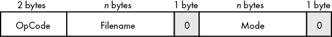
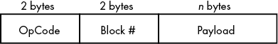
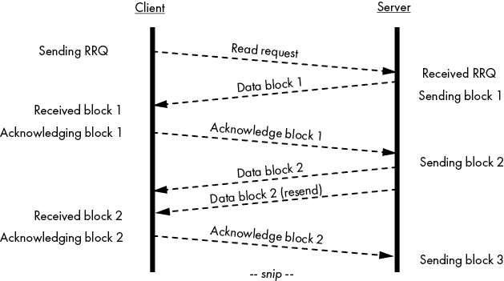
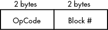
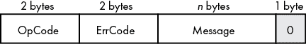

# 第六章：确保 UDP 的可靠性


第五章介绍了使用 UDP 的基本网络应用，并展示了 Go 语言的`net`包和接口在编写可移植代码时的灵活性。本章接着上章的内容，介绍了一种确保 UDP 通信可靠性的方法。

本章开始时介绍了一个建立在 UDP 之上的应用协议。我们将覆盖该协议所使用的一部分类型，并展示如何利用它们可靠地传输数据。接着，我们将实现一个服务器，允许客户端使用该应用协议下载文件。最后，我们将从我们的服务器下载一个文件并验证其完整性。

## 使用 TFTP 进行可靠的文件传输

如前一章所述，UDP 本身是不可靠的。这意味着让 UDP 连接可靠是你的应用程序的工作。既然我们在上一章中讨论了 UDP，以及它在需要部分 TCP 特性的情况下的最佳使用方式，那么现在回过头来看这样一个应用层协议的例子是很合适的。

*简单文件传输协议（TFTP）*是一个应用层协议的例子，它确保了通过 UDP 进行可靠的数据传输。它允许两个节点通过实现一部分使 TCP 可靠的特性，来通过 UDP 传输文件。TFTP 服务器实现了有序的数据包传输、确认和重传。为了将这个例子简化到最基本的内容，你的服务器只允许客户端下载二进制数据。它不支持上传、美国信息交换标准代码（ASCII）传输或 TFTP 的后续添加功能，这些功能在 RFC 1350 之外进行了规定。为了简化，你的服务器无论客户端请求哪个文件，都会快速地提供相同的文件。

请记住，TFTP 不适合用于安全文件传输。虽然它为 UDP 连接增加了可靠性，但它不支持加密或认证。如果你的应用需要通过 UDP 进行通信，你可能会想使用 WireGuard（[`github.com/WireGuard/wireguard-go/`](https://github.com/WireGuard/wireguard-go/)），这是一个支持通过 UDP 进行安全通信的应用程序。

接下来的几个部分将实现一个只读的 TFTP 服务器，教你如何将可靠性添加到 UDP 中。所谓*只读*，我的意思是你的服务器只允许客户端下载文件，而不允许上传文件。你将从定义你的 TFTP 服务器支持的常量和类型的子集开始。你将把与类型相关的逻辑封装在每个类型的方法中。接着，你将实现 TFTP 服务器的代码部分，与客户端交互，并使用我们定义的类型来促进可靠的文件传输。

## TFTP 类型

你的 TFTP 服务器将接受来自客户端的读取请求，发送数据包，传输错误包，并接受来自客户端的确认。为此，你必须在代码中定义一些类型来表示客户端请求、传输的数据、确认和错误。列表 6-1 概述了用于限制数据包大小、识别操作和编码各种错误的关键类型。

```
package tftp

import (
    "bytes"
    "encoding/binary"
    "errors"
    "io"
    "strings"
)

const (
    DatagramSize = 1516 // the maximum supported datagram size
    BlockSize = 2DatagramSize – 4 // the DatagramSize minus a 4-byte header
)

3 type OpCode uint16

const (
    OpRRQ OpCode = iota + 1
    _            // no WRQ support
    OpData
    OpAck
    OpErr
)

4 type ErrCode uint16

const (
    ErrUnknown ErrCode = iota
    ErrNotFound
    ErrAccessViolation
    ErrDiskFull
    ErrIllegalOp
    ErrUnknownID
    ErrFileExists
    ErrNoUser
)
```

列表 6-1：TFTP 服务器使用的类型和代码（*types.go*）

TFTP 限制数据报数据包的大小不得超过 516 字节，以避免分段。你定义了两个常量来强制执行数据报大小限制 1 和最大数据块大小 2。最大块大小是数据报大小减去 4 字节的头部。TFTP 数据包头的前 2 字节是操作码 3。

每个操作码是一个 2 字节的无符号整数。你的服务器支持四种操作：读取请求（RRQ）、数据操作、确认和错误。由于你的服务器是只读的，因此跳过了写请求（WRQ）的定义。

与操作码类似，你根据 RFC 定义了一系列无符号的 16 位整数错误代码 4。虽然在你的服务器中并未使用所有错误代码，因为它只允许下载，但客户端可以返回这些错误代码代替确认包。

以下章节详细说明了实现服务器支持的四种操作的类型。

### 读取请求

当客户端希望下载文件时，服务器会接收到一个 *读取请求* 数据包。然后，服务器必须回应一个数据包或一个错误包，接下来的几个章节中你将看到这两种包。任何一个数据包都可以作为对客户端的确认，表明服务器已接收到读取请求。如果客户端未收到数据包或错误包，它可以重新传输读取请求，直到服务器响应或客户端放弃。

图 6-1 说明了读取请求数据包的结构。



图 6-1：读取请求数据包结构

读取请求数据包由 2 字节的操作码、文件名、一个空字节、模式和一个尾随空字节组成。*操作码*是一个整数，对应每种操作类型的唯一标识。每个类型的操作码对应 RFC 1350 中详细说明的整数。例如，读取请求的操作码是 1。文件名和模式是长度可变的字符串。模式指示服务器如何发送文件：netascii 或 octet。如果客户端使用 *netascii* 模式请求文件，则客户端必须将文件转换为符合其自身行结束格式的格式。对于我们的目的，你只会接受 *octet* 模式，这要求服务器以二进制格式或原样发送文件。

列表 6-2 是 列表 6-1 的延续。在这里，你定义了读取请求及其方法，使服务器能够将请求编排成字节切片，以准备写入网络连接。

```
`--snip--`

1 type ReadReq struct {
    Filename string
    Mode     string
}

// Although not used by our server, a client would make use of this method.
func (q ReadReq) MarshalBinary() ([]byte, error) {
    mode := "octet"
    if q.Mode != "" {
        mode = q.Mode
    }

    // operation code + filename + 0 byte + mode + 0 byte
    cap := 2 + 2 + len(q.Filename) + 1 + len(q.Mode) + 1

    b := new(bytes.Buffer)
    b.Grow(cap)

    err := 2binary.Write(b, binary.BigEndian, OpRRQ) // write operation code
    if err != nil {
        return nil, err
    }

    _, err = b.WriteString(q.Filename) // write filename
    if err != nil {
        return nil, err
    }

    err = 3b.WriteByte(0) // write 0 byte
    if err != nil {
 return nil, err
    }

    _, err = b.WriteString(mode) // write mode
    if err != nil {
        return nil, err
    }

    err = 3b.WriteByte(0) // write 0 byte
    if err != nil {
        return nil, err
    }

    return b.Bytes(), nil
}
```

清单 6-2：读取请求及其二进制序列化方法（*types.go* 续）

表示读取请求的结构体 1 需要跟踪文件名和模式。在将数据包序列化为字节切片时，您将操作码 2 和空字节 3 插入到缓冲区中。

清单 6-3 延续了清单 6-2 的内容，并通过定义一个方法，完成了读取请求的实现，该方法允许服务器从字节切片中反序列化读取请求，通常是从与客户端的网络连接中读取的。

```
`--snip--`

func (q *ReadReq) 1UnmarshalBinary(p []byte) error {
    r := bytes.NewBuffer(p)

    var code OpCode

    err := 2binary.Read(r, binary.BigEndian, &code) // read operation code
    if err != nil {
        return err
    }

    if code != OpRRQ {
        return errors.New("invalid RRQ")
    }

    q.Filename, err = 3r.ReadString(0) // read filename
    if err != nil {
        return errors.New("invalid RRQ")
    }

    q.Filename = 4strings.TrimRight(q.Filename, "\x00") // remove the 0-byte
    if len(q.Filename) == 0 {
        return errors.New("invalid RRQ")
    }

    q.Mode, err = r.ReadString(0) // read mode
    if err != nil {
 return errors.New("invalid RRQ")
    }

    q.Mode = strings.TrimRight(q.Mode, "\x00") // remove the 0-byte
    if len(q.Mode) == 0 {
        return errors.New("invalid RRQ")
    }

    actual := strings.ToLower(q.Mode) // enforce octet mode
    if actual != "octet" {
        return errors.New("only binary transfers supported")
    }

    return nil
}
```

清单 6-3：读取请求类型实现（*types.go* 续）

您的 TFTP 服务器的读取请求、数据、确认和错误数据包都实现了`encoding.BinaryMarshaler`和`encoding.BinaryUnmarshaler`接口。这些方法允许您的类型将自身序列化为适合通过网络传输的二进制格式，并将网络字节反序列化回原始类型。例如，读取请求类型可以使用其`MarshalBinary`方法将自身序列化为与图 6-1 所示的读取请求格式匹配的字节切片，正如清单 6-2 中所示。类似地，它可以使用其`UnmarshalBinary`方法 1，从网络中读取的字节切片中构建自身。尽管您的服务器不会发送读取请求并使用其`MarshalBinary`方法，但我鼓励您在本章学习过程中编写一个 TFTP 客户端，该客户端将读取请求序列化为二进制形式。我将此作为练习留给您来实现。

`UnmarshalBinary`方法仅在给定的字节切片匹配读取请求格式时才返回`nil`。如果您不确定给定的字节切片是否是读取请求，可以将字节切片传递给此方法，并根据返回值来确定。您将在查看服务器代码时看到这一点。

`UnmarshalBinary`方法读取前 2 个字节 2 并确认操作码是读取请求的操作码。然后它读取所有字节直到第一个空字节 3，并去除空字节分隔符 4。结果字节串表示文件名。类似地，您读取模式，如果一切符合预期则返回`nil`。服务器随后可以使用填充好的`ReadReq`来为客户端检索请求的文件。

### 数据包

客户端收到*数据包*作为其读取请求的响应，前提是服务器能够检索到请求的文件。服务器将文件分成一系列数据包发送，每个数据包都有一个分配的块号，从 1 开始，随后的每个数据包递增。块号帮助客户端正确地对接收到的数据进行排序，并处理重复数据包。

所有数据包的有效负载大小为 512 字节，最后一个数据包除外。客户端会继续读取数据包，直到接收到一个有效负载小于 512 字节的数据包，表示传输结束。在任何时候，客户端都可以返回一个错误数据包来代替确认包，服务器也可以返回一个错误数据包来代替数据包。错误数据包会立即终止传输。

图 6-2 显示了数据包的格式。



图 6-2：数据包结构

与读取请求包类似，数据包的前 2 个字节包含其操作码。接下来的 2 个字节表示块号。其余字节（最多 512 字节）是有效负载。

服务器要求客户端在每个数据包后进行确认。如果服务器没有及时收到客户端的确认或错误，服务器将重试传输，直到收到回复或用尽重试次数。图 6-3 展示了客户端从 TFTP 服务器下载文件的初步通信。



图 6-3：使用简单文件传输协议下载文件

一旦客户端发送了初始读取请求包，服务器就会响应并发送第一块数据。接下来，客户端确认接收到块 1。服务器收到确认后，回复第二块数据。但在这个模拟示例中，服务器没有及时收到客户端的回复，因此它重新发送了块 2。客户端接收到块 2 并发送确认。这个来回过程会持续进行，直到服务器发送最后一块有效负载小于 512 字节的数据包。

清单 6-4 详细介绍了用于实际数据传输的数据类型。

```
`--snip--`

1 type Data struct {
    Block   uint16
    Payload io.Reader
}

2 func (d *Data) MarshalBinary() ([]byte, error) {
    b := new(bytes.Buffer)
    b.Grow(DatagramSize)

    d.Block++ // block numbers increment from 1

    err := binary.Write(b, binary.BigEndian, OpData) // write operation code
    if err != nil {
        return nil, err
    }

    err = binary.Write(b, binary.BigEndian, d.Block) // write block number
    if err != nil {
        return nil, err
    }

    // write up to BlockSize worth of bytes
    _, err = 3io.CopyN(b, d.Payload, BlockSize)
    if err != nil && err != io.EOF {
        return nil, err
    }

    return b.Bytes(), nil
}
```

清单 6-4：数据类型及其二进制序列化方法（*types.go*继续）

`Data`结构体 1 跟踪当前块号和数据源。在这种情况下，负载是`io.Reader`，而不是字节切片，原因是`io.Reader`提供了更大的灵活性，允许你从不同来源获取负载。你可以像使用`*os.File`对象从文件系统读取文件一样，使用`net.Conn`对象从其他网络连接读取数据。`io.Reader`接口提供了简单字节切片无法提供的选项。你依赖读取器来跟踪剩余的字节数，这省去了你需要编写的大量代码。

每次调用`MarshalBinary`方法时，最多会返回 516 个字节的数据，依赖于`io.CopyN`函数 3 和`BlockSize`常量。由于你希望`MarshalBinary`修改状态，因此需要使用指针接收器。其目的是服务器可以不断调用此方法，从`io.Reader`中获取顺序递增的块号的连续数据块，直到读取器耗尽。与客户端一样，服务器也需要监控此方法返回的数据包大小。当数据包大小小于 516 字节时，服务器就知道它已经接收到最后一个数据包，并应该停止调用`MarshalBinary`。你将在本章后面看到此方法在服务器代码中的实际应用。

你可能已经意识到 16 位无符号块号可能发生整数溢出的风险。如果你发送一个超过 33.5MB（65,535 × 512 字节）的有效负载，块号将会溢出并回绕到 0。你的服务器将继续愉快地发送数据包，但客户端可能无法优雅地处理这一溢出。你应该考虑通过限制 TFTP 服务器支持的文件大小来减轻溢出风险，以避免触发溢出，识别溢出发生的可能性，并判断客户端是否可以接受，或者完全使用另一种协议。

Listing 6-5 完成了数据类型实现及其二进制反序列化方法的定义。该方法遵循 Listing 6-4 中的代码。

```
`--snip--`

func (d *Data) UnmarshalBinary(p []byte) error {
    1 if l := len(p); l < 4 || l > DatagramSize {
        return errors.New("invalid DATA")
    }

    var opcode

    err := 2binary.Read(bytes.NewReader(p[:2]), binary.BigEndian, &opcode)
    if err != nil || opcode != OpData {
        return errors.New("invalid DATA")
    }

    err = 3binary.Read(bytes.NewReader(p[2:4]), binary.BigEndian, &d.Block)
    if err != nil {
        return errors.New("invalid DATA")
    }

    d.Payload = 4bytes.NewBuffer(p[4:])

    return nil
}
```

Listing 6-5：数据类型实现（*types.go*续）

为了反序列化数据，首先需要进行初步的合理性检查 1，以确定数据包的大小是否在预期范围内，确保读取剩余字节是值得的。然后读取操作码 2 并进行检查，接着读取块号 3。最后，将剩余字节填充到一个新的缓冲区 4，并将其分配给`Payload`字段。

客户端使用块号向服务器发送相应的确认消息，并在其他接收到的数据块中正确排序这一数据块。

### 确认

*确认数据包*的长度仅为 4 字节，如图 6-4 所示。



图 6-4：确认数据包结构

与其他类型一样，前 2 个字节表示操作码。最后 2 个字节包含已确认的数据块号。

Listing 6-6 展示了确认类型的完整实现，遵循 Listing 6-5 的代码。

```
`--snip--`

1 type Ack uint16

func (a Ack) MarshalBinary() ([]byte, error) {
    cap := 2 + 2 // operation code + block number

    b := new(bytes.Buffer)
    b.Grow(cap)

    err := binary.Write(b, binary.BigEndian, OpAck) // write operation code
    if err != nil {
        return nil, err
    }

    err = binary.Write(b, binary.BigEndian, a) // write block number
    if err != nil {
        return nil, err
    }

    return b.Bytes(), nil
}

func (a *Ack) UnmarshalBinary(p []byte) error {
    var code OpCode

    r := bytes.NewReader(p)

    err := binary.Read(r, binary.BigEndian, &code) // read operation code
    if err != nil {
        return err
    }

    if code != OpAck {
        return errors.New("invalid ACK")
    }

 return binary.Read(r, binary.BigEndian, a) // read block number
}
```

Listing 6-6：确认类型实现（*types.go*续）

你可以通过使用一个 16 位的无符号整数 1 来表示确认数据包。该整数被设置为已确认的数据块号。到目前为止，`MarshalBinary`和`UnmarshalBinary`方法应该已经很熟悉了，它们分别处理将操作码和块号序列化为字节切片，以及从网络读取的字节填充到`Ack`对象中。

### 错误处理

在 TFTP 中，客户端和服务器通过使用*错误数据包*来传递错误，如图 6-5 所示。



图 6-5：错误数据包结构

错误数据包由一个 2 字节的操作码、一个 2 字节的错误码、一个可变长度的错误消息和一个终止的空字节组成。

示例 6-7 详细描述了错误类型及其二进制序列化方法，这是示例 6-6 的延续。

```
`--snip--`

1 type Err struct {
    Error   ErrCode
    Message string
}

func (e Err) MarshalBinary() ([]byte, error) {
    // operation code + error code + message + 0 byte
    cap := 2 + 2 + len(e.Message) + 1

    b := new(bytes.Buffer)
    b.Grow(cap)

    err := binary.Write(b, binary.BigEndian, OpErr) // write operation code
    if err != nil {
        return nil, err
    }

    err = binary.Write(b, binary.BigEndian, e.Error) // write error code
    if err != nil {
        return nil, err
    }

    _, err = b.WriteString(e.Message) // write message
    if err != nil {
 return nil, err
    }

    err = b.WriteByte(0) // write 0 byte
    if err != nil {
        return nil, err
    }

    return b.Bytes(), nil
}
```

示例 6-7：用于在客户端和服务器之间传递错误的错误类型（*types.go*继续）

与读取请求类似，错误类型 1 包含构建错误数据包所需的最小数据：错误码和错误消息。`MarshalBinary`方法会按照图 6-5 中详细描述的字节顺序填充字节缓冲区。

示例 6-8 通过其二进制反序列化方法完成了错误类型的实现。此代码附加到示例 6-7 中的代码。

```
`--snip--`

func (e *Err) UnmarshalBinary(p []byte) error {
    r := bytes.NewBuffer(p)

    var code OpCode

    err := 1binary.Read(r, binary.BigEndian, &code) // read operation code
    if err != nil {
        return err
    }

    if code != OpErr {
        return errors.New("invalid ERROR")
    }

    err = 2binary.Read(r, binary.BigEndian, &e.Error) // read error message
    if err != nil {
        return err
    }

    e.Message, err = 3r.ReadString(0)
    e.Message = 4strings.TrimRight(e.Message, "\x00") // remove the 0-byte

    return err
}
```

示例 6-8：错误类型的二进制反序列化实现（*types.go*继续）

`UnmarshalBinary`方法非常简单，它读取并验证操作码 1，处理错误码 2 和错误消息 3，并去掉末尾的空字节 4。

## TFTP 服务器

现在你将编写服务器代码，使用你定义的类型与 TFTP 客户端进行交互。

### 编写服务器代码

示例 6-9 描述了你的服务器类型以及允许其处理传入请求的方法。你的数据包类型实现了`encoding.BinaryMarshaler`和`encoding.BinaryUnmarshaler`接口，这意味着你的服务器代码可以充当网络接口和这些类型之间的桥梁，从而简化代码。你的服务器只需关注在你的类型和网络连接之间传输字节切片。类型接口中的逻辑会处理剩余部分。

```
package tftp

import (
    "bytes"
    "errors"
    "fmt"
    "log"
    "net"
    "time"
)

type Server struct {
    1 Payload []byte // the payload served for all read requests
    2 Retries uint8 // the number of times to retry a failed transmission
    3 Timeout time.Duration // the duration to wait for an acknowledgment
}

func (s Server) ListenAndServe(addr string) error {
    conn, err := net.ListenPacket("udp", addr)
    if err != nil {
        return err
    }
    defer func() { _ = conn.Close() }()

    log.Printf("Listening on %s ...\n", conn.LocalAddr())

    return s.Serve(conn)
}

func (s *Server) 4Serve(conn net.PacketConn) error {
    if conn == nil {
        return errors.New("nil connection")
    }

    if s.Payload == nil {
        return errors.New("payload is required")
    }

 if s.Retries == 0 {
        s.Retries = 10
    }

    if s.Timeout == 0 {
        s.Timeout = 6 * time.Second
    }

    var rrq ReadReq

    for {
        buf := make([]byte, DatagramSize)

        _, addr, err := conn.ReadFrom(buf)
        if err != nil {
            return err
        }

        err = 5rrq.UnmarshalBinary(buf)
        if err != nil {
            log.Printf("[%s] bad request: %v", addr, err)
            continue
        }

        6 go s.handle(addr.String(), rrq)
    }
}
```

示例 6-9：服务器类型实现（*server.go*）

我们的服务器维护一个有效负载 1，它会在每个读取请求时返回，包括尝试数据包传输的次数 2 和每次尝试之间的超时持续时间 3。服务器的`Serve`方法接受一个`net.PacketConn`并使用它来读取传入的请求 4。关闭网络连接将导致该方法返回。

服务器从其连接中读取最多 516 字节，并尝试将字节反序列化为`ReadReq`对象 5。由于你的服务器是只读的，它只关心服务读取请求。如果从连接中读取的数据是读取请求，服务器将把它传递给 goroutine 中的处理方法 6。我们接下来将定义该方法。

### 处理读取请求

该处理程序（Listing 6-10）接受来自客户端的读取请求，并回复服务器的有效载荷。它利用你在 TFTP 服务器类型系统中构建的功能，来提高 UDP 数据传输的可靠性。该处理程序发送一个数据包，并在发送下一个数据包之前等待客户端的确认。如果在预定时间内未收到客户端的回复，它还会尝试重新传输当前的数据包。

```
`--snip--`

1 func (s Server) handle(clientAddr string, rrq ReadReq) {
    log.Printf("[%s] requested file: %s", clientAddr, rrq.Filename)

    conn, err := 2net.Dial("udp", clientAddr)
    if err != nil {
        log.Printf("[%s] dial: %v", clientAddr, err)
        return
    }
    defer func() { _ = conn.Close() }()

    var (
        ackPkt  Ack
        errPkt  Err
        dataPkt = 3Data{Payload: bytes.NewReader(s.Payload)}
        buf     = make([]byte, DatagramSize)
    )

NEXTPACKET:
    4 for n := DatagramSize; n == DatagramSize; {
        data, err := dataPkt.MarshalBinary()
        if err != nil {
            log.Printf("[%s] preparing data packet: %v", clientAddr, err)
            return
        }

    RETRY:
        5 for i := s.Retries; i > 0; i-- {
            6 n, err = conn.Write(data) // send the data packet
            if err != nil {
                log.Printf("[%s] write: %v", clientAddr, err)
                return
            }

            // wait for the client's ACK packet
            _ = conn.SetReadDeadline(time.Now().Add(s.Timeout))

            _, err = conn.Read(buf)
            if err != nil {
                if nErr, ok := err.(net.Error); ok && nErr.Timeout() {
                    continue RETRY
                }

                log.Printf("[%s] waiting for ACK: %v", clientAddr, err)
                return
            }

            switch {
            case ackPkt.UnmarshalBinary(buf) == nil:
                7 if uint16(ackPkt) == dataPkt.Block {
                    // received ACK; send next data packet
                    continue NEXTPACKET
 }
            case errPkt.UnmarshalBinary(buf) == nil:
                log.Printf("[%s] received error: %v",
                    clientAddr, errPkt.Message)
                return
            default:
                log.Printf("[%s] bad packet", clientAddr)
            }
        }

        log.Printf("[%s] exhausted retries", clientAddr)
        return
    }

    log.Printf("[%s] sent %d blocks", clientAddr, dataPkt.Block)
}
```

Listing 6-10: 处理读取请求（*server.go* 续）

该处理程序是`Server`类型上的一个方法 1，接受客户端地址和读取请求。之所以定义为方法，是因为你需要访问`Server`的字段。然后，通过使用`net.Dial`2 与你的客户端建立连接。记得，使用`net.Dial`创建的 UDP 连接对象将仅从客户端读取数据包，免去了你每次`Read`调用时都需要检查发送者地址的麻烦。你通过使用服务器的有效载荷来准备数据对象 3，然后进入`for`循环发送每个数据包 4。只要数据包大小等于 516 字节，该`for`循环将继续。

在将数据对象编组为字节切片后，你进入`for`循环 5，旨在重新发送数据包，直到达到重试次数上限或成功传送数据包为止。将数据包写入网络连接 6 会更新`n`循环变量，记录已发送的字节数。如果该值为 516 字节，当控制权回到标记为`NEXTPACKET`的`for`循环 4 时，你将再次迭代。如果该值小于 516 字节，则跳出循环。

在确定传输是否完成之前，你必须首先验证客户端是否成功接收了最后一个数据包。你从客户端读取字节，并尝试将其反序列化为`Ack`对象或`Err`对象。如果成功将其反序列化为`Err`对象，则说明客户端返回了一个错误，此时应记录该事实并提前返回。提前返回意味着此处理程序在未传送整个有效载荷的情况下终止传输。就我们的目的而言，这是不可恢复的。客户端需要重新请求文件，以启动另一次传输。

如果你成功地将字节反序列化为`Ack`对象，则可以检查该对象的`Block`值，以确定它是否与当前数据包 7 的块号匹配。如果匹配，则绕过`for`循环 4 并发送下一个数据包。如果不匹配，则绕过内部`for`循环 5 并重新发送当前数据包。

### 启动服务器

要启动 TFTP 服务器，你需要提供两个参数：一个文件（其有效载荷）和一个监听传入请求的地址（Listing 6-11）。

```
package main

import (
    "flag"
    "io/ioutil"
    "log"

    "github.com/awoodbeck/gnp/ch06/tftp"
)

var (
    address = flag.String("a", "127.0.0.1:69", "listen address")
    payload = flag.String("p", "payload.svg", "file to serve to clients")
)

func main() {
    flag.Parse()

    p, err := 1ioutil.ReadFile(*payload)
    if err != nil {
        log.Fatal(err)
    }

    s := 2tftp.Server{Payload: p}
    3 log.Fatal(s.ListenAndServe(*address))
}
```

Listing 6-11: 命令行 TFTP 服务器实现（*tftp.go*）

一旦你将 TFTP 服务器要提供的文件 1 读取到字节切片中，就可以实例化服务器并将字节切片分配给服务器的`Payload`字段 2。最后一步是调用它的`ListenAndServe`方法，以在其将监听请求的 UDP 连接上建立连接。`ListenAndServe`方法 3 会为你调用服务器的`Serve`方法，该方法在网络连接上监听传入的请求。服务器将继续运行，直到你在命令行使用 ctrl-C 终止它。

## 通过 UDP 下载文件

现在让我们尝试从你刚刚写的服务器下载一个文件。首先，你需要确保安装了 TFTP 客户端。Windows 有一个本地 TFTP 客户端，你可以通过控制面板中的“程序和功能”部分，点击“打开或关闭 Windows 功能”链接来安装。勾选**TFTP 客户端**复选框，然后点击**确定**按钮来安装它。大多数 Linux 发行版通过其包管理器提供 TFTP 客户端，而 macOS 默认已安装 TFTP 客户端。

这个例子使用的是 Windows 10。首先通过在终端中运行列表 6-11 中的代码来启动 TFTP 服务器：

```
Microsoft Windows [Version 10.0.18362.449]
(c) 2019 Microsoft Corporation. All rights reserved.

C:\Users\User\gnp\ch06\tftp\tftp>**go run tftp.go**
2006/01/02 15:04:05 Listening on 127.0.0.1:69 ...
```

服务器默认应该绑定到 127.0.0.1 上的 UDP 端口 69。端口 69 是特权端口，你可能需要在 Linux 上使用 root 权限。你可能需要先使用`go build tftp.go`构建二进制文件，然后使用`sudo`命令运行生成的二进制文件，以便绑定到端口 69：`sudo ./tftp`。TFTP 服务器应该在标准输出上记录一条消息，指示它正在监听。

从另一个终端执行 TFTP 客户端，确保传递`-i`参数来告诉服务器你希望发起二进制（字节）传输。记住，TFTP 服务器并不关心源文件名是什么，因为它会根据请求的文件名返回相同的负载。在这个例子中，你将使用*test.svg*：

```
Microsoft Windows [Version 10.0.18362.449]
(c) 2019 Microsoft Corporation. All rights reserved.

C:\Users\User>**tftp -i 127.0.0.1 GET test.svg**
Transfer successful: 75352 bytes in 1 second(s), 75352 bytes/s
```

几乎在按下回车键后，客户端应该报告传输成功。TFTP 服务器的终端也应该显示其进度：

```
Microsoft Windows [Version 10.0.18362.449]
(c) 2019 Microsoft Corporation. All rights reserved.

C:\Users\User\gnp\ch06\tftp\tftp>**go run tftp.go**
2006/01/02 15:04:05 Listening on 127.0.0.1:69 ...
2006/01/02 15:04:05 [127.0.0.1:57944] requested file: test.svg
2006/01/02 15:04:05 [127.0.0.1:57944] sent 148 blocks
```

你可以通过将下载的文件与 TFTP 服务器的*payload.svg*的校验和进行比较来确认下载的文件与提供给 TFTP 服务器的负载相同。*校验和*是一个计算值，用于验证文件的完整性。如果两个文件相同，它们将具有相同的校验和。Linux 和 macOS 都有多种命令行工具可以生成校验和，但你将使用一个纯 Go 实现，如列表 6-12 所示。

```
package main

import (
    "crypto/sha512"
    "flag"
    "fmt"
    "io/ioutil"
    "os"
)

func init() {
    flag.Usage = func() {
        fmt.Printf("Usage: %s file...\n", os.Args[0])
        flag.PrintDefaults()
    }
}

func main() {
    flag.Parse()
    for _, file := range 1flag.Args() {
        fmt.Printf("%s  %s\n", checksum(file), file)
    }
}

func checksum(file string) string {
    b, err := 2ioutil.ReadFile(file)
    if err != nil {
        return err.Error()
    }

    return fmt.Sprintf("%x", 3sha512.Sum512_256(b))
}
```

列表 6-12：为给定的命令行参数生成 SHA512/256 校验和（*sha512-256sum.go*）

这段代码将接受一个或多个文件路径作为命令行参数 1，并从它们的内容 2 生成 SHA512/256 校验和 3。

SHA512/256 校验和是通过截断 SHA512 校验和得到的 256 位版本。在 64 位机器上计算 SHA512 比计算 SHA256 校验和更快，因为 SHA512 计算使用的是 64 位字，而 SHA256 使用的是 32 位字。通过将 SHA512 截断为 256 位，你消除了 SHA512 本身容易受到的长度扩展哈希攻击。SHA512/256 在这里并不是必需的，因为你只是用它来验证文件的完整性，但你应该了解它，并将其列为你的哈希算法备选方案之一。

你可以使用清单 6-12 中的代码在清单 6-13 中验证你下载的文件（*test.svg*）是否与服务器发送的文件（*payload.svg*）相同。你将继续使用 Windows 作为目标平台，但这段代码在 Linux 和 macOS 上也能正常工作，无需修改：

```
Microsoft Windows [Version 10.0.18362.449]
(c) 2019 Microsoft Corporation. All rights reserved.

C:\Users\User\dev\gnp\ch06>**go build sha512-256sum\sha512-256sum.go**

C:\Users\User\dev\gnp\ch06>**sha512-256sum \Users\User\test.svg**

\Users\User\test.svg =>
1 3f5794c522e83b827054183658ce63cb701dc49f4e59335f08b5c79c56873969

C:\Users\User\dev\gnp\ch06>**sha512-256sum tftp\tftp\payload.svg**

tftp\tftp\payload.svg =>
2 3f5794c522e83b827054183658ce63cb701dc49f4e59335f08b5c79c56873969
```

清单 6-13：生成*test.svg*和*payload.svg*的 SHA512/256 校验和

如你所见，*test.svg*的校验和 1 等于*payload.svg*的校验和 2。

在这种情况下，*test.svg*文件是 Egon Elbre 在 GitHub 上的优秀*gophers*库中的一张 gopher 图像（[`github.com/egonelbre/gophers/`](https://github.com/egonelbre/gophers/)）。如果你在浏览器中打开该文件，你会看到图 6-6 中的图像。

尽管你通过本地回环地址传输了有效载荷，并且不预期数据丢失或损坏，但客户端和服务器仍然确认了每一个数据包，确保了有效载荷的正确传输。


图 6-6：从 TFTP 服务器下载的有效载荷

## 你学到了什么

UDP 可以在应用层实现可靠性，正如琐碎文件传输协议（TFTP）所展示的那样。TFTP 结合了数据包序列号和确认机制，以确保客户端和服务器在所有传输的数据上达成一致，并在必要时重新传输丢失的数据包。

Go 的二进制序列化和反序列化接口的广泛使用使得你能够实现一些类型，从而使得使用 TFTP 进行通信变得简单。每个通过 UDP 传输的 TFTP 类型都实现了`encoding.BinaryMarshaler`接口，以便将其数据序列化为适合写入网络连接的格式。同样，任何你期望从网络连接读取的类型都应该实现`encoding.BinaryUnmarshaler`接口。成功地将二进制数据反序列化为自定义类型，可以帮助你确定接收到的二进制数据及其正确性。
