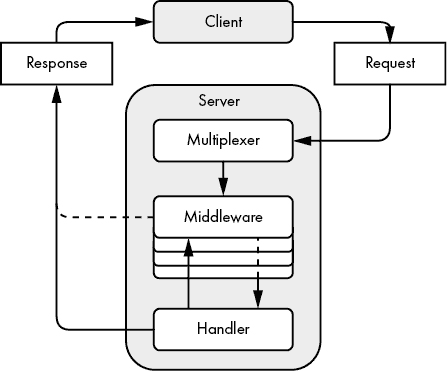

# 第九章：构建 HTTP 服务


现在你已经编写了发送 HTTP 请求的客户端代码，让我们构建一个能够处理这些请求并将资源发送给客户端的服务器。`net/http` 包为你处理了大多数实现细节，因此你可以专注于实例化和配置服务器、创建资源以及处理每个客户端请求。

在 Go 中，一个 HTTP 服务器依赖于几个相互作用的组件：处理程序、中间件和复用器。当它包含所有这些部分时，我们将这个服务器称为 *Web 服务*。我们将从一个简单的 HTTP Web 服务开始，然后在本章中逐步探讨每个组件。整体框架应该能帮助你理解初学者常常觉得抽象的主题。

你还将学习 `net/http` 包的更高级用法，例如添加 TLS 支持和将数据推送到 HTTP/2 客户端。到最后，你应该能够自如地配置基于 Go 的 HTTP 服务器，编写中间件，并使用处理程序响应请求。

## Go HTTP 服务器的结构

图 9-1 说明了请求在典型的 `net/http` 基于服务器中的路径。



图 9-1：客户端请求最终由处理程序响应的服务器

首先，服务器的 *复用器*（在计算机网络术语中是 *路由器*）接收客户端的请求。复用器确定请求的目标，然后将其传递给能够处理它的对象。我们称这个对象为 *处理程序*。（复用器本身就是一个处理程序，它将请求路由到最合适的处理程序。）在处理程序接收到请求之前，请求可能会经过一个或多个称为 *中间件* 的函数。中间件改变处理程序的行为或执行辅助任务，例如日志记录、身份验证或访问控制。

清单 9-1 创建一个遵循基本结构的 HTTP 服务器。如果你在跟随过程中遇到困难，别担心；你将花费本章的其余部分来学习这些部分如何工作。

```
package main

import (
    "bytes"
    "fmt"
    "io"
    "io/ioutil"
    "net"
    "net/http"
    "testing"
    "time"

    "github.com/awoodbeck/gnp/ch09/handlers"
)

func TestSimpleHTTPServer(t *testing.T) {
    srv := &http.Server{
        Addr: "127.0.0.1:8081",
        Handler: 1http.TimeoutHandler(
            handlers.DefaultHandler(), 2*time.Minute, ""),
        IdleTimeout:       5 * time.Minute,
        ReadHeaderTimeout: time.Minute,
    }

    l, err := 2net.Listen("tcp", srv.Addr)
    if err != nil {
        t.Fatal(err)
    }

    go func() {
        err := 3srv.Serve(l)
        if err != http.ErrServerClosed {
            t.Error(err)
        }
    }()
```

清单 9-1：实例化复用器和 HTTP 服务器 (*server_test.go*)

发送到服务器的处理程序的请求首先经过名为 `http.TimeoutHandler` 的中间件 1，然后传递给由 `handlers.DefaultHandler` 函数返回的处理程序。在这个非常简单的示例中，你为所有请求指定了一个处理程序，而不是依赖于复用器。

服务器有几个字段。`Handler` 字段接受一个复用器或其他能够处理客户端请求的对象。`Address` 字段你现在应该已经很熟悉了。在这个示例中，你希望服务器监听 IP 地址 127.0.0.1 上的端口 8081。我将在下一节中解释 `IdleTimeout` 和 `ReadHeaderTimeout` 字段。现在可以简单地说，你应该始终定义这两个字段。

最后，你创建一个新的`net.Listener`并将其绑定到服务器的地址 2，然后指示服务器从这个监听器 3 处理请求。`Serve`方法在正常关闭时返回`http.ErrServerClosed`。

现在，让我们来测试这个服务器。列表 9-2 从列表 9-1 开始，详细介绍了一些测试请求及其预期结果。

```
`--snip--`

    testCases := []struct {
        method   string
        body     io.Reader
        code     int
        response string
    }{
      1{http.MethodGet, nil, http.StatusOK, "Hello, friend!"},
      2{http.MethodPost, bytes.NewBufferString("<world>"), http.StatusOK,
            "Hello, &lt;world&gt;!"},
      3{http.MethodHead, nil, http.StatusMethodNotAllowed, ""},
    }

 client := new(http.Client)
    path := fmt.Sprintf("http://%s/", srv.Addr)
```

列表 9-2：HTTP 服务器的请求测试用例（*server_test.go*）

首先，你发送了一个`GET`请求 1，结果返回了一个 200 OK 状态码。响应体中包含字符串`Hello, friend!`。

在第二个测试用例 2 中，你发送了一个`POST`请求，其主体包含字符串`<world>`。尖括号是故意的，它们展示了处理客户端输入时常被忽视的一个方面：始终对客户端输入进行转义。你将在第 193 页的“处理器”中学习到如何转义客户端输入。这个测试用例的响应体是字符串`Hello, &lt;world&gt;!`。响应看起来有些傻，但你的 Web 浏览器会将其渲染为`Hello, <world>!`。

第三个测试用例 3a 向 HTTP 服务器发送了一个`HEAD`请求。由`handlers.DefaultHandler`函数返回的处理器将不会处理`HEAD`方法。因此，它返回了 405 Method Not Allowed 状态码和一个空的响应体。

列表 9-3 继续了列表 9-2 中的代码，并逐一执行每个测试用例。

```
`--snip--`

    for i, c := range testCases {
        r, err := 1http.NewRequest(c.method, path, c.body)
        if err != nil {
            t.Errorf("%d: %v", i, err)
            continue
        }

        resp, err := 2client.Do(r)
        if err != nil {
            t.Errorf("%d: %v", i, err)
            continue
        }

        if resp.StatusCode != c.code {
            t.Errorf("%d: unexpected status code: %q", i, resp.Status)
        }

        b, err := 3ioutil.ReadAll(resp.Body)
        if err != nil {
            t.Errorf("%d: %v", i, err)
            continue
        }
        _ = 4resp.Body.Close()

        if c.response != string(b) {
            t.Errorf("%d: expected %q; actual %q", i, c.response, b)
        }
    }

 if err := 5srv.Close(); err != nil {
        t.Fatal(err)
    }
}
```

列表 9-3：向 HTTP 服务器发送测试请求（*server_test.go*）

首先，你创建一个新的请求，将测试用例 1 中的参数传递进去。接着，你将请求传递给客户端的`Do`方法 2，它返回服务器的响应。然后，你检查状态码并读取整个响应体 3。如果客户端没有返回错误 4，你应该养成始终关闭响应体的习惯，即使响应体为空或完全忽略它。不这样做可能会阻止客户端重用底层 TCP 连接。

一旦所有测试完成，你调用服务器的`Close`方法 5。这会导致其在列表 9-1 中的`Serve`方法返回，从而停止服务器。`Close`方法会突然关闭客户端连接。稍后在本章讨论 HTTP/2 推送时，你将看到 HTTP 服务器的优雅关闭支持的示例。

Go 的 HTTP 服务器支持一些其他功能，我们将在接下来的章节中探讨。它可以主动向客户端提供或推送资源。它还提供了优雅关闭的支持。突然关闭你的 Web 服务器可能会使一些客户端处于尴尬状态，因为如果它们在你停止服务器时正在等待响应，它们将永远收不到响应。优雅关闭允许所有待处理的响应在服务器停止前到达每个客户端。

### 客户端不尊重你的时间

就像我建议设置客户端的超时值一样，我建议你管理各种服务器超时值，原因很简单，否则客户端不会尊重你的服务器时间。客户端可以慢慢地将请求发送到你的服务器。而你的服务器则在等待完整请求的过程中占用了资源。同样，当服务器发送响应时，它也处于客户端的掌控之中，因为它只能以客户端读取数据的速度发送数据（或者只能发送到 TCP 缓冲区可用的空间）。避免让客户端决定请求-响应生命周期的持续时间。

列表 9-1 包含了一个服务器实例，其中指定了两个超时值：客户端在请求之间可以保持空闲的时间以及服务器应等待多长时间来读取请求头：

```
srv := &http.Server{
    Addr:              "127.0.0.1:8081",
    Handler:           mux,
    IdleTimeout:       5 * time.Minute,
    ReadHeaderTimeout: time.Minute,
}
```

尽管`http.Server`上有多个超时字段可供使用，但我建议只设置`IdleTimeout`和`ReadHeaderTimeout`字段。`IdleTimeout`字段决定了服务器在使用保活连接时，等待下一个客户端请求时 TCP 套接字保持打开的时间。`ReadHeaderTimeout`值决定了服务器在读取完请求头之前会等待多久。请记住，这个时间段与读取请求体所需的时间无关。

如果你想在所有处理程序中强制执行读取传入请求的时间限制，可以通过使用`ReadTimeout`字段来管理请求的截止时间。如果客户端在`ReadTimeout`持续时间内未能发送完整的请求（包括头部和正文），服务器将结束 TCP 连接。同样，你也可以通过使用`WriteTimeout`字段为客户端设置一个有限的时间，在此时间内发送请求并读取响应。`ReadTimeout`和`WriteTimeout`值适用于所有请求和响应，因为它们决定了 TCP 套接字的`ReadDeadline`和`WriteDeadline`值，正如在第四章中讨论的那样。

这些通用的超时值可能不适用于那些期望客户端在请求体中发送大文件的处理程序，或者那些无限期地将数据流式传输到客户端的处理程序。在这两种情况下，即使一切按预期进行，请求或响应仍然可能突然超时。相反，一个好的做法是依赖`ReadHeaderTimeout`值。你可以通过中间件或处理程序单独管理读取请求体和发送响应所需的时间。这为你提供了对每个资源的请求和响应持续时间的最大控制。你将在第 202 页的“中间件”一节中学到如何通过中间件管理请求-响应持续时间。

### 添加 TLS 支持

HTTP 流量默认是明文的，但网页客户端和服务器可以通过加密的 TLS 连接使用 HTTP，这种组合被称为*HTTPS*。Go 的 HTTP 服务器仅支持通过 TLS 连接使用 HTTP/2，但启用 TLS 是一件简单的事。你只需要修改 Listing 9-1 中服务器实现的两行代码：端口号和 `Serve` 方法：

```
 srv := &http.Server{
        Addr:            1"127.0.0.1:8443",
        Handler:           mux,
        IdleTimeout:       5 * time.Minute,
        ReadHeaderTimeout: time.Minute,
    }

    l, err := net.Listen("tcp", srv.Addr)
    if err != nil {
        t.Fatal(err)
    }

    go func() {
     2 err := srv.ServeTLS(l, "cert.pem", "key.pem")
        if err != http.ErrServerClosed {
 t.Error(err)
        }
    }()
```

从技术上讲，你不需要更改端口号 1，但惯例是通过端口 443 提供 HTTPS 服务，或者使用端口 443 的扩展端口，如 8443。通过服务器的 `ServeTLS` 方法，你指示服务器在 HTTP 2 上使用 TLS。`ServeTLS` 方法需要证书和相应私钥的路径。我建议你查看 mkcert 项目，网址为 [`github.com/FiloSottile/mkcert/`](https://github.com/FiloSottile/mkcert/)，以获取密钥对。你可以使用 mkcert 仅为开发目的创建本地信任的密钥对。对于生产用途，你应该考虑使用并支持 Let’s Encrypt，网址为 [`letsencrypt.org/`](https://letsencrypt.org/)。

## 处理器

当客户端向 HTTP 服务器发送请求时，服务器需要弄清楚如何处理该请求。根据客户端请求的内容，服务器可能需要检索各种资源或执行某个操作。一个常见的设计模式是指定一些代码来处理这些请求，这些代码称为*处理器*。你可能有一个处理器知道如何检索图片，另一个处理器知道如何从数据库中检索信息。我们将在第 207 页的“多路复用器”一节中讨论服务器如何确定哪个处理器最适合每个请求。

在 Go 中，处理器是实现了 `http.Handler` 接口的对象。它们读取客户端请求并写入响应。`http.Handler` 接口由一个方法组成，用于接收响应和请求：

```
type Handler interface {
    ServeHTTP(http.ResponseWriter, *http.Request)
}
```

任何实现了 `http.Handler` 接口的对象都可以处理客户端请求，就 Go HTTP 服务器而言。我们通常将处理器定义为函数，如下所示的常见模式：

```
handler := http.HandlerFunc(
    func(w http.ResponseWriter, r *http.Request) {
        _, _ = w.Write([]byte("Hello, world!"))
    },
)
```

在这里，你将一个接受 `http.ResponseWriter` 和 `http.Request` 指针的函数包装在 `http.HandlerFunc` 类型中，该类型实现了 `Handler` 接口。这会生成一个 `http.HandlerFunc` 对象，当服务器调用其 `ServeHTTP` 方法时，会调用包装的 `func(w http.ResponseWriter, r *http.Request)` 函数。这个处理器会在响应体中向客户端返回字符串 `Hello, world!`。

请注意，你忽略了写入字节数和任何潜在的写入错误。在实际应用中，写入客户端可能由于各种原因失败。记录这些错误是没有意义的。相反，一种选择是跟踪写入错误的频率，并在错误次数超过适当阈值时让服务器发送警报。你将在第十三章学习如何为代码添加监控功能。

现在你已经熟悉了处理器的结构，让我们来看看`handlers.DefaultHandler`函数返回的处理器，见清单 9-4。

```
package handlers

import (
    "html/template"
    "io"
    "io/ioutil"
    "net/http"
)

var t = 1template.Must(template.New("hello").Parse("Hello, {{.}}!"))

func DefaultHandler() http.Handler {
    return http.HandlerFunc(
        func(w http.ResponseWriter, r *http.Request) {
         2 defer func(r io.ReadCloser) {
                _, _ = io.Copy(ioutil.Discard, r)
                _ = r.Close()
            }(r.Body)

            var b []byte

         3 switch r.Method {
            case http.MethodGet:
                b = []byte("friend")
            case http.MethodPost:
                var err error
                b, err = ioutil.ReadAll(r.Body)
                if err != nil {
             4 http.Error(w, "Internal server error",
                    http.StatusInternalServerError)
                return
                }
            default:
                // not RFC-compliant due to lack of "Allow" header
             5 http.Error(w, "Method not allowed", 
                    http.StatusMethodNotAllowed)
                return
            }

            _ = 6t.Execute(w, string(b))
        },
    )
}
```

清单 9-4：默认处理器实现（*handlers/default.go*）

`handlers.DefaultHandler`函数返回一个转换为`http.HandlerFunc`类型的函数。`http.HandlerFunc`类型实现了`http.Handler`接口。Go 程序员通常会将签名为`func(w http.ResponseWriter, r *http.Request)`的函数转换为`http.HandlerFunc`类型，这样该函数就实现了`http.Handler`接口。

你看到的第一段代码是一个延迟函数，用于清空并关闭请求体 2。就像客户端需要清空并关闭响应体以重用 TCP 连接一样，服务器也需要对请求体执行相同的操作。但与 Go HTTP 客户端不同，关闭请求体并不会自动清空它。虽然`http.Server`会为你关闭请求体，但它不会清空它。为了确保可以重用 TCP 连接，我建议至少清空请求体。关闭它是可选的。

该处理器根据请求方法做出不同的响应 3。如果客户端发送的是`GET`请求，处理器会向响应写入`Hello, friend!`。如果请求方法是`POST`，处理器首先读取整个请求体。如果在读取请求体时发生错误，处理器会使用`http.Error`函数 4 简洁地将`Internal server error`消息写入响应体，并将响应状态码设置为 500。否则，处理器会返回一个包含请求体内容的问候消息。如果处理器收到任何其他请求方法，它会以 405 Method Not Allowed 状态响应 5。技术上讲，405 响应没有遵循 RFC 规范，因为没有 Allow 头显示处理器接受哪些方法。我们将在《任何类型都可以是处理器》中（第 198 页）补充这一缺陷。最后，处理器写入响应体。

这段代码可能存在安全漏洞，因为响应体的部分内容可能来自请求体。恶意客户端可以发送一个包含 JavaScript 的请求负载，这些脚本可能会在客户端的计算机上运行。这种行为可能导致 XSS 攻击。为了防止这些攻击，你必须在将客户端提供的内容发送到响应中之前，正确地对其进行转义。在这里，你使用 `html/template` 包创建一个简单的模板 1，该模板读取 `Hello, {{.}}!`，其中 `{{.}}` 是响应部分内容的占位符。由 `html/template` 包衍生的模板会在你填充它们并将结果写入响应写入器时，自动对 HTML 字符进行转义。Listing 9-2 中第二个测试用例解释了 HTML 转义的字符。客户端的浏览器将正确显示这些字符，而不是将它们解释为响应体中的 HTML 和 JavaScript。最重要的是，在将不可信的数据写入响应写入器时，始终使用 `html/template` 包。

### 使用 httptest 测试你的处理程序

说“确保你测试你的代码”就像是开发者的等同于我妈妈告诉我要整理我的卧室。这是个好建议，但我更愿意继续编写代码，而不是写测试代码。但我妈妈是对的，现在编写测试代码将对我未来有很大帮助。Go 标准库的架构师们——无疑是受到整洁卧室的启发——确保给了我们 `net/http/httptest` 包。这个包让单元测试处理程序变得轻松。

`net/http/httptest` 包导出了一个 `NewRequest` 函数，接受 HTTP 方法、目标资源和请求体 `io.Reader`。它返回一个指向 `http.Request` 的指针，准备在 `http.Handler` 中使用：

```
func NewRequest(method, target string, body io.Reader) *http.Request
```

与其 `http.NewRequest` 等效方法不同，`httptest.NewRequest` 会引发 panic，而不是返回错误。这在测试中是可取的，但在生产代码中并不适用。

`httptest.NewRecorder` 函数返回一个指向 `httptest.ResponseRecorder` 的指针，该类型实现了 `http.ResponseWriter` 接口。尽管 `httptest.ResponseRecorder` 导出了看起来很诱人的字段（我不想诱惑你提到它们），但我建议你改为调用它的 `Result` 方法。`Result` 方法返回一个指向 `http.Response` 对象的指针，就像我们在上一章中使用的那样。正如方法名所示，它会等到处理程序返回后，再获取 `httptest.ResponseRecorder` 的结果。

如果你有兴趣进行集成测试，`net/http/httptest` 包包含了一个测试服务器的实现。为了本章的目的，我们将使用 `httptest.NewRequest` 和 `httptest.NewRecorder`。

### 响应的编写方式很重要

这里有一个潜在的陷阱：你向响应体写入内容和设置响应状态码的顺序非常重要。客户端首先接收到响应状态码，然后是来自服务器的响应体。如果你先写入响应体，Go 会推断响应状态码是 200 OK，并在发送响应体之前将其发送给客户端。要查看这一点的实际效果，请查看示例 9-5。

```
package handlers

import (
    "net/http"
    "net/http/httptest"
    "testing"
)

func TestHandlerWriteHeader(t *testing.T) {
    handler := func(w http.ResponseWriter, r *http.Request) {
        _, _ = 1w.Write([]byte("Bad request"))
      2w.WriteHeader(http.StatusBadRequest)
    }
    r := httptest.NewRequest(http.MethodGet, "http://test", nil)
    w := httptest.NewRecorder()
    handler(w, r)
    t.Logf("Response status: %q", 3w.Result().Status)

    handler = func(w http.ResponseWriter, r *http.Request) {
      4w.WriteHeader(http.StatusB)
        _, _ = 5w.Write([]byte("Bad request"))
    }
 r = httptest.NewRequest(http.MethodGet, "http://test", nil)
    w = httptest.NewRecorder()
    handler(w, r)
    t.Logf("Response status: %q", 6w.Result().Status)
}
```

示例 9-5：首先写入状态码，然后写入响应体以获得预期结果（*handlers/pitfall_test.go*）

乍一看，可能会觉得第一个处理程序函数生成了 400 Bad Request 的响应状态码，并且在响应体中返回了字符串`Bad request`。但实际情况并非如此。调用`ResponseWriter`的`Write`方法会使 Go 隐式地调用响应的`WriteHeader`方法，并为你设置`http.StatusOK`。一旦通过显式或隐式调用`WriteHeader`设置了响应的状态码，你就无法更改它。

Go 的开发者做出这个设计选择是因为他们认为你只需要在出现不良情况时调用`WriteHeader`，在这种情况下，你应该在向响应体写入任何内容之前调用它。记住，服务器在响应体之前发送响应状态码。一旦通过显式或隐式调用`WriteHeader`设置了响应的状态码，你就无法更改它，因为它很可能已经在发送给客户端的路上。

然而，在这个例子中，你调用了`Write`方法 1，这隐式地调用了`WriteHeader(http.StatusOK)`。由于状态码尚未设置，响应码现在是 200 OK。接下来的`WriteHeader`调用 2 实际上是一个无操作，因为状态码已经设置。响应码 200 OK 会持续存在 3。

现在，如果你交换调用的顺序，将状态码 4 设置在写入响应体 5 之前，响应将具有正确的状态码 6。

让我们看一下测试输出，确认这一点：

```
=== RUN   TestHandlerWriteHeader
    TestHandlerWriteHeader: pitfall_test.go:17: Response status: "200 OK"
    TestHandlerWriteHeader: pitfall_test.go:26: Response status: "400 Bad Request"
--- PASS: TestHandlerWriteHeader (0.00s)
PASS
```

正如你从测试输出中看到的，任何在调用`WriteHeader`方法之前写入响应体的操作都会导致 200 OK 状态码。唯一能决定响应状态码的方法是先调用`WriteHeader`方法，再进行任何响应体的写入。

你可以通过使用`http.Error`函数进一步优化这段代码，它简化了写入响应状态码和响应体的过程。例如，你可以用这一行代码替换你的处理程序：

```
http.Error(w, "Bad request", http.StatusBadRequest)
```

这个函数将内容类型设置为*text/plain*，将状态码设置为 400 Bad Request，并将错误信息写入响应体。

### 任何类型都可以作为处理程序

因为`http.Handler`是一个接口，你可以利用它编写强大的构造来处理客户端请求。通过在清单 9-4 的基础上定义一个实现`http.Handler`接口的新类型，我们可以改进默认的处理器，这个新类型会允许你针对特定的 HTTP 方法作出适当的响应，并且会自动为你实现`OPTIONS`方法。

```
package handlers

import (
    "fmt"
    "html"
    "io"
    "io/ioutil"
    "net/http"
    "sort"
    "strings"
)

1 type Methods map[string]http.Handler

func (h Methods) 2ServeHTTP(w http.ResponseWriter, r *http.Request) {
 3 defer func(r io.ReadCloser) {
        _, _ = io.Copy(ioutil.Discard, r)
        _ = r.Close()
    }(r.Body)

    if handler, ok := h[r.Method]; ok {
        if handler == nil {
     4 http.Error(w, "Internal server error",
                http.StatusInternalServerError)
        } else {
     5 handler.ServeHTTP(w, r)
        }

        return
    }

 6 w.Header().Add("Allow", h.allowedMethods())
    if r.Method != 7http.MethodOptions {
        http.Error(w, "Method not allowed", http.StatusMethodNotAllowed)
    }
}

func (h Methods) allowedMethods() string {
    a := make([]string, 0, len(h))

    for k := range h {
        a = append(a, k)
 }
    sort.Strings(a)

    return strings.Join(a, ", ")
}
```

清单 9-6：动态路由请求到正确处理器的方法映射（*handlers/methods.go*）

新类型`Methods`是一个映射 1，其键是 HTTP 方法，值是一个`http.Handler`。它有一个`ServeHTTP`方法 2 来实现`http.Handler`接口，因此你可以将`Methods`本身作为处理器。`ServeHTTP`方法首先延迟一个函数来清空并关闭请求体 3，避免映射中的处理器需要执行此操作。

`ServeHTTP`方法在映射中查找请求方法并检索处理器。为了避免程序崩溃，`ServeHTTP`方法确保相应的处理器不为`nil`，如果是`nil`，则返回 500 内部服务器错误。否则，它会调用相应处理器的`ServeHTTP`方法。`Methods`类型是一个多路复用器（路由器），因为它将请求路由到适当的处理器。

如果请求方法不在映射中，`ServeHTTP`方法会响应 Allow 头 6 和映射中支持的所有方法列表。现在你只需要判断客户端是否明确请求了`OPTIONS`方法。如果请求了，`ServeHTTP`方法会返回，向客户端发送 200 OK 响应。如果没有请求，客户端会收到 405 方法不允许的响应。

清单 9-7 使用`Methods`处理器来实现一个比清单 9-4 中的默认处理器更好的处理器。旧的默认处理器没有自动添加 Allow 头，也没有支持`OPTIONS`方法。这个新处理器则会支持，因此它能让你的工作变得更加轻松。你只需要确定你的`Methods`处理器应该支持哪些方法，然后实现它们。

```
`--snip--`

func DefaultMethodsHandler() http.Handler {
    return Methods{
     1 http.MethodGet: http.HandlerFunc(
            func(w http.ResponseWriter, r *http.Request) {
                _, _ = w.Write([]byte("Hello, friend!"))
            },
        ),
     2 http.MethodPost: http.HandlerFunc(
            func(w http.ResponseWriter, r *http.Request) {
                b, err := ioutil.ReadAll(r.Body)
                if err != nil {
                    http.Error(w, "Internal server error",
                        http.StatusInternalServerError)
                    return
                }

                _, _ = fmt.Fprintf(w, "Hello, %s!",
                    html.EscapeString(string(b)))
 },
        ),
    }
}
```

清单 9-7：`Methods`处理器的默认实现（*methods.go*）

现在，`handlers.DefaultMethodsHandler`函数返回的处理器支持`GET`、`POST`和`OPTIONS`方法。`GET`方法仅将`Hello, friend!`消息写入响应体 1。`POST`方法会以 HTML 转义的请求体内容向客户端问好 2。支持`OPTIONS`方法并正确设置 Allow 头的剩余功能是`Methods`类型的`ServeHTTP`方法自带的。

`handlers.DefaultMethodsHandler`函数返回的处理器是对`handlers.DefaultHandler`函数返回的处理器的替代。你可以将清单 9-1 中的以下代码片段替换掉：

```
Handler: http.TimeoutHandler(handlers.DefaultHandler(), 2*time.Minute, ""),
```

对于这段代码：

```
Handler: http.TimeoutHandler(handlers.DefaultMethodsHandler(), 2*time.Minute, ""),
```

以利用`Methods`处理器提供的附加功能。

### 将依赖注入到处理器中

`http.Handler` 接口让您可以访问请求和响应对象。但是，您可能需要访问额外的功能，比如日志记录器、指标、缓存或数据库来处理请求。例如，您可能希望注入一个日志记录器来记录请求错误，或者注入一个数据库对象来检索用于创建响应的数据。将对象注入到处理程序中的最简单方法是使用闭包。

示例 9-8 演示了如何将 SQL 数据库对象注入到 `http.Handler` 中。

```
dbHandler := func(1db *sql.DB) http.Handler {
    return http.HandlerFunc(
        func(w http.ResponseWriter, r *http.Request) {
            err := 2db.Ping()
            // do something with the database here…
        },
    )
}

http.Handle("/three", 3dbHandler(db))
```

示例 9-8：使用闭包将依赖项注入到处理程序中

您创建一个接受 SQL 数据库对象指针 1 并返回一个处理程序的函数，然后将其分配给一个名为 `dbHandler` 的变量。由于此函数会捕获返回的处理程序，您可以在处理程序的作用域中访问 `db` 变量 2。实例化处理程序的方式就是调用 `dbHandler` 并传入一个 SQL 数据库对象的指针 3。

如果您有多个处理程序需要访问相同的数据库对象，或者您的设计正在发展并且未来可能需要访问额外的对象，这种方法可能会有些繁琐。一种更具扩展性的方法是使用一个结构体，其字段表示您希望在处理程序中访问的对象和数据，并将您的处理程序定义为结构体方法（参见 示例 9-9）。注入依赖项是通过添加结构体字段，而不是修改多个闭包定义来实现的。

```
type Handlers struct {
    db *sql.DB
  1log *log.Logger
}

func (h *Handlers) Handler1() http.Handler {
    return http.HandlerFunc(
        func(w http.ResponseWriter, r *http.Request) {
            err := h.db.Ping()
            if err != nil {
              2h.log.Printf("db ping: %v", err)
            }
            // do something with the database here
        },
    )
}

func (h *Handlers) Handler2() http.Handler {
    return http.HandlerFunc(
        func(w http.ResponseWriter, r *http.Request) {
            // ...
        },
    )
}
```

示例 9-9：将依赖项注入到定义为结构体方法的多个处理程序中

您定义了一个结构体，其中包含指向数据库对象和日志记录器的指针 1。您在处理程序上定义的任何方法现在都可以访问这些对象 2。如果您的处理程序需要访问其他资源，您只需向结构体中添加字段。

示例 9-10 演示了如何使用 `Handlers` 结构体。

```
h := &Handlers{
    db: 1db,
    log: log.New(os.Stderr, "handlers: ", log.Lshortfile),
}
http.Handle("/one", h.Handler1())
http.Handle("/two", h.Handler2())
```

示例 9-10：初始化 `Handlers` 结构体并使用其处理程序

假设 `db`1 是指向 `sql.DB` 对象的指针，您初始化一个 `Handlers` 对象，并使用 `http.Handle` 调用其方法，例如。

## 中间件

中间件由可重用的函数组成，这些函数接受一个 `http.Handler` 并返回一个 `http.Handler`：

```
func(http.Handler) http.Handler
```

您可以使用中间件检查请求，并根据其内容做出决策，然后将其传递给下一个处理程序。或者，您可能使用请求内容在响应中设置头信息。例如，如果处理程序需要身份验证并且未经过身份验证的客户端发送了请求，则中间件可以向客户端响应一个错误。中间件还可以收集指标、记录请求或控制对资源的访问，这只是其中的一些用法。最棒的是，您可以在多个处理程序中重用它们。如果您发现自己一遍又一遍地编写相同的处理程序代码，请问问自己是否可以将功能放入中间件并在处理程序之间重用它。

列表 9-11 展示了中间件的一些用法，比如强制处理程序允许哪些方法、向响应中添加头部，或执行辅助功能，如日志记录。

```
func Middleware(next http.Handler) http.Handler {
    return 1http.HandlerFunc(
     2 func(w http.ResponseWriter, r *http.Request) {
            if r.Method == http.MethodTrace {
              3http.Error(w, "Method not allowed",
                    http.StatusMethodNotAllowed)
            }

          4w.Header().Set("X-Content-Type-Options", "nosniff")

            start := time.Now()
          5next.ServeHTTP(w, r)
          6log.Printf("Next handler duration %v", time.Now().Sub(start))
        },
    )
}
```

列表 9-11：示例中间件函数

`Middleware` 函数使用了一个常见模式，这个模式你在 列表 9-4 中第一次看到：它定义了一个接受 `http.ResponseWriter` 和 `http.Request` 指针的函数，并通过 `http.HandlerFunc` 进行包装。

在大多数情况下，中间件调用给定的处理程序 5。但在某些情况下，这可能不合适，且中间件应该阻止下一个处理程序并自行响应客户端 3。同样，你可能希望使用中间件来收集指标，确保响应中设置了特定的头部 4，或写入日志文件 6。

列表 9-11 是一个人为的示例。我不推荐在单个中间件函数中执行这么多任务。相反，最好遵循 Unix 的哲学，编写简洁的中间件，每个函数专注于做一件事，并做到非常好。理想情况下，你可以将 列表 9-11 中的中间件拆分为三个中间件函数，分别检查请求方法并响应客户端 3，强制响应头部 4，以及收集指标 6。

`net/http` 包包括用于提供静态文件、重定向请求和管理请求超时的有用中间件。让我们深入研究它们的源代码，看看你如何使用它们。除了这些标准库函数，还可以查看 [`go.dev/`](https://go.dev/) 上的中间件。

### 超时慢速客户端

正如我之前提到的，重要的是不要让客户端决定请求响应生命周期的持续时间。恶意客户端可能会利用这一宽松性来达到自己的目的，耗尽服务器资源，从而有效地拒绝服务合法客户端。然而，同时，设置服务器级别的读写超时会使服务器难以流式传输数据或为每个处理程序使用不同的超时时间。

相反，你应该在中间件或单独的处理程序中管理超时。`net/http` 包包含一个中间件函数，允许你在每个处理程序级别控制请求和响应的持续时间。`http.TimeoutHandler` 接受一个 `http.Handler`、一个持续时间和一个字符串，以写入响应体。它设置一个内部计时器，持续时间为给定值。如果 `http.Handler` 在计时器到期之前没有返回，`http.TimeoutHandler` 会阻塞 `http.Handler`，并以 503 服务不可用状态响应客户端。

列表 9-12 使用 `http.TimeoutHandler` 来包装一个模拟慢速客户端的 `http.Handler`。

```
package middleware

import (
    "io/ioutil"
    "net/http"
    "net/http/httptest"
    "testing"
    "time"
)

func TestTimeoutMiddleware(t *testing.T) {
    handler := 1http.TimeoutHandler(
        http.HandlerFunc(func(w http.ResponseWriter, r *http.Request) {
            w.WriteHeader(http.StatusNoContent)
          2time.Sleep(time.Minute)
        }),
        time.Second,
        "Timed out while reading response",
    )

    r := httptest.NewRequest(http.MethodGet, "http://test/", nil)
    w := httptest.NewRecorder()
 handler.ServeHTTP(w, r)

    resp := w.Result()
    if resp.StatusCode != 3http.StatusServiceUnavailable {
        t.Fatalf("unexpected status code: %q", resp.Status)
    }

    b, err := 4ioutil.ReadAll(resp.Body)
    if err != nil {
        t.Fatal(err)
    }
    _ = resp.Body.Close()

 5 if actual := string(b); actual != "Timed out while reading response" {
        t.Logf("unexpected body: %q", actual)
    }
}
```

列表 9-12：为客户端设置有限的读取响应时间（*middleware/timeout_test.go*）

尽管名字如此，`http.TimeoutHandler` 是一个中间件，它接受一个 `http.Handler` 并返回一个 `http.Handler`1。被包装的 `http.Handler` 故意休眠一分钟 2，以模拟客户端花时间读取响应，从而阻止 `http.Handler` 返回。当处理程序在一秒钟内没有返回时，`http.TimeoutHandler` 会将响应状态码设置为 503 服务不可用 3。测试会读取整个响应体 4，正确地关闭它，并确保响应体中包含中间件写入的字符串 5。

### 保护敏感文件

中间件还可以防止客户端访问您希望保持私密的信息。例如，`http.FileServer` 函数简化了为客户端提供静态文件的过程，接受一个 `http.FileSystem` 接口并返回一个 `http.Handler`。问题在于，它不会保护防止提供潜在的敏感文件。目标目录中的任何文件都是合法的。按惯例，许多操作系统将配置文件或其他敏感信息存储在以点（.）开头的文件和目录中，并默认隐藏这些以点开头的文件和目录。（在与 Unix 兼容的系统中尤其如此。）但 `http.FileServer` 会高兴地提供以点开头的文件或遍历以点开头的目录。

`net/http` 包文档中包含了一个 `http.FileSystem` 的示例，能够防止 `http.FileServer` 提供以点开头的文件和目录。清单 9-13 通过使用中间件提供相同的保护方式。

```
package middleware

import (
    "net/http"
    "path"
 "strings"
)

func RestrictPrefix(prefix string, next http.Handler) http.Handler {
    return 1http.HandlerFunc(
        func(w http.ResponseWriter, r *http.Request) {
         2 for _, p := range strings.Split(path.Clean(r.URL.Path), "/") {
                if strings.HasPrefix(p, prefix) {
                 3 http.Error(w, "Not Found", http.StatusNotFound)
                    return
                }
            }
          next.ServeHTTP(w, r)
        },
    )
}
```

清单 9-13：保护带有指定前缀的任何文件或目录 (*middleware/restrict_prefix.go*)。

`RestrictPrefix` 中间件 1 会检查 URL 路径 2，查找任何以给定前缀开头的元素。如果中间件在 URL 路径中找到了以给定前缀开头的元素，它会抢先响应 `http.Handler` 并返回一个 404 未找到状态 3。

清单 9-14 使用了 `RestrictPrefix` 中间件，并包含一系列测试用例。

```
package middleware

import (
    "net/http"
    "net/http/httptest"
    "testing"
)

func TestRestrictPrefix(t *testing.T) {
    handler := 1http.StripPrefix("/static/",
      2RestrictPrefix(".", 3http.FileServer(http.Dir("../files/"))),
    )

    testCases := []struct {
        path string
        code int
    }{
      4{"http://test/static/sage.svg", http.StatusOK},
        {"http://test/static/.secret", http.StatusNotFound},
        {"http://test/static/.dir/secret", http.StatusNotFound},
    }

    for i, c := range testCases {
        r := httptest.NewRequest(http.MethodGet, c.path, nil)
        w := httptest.NewRecorder()
        handler.ServeHTTP(w, r)

 actual := w.Result().StatusCode
        if c.code != actual {
            t.Errorf("%d: expected %d; actual %d", i, c.code, actual)
        }
    }
}
```

清单 9-14：使用 `RestrictPrefix` 中间件 (*middleware/restrict_prefix_test.go*)

重要的是要意识到，服务器首先将请求传递给 `http.StripPrefix` 中间件 1，然后是 `RestrictPrefix` 中间件 2，如果 `RestrictPrefix` 中间件批准资源路径，则传递给 `http.FileServer`3。`RestrictPrefix` 中间件会评估请求的资源路径，以判断客户端是否请求了受限路径，无论该路径是否存在。如果是，`RestrictPrefix` 中间件会回应客户端一个错误，而不会将请求传递给 `http.FileServer`。

本测试的`http.FileServer`提供的静态文件存在于名为*files*的目录中，该目录位于*restrict_prefix_test.go*文件的父目录下。*../files*目录中的文件在传递给`http.FileServer`的文件系统根目录中。例如，操作系统文件系统中的*../files/sage.svg*文件，在传递给`http.FileServer`的`http.FileSystem`中位于*/sage.svg*路径。如果客户端希望从`http.FileServer`获取*sage.svg*文件，请求路径应为*/sage.svg*。

但是，我们的每个测试用例 4 的 URL 路径都包括*/static/*前缀，后跟静态文件名。这意味着测试请求*static/sage.svg*来自`http.FileServer`，但该文件并不存在。该测试使用了`net/http`包中的另一个中间件来解决这个路径不一致问题。`http.StripPrefix`中间件在将请求传递给`http.Handler`（本测试中的`http.FileServer`）之前，先去掉 URL 路径中的指定前缀。

接下来，您通过将`http.FileServer`包装在`RestrictPrefix`中间件中来阻止访问敏感文件，以防止该处理程序服务任何以句点为前缀的文件或目录。第一个测试用例结果是 200 OK 状态，因为 URL 路径中没有任何元素以句点为前缀。`http.StripPrefix`中间件从测试用例的 URL 中移除*/static/*前缀，将其从*/static/sage.svg*更改为*sage.svg*。然后，它将此路径传递给`http.FileServer`，该服务器在其`http.FileSystem`中找到对应的文件。`http.FileServer`将文件内容写入响应体中。

第二个测试用例结果是 404 Not Found 状态，因为*.secret*文件名的第一个字符是一个句点。第三个测试用例也导致 404 Not Found 状态，因为 URL 路径中的*.dir*元素，原因在于你的`RestrictPrefix`中间件会考虑路径中每个段的前缀，而不仅仅是文件本身。

更好的限制资源访问的方法是默认阻止所有资源，并显式允许特定的资源。作为练习，尝试通过创建一个中间件来实现`RestrictPrefix`中间件的反向功能，该中间件仅允许访问一个允许的资源列表。

## 多路复用器

一天下午，我走进了美国第四大图书馆——密歇根大学的图书馆。我正在寻找一本翻烂了的库尔特·冯内古特的*猫的摇篮*，但我不知道从哪里开始寻找。我找到最近的图书管理员，向他寻求帮助寻找这本书。当我们到达正确的位置时，书本却显示 404 Not Found。

一个*多路复用器*就像友好的图书管理员将我引导到正确的书架，它是一个通用的处理器，将请求路由到特定的处理器。`http.ServeMux`多路复用器是一个`http.Handler`，它将传入的请求路由到请求资源的正确处理器。默认情况下，`http.ServeMux`会对所有传入的请求返回 404 Not Found 状态，但你可以使用它来注册你自己的模式和相应的处理器。然后它将请求的 URL 路径与已注册的模式进行比较，并将请求和响应写入器传递给与最长匹配模式对应的处理器。

示例 9-1 使用多路复用器将所有请求发送到一个单一的端点。示例 9-15 介绍了一个稍微复杂一点的多路复用器，它有三个端点。这个多路复用器会评估请求的资源，并将请求路由到正确的端点。

```
package main

import (
    "fmt"
    "io"
    "io/ioutil"
    "net/http"
    "net/http/httptest"
    "testing"
)

1 func drainAndClose(next http.Handler) http.Handler {
    return http.HandlerFunc(
        func(w http.ResponseWriter, r *http.Request) {
          2next.ServeHTTP(w, r)
            _, _ = io.Copy(ioutil.Discard, r.Body)
            _ = r.Body.Close()
        },
    )
}

func TestSimpleMux(t *testing.T) {
    serveMux := http.NewServeMux()
 3 serveMux.HandleFunc("/", func(w http.ResponseWriter, r *http.Request) {
        w.WriteHeader(http.StatusNoContent)
    })
    serveMux.HandleFunc(4"/hello", func(w http.ResponseWriter,
        r *http.Request) {
        _, _ = fmt.Fprint(w, "Hello friend.")
    })
    serveMux.HandleFunc(5"/hello/there/", func(w http.ResponseWriter,
 r *http.Request) {
        _, _ = fmt.Fprint(w, "Why, hello there.")
    })
    mux := drainAndClose(serveMux)
```

示例 9-15：将模式注册到多路复用器，并用中间件包裹整个多路复用器（*mux_test.go*）。

测试创建了一个新的多路复用器，并使用该多路复用器的`HandleFunc`方法 3 注册了三条路由。第一条路由仅仅是一个斜杠，表示默认的或空的 URL 路径，并设置响应的 204 No Content 状态。如果没有其他路由匹配，这条路由将匹配所有 URL 路径。第二条是*/hello*4，它将字符串`Hello friend.`写入响应。最后的路径是*/hello/there/*5，它将字符串`Why, hello there.`写入响应。

请注意，第三条路由以斜杠结尾，使其成为一个子树，而之前的路由 4 没有以斜杠结尾，使其成为绝对路径。这一区别对不习惯的用户来说可能有点混淆。Go 的多路复用器将绝对路径视为精确匹配：要么请求的 URL 路径匹配，要么不匹配。相比之下，它将子树视为前缀匹配。换句话说，多路复用器会寻找最长的已注册模式，该模式出现在请求的 URL 路径的开头。例如，*/hello/there/*是*/hello/there/you*的前缀，但不是*/hello/you*的前缀。

Go 的多路复用器还可以重定向一个不以斜杠结尾的 URL 路径，例如*/hello/there*。在这种情况下，`http.ServeMux`首先尝试查找一个匹配的绝对路径。如果失败，多路复用器会在路径末尾添加一个斜杠，例如将路径变为*/hello/there/*，然后将其响应给客户端。这个新路径成为一个永久重定向。你将在示例 9-16 中看到一个例子。

现在，您已经为多路复用器定义了路由，它已准备好使用。但处理程序存在一个问题：它们没有清空和关闭请求体。在这样的测试中，这不是一个大问题，但您仍然应该遵循最佳实践。如果在实际场景中不这样做，可能会导致额外的开销和潜在的内存泄漏。在这里，您使用中间件 1 来清空和关闭请求体。在 `drainAndClose` 中间件中，您首先调用 `next` 处理程序 2，然后清空并关闭请求体。清空和关闭已清空并关闭的请求体是没有害处的。

清单 9-16 测试了一系列请求，针对 清单 9-15 的多路复用器。

```
`--snip--`

    testCases := []struct {
        path     string
        response string
        code     int
    }{
     1 {"http://test/", "", http.StatusNoContent},
        {"http://test/hello", "Hello friend.", http.StatusOK},
        {"http://test/hello/there/", "Why, hello there.", http.StatusOK},
     2 {"http://test/hello/there",
 "<a href=\"/hello/there/\">Moved Permanently</a>.\n\n",
            http.StatusMovedPermanently},
     3 {"http://test/hello/there/you", "Why, hello there.", http.StatusOK},
     4 {"http://test/hello/and/goodbye", "", http.StatusNoContent},
        {"http://test/something/else/entirely", "", http.StatusNoContent},
        {"http://test/hello/you", "", http.StatusNoContent},
    }

    for i, c := range testCases {
        r := httptest.NewRequest(http.MethodGet, c.path, nil)
        w := httptest.NewRecorder()
        mux.ServeHTTP(w, r)
        resp := w.Result()

        if actual := resp.StatusCode; c.code != actual {
            t.Errorf("%d: expected code %d; actual %d", i, c.code, actual)
        }

        b, err := 5ioutil.ReadAll(resp.Body)
        if err != nil {
            t.Fatal(err)
        }
        _ = 6resp.Body.Close()

        if actual := string(b); c.response != actual {
            t.Errorf("%d: expected response %q; actual %q", i,
                c.response, actual)
        }
    }
}
```

清单 9-16：执行一系列测试用例并验证响应状态码和响应体（*mux_test.go*）。

前三个测试用例 1，包括请求 */hello/there/* 路径，匹配多路复用器中注册的精确模式。但第四个测试用例 2 不同，它没有精确匹配。当多路复用器在其后添加一个斜杠时，它发现该路径与已注册的模式完全匹配。因此，多路复用器会响应 301 永久移动状态，并在响应体中提供指向新路径的链接。第五个测试用例 3 匹配 */hello/there/* 子树，并收到 `Why, hello there.` 的响应。最后三个测试用例 4 匹配默认路径 */*，并收到 204 无内容状态。

就像测试依赖中间件来清空和关闭请求体一样，它也会清空 5 并关闭 6 响应体。

## HTTP/2 服务器推送

Go HTTP 服务器可以通过 HTTP/2 向客户端推送资源，这是一个有潜力提高效率的特性。例如，客户端可能请求 Web 服务器的主页，但在收到 HTML 响应之前，客户端并不知道它需要相关的样式表和图像来正确渲染主页。HTTP/2 服务器可以主动将样式表和图像与 HTML 一起发送到响应中，从而节省客户端后续请求这些资源的时间。但服务器推送具有滥用的潜力。本节将向您展示如何使用服务器推送，并讨论在何种情况下您应该避免这样做。

### 向客户端推送资源

让我们通过 HTTP/1.1 获取 清单 9-17 中的 HTML 页面，然后通过 HTTP/2 获取相同的页面并比较其差异。

```
<!DOCTYPE html>
<html lang="en">
<head>
    <meta charset="UTF-8">
    <title>H2 Server Push</title>
 1 <link href="/static/style.css" rel="stylesheet">
</head>
<body>
 2 
</body>
</html>
```

清单 9-17：简单的索引文件，包含指向两个资源的链接（*files/index.html*）

这个 HTML 文件需要浏览器获取两个额外的资源，一个样式表 1 和一个 SVG 图像 2，才能正确显示整个页面。图 9-2 显示了当使用 HTTP/1.1 服务时，Google Chrome 对 HTML 请求的统计。


图 9-2：通过 HTTP/1.1 下载的索引页面和相关资源

除了 *favicon.ico* 文件（Chrome 会自动获取）外，浏览器发出了三次请求以获取所有必需的资源——一次请求 HTML 文件，一次请求样式表，一次请求 SVG 图像。任何请求 *index.html* 文件的 web 浏览器（在 Figure 9-2 中是 *localhost*）也会请求 *style.css* 和 *hiking.svg* 文件，以正确渲染 *index.html* 文件。Web 服务器可以提高效率，主动将这两个文件推送到 web 浏览器，因为它知道浏览器必定会请求它们。Web 服务器的这种主动方式可以让浏览器避免再进行两个额外的请求。

Figure 9-3 显示了使用 HTTP/2 的相同检索过程。在这种情况下，服务器推送了 *style.css* 和 *hiking.svg* 文件。


Figure 9-3：下载的索引页面与服务器端推送的资源

客户端在向服务器请求 *index.html* 文件后，会接收到所有三个资源。Figure 9-3 中的 Initiator 列显示 Chrome 从其专用的推送缓存中检索了这些资源。

让我们编写一个命令行可执行文件，可以将资源推送到客户端。Listing 9-18 显示了程序的第一部分。

```
package main

import (
    "context"
    "flag"
    "log"
    "net/http"
    "os"
    "os/signal"
    "path/filepath"
    "time"

    "github.com/awoodbeck/gnp/ch09/handlers"
    "github.com/awoodbeck/gnp/ch09/middleware"
)

var (
    addr  = flag.String("listen", "127.0.0.1:8080", "listen address")
 1 cert  = flag.String("cert", "", "certificate")
 2 pkey  = flag.String("key", "", "private key")
    files = flag.String("files", "./files", "static file directory")
)

func main() {
    flag.Parse()

    err := 3run(*addr, *files, *cert, *pkey)
    if err != nil {
        log.Fatal(err)
    }

    log.Println("Server gracefully shutdown")
}
```

Listing 9-18：HTTP/2 服务器的命令行参数（*server.go*）

服务器需要证书的路径 1 和对应的私钥 2 来启用 TLS 支持，并允许客户端与服务器协商 HTTP/2。如果其中任何一个值为空，服务器将侦听普通的 HTTP 连接。接下来，将命令行标志的值传递给 `run` 函数 3。

`run` 函数，定义在 Listing 9-19 中，包含了服务器的大部分逻辑，并最终启动了 web 服务器。将此功能拆分为单独的函数有助于后续的单元测试。

```
`--snip--`

func run(addr, files, cert, pkey string) error {
    mux := http.NewServeMux()
 1 mux.Handle("/static/",
        http.StripPrefix("/static/",
            middleware.RestrictPrefix(
                ".", http.FileServer(http.Dir(files)),
            ),
        ),
    )
 2 mux.Handle("/",
        handlers.Methods{
            http.MethodGet: http.HandlerFunc(
                func(w http.ResponseWriter, r *http.Request) {
                 3 if pusher, ok := w.(http.Pusher); ok {
                        targets := []string{
                          4"/static/style.css",
                            "/static/hiking.svg",
                        }
                        for _, target := range targets {
                            if err := 5pusher.Push(target, nil); err != nil {
                                log.Printf("%s push failed: %v", target, err)
                            }
                        }
                    }

                 6 http.ServeFile(w, r, filepath.Join(files, "index.html"))
                },
            ),
        },
    )
 7 mux.Handle("/2",
        handlers.Methods{
            http.MethodGet: http.HandlerFunc(
                func(w http.ResponseWriter, r *http.Request) {
                    http.ServeFile(w, r, filepath.Join(files, "index2.html"))
                },
            ),
        },
    )
```

Listing 9-19：HTTP/2 服务器的多路复用器、中间件和处理器（*server.go*）

服务器的多路复用器有三个路由：一个用于静态文件 1，一个用于默认路由 2，一个用于 */2* 绝对路径 7。如果 `http.ResponseWriter` 是 `http.Pusher`3，它可以在没有对应请求的情况下将资源推送到客户端 5。你需要从客户端的角度指定资源的路径 4，而不是服务器文件系统上的文件路径，因为服务器将请求视为客户端发起的，以便促进服务器推送。推送资源后，你为处理器提供响应 6。如果你在推送关联资源之前先发送了 *index.html* 文件，客户端的浏览器可能会在处理推送之前，先发送请求获取关联的资源。

网络浏览器会缓存 HTTP/2 推送的资源，直到连接结束，并且在不同的路由中可用。因此，如果*index2.html*文件由*/2*路由 7 提供，并且引用了默认路由推送的相同资源，而客户端首先访问默认路由，则客户端的网页浏览器可能会在渲染*/2*路由时使用推送的资源。

你还有一项任务要完成：实例化一个 HTTP 服务器来提供你的资源。列表 9-20 通过使用多路复用器来完成此任务。

```
`--snip--`

    srv := &http.Server{
        Addr:              addr,
        Handler:           mux,
        IdleTimeout:       time.Minute,
        ReadHeaderTimeout: 30 * time.Second,
    }

    done := make(chan struct{})
    go func() {
        c := make(chan os.Signal, 1)
        signal.Notify(c, os.Interrupt)

        for {
         1 if <-c == os.Interrupt {
             2 if err := srv.Shutdown(context.Background()); err != nil {
                    log.Printf("shutdown: %v", err)
                }
                close(done)
                return
            }
        }
    }()

    log.Printf("Serving files in %q over %s\n", files, srv.Addr)

    var err error
    if cert != "" && pkey != "" {
        log.Println("TLS enabled")
     3 err = srv.ListenAndServeTLS(cert, pkey)
 } else {
     4 err = srv.ListenAndServe()
    }

    if err == http.ErrServerClosed {
        err = nil
    }

    <-done

    return err
}
```

列表 9-20：支持 HTTP/2 的服务器实现（*server.go*）

当服务器收到`os.Interrupt`信号 1 时，它会触发对服务器`Shutdown`方法 2 的调用。与服务器的`Close`方法不同，`Close`方法会突然关闭服务器的监听器和所有活动连接，而`Shutdown`方法会优雅地关闭服务器。它指示服务器停止监听传入连接，并在所有客户端连接结束之前阻塞。这给了服务器在停止之前完成发送响应的机会。

如果服务器接收到证书和相应私钥的路径，它将通过调用`ListenAndServeTLS`方法 3 来启用 TLS 支持。如果无法找到或解析证书或私钥之一，则此方法会返回错误。如果没有这些路径，服务器将使用`ListenAndServe`方法 4。

现在可以测试这个服务器了。正如第八章所提到的，Go 并未包括用于通过代码测试服务器推送功能的支持，但你可以通过使用网页浏览器与该程序进行交互。

### 不要过于强求

尽管 HTTP/2 服务器推送可以提高通信效率，但如果不小心，它可能会适得其反。请记住，网页浏览器会将推送的资源缓存到一个单独的缓存中，并保持连接期间的有效性。如果你提供的资源不经常变化，网页浏览器可能已经将它们存储在常规缓存中，所以你不应该推送它们。一旦它们被缓存，浏览器就可以在多个连接间的未来请求中使用这些资源。例如，像列表 9-19 中的资源就不应该推送，因为它们不太可能经常变化。

我的建议是，在服务器推送方面要保持保守。使用你的处理程序，并依靠指标来判断何时应该推送资源。如果你确实推送资源，应该在写入响应之前进行推送。

## 你所学到的

Go 的`net/http`包包括了一个强大的服务器实现。在本章中，你使用了它的处理程序、中间件、多路复用器以及对 HTTP/2 的支持，来智能高效地处理客户端请求。

Go 的`http.Handler`是一个接口，描述了一个能够接收请求并以状态码和有效载荷响应的对象。一种特殊的处理器，称为*多路复用器*，可以解析请求并将其传递给最合适的处理器，有效地充当请求路由器。*中间件*是增强处理器行为或执行辅助任务的代码。它可能会修改请求，向响应添加头部，收集指标，或抢先执行处理器，等等。最后，Go 的服务器支持 TLS 上的 HTTP/2。当使用 HTTP/2 时，服务器可以将资源推送到客户端，从而可能使通信更加高效。

将这些功能结合起来，你可以用出乎意料少的代码构建全面且实用的基于 HTTP 的应用程序。
