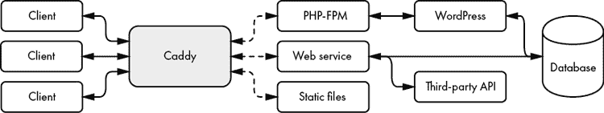

# 第十章：Caddy：一个现代化的 Web 服务器


第九章重点介绍了 Go 标准库中可用于构建 Web 服务的基础模块。你学习了如何通过使用处理器、中间件和复用器，以相对较少的代码创建一个简单的 Web 服务器。虽然仅凭这些工具你可以构建一个功能强大的 Web 服务器，但从头开始编写自己的服务器可能并不是最快捷的方法。添加日志记录、指标、认证、访问控制和加密等功能，举几个例子，这些可能会让人感到困难且难以实现正确。相反，你可能会觉得使用现有的、全面的 Web 服务器来托管你的 Web 服务会更方便。

本章将介绍 Caddy Web 服务器，并展示如何将精力集中在编写 Web 服务上，而依赖 Caddy 来托管你的应用程序。你将快速启动 Caddy 并深入了解其实时配置 API。接着，你将学习如何通过使用自定义模块和配置适配器来扩展 Caddy 的功能。然后，你将使用 Caddy 来托管应用程序的静态文件并代理请求到你的 Web 服务。最后，你将了解 Caddy 的自动 TLS 支持，通过使用 Let’s Encrypt 提供的免费证书和自动化密钥管理。

阅读完本章后，你应该能够自如地选择适合你的 Web 应用程序的最佳解决方案：要么是一个基于`net/http`的简单 Web 服务器，要么是像 Caddy 这样的全面解决方案。

## 什么是 Caddy？

*Caddy*是一个现代化的 Web 服务器，专注于安全性、性能和易用性。作为其标志性特性之一，它提供了自动化 TLS 证书管理，使你能够轻松实现 HTTPS。Caddy 还利用 Go 的并发原语来处理大量 Web 流量。它是少数几个提供企业级支持的开源项目之一。

### Let’s Encrypt 集成

*Let’s Encrypt*是一个非营利性的证书颁发机构，免费为公众提供数字证书，方便进行 HTTPS 通信。Let’s Encrypt 的证书在互联网上超过一半的网站上运行，并且被所有流行的 Web 浏览器信任。你可以通过使用 Let’s Encrypt 的自动颁发和续订协议，称为*自动证书管理环境（ACME）*，来为你的网站获取证书。

通常，获取证书需要三个步骤：证书请求、域名验证和证书颁发。首先，你需要向 Let’s Encrypt 请求你域名的证书。然后，Let’s Encrypt 确认你的域名，确保你是该域名的管理员。一旦 Let’s Encrypt 确保你是该域名的合法拥有者，它会为你颁发证书，供你的 Web 服务器用于 HTTPS 支持。每个证书有效期为 90 天，但你应该每 60 天续订一次，以防止服务中断。

Caddy 原生支持 ACME 协议，如果 Caddy 能正确推导出它托管的域名，它将自动请求、验证并安装 Let’s Encrypt 证书。我们将在第 237 页的“添加自动 HTTPS”部分讨论如何最佳地实现这一点。Caddy 还处理自动续期，消除了你跟踪证书过期日期的需要。

### Caddy 在这个方程中如何适应？

Caddy 的工作方式与其他流行的 web 服务器，如 NGINX 和 Apache 相似。它最适合部署在网络的边缘，位于 web 客户端和 web 服务之间，如图 10-1 所示。



图 10-1：Caddy 反向代理客户端请求到 web 服务

Caddy 可以提供静态文件服务，并在客户端和后端服务之间转发请求，这个过程称为 *反向代理*。在这个例子中，你可以看到 Caddy 通过 PHP 的 FastCGI 进程管理器（PHP-FPM）、静态文件和基于 Go 的 web 服务提供 WordPress 博客服务。我们将在本章后面复制一个类似的设置，但不包括 WordPress 博客。

Caddy 通过抽象 web 服务与客户端之间的关系，类似于我们在代码中使用抽象的方式。如果你使用 Caddy 的自动 TLS、静态文件服务器、数据压缩、访问控制和日志记录功能，你就不需要在每个 web 服务中添加这些功能。此外，使用 Caddy 还有一个好处，那就是能够将你的网络拓扑从客户端中抽象出来。随着服务的流行增加，web 服务的容量开始对客户端产生负面影响，你可以将 web 服务添加到 Caddy 中，并指示 Caddy 在它们之间平衡负载，而不会对客户端造成中断。

## 获取 Caddy

在本章中，我们将使用 Caddy 的版本 2。你有几种安装选项，本节将进行说明。

### 下载 Caddy

你可以通过使用 Caddy 团队构建的静态二进制文件来安装 Caddy。这个二进制文件可以通过[`caddyserver.com/`](https://caddyserver.com/)上的下载链接获得。*。

Caddy 还可以作为 Docker 镜像、DigitalOcean 虚拟机、Debian 衍生版的高级包管理工具（APT）源以及 Fedora 的 Copr 构建系统中的工具来使用，适用于 Fedora、CentOS 或 Red Hat Enterprise Linux。你可以在[`caddyserver.com/docs/download`](https://caddyserver.com/docs/download)的安装文档中找到详细信息。

### 从源代码构建 Caddy

如果你找不到适合你操作系统和架构的静态二进制文件，或者你希望定制 Caddy，你也可以从源代码编译 Caddy。

Caddy 强烈依赖 Go 对模块的支持。因此，在运行以下命令之前，你需要至少使用 Go 1.14：

```
$ **git clone "https://github.com/caddyserver/caddy.git"**
Cloning into 'caddy'...
$ **cd caddy/cmd/caddy**
$ **go build**
```

克隆 Caddy Git 仓库并切换到 *caddy/cmd/caddy* 子目录，在这里你会找到 `main` 包。运行 `go build` 在当前目录为你的操作系统和架构创建一个名为 *caddy* 的二进制文件。为了简化命令，本章其余部分假设 *caddy* 二进制文件已添加到你的 `PATH` 中。

在这个子目录中，注意 *main.go* 文件。你将在本章稍后学习如何通过添加模块来自定义 Caddy 时再次查看它。

## 运行和配置 Caddy

为了配置，Caddy 在 TCP 2019 端口上暴露了一个管理端点，通过这个端点，你可以实时与 Caddy 的配置进行交互。你可以通过向该端点发布 JSON 来配置 Caddy，也可以通过 `GET` 请求读取配置。Caddy 的完整 JSON API 文档可以在 [`caddyserver.com/docs/json/`](https://caddyserver.com/docs/json/) 找到。

在你配置 Caddy 之前，你需要先启动它。运行此命令将 Caddy 作为后台进程启动：

```
$ **caddy start**
2006/01/02 15:04:05.000 INFO    admin   endpoint started
{"address": "tcp/localhost:2019", "enforce_origin": false,
"origins": ["localhost:2019", "[::1]:2019", "127.0.0.1:2019"]}
2006/01/02 15:04:05.000 INFO    serving initial configuration
Successfully started Caddy (pid=24587) - Caddy is running in the background
```

你会看到日志条目，显示管理员端点已启动，Caddy 正在使用初始配置。你还会看到日志条目在与管理员端点交互时打印到标准输出。

Caddy 的配置默认是空的。让我们发送有意义的配置数据到 Caddy。列表 10-1 使用 `curl` 命令将 JSON 发布到 Caddy 管理员端点上的 `load` 资源。

```
$ **curl localhost:2019/load \**
1 **-X POST -H "Content-Type: application/json" \** 
**-d '**
**{**
 **"apps": {**
 **"http": {**
 **"servers": {**
 **"hello": {**
 **"listen": ["localhost:2020"],**
       2 **"routes": [{**
 **"handle": [{**
           3 **"handler": "static_response",**
 **"body": "Hello, world!"**
 **}]**
 **}]**
 **}**
 **}**
 **}**
 **}**
**}'**
```

列表 10-1：将配置发布到 Caddy 的管理员端点

你向 Caddy 实例监听的 2019 端口的 `load` 资源发送一个包含 JSON 请求体的 `POST` 请求 1。顶级的 `apps` 命名空间列出了 Caddy 在运行时将加载的应用程序。在本例中，你告诉 Caddy 加载 `http` 应用程序。`http` 应用程序的配置由一个或多个服务器组成。此示例设置了一个名为 `hello` 的服务器，监听 localhost 的 2020 端口。你可以自由地为你的服务器命名。

由于 `listen` 值是一个地址数组，你可以配置该服务器监听多个套接字地址。Caddy 会将这些地址值传递给 `net.Listen`，就像你在第三章中所做的那样。你还可以选择指定一个端口范围，例如 *localhost:2020-2025*。Caddy 会识别你使用了一个范围，并正确地将该范围扩展为单独的套接字地址。Caddy 允许你通过在套接字地址前缀添加特定的网络类型来限制监听器。例如，*udp/localhost:2020* 告诉服务器绑定到 localhost 上的 UDP 2020 端口。斜杠不是地址的一部分，而是一个分隔符。如果你希望服务器绑定到 Unix 套接字 */tmp/caddy.sock*，可以指定地址 *unix//tmp/caddy.sock*。

`hello`服务器的`routes`值是一个路由数组，类似于前一章中的多路复用器，它规定了服务器如何处理传入的请求。如果某个路由匹配请求，Caddy 会将请求传递给`handle`数组中的每个处理器。由于`handle`是一个数组，你可以为每个路由指定多个处理器。Caddy 会将请求传递给每个后续处理器，方式就像你在前一章中将中间件连接起来一样。在这个例子中，你为所有请求指定了一个路由，并为这个路由添加了一个处理器。你使用的是内置的`static_response`处理器，它将在响应体中写入`body`的值（在这个例子中是`Hello, world!`）。

只要配置没有错误，Caddy 会立即开始使用新配置。让我们确认 Caddy 现在同时在管理端口 2019 和你的`hello`服务器端口 2020 上监听：

```
$ **lsof -Pi :2019-2025**
COMMAND   PID USER   FD   TYPE DEVICE SIZE/OFF NODE NAME
caddy   24587 user    3u  IPv4 811511      0t0  TCP localhost:2019 (LISTEN)
caddy   24587 user    9u  IPv4 915742      0t0  TCP localhost:2020 (LISTEN)
```

看起来不错。这个命令在 Windows 上无法使用。相反，你可以通过在管理员命令提示符下运行`netstat -b`命令，查看类似的输出。现在，你可以通过发送`GET`请求来请求 Caddy 的配置：

```
$ **curl localhost:2019/config/**
{"apps":{"http":{"servers":{"hello":{"listen":["localhost:2020"],
"routes":[{"handle":[{"body":"Hello, world!","handler":"static_response"}]}]}}}}}
```

Caddy 在响应体中返回其 JSON 格式的配置。请注意，你需要在`/config/`资源后写上斜杠，因为`/config/`是 Caddy 暴露其配置的资源前缀。你是在请求所有位于`/config/`前缀下的资源。如果你不小心省略了尾部斜杠，Caddy 会认为你在请求名为`/config`的绝对资源，但该资源在 Caddy 的管理 API 上并不存在（端口 2019）。

Caddy 支持*配置遍历*。配置遍历允许你通过将配置数据中的每个 JSON 键视为资源地址，来请求配置的一个子集。例如，你可以通过发送一个`GET`请求来请求我们示例配置中`hello`服务器的`listen`值，方式如下：

```
$ **curl localhost:2019/config/apps/http/servers/hello/listen**
["localhost:2020"]
```

Caddy 返回一个包含*localhost:2020*的 JSON 数组，正如你所期望的那样。让我们向这个套接字地址发送一个`GET`请求：

```
$ **curl localhost:2020**
Hello, world!
```

你看到从`static_response`处理器返回的`Hello, world!`字符串。

### 实时修改 Caddy 的配置

你可以使用第八章中学到的其他 HTTP 方法来修改服务器的配置。只要 Caddy 能解析你发送的 JSON，任何修改都会立即生效。如果 Caddy 无法解析 JSON，或者新配置中存在基础错误，Caddy 会记录错误并解释出错的原因，继续使用现有配置。

假设你想让你的`hello`服务器也监听 2021 端口。你可以通过发送一个`POST`请求来附加另一个`listen`值，并立即检查修改是否生效：

```
$ **curl localhost:2019/config/apps/http/servers/hello/listen \**
**-X POST -H "Content-Type: application/json" -d '"localhost:2021"'**
$ **lsof -Pi :2019-2025**
COMMAND   PID USER   FD   TYPE  DEVICE SIZE/OFF NODE NAME
caddy   24587 user    3u  IPv4  811511      0t0  TCP localhost:2019 (LISTEN)
caddy   24587 user    9u  IPv4  915742      0t0  TCP localhost:2020 (LISTEN)
1 caddy   24587 user   11u  IPv4 1148212      0t0  TCP localhost:2021 (LISTEN)
```

你可以看到，除了 2019 和 2020 端口，Caddy 现在还在监听 2021 端口。

假设你想替换监听地址并改用范围。在这种情况下，你可以发送一个`PATCH`请求，包含你希望 Caddy 使用的新`listen`数组值：

```
$ **curl localhost:2019/config/apps/http/servers/hello/listen \**
**-X PATCH -H "Content-Type: application/json" -d '["localhost:2020-2025"]'**
$ **lsof -Pi :2019-2025**
COMMAND   PID USER   FD   TYPE  DEVICE SIZE/OFF NODE NAME
caddy   24587 user    3u  IPv4  811511      0t0  TCP localhost:2019 (LISTEN)
1 caddy   24587 user    9u  IPv4  915742      0t0  TCP localhost:2020 (LISTEN)
caddy   24587 user   10u  IPv4 1149557      0t0  TCP localhost:2021 (LISTEN)
caddy   24587 user   11u  IPv4 1166333      0t0  TCP localhost:2022 (LISTEN)
caddy   24587 user   12u  IPv4 1169409      0t0  TCP localhost:2023 (LISTEN)
caddy   24587 user   13u  IPv4 1169413      0t0  TCP localhost:2024 (LISTEN)
2 caddy   24587 user   14u  IPv4 1169417      0t0  TCP localhost:2025 (LISTEN)
```

除了管理员端口 2019，Caddy 现在还在端口 2020 至 2025 之间监听。

尽管你可能不会经常需要在运行时更改 Caddy 的配置，但它是开发中一个非常有用的功能，因为它允许你快速启动一个新服务器来添加功能。让我们在 Caddy 运行时添加一个新服务器。你将为这个新服务器命名为`test`，并将其配置为监听 2030 端口。列表 10-2 在实时中将新的`test`服务器添加到 Caddy。

```
$ **curl localhost:2019/config/apps/http/servers/test \**
**-X POST -H "Content-Type: application/json" \**
**-d '{**
 **"listen": ["localhost:2030"],**
 **"routes": [{**
 **"handle": [{**
 **"handler": "static_response",**
 **"body": "Welcome to my temporary test server."**
 **}]**
 **}]**
**}'**
```

列表 10-2：实时向 Caddy 添加新服务器

新服务器的名称`test`是你通过`POST`请求的资源的一部分。如果你在列表 10-1 的原始配置中定义了这个服务器，你可以把`test`看作是键，请求正文中的 JSON 看作是值。此时，Caddy 有两个服务器：`hello`监听 2020 至 2025 端口，`test`监听 2030 端口。要确认 Caddy 正在服务`test`，你可以检查 2030 端口上的新端点：

```
$ **curl localhost:2030**
Welcome to my temporary test server.
```

`static_response`处理器正确地响应了预期的消息。如果你想移除`test`服务器，只需发出一个`DELETE`请求：

```
$ **curl localhost:2019/config/apps/http/servers/test -X DELETE**
```

在这里，你再次在资源中指定了`test`服务器。Caddy 不再在 localhost 的 2030 端口上监听，且`test`服务器不再存在。你能够启动一个新的服务器来处理完全不同的请求，而不会中断`hello`服务器的功能。实时更改配置为你打开了更多的可能性。你是否希望服务器或路由仅在某些时间段内可访问？没问题。你是否希望临时重定向流量，而无需重新启动整个 Web 服务器，避免中断现有 Web 流量？当然，去做吧。

### 将配置存储在文件中

我们通常会在启动过程中向 Caddy 提供配置。将列表 10-1 中的 JSON 配置写入名为*caddy.json*的文件。然后使用以下命令启动 Caddy：

```
$ **caddy start --config caddy.json**
Successfully started Caddy (pid=46112) - Caddy is running in the background
$ **curl localhost:2019/config/**
{"apps":{"http":{"servers":{"hello":{"listen":["localhost:2020"],
"routes":[{"handle":[{"body":"Hello, world!","handler":"static_response"}]}]}}}}}
```

Caddy 像列表 10-1 中那样在后台启动——但这次，它在初始化期间从*caddy.json*文件中加载配置。

## 通过模块和适配器扩展 Caddy

Caddy 采用模块化架构来组织其功能。这种模块化方法允许你通过编写自己的模块和配置适配器来扩展 Caddy 的功能。在本节中，我们将介绍编写一个配置适配器的过程，该适配器将允许你将 Caddy 的配置存储在 Tom's Obvious Minimal Language（TOML）文件中。我们还将在适当的 Caddy 模块中复制前一章的`restrict_prefix`中间件。

### 编写配置适配器

虽然 JSON 是一种非常适合配置文件的格式，但它不像其他格式那样适合人类阅读。JSON 不支持注释和多行字符串，而这两者恰恰是让配置文件更易于人类阅读的特性。Caddy 支持使用 *配置适配器*，将一种格式（如 TOML）适配为 Caddy 的本地 JSON 格式。TOML 是一种易于人类阅读的配置文件格式，支持注释和多行字符串。你可以在[`github.com/toml-lang/toml/tree/v0.5.0/`](https://github.com/toml-lang/toml/tree/v0.5.0/)找到更多细节。

Caddy 版本 1 支持一种名为 *Caddyfile* 的自定义配置文件格式，按照约定，配置文件也通常使用这个名字。如果你希望在 Caddy v2 中使用 Caddyfile，必须依赖配置适配器，以便 Caddy 可以读取它。当你指定一个以 *Caddyfile* 开头的文件名时，Caddy 足够聪明，知道需要使用 `caddyfile` 适配器。但如果你想从命令行指定适配器，你需要明确告诉 Caddy 使用哪个适配器：

```
$ **caddy start --config Caddyfile --adapter caddyfile**
```

`adapter` 标志告诉 Caddy 应该使用哪个适配器。Caddy 会调用适配器将配置文件适配成 JSON 格式，然后像处理原本以 JSON 格式提供的配置一样，解析适配器返回的 JSON。

但 Caddy 并没有附带一个官方的 TOML 配置适配器，所以让我们尝试编写一个。你需要先为 TOML 配置适配器创建一个 Go 模块：

```
$ **mkdir caddy-toml-adapter**
$ **cd caddy-toml-adapter**
1 $ **go mod init github.com/awoodbeck/caddy-toml-adapter**
go: creating new go.mod: module github.com/awoodbeck/caddy-toml-adapter
```

你应该使用一个完全限定的模块名 1，与此处使用的不同。我是在 GitHub 上通过我的 *awoodbeck* 账户创建了这个模块。你的模块的完全限定名称将根据其托管的位置和账户不同而有所不同。

现在你已经创建了一个模块，可以开始编写代码了。在当前目录下创建一个名为 *toml.go* 的文件，并将代码添加到清单 10-3 中。

```
package tomladapter

import (
    "encoding/json"

    "github.com/caddyserver/caddy/v2/caddyconfig"
    "github.com/pelletier/go-toml"
)

func init() {
    caddyconfig.RegisterAdapter(1"toml", 2Adapter{})
}

// Adapter converts a TOML Caddy configuration to JSON.
type Adapter struct{}

// Adapt the TOML body to JSON.
func (a Adapter) Adapt(body []byte, _ map[string]interface{}) (
    []byte, []caddyconfig.Warning, error) {
    tree, err := 3toml.LoadBytes(body)
    if err != nil {
        return nil, nil, err
    }

    b, err := json.Marshal(4tree.ToMap())

    return b, nil, err
}
```

清单 10-3：创建一个 TOML 配置适配器并将其注册到 Caddy

你使用 Thomas Pelletier 的 *go-toml* 库来解析配置文件内容 3。这可以节省大量的代码。然后你将解析后的 TOML 转换成一个映射 4，并将这个映射序列化为 JSON。

最后一步是将你的配置适配器注册到 Caddy。为此，你需要在 `init` 函数中调用 `caddyconfig.RegisterAdapter` 并传入适配器的类型 1 和一个实现 `caddyconfig.Adapter` 接口的 `Adapter` 对象 2。当你从 Caddy 的 *main.go* 文件中导入这个模块时，配置适配器会自动注册到 Caddy 中，为解析 TOML 配置文件提供支持。在第 231 页的“将模块注入 Caddy”部分，你将看到如何从 Caddy 中导入这个模块的具体示例。

现在你已经创建了 *toml.go* 文件，可以整理一下模块：

```
$ **go mod tidy**
go: finding module for package github.com/caddyserver/caddy/v2/caddyconfig
go: found github.com/caddyserver/caddy/v2/caddyconfig in
github.com/caddyserver/caddy/v2 v2.0.0
```

该命令将 Caddy 依赖项添加到*go.mod*文件中。剩下的工作就是像这个示例一样将你的模块发布到 GitHub，或者其他支持`go get`的合适版本控制系统。

### 编写 Restrict Prefix 中间件模块

第九章介绍了中间件的概念，这是一种设计模式，它允许你的代码在服务器接收请求时操作请求和响应，并执行辅助任务，例如记录请求详情。让我们探讨如何在 Caddy 中使用中间件。

在 Go 中，中间件是一个接受`http.Handler`并返回`http.Handler`的函数：

```
func(http.Handler) http.Handler
```

`http.Handler`描述了一个具有`ServeHTTP`方法的对象，该方法接受`http.RequestWriter`和`http.Request`：

```
type Handler interface {
    ServeHTTP(http.ResponseWriter, *http.Request)
}
```

处理器从请求中读取并写入响应。假设`myHandler`是一个实现了`http.Handler`接口的对象，并且`middleware1`、`middleware2`和`middleware3`都接受一个`http.Handler`并返回一个`http.Handler`，你可以在示例 10-4 中将中间件函数应用到`myHandler`上。

```
h := middleware1(middleware2(middleware3(myHandler)))
```

示例 10-4：多个中间件函数包装一个处理器

你可以用你在前一章中编写的`RestrictPrefix`中间件替换任何一个中间件函数，因为它是一个接受`http.Handler`并返回`http.Handler`的函数。

不幸的是，Caddy 的中间件并未使用这种设计模式，因此不能使用`RestrictPrefix`。Caddy 包含了处理器和中间件的接口，这与`net/http`不同，后者仅描述处理器。Caddy 中与`http.Handler`接口等效的是`caddyhttp.Handler`：

```
type Handler interface {
    ServeHTTP(http.ResponseWriter, *http.Request) error
}
```

`caddyhttp.Handler`和`http.Handler`之间唯一的区别是前者的`ServeHTTP`方法返回一个`error`接口。

Caddy 中间件是一种特殊类型的处理器，它实现了`caddyhttp.MiddlewareHandler`接口：

```
type MiddlewareHandler interface {
    ServeHTTP(http.ResponseWriter, *http.Request, Handler) error
}
```

与`caddyhttp.Handler`类似，Caddy 的中间件同时接受`http.ResponseWriter`和`http.Request`，并返回一个`error`接口。但它接受一个额外的参数：`caddyhttp.Handler`，这个处理器位于中间件之后，类似于`myHandler`位于`middleware3`之后的方式，在示例 10-4 中。Caddy 中间件并不接受一个`http.Handler`并返回一个`http.Handler`，而是期望它充当处理器，并且在中间件处理完请求和响应之后，可以访问`caddyhttp.Handler`。

让我们创建一个新的 Caddy 模块，复制你的`RestrictPrefix`中间件的功能：

```
$ **mkdir caddy-restrict-prefix**
$ **cd caddy-restrict-prefix**
$ **go mod init github.com/awoodbeck/caddy-restrict-prefix**
go: creating new go.mod: module github.com/awoodbeck/caddy-restrict-prefix
```

如前所述，你的完全限定模块名会与你的不同。创建一个名为*restrict_prefix.go*的新文件，并将示例 10-5 中的代码添加到该文件中。

```
package restrictprefix

import (
    "fmt"
    "net/http"
    "strings"

    "github.com/caddyserver/caddy/v2"
    "github.com/caddyserver/caddy/v2/modules/caddyhttp"
    "go.uber.org/zap"
)

func init() {
  1caddy.RegisterModule(RestrictPrefix{})
}

// RestrictPrefix is middleware that restricts requests where any portion
// of the URI matches a given prefix.
type RestrictPrefix struct {
  2Prefix string `json:"prefix,omitempty"`
  3logger *zap.Logger
}

// CaddyModule returns the Caddy module information.
func (RestrictPrefix) 4CaddyModule() caddy.ModuleInfo {
    return caddy.ModuleInfo{
      5ID:  "http.handlers.restrict_prefix",
      6New: func() caddy.Module { return new(RestrictPrefix) },
    }
}
```

示例 10-5：定义并注册一个新的 Caddy 模块

来自上一章的`RestrictPrefix`中间件实现预期 URL 路径的前缀是一个字符串。在这里，你将前缀存储在`RestrictPrefix`结构体中，并为其分配一个结构体标签，以使用`json.Unmarshal`行为，将传入的键与结构体标签进行匹配。结构体标签告诉`json.Unmarshal`哪个 JSON 键对应此字段。在这个示例中，你告诉`json.Unmarshal`应该取 JSON 配置中与`prefix`键相关联的值，并将其赋给结构体的`Prefix`字段。`RestrictPrefix`结构体还有一个`logger`字段，3 这样你就可以根据需要记录事件。

你的模块需要在初始化时向 Caddy 注册 1。`caddy.RegisterModule`函数接受任何实现了`caddy.Module`接口的对象。为此，你添加了`CaddyModule`方法 4 来返回有关你的模块的信息给 Caddy。Caddy 要求每个模块都有一个 ID5。由于你正在创建一个 HTTP 中间件处理程序，你将使用 ID`http.handler.restrict_prefix`，其中`restrict_prefix`是你模块的唯一名称。Caddy 还期望一个函数 6，用来创建你模块的新实例。

现在你可以将模块注册到 Caddy，让我们添加更多功能，以便你可以从 Caddy 检索日志记录器并验证模块的设置。列表 10-6 接着我们之前的内容。

```
`--snip--`

// Provision a Zap logger to RestrictPrefix.
func (p *RestrictPrefix) 1Provision(ctx caddy.Context) error {
    p.logger = 2ctx.Logger(p)
    return nil
}

// Validate the prefix from the module's configuration, setting the
// default prefix "." if necessary.
func (p *RestrictPrefix) 3Validate() error {
    if p.Prefix == "" {
        p.Prefix = "."
    }
    return nil
}
```

列表 10-6：实现各种 Caddy 接口

你向结构体中添加了`Provision`方法 1。Caddy 会识别到你的模块实现了`caddy.Provisioner`接口，并调用该方法。然后，你可以从给定的`caddy.Context`2 中获取日志记录器。同样，Caddy 会调用你模块的`Validate`方法 3，因为它实现了`caddy.Validator`接口。你可以使用此方法确保所有必需的设置都已从配置中反序列化到模块中。如果出现问题，你可以返回错误，Caddy 会代表你发出警告。在这个示例中，你使用此方法来设置默认的前缀，如果配置中没有提供前缀的话。

你快完成了。最后一步是实现中间件本身。列表 10-7 通过添加对`caddyhttp.MiddlewareHandler`接口的支持，完成了你的模块实现。

```
`--snip--`

// ServeHTTP implements the caddyhttp.MiddlewareHandler interface.
func (p RestrictPrefix) ServeHTTP(w http.ResponseWriter, r *http.Request,
    next caddyhttp.Handler) error {
 1 for _, part := range strings.Split(r.URL.Path, "/") {
        if strings.HasPrefix(part, p.Prefix) {
          2http.Error(w, "Not Found", http.StatusNotFound)
            if p.logger != nil {
              3p.logger.Debug(fmt.Sprintf(
                    "restricted prefix: %q in %s", part, r.URL.Path))
 }
            return nil
        }
    }
    return 4next.ServeHTTP(w, r)
}

var (
 5 _ caddy.Provisioner           = (*RestrictPrefix)(nil)
    _ caddy.Validator             = (*RestrictPrefix)(nil)
    _ caddyhttp.MiddlewareHandler = (*RestrictPrefix)(nil)
)
```

列表 10-7：实现`MiddlewareHandler`接口

逻辑几乎与上一章的中间件完全相同。你遍历 URL 路径组件，检查每个路径是否有前缀 1。如果找到匹配项，你会返回 404 Not Found 状态 2，并记录该事件以便调试 3。如果一切检查通过，你将控制权传递给链中的下一个处理程序 4。

做好防范接口变更的措施是一种好习惯，明确确保你的模块实现了预期的接口 5。如果将来其中一个接口发生变化（例如，添加了新方法），这些接口保护将导致编译失败，提前警告你需要调整代码。

最后的步骤是整理你的模块依赖并发布它：

```
$ **go mod tidy**
go: finding module for package github.com/caddyserver/caddy/v2
go: finding module for package github.com/caddyserver/caddy/v2/modules/caddyhttp
go: finding module for package go.uber.org/zap
go: found github.com/caddyserver/caddy/v2 in github.com/caddyserver/caddy/v2 v2.0.0
go: found go.uber.org/zap in go.uber.org/zap v1.15.0
go: downloading github.com/golang/mock v1.4.1
go: downloading github.com/onsi/gomega v1.8.1
go: downloading github.com/smallstep/assert v0.0.0-20200103212524-b99dc1097b15
go: downloading github.com/onsi/ginkgo v1.11.0
go: downloading github.com/imdario/mergo v0.3.7
go: downloading github.com/chzyer/test v0.0.0-20180213035817-a1ea475d72b1
go: downloading github.com/golang/glog v0.0.0-20160126235308-23def4e6c14b
go: downloading github.com/alangpierce/go-forceexport v0.0.0-20160317203124-
8f1d6941cd75
go: downloading github.com/chzyer/logex v1.1.10
go: downloading github.com/hpcloud/tail v1.0.0
go: downloading gopkg.in/tomb.v1 v1.0.0-20141024135613-dd632973f1e7
go: downloading gopkg.in/fsnotify.v1 v1.4.7
```

将你的模块发布到 GitHub 或类似的版本控制系统，以便通过 `go get` 使用。

### 将你的模块注入 Caddy

你编写的模块和适配器都是自注册的。要在 Caddy 中包含它们的功能，你需要在构建时导入它们。为此，你需要从源代码编译 Caddy。首先为你的构建创建一个目录：

```
$ **mkdir caddy**
$ **cd caddy**
```

从源代码构建 Caddy 需要一些基础代码，你将把你的模块包含在其中。你的模块会在导入时自动注册到 Caddy 中。创建一个新的文件，命名为 *main.go*，并将 清单 10-8 中的代码添加到其中。

```
package main

import (
 1 cmd "github.com/caddyserver/caddy/v2/cmd"
 2 _ "github.com/caddyserver/caddy/v2/modules/standard"

    // Injecting custom modules into Caddy
 3 _ "github.com/awoodbeck/caddy-restrict-prefix"
 4 _ "github.com/awoodbeck/caddy-toml-adapter"
)

func main() {
    cmd.Main()
}
```

清单 10-8：将自定义模块注入 Caddy

首先，你将 Caddy 命令模块 1 导入到构建中。这个模块包含启动 Caddy 服务器的 `Main` 函数。然后，你导入 Caddy 二进制分发包中找到的标准模块 2。最后，你包含了你的限制前缀模块 3 和 TOML 配置适配器 4。

现在剩下的工作就是初始化 `caddy` 模块并进行构建：

```
$ **go mod init caddy**
$ **go build**
```

此时，你应该在当前目录中有一个名为 `caddy` 的二进制文件。你可以通过查看 `caddy` 二进制文件中的模块列表来验证它是否包含你的自定义导入。以下命令适用于 Linux 和 macOS：

```
$ **./caddy list-modules | grep "toml\|restrict_prefix"**
caddy.adapters.toml
http.handlers.restrict_prefix
```

对于我的 Windows 用户，改为运行以下命令：

```
> **caddy list-modules | findstr "toml restrict_prefix"**
caddy.adapters.toml
http.handlers.restrict_prefix
```

你构建的 `caddy` 二进制文件可以从 TOML 文件中读取配置，并拒绝客户端访问包含给定前缀的路径中的资源。

## 反向代理请求到后台 Web 服务

现在，你已经具备了在 Caddy 中创建有意义功能所需的所有构建块。让我们通过配置 Caddy，将其设置为反向代理请求到后台 Web 服务，并代表后台 Web 服务提供静态文件，从而将你学到的所有知识结合起来。你将在 Caddy 中创建两个端点。第一个端点只会从 Caddy 的文件服务器提供静态内容，展示 Caddy 的静态文件服务功能。第二个端点会反向代理请求到后台 Web 服务。这个后台服务将向客户端发送 HTML，并提示客户端从 Caddy 获取静态文件，这将展示你的 Web 服务如何依赖 Caddy 来代表它们提供静态内容。

在开始构建之前，你需要设置正确的目录结构。如果你在跟随教程，你现在应该在 *caddy* 目录下，该目录中包含从 清单 10-8 中的代码构建的 `caddy` 二进制文件。创建两个子目录，分别为 *files* 和 *backend*：

```
$ **mkdir files backend**
```

你可以从 [`github.com/awoodbeck/gnp/tree/master/ch10/files/`](https://github.com/awoodbeck/gnp/tree/master/ch10/files/) 获取 *files* 子目录的内容。*backend* 子目录将存储在下一部分创建的简单后端服务。

### 创建一个简单的后端 Web 服务

你需要一个后端 Web 服务，以便 Caddy 将请求反向代理到它，如 图 10-1 所示。该服务将以 HTML 文档响应所有请求，并包含 Caddy 代表该服务提供的静态文件。

清单 10-9 是后端 Web 服务的初始代码。

```
package main

import (
    "flag"
    "fmt"
    "log"
    "net/http"
    "os"
    "os/signal"
    "time"
)

var addr = flag.String("listen", 1"localhost:8080", "listen address")

func main() {
    flag.Parse()

    c := make(chan os.Signal, 1)
    signal.Notify(c, os.Interrupt)

    err := 2run(*addr, c)
    if err != nil {
        log.Fatal(err)
    }

    log.Println("Server stopped")
}
```

清单 10-9：创建后端服务 (*backend/main.go*)

这段代码应该很熟悉，因为它是你在上一章中写的代码的简化版。你正在设置一个监听本地主机 8080 端口的 Web 服务 1。Caddy 将把请求导向这个套接字地址。清单 10-10 实现了 `run` 函数 2。

```
`--snip--`

func run(addr string, c chan os.Signal) error {
    mux := http.NewServeMux()
    mux.Handle("/",
        http.HandlerFunc(func(w http.ResponseWriter, r *http.Request) {
            clientAddr := r.Header.Get(1"X-Forwarded-For")
            log.Printf("%s -> %s -> %s", clientAddr, r.RemoteAddr, r.URL)
            _, _ = w.Write(2index)
        }),
    )

    srv := &http.Server{
        Addr:              addr,
        Handler:           mux,
        IdleTimeout:       time.Minute,
        ReadHeaderTimeout: 30 * time.Second,
    }

    go func() {
        for {
            if <-c == os.Interrupt {
                _ = srv.Close()
                return
            }
        }
    }()

    fmt.Printf("Listening on %s ...\n", srv.Addr)
    err := srv.ListenAndServe()

 if err == http.ErrServerClosed {
        err = nil
    }

    return err
}
```

清单 10-10：后端服务的主要逻辑 (*backend/main.go*)

Web 服务接收来自 Caddy 的所有请求，无论哪个客户端发起了请求。同样，它将所有响应发送回 Caddy，后者再将响应路由到正确的客户端。方便的是，Caddy 会在每个请求中添加一个 `X-Forwarded-For` 头 1，包含发起客户端的 IP 地址。虽然你不会做任何处理，仅仅记录此信息，但你的后端服务可以利用这个 IP 地址来区分客户端请求。例如，服务可以基于客户端 IP 地址拒绝请求。

处理程序将一个字节切片 2 写入响应，这个字节切片包含在 清单 10-11 中定义的 HTML。

```
`--snip--`

var index = []byte(`<!DOCTYPE html>
<html lang="en">
<head>
    <meta charset="UTF-8">
    <title>Caddy Backend Test</title>
    <link href=1"/style.css" rel="stylesheet">
</head>
<body>
    <p></p>
</body>
</html>`)
```

清单 10-11：由后端服务提供的索引 HTML (*backend/main.go*)

`/style.css`1 和 `/hiking.svg`2 资源没有包含完整的 URL（例如 [`localhost:2020/style.css`](http://localhost:2020/style.css)），因为后端 Web 服务不了解 Caddy，也不知道客户端如何访问 Caddy。当你在资源地址中省略方案、主机名和端口号时，客户端的 Web 浏览器应该在 HTML 中遇到 `/style.css` 并将其所使用的方案、主机名和端口号附加到请求中，然后将请求发送给 Caddy。为了使这一切正常工作，你需要在下一部分配置 Caddy，将某些请求转发到后端 Web 服务，其余的请求则由 Caddy 提供静态文件。

### 配置 Caddy

正如本章前面提到的，Caddy 使用 JSON 作为其原生配置格式。你当然可以使用 JSON 来编写配置，但你已经编写了一个完美的配置适配器，允许你使用 TOML，因此你将实现 TOML 配置。

您希望配置 Caddy 将请求反向代理到您的后端 Web 服务，并从 *files* 子目录提供静态文件服务。您需要两个路由：一个指向后端 Web 服务，另一个用于静态文件。让我们从在名为 *caddy.toml* 的文件中定义服务器配置开始（列表 10-12）。

```
1 [apps.http.servers.test_server]
listen = [
    'localhost:2020',
]
```

列表 10-12: Caddy 测试服务器配置（*caddy.toml*）

您的 TOML 适配器将 TOML 直接转换为 JSON。因此，您需要确保使用的是 Caddy 所期望的相同命名空间。您的服务器的命名空间是 `apps.http.servers.test_server`1。（为了简便，接下来的讨论中，您可以简称此命名空间为 `test_server`。）它在本地主机的 2020 端口监听传入的连接。

### 将反向代理添加到您的服务

Caddy 包含一个强大的反向代理处理器，可以快速将传入的请求转发到您的后端 Web 服务。就像在前一章中的服务器实现一样，Caddy 会将传入请求与路由匹配，然后将请求传递给相关的处理器。

列表 10-13 向 *caddy.toml* 文件中添加了一个路由和一个反向代理处理器。

```
`--snip--`

1 [[apps.http.servers.test_server.routes]]
2 [[apps.http.servers.test_server.routes.match]]
path = [
    '/backend',
 3 '/backend/*',
]
4 [[apps.http.servers.test_server.routes.handle]]
handler = 'reverse_proxy'
5 [[apps.http.servers.test_server.routes.handle.upstreams]]
dial = 6'localhost:8080'
```

列表 10-13: 向后端服务添加反向代理（*caddy.toml*）

`test_server` 配置包括一个 `routes` 数组 1，每个数组中的路由可以有零个或多个匹配器 2。*匹配器* 是一个特殊模块，它允许您为传入请求指定匹配条件，就像前一章中讨论的 `http.ServeMux.Handle` 方法的模式匹配一样。Caddy 包括了允许您考虑请求的各个部分的匹配器模块。

对于这个路由，您添加了一个匹配器，它可以匹配任何请求的绝对路径为 */backend* 或任何以 */backend/* 开头的路径 3。*** 字符是一个通配符，告诉 Caddy 您希望匹配 */backend/* 前缀。例如，请求资源 */backend/this/is/a/test* 也会匹配。

路由可以有一个或多个处理器 4。在这里，您告诉 Caddy，您希望将所有匹配的请求发送到反向代理处理器。反向代理处理器需要知道将请求发送到哪里。您需要通过其 dial 属性指定一个上游条目 5，该属性设置为后端服务器的套接字地址 6。

### 提供静态文件

在前一章中，您依赖于`http.FileServer`为您提供静态文件服务。Caddy 提供了类似的功能，通过其 `file_server` 处理器。列表 10-14 向您的 *caddy.toml* 文件添加了第二个路由，用于提供静态文件服务。

```
`--snip--`

1 [[apps.http.servers.test_server.routes]]
2 [[apps.http.servers.test_server.routes.handle]]
handler = 'restrict_prefix'
prefix = '.'
3 [[apps.http.servers.test_server.routes.handle]]
handler = 'file_server'
root = 4'./files'
index_names = [
  5'index.html',
]
```

列表 10-14: 向默认路由添加静态文件服务（*caddy.toml*）

与在 Listing 10-13 中添加的路由不同，这个路由 1 不包含任何匹配器。因此，如果请求没有匹配之前的路由，Caddy 会将每个请求都发送到这个路由的处理器。换句话说，这个路由是你的默认路由，所以它在文件中的位置很重要。如果你将这个路由移到反向代理路由之前，所有请求都会匹配它，且没有请求会进入反向代理。每当你指定一个没有匹配器的路由时，确保把它放在路由数组的末尾，就像这里一样。

与前一章的文件服务器一样，你需要防止不小心服务带有点前缀的敏感文件。因此，你应将 `restrict_prefix` 中间件 2 包含到处理器数组中，放在 `file_server` 处理器 3 之前。你可以添加更多配置选项，以便提供 *files* 子目录 4 中的文件，并且当请求未指定文件时，返回 *index.html* 文件 5。

### 检查你的工作

一切就绪。启动 Caddy 并验证配置是否按预期工作。由于一些静态文件是图片，我建议你在 Caddy 运行时使用网页浏览器与其交互。

使用 *caddy.toml* 文件和 *toml* 适配器启动 Caddy：

```
$ **./caddy start --config caddy.toml --adapter toml**
```

在 Windows 上，命令如下所示：

```
> **caddy start --config caddy.toml --adapter toml**
```

现在，运行后台 web 服务：

```
$ **cd backend**
$ **go run backend.go**
Listening on localhost:8080 ...
```

打开你的网页浏览器并访问 [`localhost:2020/`](http://localhost:2020/)。Caddy 会将你的请求发送到文件服务器处理器，然后它会响应 *index.html* 文件，因为你没有在请求中指定特定文件。然后，浏览器会请求 Caddy 获取 *style.css* 和 *sage.svg* 文件，以完成页面的渲染。如果一切顺利，你现在应该看到一个智慧的登山獾。

现在，让我们测试反向代理到后台 web 服务。访问 [`localhost:2020/backend`](http://localhost:2020/backend)。这个请求与反向代理路由的匹配器相匹配，因此反向代理处理器应处理它，将请求发送到后台服务。后台 web 服务响应 HTML，指示你的浏览器从 Caddy 获取 *style.css* 和 *hiking.svg* 文件，文件服务器处理器会愉快地提供这些文件。你现在应该看到一个通过后台 web 服务生成的登山獾，使用的是从 Caddy 提供的静态文件。

如果你从本书的源码仓库复制了 *files* 子目录，它应该包含 *./files/.secret* 和 *./files/.dir/secret* 文件。你的中间件应阻止访问这两个文件。换句话说，如果你尝试请求 [`localhost:2020/files/.secret`](http://localhost:2020/files/.secret) 或 [`localhost:2020/files/.dir/secret`](http://localhost:2020/files/.dir/secret)，它们将返回 404 未找到状态。

### 添加自动 HTTPS

现在，让我们将 Caddy 的关键特性添加到你的 web 服务器中：自动 HTTPS。

我曾使用 Caddy 搭建过一个完整支持 HTTPS 的网站，使用所有现代 Web 浏览器信任的证书，整个过程只花了几分钟。此后，服务器一直稳定运行，每隔几个月 Caddy 会自动旋转 Let’s Encrypt 的密钥，我无需干预。这并不是说我不能在我自己的基于 Go 的 Web 服务器中复制这种功能；我只是认为我的时间更应该用来构建服务，而将 Web 服务交给 Caddy。如果 Caddy 缺少某些功能，我可以通过模块来添加。

当 Caddy 能够确定您配置的域名时，它会自动启用 TLS。本章中创建的 *caddy.toml* 配置文件没有提供足够的信息，让 Caddy 确定它正在为哪个域名提供服务。因此，Caddy 没有为您启用 HTTPS。您告诉 Caddy 绑定到 localhost，但这只告诉 Caddy 它正在监听什么，并没有告诉它正在为哪些域名提供服务。

启用自动 HTTPS 的最常见方法是向 Caddy 的某个路由添加主机匹配器。以下是一个匹配器示例：

```
[[apps.http.servers.server.routes.match]]
host = [
    'example.com',
]
```

这个主机匹配器提供了足够的信息，供 Caddy 确定它正在为 *example.com* 域名提供服务。如果 Caddy 尚未为 *example.com* 配置有效证书以启用 HTTPS，它将通过与 Let’s Encrypt 验证该域名并获取证书的过程。Caddy 会管理您的证书，并在必要时自动续期。

Caddy 的 `file-server` 子命令告诉 Caddy 您希望它仅通过 HTTP 提供文件服务。`file-server` 的 `--domain` 标志提供了足够的信息，供 Caddy 启用自动 HTTPS，使您能够通过 HTTPS 提供文件服务。

Caddy 的 `reverse-proxy` 子命令允许您将 Caddy 设置为仅反向代理模式，它会将所有传入请求转发到 `--to` 标志指定的套接字地址。如果您使用 `--from` 标志指定主机名，Caddy 会检索 TLS 证书并启用自动 HTTPS。

我鼓励您阅读更多关于 Caddy 在生产环境中自动启用 HTTPS 的内容，请访问 [`caddyserver.com/docs/automatic-https`](https://caddyserver.com/docs/automatic-https)。

## 您所学的内容

Caddy 是一款用 Go 语言编写的现代 Web 服务器，通过模块和配置适配器提供安全性、性能和可扩展性。Caddy 可以通过与 Let’s Encrypt（一个提供免费数字证书的非营利证书机构）的集成，自动启用 HTTPS。Caddy 和 Let’s Encrypt 配合使用，能够让您轻松搭建具有无缝 HTTPS 支持的 Web 服务器。

Caddy 使用 JSON 作为其原生配置格式，并在本地主机的 2019 端口上公开了一个 API，允许你发布 JSON 来更改其配置。配置更改会立即生效。但由于 JSON 并不是理想的配置格式，Caddy 采用了配置适配器。配置适配器将更适合配置的格式（如 TOML）转化为 JSON。如果你不想使用 JSON 作为 Caddy 配置，或者找不到符合你需求的配置适配器，你还可以像本章所示，自己编写一个适配器。

你还可以通过使用模块扩展 Caddy 的功能。本章将展示如何编写一个中间件模块，将其编译进 Caddy，配置模块，并使其有效运作。

最后，本章向你展示了如何将 Caddy 集成到你的网络架构中。你会经常将 Caddy 作为你网络中的第一个服务器，使用它接收客户端请求，然后将请求转发到最终目的地。在本章中，你配置了一个 Caddy 实例，将客户端请求反向代理到你的后端 Web 服务，并代表后端 Web 服务提供静态文件。因此，你保持了后端 Web 服务的简洁，并避免了它需要管理静态内容。你的后端 Web 服务可以使用 Caddy 提供 HTTPS 支持、缓存和文件服务。

现在你已经有了一些使用 Caddy 的经验，你应该能够判断，当你的 Web 服务由一个全面的 Web 服务器解决方案提供时，还是由一个相对简洁的 `net/http` Web 服务器实现提供时，效果更好。如果你打算将你的 Web 服务公开，使用像 Caddy 这样的成熟 Web 服务器作为应用程序的边缘服务器，将能节省出更多时间，让你将精力集中在后端 Web 服务的优化上。
