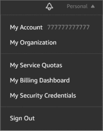
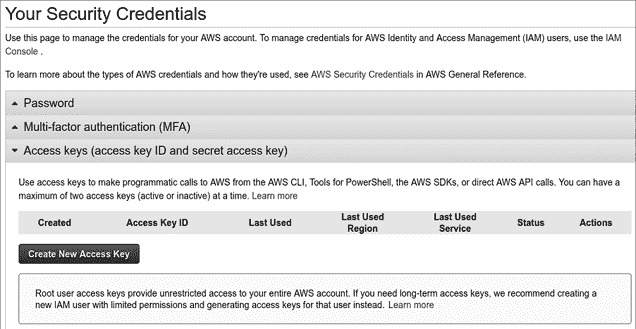
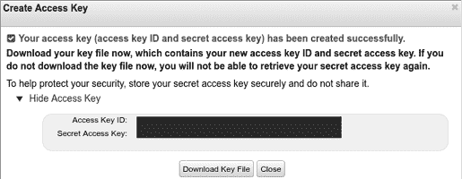

# 第十四章：迁移到云端


2006 年 8 月，Amazon Web Services (AWS)推出了 Elastic Compute Cloud（EC2），为公共云基础设施的普及做出了贡献。EC2 消除了通过互联网提供服务的障碍；你不再需要购买服务器和软件许可证、签署支持合同、租赁办公空间或雇佣 IT 专业人员来维护基础设施。相反，你按需支付 AWS 使用 EC2 实例的费用，允许你在 AWS 处理维护、冗余和标准合规等细节的同时，扩展你的业务。在接下来的几年里，Google 和 Microsoft 也推出了与 AWS 竞争的公共云服务。现在，三大云服务提供商都提供全面的服务，涵盖从分析到存储的所有内容。

本章的目标是为你提供 Amazon Web Services、Google Cloud 和 Microsoft Azure 的对比，让你能够一目了然地了解各自的不同。你将创建并部署一个应用程序，展示每个提供商的工具、认证和部署体验的差异。你的应用程序将遵循*平台即服务 (PaaS)* 模式，在云服务商的平台上创建并部署应用程序。具体来说，你将创建一个函数并将其部署到 AWS Lambda、Google Cloud Functions 和 Microsoft Azure Functions。我们将尽量使用命令行，以便保持对比的公平，并让你了解每个提供商的工具。

三大服务提供商都提供试用期，因此你不应产生任何费用。如果你已用完试用期，请在继续执行后续步骤时注意可能的费用。

你将创建一个简单的功能，获取最新 XKCD 漫画的 URL，或者选择获取前一篇漫画。这将演示如何从函数内检索数据，以满足客户端请求，并在执行之间持久化函数状态。

在本章结束时，你应该能够自如地编写应用程序、部署应用程序，并测试它以利用 AWS、Google Cloud 和 Microsoft Azure 的 PaaS 服务。如果你选择迁移到云平台，你应该更清楚地了解哪个提供商的工作流最适合你的使用案例。

## 打好基础

XKCD 网站提供一个 Real Simple Syndication (RSS)源，地址为[`xkcd.com/rss.xml`](https://xkcd.com/rss.xml)。正如文件扩展名所示，源使用 XML 格式。你可以使用 Go 的*encoding/xml*包来解析这个源。

在将可以获取最新 XKCD 漫画 URL 的功能部署到云端之前，你需要编写一些代码来解析 RSS 源。列表 14-1 创建了两种类型来解析该源。

```
package feed

import (
    "context"
    "encoding/xml"
    "fmt"
    "io/ioutil"
    "net/http"
)

type Item struct {
    Title     string `xml:"title"`
    URL       string `xml:"link"`
    Published string 1`xml:"pubDate"`
}

type RSS struct {
    Channel struct {
        Items []Item `xml:"item"`
    } `xml:"channel"`
    entityTag 2string
}
```

列表 14-1：表示 XKCD RSS 源的结构（*feed/rss.go*）

`RSS` 结构体表示 RSS 订阅源，而`Item` 结构体表示订阅源中的每个项（漫画）。与你在早期章节中使用的 Go 的*encoding/json*包一样，它的*encoding/xml*包可以使用结构体标签将 XML 标签映射到相应的结构体字段。例如，`Published`字段的标签指示*encoding/xml*包将其赋值为项的`pubDate`值。

做一个好的互联网邻居并跟踪订阅源的实体标签非常重要。Web 服务器通常为可能不发生变化的内容推导实体标签。客户端可以跟踪这些实体标签，并在以后的请求中提供它们。如果服务器确定请求的内容具有相同的实体标签，它可以避免返回整个负载，并返回 304 Not Modified 状态码，这样客户端就知道使用其缓存的副本。你将在示例 14-2 中使用这个值，在订阅源更改时有条件地更新`RSS` 结构体。

```
`--snip--`
func (r RSS) Items() []Item {
    items := 1make([]Item, len(r.Channel.Items))
    copy(items, r.Channel.Items)

    return items
}

func (r *RSS) ParseURL(ctx context.Context, u string) error {
    req, err := http.NewRequestWithContext(ctx, http.MethodGet, u, nil)
    if err != nil {
        return err
    }

    if r.entityTag != "" {
      2 req.Header.Add("ETag", r.entityTag)
    }

    resp, err := http.DefaultClient.Do(req)
    if err != nil {
        return err
    }

    switch resp.StatusCode {
    case 2http.StatusNotModified: // no-op
    case 3http.StatusOK:
        b, err := ioutil.ReadAll(resp.Body)
        if err != nil {
 return err
        }
        _ = resp.Body.Close()

        err = xml.Unmarshal(b, r)
        if err != nil {
            return err
        }

        r.entityTag = 4resp.Header.Get("ETag")
    default:
        return fmt.Errorf("unexpected status code: %v", resp.StatusCode)
    }

    return nil
}
```

示例 14-2：解析 XKCD RSS 订阅源并返回项的切片（*feed/rss.go*）

这里有三点需要注意。首先，`RSS` 结构体及其方法不适合并发使用。虽然这对于你的用例来说并不成问题，但最好还是了解这一点。第二，`Items` 方法返回`RSS` 结构体中项的切片，该切片在你的代码调用`ParseURL`方法填充`RSS` 结构体之前是空的。第三，`Items` 方法会复制`Items`切片，并返回该副本，以防止原始`Items`切片被破坏。这对于你的用例来说可能有点过度，但最好知道你返回的是一个可以被接收方修改的引用类型。如果接收方修改了副本，它不会影响原始的`Items`。

解析 RSS 订阅源非常简单，应该看起来很熟悉。`ParseURL` 方法通过使用 `GET` 请求来检索 RSS 订阅源。如果订阅源是新的，该方法会从响应体中读取 XML，并调用`xml.Unmarshal`函数将 XML 反序列化到`RSS`结构体中。

请注意，你条件性地设置了请求的`ETag`头部，以便 XKCD 服务器能够判断是否需要发送订阅源内容，还是你已经拥有最新版本。如果服务器响应 304 Not Modified 状态码，`RSS` 结构体保持不变。如果你收到 200 OK 响应，则表示你收到了订阅源的新版本，并将响应体中的 XML 反序列化到`RSS` 结构体中。如果成功，你将更新实体标签。

在这个逻辑下，`RSS` 结构体应当仅在其实体标签为空时更新自己，这在结构体初始化时会发生，或者当有新的订阅源时。

最后一个任务是使用以下命令创建*go.mod*文件：

```
$ **cd feed**
feed$ **go mod init github.com/awoodbeck/gnp/ch14/feed**
go: creating new go.mod: module github.com/awoodbeck/gnp/ch14/feed
feed$ **cd -**
```

这些命令初始化一个名为*github.com/awoodbeck/gnp/ch14/feed*的新模块，代码将在本章后面使用。

## AWS Lambda

*AWS Lambda* 是一个无服务器平台，提供对 Go 语言的优质支持。你可以创建 Go 应用程序，部署它们，并让 Lambda 处理实现细节。它将根据需求扩展你的代码。在开始使用 Lambda 之前，请确保你在 [`aws.amazon.com/`](https://aws.amazon.com/) 创建了一个试用帐户。

### 安装 AWS 命令行界面

AWS 为 Windows、macOS 和 Linux 提供版本 2 的命令行界面（CLI）工具。你可以在 [`docs.aws.amazon.com/cli/latest/userguide/cli-chap-install.html`](https://docs.aws.amazon.com/cli/latest/userguide/cli-chap-install.html) 找到详细的安装说明。

使用以下命令在 Linux 上安装 AWS CLI 工具：

```
$ **curl "https://awscli.amazonaws.com/awscli-exe-linux-x86_64.zip" \**
**-o "awscliv2.zip"**
  % Total    % Received % Xferd  Average Speed   Time    Time     Time  Current
                                 Dload  Upload   Total   Spent    Left  Speed
100 32.3M  100 32.3M    0     0  31.1M      0  0:00:01  0:00:01 --:--:-- 31.1M
$ **unzip -q awscliv2.zip**
$ **sudo ./aws/install**
[sudo] password for user:
You can now run: /usr/local/bin/aws --version
$ **aws --version**
aws-cli/2.0.56 Python/3.7.3 Linux/5.4.0-7642-generic exe/x86_64.pop.20
```

下载 AWS CLI 版本 2 的压缩包。使用 `curl` 从命令行下载 ZIP 文件。然后解压该压缩包，并使用 `sudo` 运行 *./aws/install* 可执行文件。完成后，运行 `aws --version` 以验证 AWS 二进制文件是否在你的路径中，并且你正在运行版本 2。

### 配置 CLI

既然你已经安装了 AWS CLI，你需要使用凭证对其进行配置，以便它可以代表你的账户与 AWS 交互。本节将指导你完成该过程。如果你感到困惑，可以参考 AWS CLI 配置快速入门指南 [`docs.aws.amazon.com/cli/latest/userguide/cli-configure-quickstart.html`](https://docs.aws.amazon.com/cli/latest/userguide/cli-configure-quickstart.html)。

首先，访问 AWS 控制台 [`console.aws.amazon.com`](https://console.aws.amazon.com)。登录 AWS 控制台后，访问 图 14-1 中显示的下拉菜单。



图 14-1：访问你的 AWS 账户安全凭证

点击 AWS 控制台右上角的账户名称（**个人**，见 图 14-1）。然后，从下拉菜单中选择 **我的安全凭证**。该链接应将你带到“你的安全凭证”页面，如 图 14-2 所示。



图 14-2：创建新的访问密钥

选择 **访问密钥** 部分标题以展开该部分。然后点击 **创建新访问密钥** 按钮，以创建可以在命令行中使用的凭证。这将显示凭证（图 14-3）。



图 14-3：检索新的访问密钥 ID 和秘密访问密钥

你需要访问密钥 ID 和秘密访问密钥来在命令行中使用 AWS 进行身份验证。确保下载密钥文件并将其保存在安全的位置，以备将来需要时使用。现在，你将使用它们来配置你的 AWS 命令行界面：

```
$ **aws configure**
AWS Access Key ID [None]: **AIDA1111111111EXAMPLE**
AWS Secret Access Key [None]: **YxMCBWETtZjZhW6VpLwPDY5KqH8hsDG45EXAMPLE**
Default region name [None]: **us-east-2**
Default output format [None]: **yaml**
```

在命令行中，调用 `aws configure` 命令。你将被提示输入 图 14-3 中的访问密钥 ID 和秘密访问密钥。

你还可以指定默认区域和默认输出格式。*区域*是你服务的地理终端。在这个例子中，我告诉 AWS 我希望我的服务默认使用 `us-east-2` 终端，这个终端位于俄亥俄州。你可以在 [`docs.aws.amazon.com/general/latest/gr/rande.html`](https://docs.aws.amazon.com/general/latest/gr/rande.html) 找到一个区域终端的通用列表。

### 创建角色

你的代码需要一个特定的身份在 AWS 中运行。这个身份叫做 *角色*。你可以在你的 AWS 账户下拥有多个角色，并为每个角色分配不同的权限。然后，你可以将角色分配给 AWS 服务，这样服务就能访问你的资源，而不需要你为每个服务单独分配凭证（比如访问密钥 ID 和密钥访问密钥）。在本章中，你将使用角色来授予 AWS Lambda 访问你将编写的 Lambda 函数的权限。

暂时，你将只创建一个角色，并授予 AWS Lambda 角色的权限，以便它能够调用你的代码。清单 14-3 详细说明了一个简单的信任策略文档，该文档分配了适当的访问权限。信任策略文档列出了你将分配给新角色的一组权限。

```
{
  "Version": 1"2012-10-17",
  "Statement": [
    {
      "Effect": 2"Allow",
      "Principal": {
        "Service": 3"lambda.amazonaws.com"
      },
      "Action": 4"sts:AssumeRole"
    }
  ]
}
```

清单 14-3：为你的新角色定义信任策略（*aws/trust-policy.json*）

这个信任策略告诉 AWS 你希望允许 Lambda 服务来承担该角色。信任策略版本 1 是当前信任策略语言的版本，而不是一个任意的日期。

接下来，创建你将为其分配该信任策略的角色：

```
$ **aws iam create-role --role-name "lambda-xkcd" \**
**--assume-role-policy-document file://aws/trust-policy.json**
Role:
1 Arn: arn:aws:iam::123456789012:role/lambda-xkcd
2 AssumeRolePolicyDocument:
    Statement:
    - Action: sts:AssumeRole
      Effect: Allow
      Principal:
        Service: lambda.amazonaws.com
    Version: '2012-10-17'
  CreateDate: '2006-01-02T15:04:05+00:00'
  Path: /
  RoleId: AROA1111111111EXAMPLE
  RoleName: lambda-xkcd
```

使用 AWS 身份与访问管理（IAM）服务创建一个新角色，角色名称为 *lambda-xkcd*，并使用你在 清单 14-3 中创建的 *aws/trust-policy.json* 文档。如果成功，这将使用你的信任策略 2 创建一个新角色。IAM 为该角色分配一个 Amazon 资源名称（ARN）。ARN 1 是此角色的唯一标识符，你将在调用代码时使用它。

### 定义 AWS Lambda 函数

AWS Lambda 的 Go 库在 Lambda 函数签名方面为你提供了一些灵活性。你的函数必须符合以下其中一种格式：

```
func()

func() error

func(TypeIn) error

func() (TypeOut, error)

func(context.Context) error

func(context.Context, TypeIn) error

func(context.Context) (TypeOut, error)

func(context.Context, TypeIn) (TypeOut, error)
```

`TypeIn` 和 `TypeOut` 对应 *encoding/json* 兼容类型，发送到 Lambda 函数的 JSON 输入将被解码为 `TypeIn`。同样，函数返回的 `TypeOut` 将在到达目标之前被编码为 JSON。你将使用本节中的最后一个函数签名。

你将编写的函数应该让你体验无服务器环境中能做什么。它将接受来自客户端的输入，通过互联网获取资源，保持在函数调用之间的状态，并响应客户端。如果你读过第九章，你知道你可以编写一个 `http.Handler` 来执行这些操作，但 AWS Lambda 需要一种稍有不同的方法。你不会使用 `http.Request` 或 `http.ResponseWriter`。相反，你将使用自己创建的类型或从其他模块导入的类型。AWS Lambda 会为你处理数据的解码和编码，将数据传入和传出你的函数。

让我们开始编写你的第一段无服务器代码（清单 14-4）。

```
package main

import (
    "context"

    "github.com/awoodbeck/gnp/ch14/feed"
    "github.com/aws/aws-lambda-go/lambda"
)

var (
    rssFeed 1feed.RSS
    feedURL = 2"https://xkcd.com/rss.xml"
)

type EventRequest struct {
    Previous bool `json:"previous"`
}

type EventResponse struct {
    Title     string `json:"title"`
    URL       string `json:"url"`
    Published string `json:"published"`
}
```

清单 14-4：创建持久变量以及请求和响应类型 (*aws/xkcd.go*)

你可以在包级别指定变量，这些变量会在函数调用之间保持持久性，同时函数本身在内存中保持存在。在这个示例中，你定义了一个 `feed` 对象 1 和 RSS 源的 URL 2。创建并填充一个新的 `feed.RSS` 对象需要一定的开销。如果你将该对象存储在包级别的变量中，它将在每次函数调用之后仍然存在，从而避免了后续函数调用中的开销。这还可以让你利用 `feed.RSS` 中对实体标签的支持。

`EventRequest` 和 `EventResponse` 类型定义了客户端请求的格式和函数的响应格式。AWS Lambda 会将客户端 HTTP 请求体中的 JSON 解组到 `EventRequest` 对象中，并将函数的 `EventResponse` 编组为 JSON，放入 HTTP 响应体中，再返回给客户端。

清单 14-5 定义了 `main` 函数，并开始定义兼容 AWS Lambda 的函数。

```
`--snip--`
func main() {
  1 lambda.Start(LatestXKCD)
}

func LatestXKCD(ctx context.Context, req EventRequest) (
    EventResponse, error) {
    resp := 2EventResponse{Title: "xkcd.com", URL: "https://xkcd.com/"}

    if err := 3rssFeed.ParseURL(ctx, feedURL); err != nil {
        return resp, err
    }
```

清单 14-5：主函数以及名为 LatestXKCD 的 Lambda 函数的第一部分 (*aws/xkcd.go*)

通过将你的函数传递给 `lambda.Start` 方法 1，将它与 Lambda 连接起来。如果你的函数需要，你可以在 `init` 函数中实例化依赖项，或者在这条语句之前实例化它们。

`LatestXKCD` 函数接受一个上下文和一个 `EventRequest`，并返回一个 `EventResponse` 和一个 `error` 接口。它定义了一个响应对象 2，并设置了默认的 `Title` 和 `URL` 值。在发生错误或源为空时，函数将按原样返回响应。

从 清单 14-4 解析源 URL 3，会将最新的源细节填充到 `rssFeed` 对象中。清单 14-6 使用这些细节来构建响应。

```
`--snip--`
    switch items := rssFeed.Items(); {
    case 1req.Previous && len(items) > 1:
        resp.Title = items[1].Title
        resp.URL = items[1].URL
        resp.Published = items[1].Published
    case len(items) > 0:
        resp.Title = items[0].Title
        resp.URL = items[0].URL
        resp.Published = items[0].Published
    }

    return resp, nil
}
```

清单 14-6：用源结果填充响应（aws/xkcd.go）

如果客户端请求了之前的 XKCD 漫画 1，并且至少有两个提要项，函数会用之前的 XKCD 漫画的详细信息填充响应。否则，函数会用最新的 XKCD 漫画的详细信息填充响应，只要提要中至少有一个项。如果这两种情况都不成立，客户端将收到默认值的响应，来自 Listing 14-5。

### 编译、打包和部署你的函数

AWS Lambda 希望你在部署归档之前编译代码并将生成的二进制文件压缩，使用 AWS CLI 工具来完成此操作。为此，请在 Linux、macOS 或 WSL 中使用以下命令：

```
$ **GOOS=linux go build aws/xkcd.go**
$ **zip xkcd.zip xkcd**
  adding: xkcd (deflated 50%)
$ **aws lambda create-function --function-name "xkcd" --runtime "go1.x" \**
**--handler "xkcd" --role "arn:aws:iam::123456789012:role/lambda-xkcd" \**
**--zip-file "fileb://xkcd.zip"**
CodeSha256: M36I7oiS8+S9AryIthcizsjdLDKXMaJKvZvsZzZDNH0=
CodeSize: 6597490
Description: ''
FunctionArn: arn:aws:lambda:us-east-2:123456789012:function:xkcd
FunctionName: 1xkcd
Handler: 2xkcd
LastModified: 2006-01-02T15:04:05.000+0000
LastUpdateStatus: Successful
MemorySize: 128
RevisionId: b094a881-9c49-4b86-86d5-eb4335507eb0
Role: arn:aws:iam::123456789012:role/lambda-xkcd
Runtime: go1.x
State: Active
Timeout: 3
TracingConfig:
  Mode: PassThrough
Version: $LATEST
```

编译 *aws/xkcd.go* 并将生成的 *xkcd* 二进制文件添加到一个 ZIP 文件中。然后，使用 AWS CLI 创建一个名为 `xkcd` 的新函数，指定处理程序为 `xkcd`，运行时为 `go1.x`，并使用之前创建的角色 ARN 和包含 *xkcd* 二进制文件的 ZIP 文件。请注意命令行中的 *fileb://xkcd.zip* URL，这告诉 AWS CLI 可以在当前目录中找到名为 *xkcd.zip* 的二进制文件 (*fileb*)。

如果成功，AWS CLI 会输出新 Lambda 函数的详细信息：AWS 中的函数名称 1，之后你将在命令行中使用该名称管理你的函数，以及 ZIP 文件中二进制文件的文件名 2。

在 Windows 上，二进制文件的编译和打包略有不同。我建议你在 PowerShell 中执行此操作，因为你可以在命令行中压缩跨平台编译的二进制文件，而无需安装特定的压缩工具。

```
PS C:\Users\User\dev\gnp\ch14> setx GOOS linux

SUCCESS: Specified value was saved.
PS C:\Users\User\dev\gnp\ch14> \Go\bin\go.exe build -o xkcd .\aws\xkcd.go
go: downloading github.com/aws/aws-lambda-go v1.19.1
`--snip--`
PS C:\Users\User\dev\gnp\ch14> Compress-Archive xkcd xkcd.zip
```

此时，使用 AWS CLI 工具像之前的列表中那样部署 ZIP 文件。

如果需要更新函数代码，请重新编译二进制文件并再次打包。然后使用以下命令更新现有的 Lambda 函数：

```
$ **aws lambda update-function-code --function-name "xkcd" \**
**--zip-file "fileb://xkcd.zip"**
```

由于你正在更新现有的函数，因此只需要提供函数名和 ZIP 文件名。其余的由 AWS 处理。

作为练习，更新代码以允许客户端请求强制刷新 XKCD RSS 提要。然后，更新函数以应用这些更改，并继续到下一部分进行测试。

### 测试你的 AWS Lambda 函数

AWS CLI 工具使测试 Lambda 函数变得容易。你可以使用它们发送 JSON 有效负载并捕获 JSON 响应。通过提供函数名和文件路径来调用该函数，AWS CLI 会将响应体填充到其中：

```
$ **aws lambda invoke --function-name "xkcd" response.json**
ExecutedVersion: $LATEST
StatusCode: 200
```

如果调用成功，你可以通过查看 *response.json* 的内容来验证函数是否返回了 XKCD 漫画的名称和 URL：

```
$ **cat response.json**
{"title":"Election Screen Time","url":"https://xkcd.com/2371/",
"published":"Mon, 12 Oct 2020 04:00:00 -0000"}
```

你还可以通过添加一些额外的命令行参数来使用自定义请求体调用函数。如果你将格式指定为 `raw-in-base64-out`，可以传递一个 `payload` 字符串。这告诉 AWS CLI 将你提供的字符串进行 Base64 编码，然后将其分配给请求体，并传递给函数：

```
$ **aws lambda invoke --cli-binary-format "raw-in-base64-out" \**
**--payload '{"previous":true}' --function-name "xkcd" response.json**
ExecutedVersion: $LATEST
StatusCode: 200
$ **cat response.json**
{"title":"Chemist Eggs","url":"https://xkcd.com/2373/",
"published":"Fri, 16 Oct 2020 04:00:00 -0000"}
```

## Google Cloud Functions

与 AWS Lambda 类似，Google Cloud Functions 允许您在无服务器环境中部署代码，将实现细节交给 Google 处理。不出所料，Go 在 Cloud Functions 中享有一流支持。

在继续进行此部分之前，您需要一个 Google Cloud 帐户。访问[`cloud.google.com`](https://cloud.google.com)开始注册试用帐户。

### 安装 Google Cloud 软件开发工具包

Google Cloud 软件开发工具包（SDK）要求 Python 2.7.9 或 3.5 以上版本。您需要确保操作系统上安装了适合的 Python 版本，然后才能继续。您可以按照 Google 提供的全面安装指南[`cloud.google.com/sdk/docs/install/`](https://cloud.google.com/sdk/docs/install/)，其中包含 Windows、macOS 和各种 Linux 版本的具体安装说明。

以下是通用的 Linux 安装步骤：

```
$ **curl -O** **https://dl.google.com/dl/cloudsdk/channels/rapid/downloads/\**
**google-cloud-sdk-319.0.1-linux-x86_64.tar.gz**
  % Total    % Received % Xferd  Average Speed   Time    Time     Time  Current
                                 Dload  Upload   Total   Spent    Left  Speed
100 81.9M  100 81.9M    0     0  34.1M      0  0:00:02  0:00:02 --:--:-- 34.1M
$ **tar xf google-cloud-sdk-319.0.1-linux-x86_64.tar.gz**
$ **./google-cloud-sdk/install.sh**
Welcome to the Google Cloud SDK!
`--snip--`
```

下载当前的 Google Cloud SDK 压缩包（版本会经常变动！）并解压。然后，运行 *./google-cloud-sdk/install.sh* 脚本。安装过程中会询问一些与您环境相关的问题。我已从输出中省略这些内容，以简洁为主。

### 初始化 Google Cloud SDK

您需要授权 Google Cloud SDK，才能使用它来部署代码。与 AWS 相比，Google 使这个过程变得简单。无需创建凭据并将其复制粘贴到命令行中。相反，Google Cloud 使用您的 Web 浏览器进行身份验证和授权。

`gcloud init` 命令相当于 `aws configure` 命令，它将引导您配置 Google Cloud 命令行环境：

```
$ **./google-cloud-sdk/bin/gcloud init**
Welcome! This command will take you through the configuration of gcloud.
`--snip--`
Pick cloud project to use:
1 [1] Create a new project
Please enter numeric choice or text value (must exactly match list
item):  **1**

Enter a Project ID. Note that a Project ID CANNOT be changed later.
Project IDs must be 6-30 characters (lowercase ASCII, digits, or
hyphens) in length and start with a lowercase letter. **goxkcd**
`--snip--`
$ **gcloud projects list**
PROJECT_ID                      NAME                   PROJECT_NUMBER
goxkcd                          goxkcd                 123456789012
```

过程的第一步将会在您的浏览器中打开一个页面，用于将 Google Cloud SDK 与您的 Google Cloud 帐户进行身份验证。如果您的 Google Cloud 帐户已有项目，则您的命令行输出可能与此处的输出略有不同。为了本章节的目的，选择创建一个新项目 1 并为其指定一个项目 ID——在本示例中为 `goxkcd`。您的项目 ID 必须在 Google Cloud 中唯一。一旦完成此步骤，您就可以像在 AWS 中一样，从命令行与 Google Cloud 进行交互。

### 启用结算和 Cloud Functions

在使用 Cloud Functions 之前，您需要确保为您的项目启用结算功能。访问[`cloud.google.com/billing/docs/how-to/modify-project/`](https://cloud.google.com/billing/docs/how-to/modify-project/)了解如何修改现有项目的结算信息。启用后，您可以继续启用项目的 Cloud Functions 访问权限。此时，您可以开始编写代码。

### 定义一个 Cloud Function

Cloud Functions 使用 Go 的模块支持，而不是像 AWS Lambda 那样要求你编写一个独立的应用程序。这简化了你的代码，因为你不需要导入任何特定于 Cloud Functions 的库，也不需要定义一个主函数作为执行的入口点。

Listing 14-7 提供了一个兼容 Cloud Functions 的模块的初始代码。

```
package gcp

import (
    "encoding/json"
    "log"
    "net/http"

    "github.com/awoodbeck/gnp/ch14/feed"
)

var (
    rssFeed feed.RSS
    feedURL = "https://xkcd.com/rss.xml"
)
 type EventRequest struct {
    Previous bool `json:"previous"`
}

type EventResponse struct {
    Title          string `json:"title"`
    URL            string `json:"url"`
    Published      string `json:"published"`
}
```

Listing 14-7：创建持久变量和请求、响应类型 (*gcp/xkcd.go*)

这些类型与我们为 AWS Lambda 编写的代码是一样的。不同于 AWS Lambda，Cloud Functions 不会为你将请求体解码为 `EventRequest`。因此，你需要自行处理请求和响应负载的解码和编码。

与 AWS Lambda 接受多种函数签名不同，Cloud Functions 使用熟悉的 `net/http` 处理函数签名：`func(http.ResponseWriter, *http.Request)`，如 Listing 14-8 所示。

```
`--snip--`
func LatestXKCD(w http.ResponseWriter, r *http.Request) {
    var req EventRequest
    resp := EventResponse{Title: "xkcd.com", URL: "https://xkcd.com/"}

    defer 1func() {
        w.Header().Set("Content-Type", "application/json")
        out, _ := json.Marshal(&resp)
        _, _ = w.Write(out)
    }()

    if err := 2json.NewDecoder(r.Body).Decode(&req); err != nil {
        log.Printf("decoding request: %v", err)
        return
    }

    if err := rssFeed.ParseURL(3r.Context(), feedURL); err != nil {
        log.Printf("parsing feed: %v:", err)
        return
    }
```

Listing 14-8：处理请求和响应，并可选地更新 RSS feed (*gcp/xkcd.go*)

与 AWS 代码相似，这个 `LatestXKCD` 函数通过使用 `ParseURL` 方法刷新 RSS feed。但与 AWS 代码不同的是，你需要先将请求体进行 JSON 解码，然后再将响应转为 JSON，才能发送给客户端。尽管 `LatestXKCD` 的函数参数中没有接收上下文，但你可以使用请求的上下文 3 来取消解析器，如果客户端与服务器的连接在解析器返回之前终止的话。

Listing 14-9 实现了 `LatestXKCD` 函数的其余部分。

```
`--snip--`
    switch items := rssFeed.Items(); {
    case req.Previous && len(items) > 1:
        resp.Title = items[1].Title
        resp.URL = items[1].URL
        resp.Published = items[1].Published
    case len(items) > 0:
        resp.Title = items[0].Title
        resp.URL = items[0].URL
        resp.Published = items[0].Published
    }
}
```

Listing 14-9：用 feed 结果填充响应 (*gcp/xkcd.go*)

如 Listing 14-6 所示，这段代码将适当的 feed 项填充到响应字段中。Listing 14-8 中的延迟函数负责将响应写入 `http.ResponseWriter`，因此这里不需要做其他事情。

### 部署你的 Cloud Function

在部署代码之前，你需要解决一个模块管理的问题；你需要创建一个 *go.mod* 文件，以便 Google 可以找到依赖项，因为与 AWS Lambda 不同，你不会自己编译和打包二进制文件。相反，代码最终会在 Cloud Functions 上编译。

使用以下命令创建 *go.mod* 文件：

```
$ **cd gcp**
gcp$ **go mod init github.com/awoodbeck/gnp/ch14/gcp**
go: creating new go.mod: module github.com/awoodbeck/gnp/ch14/gcp
gcp$ **go mod tidy**
`--snip--`
gcp$ **cd -**
```

这些命令初始化了一个名为 *github.com/awoodbeck/gnp/ch14/gcp* 的新模块，并整理了 *go.mod* 文件中的模块需求。

你的模块已准备好部署。使用 `gcloud functions deploy` 命令，它接受你代码的函数名称、源位置和 Go 运行时版本：

```
$ **gcloud functions deploy LatestXKCD --source ./gcp/ --runtime go113 \**
**--trigger-http --allow-unauthenticated**
Deploying function (may take a while - up to 2 minutes)... 
For Cloud Build Stackdriver Logs, visit: 
https://console.cloud.google.com/logs/viewer`--snip--`
Deploying function (may take a while - up to 2 minutes)...done.
availableMemoryMb: 256
buildId: 5d7fee9b-7468-4b04-badc-81015aa62e59
entryPoint: 1LatestXKCD
httpsTrigger:
  url: 2https://us-central1-goxkcd.cloudfunctions.net/LatestXKCD
ingressSettings: 3ALLOW_ALL
labels:
  deployment-tool: cli-gcloud
name: projects/goxkcd/locations/us-central1/functions/LatestXKCD
runtime: 4go113
serviceAccountEmail: goxkcd@appspot.gserviceaccount.com
sourceUploadUrl: https://storage.googleapis.com/`--snip--`
status: ACTIVE
timeout: 60s
updateTime: '2006-01-02T15:04:05.000Z'
versionId: '1'
```

添加 `--trigger-http` 和 `--allow-unauthenticated` 标志告诉 Google，你希望通过传入的 HTTP 请求触发对函数的调用，并且该 HTTP 端点不需要认证。

创建后，SDK 输出将显示函数名称 1、函数的 HTTP 端点 2、端点的权限 3 和 Go 运行时版本 4。

尽管 Cloud Functions 的部署工作流程比 AWS Lambda 的工作流程更简单，但它有一个限制：您受到 Cloud Functions 支持的 Go 运行时版本的限制，可能不是最新版本。因此，您需要确保编写的代码不使用自 Go 1.13 版本以来新增的特性。部署到 AWS Lambda 时没有类似的限制，因为您在部署前会本地编译二进制文件。

### 测试您的 Google Cloud 函数

Google Cloud SDK 不提供像 AWS CLI 那样从命令行调用您的函数的方式。但您的函数的 HTTP 端点是公开可访问的，因此您可以直接向其发送 HTTP 请求。

使用 `curl` 向您的函数的 HTTP 端点发送 HTTP 请求：

```
$ **curl -X POST -H "Content-Type: application/json" --data '{}' \**
**https://us-central1-goxkcd.cloudfunctions.net/LatestXKCD**
{"title":"Chemist Eggs","url":"https://xkcd.com/2373/",
"published":"Fri, 16 Oct 2020 04:00:00 -0000"}
$ **curl -X POST -H "Content-Type: application/json" \**
**--data '{"previous":true}' \**
**https://us-central1-goxkcd.cloudfunctions.net/LatestXKCD**
{"title":"Chemist Eggs","url":"https://xkcd.com/2373/",
"published":"Fri, 16 Oct 2020 04:00:00 -0000"}
```

在这里，您发送 `POST` 请求，并在 `Content-Type` 头中指示请求体包含 JSON。第一次请求发送一个空对象，因此您正确地接收当前的 XKCD 漫画标题和 URL。第二次请求询问前一个漫画，函数正确地在响应中返回它。

请记住，与 AWS 不同，使用 `--allow-unauthenticated` 标志时，您的函数的 HTTP 端点唯一的安全性是模糊性，因为任何人都可以向您的 Google Cloud 函数发送请求。由于您没有返回敏感信息，您面临的主要风险是如果在使用后没有删除或保护您的函数，可能会产生的费用。

一旦您确认函数按预期工作，就可以删除它。如果您这么做，我晚上会睡得更好。您可以通过以下方式在命令行中删除该函数：

```
$ **gcloud functions delete LatestXKCD**
```

系统将提示您确认删除操作。

## Azure Functions

与 AWS Lambda 和 Google Cloud Functions 不同，Microsoft Azure Functions 不提供对 Go 的一流支持。但并非一无所有。我们可以定义一个自定义处理程序，暴露一个 HTTP 服务器。Azure Functions 会在客户端和您的自定义处理程序的 HTTP 服务器之间代理请求和响应。您可以在[`docs.microsoft.com/en-us/azure/azure-functions/functions-custom-handlers#http-only-function`](https://docs.microsoft.com/en-us/azure/azure-functions/functions-custom-handlers#http-only-function)阅读有关 Azure Functions 自定义处理程序的更多细节。此外，您的代码运行在 Windows 环境中，而不是 Linux，这在为 Azure Functions 部署时编译代码时是一个重要区别。

在继续之前，您需要一个 Microsoft Azure 账户。请访问 [`azure.microsoft.com`](https://azure.microsoft.com) 创建一个。

### 安装 Azure 命令行界面

Azure CLI 提供适用于 Windows、macOS 和多个流行 Linux 发行版的安装包。你可以在[`docs.microsoft.com/en-us/cli/azure/install-azure-cli/`](https://docs.microsoft.com/en-us/cli/azure/install-azure-cli)找到针对你操作系统的详细信息。

以下命令在兼容 Debian 的 Linux 系统上安装 Azure CLI：

```
$ **curl -sL https://aka.ms/InstallAzureCLIDeb | sudo bash**
[sudo] password for user:  
export DEBIAN_FRONTEND=noninteractive  
apt-get update
`--snip--`
$ **az version**
{
  "azure-cli": "2.15.0",
  "azure-cli-core": "2.15.0",
  "azure-cli-telemetry": "1.0.6",
  "extensions": {}
}
```

第一个命令下载 `InstallAzureCLIDeb` 脚本并将其传递给 `sudo bash`。身份验证后，该脚本会安装 Apt 仓库，更新 Apt，并安装 *azure-cli* 包。

安装完成后，`az version` 命令将显示当前 Azure CLI 组件的版本。

### 配置 Azure CLI

与 AWS CLI 需要你在配置过程中提供凭证，以及 Google Cloud SDK 在配置过程中打开网页进行授权不同，Azure CLI 将配置和身份验证分成了两个独立的步骤。首先，执行 `az configure` 命令并按照指示配置 Azure CLI。然后，运行 `az login` 命令，通过你的 Web 浏览器对 Azure CLI 进行身份验证：

```
$ **az configure**
Welcome to the Azure CLI! This command will guide you through logging in and 
setting some default values.

Your settings can be found at /home/user/.azure/config
Your current configuration is as follows:
`--snip--`
$ **az login**
1 You have logged in. Now let us find all the subscriptions to which you have
access...
[
  {
    "cloudName": "AzureCloud",
`--snip--`
  }
]
```

Azure CLI 支持多种配置选项，这些选项不在`az configure`过程中涵盖。你可以使用 Azure CLI 来设置这些值，而不是直接编辑 *$HOME/.azure/config* 文件。例如，你可以通过将 `core.collect_telemetry` 变量设置为 `off` 来禁用遥测：

```
$ **az config set core.collect_telemetry=off**
Command group 'config' is experimental and not covered by customer support. Please use with discretion.
```

### 安装 Azure Functions 核心工具

与本章介绍的其他云服务不同，Azure CLI 工具并不直接支持 Azure Functions。你需要安装一套专门用于 Azure Functions 的工具。

[`docs.microsoft.com/en-us/azure/azure-functions/functions-run-local/`](https://docs.microsoft.com/en-us/azure/azure-functions/functions-run-local/) 中的“安装 Azure Functions 核心工具”部分详细描述了在 Windows、macOS 和 Linux 上安装版本 3 的工具的过程。

### 创建自定义处理程序

你可以使用 Azure Functions 核心工具初始化一个新的自定义处理程序。只需运行 `func init` 命令，并将 `--worker-runtime` 标志设置为 `custom`：

```
$ **cd azure**
$ **func init --worker-runtime custom**
Writing .gitignore
Writing host.json
Writing local.settings.json
Writing /home/user/dev/gnp/ch14/azure/.vscode/extensions.json
```

核心工具随后会创建一些项目文件，其中最相关的是 *host.json* 文件。

在开始编写代码之前，你需要完成一些其他任务。首先，在 Azure Functions 中创建一个与期望函数名称相同的子目录：

```
$ **mkdir LatestXKCDFunction**
```

本示例通过创建一个同名的子目录来命名 Azure Function 为 `LatestXKCDFunction`。这个名称将成为你函数端点 URL 的一部分。

第二步，在子目录中创建一个名为*function.json*的文件，内容参见清单 14-10。

```
{
  "bindings": [
    {
      "type": 1"httpTrigger",
      "direction": 2"in",
      "name": "req",
    3 "methods": [ "post" ]
    },
    {
      "type": 4"http",
      "direction": 5"out",
      "name": "res"
    }
  ]
}
```

清单 14-10：绑定传入的 HTTP 触发器和传出的 HTTP (*azure/LatestXKCDFunction/function.json*)

Azure Functions Core Tools 将使用此 *function.json* 文件来配置 Azure Functions 使用你的自定义处理程序。此 JSON 文件指示 Azure Functions 将传入的 HTTP 触发器绑定到你的自定义处理程序，并期待来自它的 HTTP 输出。在这里，你告诉 Azure Functions，传入的 2`POST` 请求 3 将触发 1 你的自定义处理程序，而你的自定义处理程序返回 4 HTTP 响应 5。

最后，生成的 *host.json* 文件需要进行一些调整（列表 14-11）。

```
{
  "version": "2.0",
  "logging": {
    "applicationInsights": {
      "samplingSettings": {
        "isEnabled": true,
        "excludedTypes": "Request"
      }
    }
  },
  "extensionBundle": {
    "id": "Microsoft.Azure.Functions.ExtensionBundle",
    "version": "[1.*, 2.0.0)"
  },
  "customHandler": {
  1 "enableForwardingHttpRequest": true,
    "description": {
      "defaultExecutablePath": 2"xkcd.exe",
      "workingDirectory": "",
      "arguments": []
    }
  }
}
```

列表 14-11：调整 *host.json* 文件（*azure/host.json*）

确保启用从 Azure Functions 到自定义处理程序 1 的 HTTP 请求转发。这指示 Azure Functions 充当客户端和自定义处理程序之间的代理。此外，将默认可执行路径设置为 Go 二进制文件的名称 2。由于你的代码将在 Windows 上运行，请确保包含 *.exe* 文件扩展名。

### 定义自定义处理程序

你的自定义处理程序需要实例化自己的 HTTP 服务器，但你可以利用已经为 Google Cloud Functions 编写的代码。列表 14-12 是完整的自定义处理程序实现。

```
package main

import (
    "log"
    "net/http"
    "os"
    "time"

    "github.com/awoodbeck/gnp/ch14/gcp"
)

func main() {
    port, exists := 1os.LookupEnv("FUNCTIONS_CUSTOMHANDLER_PORT")
    if !exists {
        log.Fatal("FUNCTIONS_CUSTOMHANDLER_PORT environment variable not set")
    }
 srv := &http.Server{
        Addr:              ":" + port,
        Handler:           http.HandlerFunc(2gcp.LatestXKCD),
        IdleTimeout:       time.Minute,
        ReadHeaderTimeout: 30 * time.Second,
    }

    log.Printf("Listening on %q ...\n", srv.Addr)
    log.Fatal(srv.ListenAndServe())
}
```

列表 14-12：使用 Google Cloud Functions 代码处理请求（*azure/xkcd.go*）

Azure Functions 期望你的 HTTP 服务器监听它为 `FUNCTIONS_CUSTOMHANDLER_PORT` 环境变量分配的端口号 1。由于你为 Cloud Functions 编写的 `LatestXKCD` 函数可以被转换为 `http.HandlerFunc`，你可以通过导入其模块并将该函数用作 HTTP 服务器的处理程序，从而省去很多敲击键盘的步骤 2。

### 本地测试自定义处理程序

Azure Functions Core Tools 允许你在部署之前本地测试代码。让我们逐步了解如何在计算机上构建和运行 Azure Functions 代码。首先，切换到包含 Azure Functions 代码的目录：

```
$ **cd azure**
```

接下来，构建你的代码，确保生成的二进制文件名称与在主机文件中定义的名称相匹配——此示例中为 *xkcd.exe*：

```
azure$ **go build -o xkcd.exe xkcd.go**
```

由于你的代码将在本地运行，你不需要专门为 Windows 编译二进制文件。

最后，运行 `func start`，这将读取 *host.json* 文件并执行 *xkcd.exe* 二进制文件：

```
azure$ **func start**
Azure Functions Core Tools (3.0.2931 Commit hash: 
d552c6741a37422684f0efab41d541ebad2b2bd2)
Function Runtime Version: 3.0.14492.0
[2020-10-18T16:07:21.857] Worker process started and initialized.
[2020-10-18T16:07:21.915] 2020/10/18 12:07:21 Listening on 1":44687" ...
[2020-10-18T16:07:21.915] 2020/10/18 12:07:21 decoding request: EOF
Hosting environment: Production
Content root path: /home/user/dev/gnp/ch14/azure
Now listening on: 2http://0.0.0.0:7071
Application started. Press Ctrl+C to shut down.

Functions:

    LatestXKCDFunction: [POST] 3http://localhost:7071/api/LatestXKCDFunction

For detailed output, run func with –verbose flag.
```

在这里，Azure Functions 代码在执行 *xkcd.exe* 二进制文件之前，将 `FUNCTIONS_CUSTOMHANDLER_PORT` 环境变量设置为 44687 1。Azure Functions 还在端口 7071 上公开了一个 HTTP 端点 2。任何发送到 *LatestXKCDFunction* 端点的请求 3 都会转发到 *xkcd.exe* HTTP 服务器，并且响应会转发给客户端。

现在，*LatestXKCDFunction* 端点已经激活，你可以像使用 Google Cloud Functions 代码时那样向其发送 HTTP 请求：

```
$ **curl -X POST -H "Content-Type: application/json" --data '{}' \**
**http://localhost:7071/api/LatestXKCDFunction**
{"title":"Chemist Eggs","url":"https://xkcd.com/2373/",
"published":"Fri, 16 Oct 2020 04:00:00 -0000"}
$ **curl -X POST -H "Content-Type: application/json" –data \** 
**'{"previous":true}' http://localhost:7071/api/LatestXKCDFunction**
{"title":"Dialect Quiz","url":"https://xkcd.com/2372/",
"published":"Wed, 14 Oct 2020 04:00:00 -0000"}
```

与 Google Cloud 一样，发送一个请求体为空的 `POST` 请求会导致自定义处理程序返回当前的 XKCD 漫画标题和 URL。请求前一张漫画时，会准确返回前一张漫画的标题和 URL。

### 部署自定义处理程序

由于你使用的是自定义处理程序，部署过程比 Lambda 或 Cloud Functions 稍微复杂一些。本节将指导你在 Linux 上的步骤。你可以在[`docs.microsoft.com/en-us/azure/azure-functions/functions-create-first-azure-function-azure-cli/`](https://docs.microsoft.com/en-us/azure/azure-functions/functions-create-first-azure-function-azure-cli/)找到整个过程的详细说明。

通过执行`az login`命令来确保你的 Azure CLI 授权是最新的：

```
$ **az login**
You have logged in.
```

接下来，创建一个资源组并指定你想使用的位置。你可以使用`az account list-locations`获取位置列表。这个示例使用`NetworkProgrammingWithGo`作为资源组名称，`eastus`作为位置：

```
$ **az group create --name NetworkProgrammingWithGo --location eastus**
{
  "id": "/subscriptions/`--snip--`/resourceGroups/NetworkProgrammingWithGo",
  "location": "eastus",
 "managedBy": null,
  "name": "NetworkProgrammingWithGo",
  "properties": {
    "provisioningState": "Succeeded"
  },
  "tags": null,
  "type": "Microsoft.Resources/resourceGroups"
}
```

然后，创建一个唯一的存储帐户，指定其名称、位置、你刚创建的资源组名称以及`Standard_LRS` SKU：

```
$ **az storage account create --name npwgstorage --location eastus \**
**--resource-group NetworkProgrammingWithGo --sku Standard_LRS**
 - Finished ..
`--snip--`
```

最后，创建一个唯一名称的函数应用，确保指定你使用的是 Functions 3.0 和自定义运行时：

```
$ **az functionapp create --resource-group NetworkProgrammingWithGo \**
**--consumption-plan-location eastus --runtime custom \**
**--functions-version 3 --storage-account npwgstorage --name latestxkcd**
Application Insights "latestxkcd" was created for this Function App. 
`--snip--`
```

到此为止，你已经准备好编译代码并部署它。由于你的代码将在 Windows 上运行，因此需要为 Windows 构建二进制文件。然后，发布你的自定义处理程序。

```
$ **cd azure**
azure$ **GOOS=windows go build -o xkcd.exe xkcd.go**
azure$ **func azure functionapp publish latestxkcd --no-build**
Getting site publishing info...
Creating archive for current directory…
Skipping build event for functions project (--no-build).
Uploading 6.12 MB [##########################################################]
Upload completed successfully.
Deployment completed successfully.
Syncing triggers...
Functions in latestxkcd:
    LatestXKCDFunction - [httpTrigger]
        Invoke url: 1https://latestxkcd.azurewebsites.net/api/latestxkcdfunction
```

一旦代码部署完成，你可以向自定义处理程序的 URL 1 发送`POST`请求。实际的 URL 比这个要长，并且包含与 Azure Functions 相关的 URI 参数。为了简洁起见，我已经将其剪裁。

### 测试自定义处理程序

假设你正在使用自定义处理程序的完整 URL，它应该返回如下所示的结果：

```
$ **curl -X POST -H "Content-Type: application/json" --data '{}' \**
**https://latestxkcd.azurewebsites.net/api/latestxkcdfunction?**`--snip--`
{"title":"Chemist Eggs","url":"https://xkcd.com/2373/",
"published":"Fri, 16 Oct 2020 04:00:00 -0000"}
$ **curl -X POST -H "Content-Type: application/json" \**
**--data '{"previous":true}' \**
**https://latestxkcd.azurewebsites.net/api/latestxkcdfunction?**`--snip--`
{"title":"Chemist Eggs","url":"https://xkcd.com/2373/",
"published":"Fri, 16 Oct 2020 04:00:00 -0000"}
```

使用`curl`查询你的 Azure Functions 自定义处理程序。如预期所示，空的 JSON 会返回当前 XKCD 漫画的标题和网址，而请求前一部漫画则会正确返回前一部漫画的详细信息。

## 你所学到的

当你使用云服务时，你可以专注于应用程序开发，避免了获取服务器基础设施、软件授权和维护所需的人力资源的成本。本章探讨了 Amazon Web Services、Google Cloud 和 Microsoft Azure，这些平台都提供了综合解决方案，使你能够扩展业务并按需付费。我们使用了 AWS Lambda、Google Cloud Functions 和 Microsoft Azure Functions，这些都是 PaaS 服务，允许你部署应用程序，同时让平台处理实现细节。

如你所见，在这三个云环境中开发和部署应用程序遵循相同的一般过程。首先，你安装平台的命令行工具。接下来，你授权命令行工具代表你的帐户执行操作。然后，你为目标平台开发应用程序并进行部署。最后，你确保应用程序按预期运行。

AWS Lambda 和 Cloud Functions 都为 Go 提供了一流的支持，使得开发和部署流程变得简单。尽管 Azure Functions 没有明确支持 Go，但你可以编写自定义处理程序来与该服务一起使用。尽管在开发、部署和测试工作流程中存在一些小的差异，但这三大云平台都能产生相同的结果。你应该选择哪个，取决于你的使用场景和预算。
