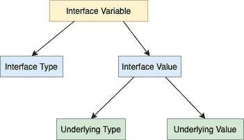

<!--yml
category: 未分类
date: 2024-10-13 06:23:01
-->

# Access Underlying Variable of Interface in Go (Golang)

> 来源：[https://golangbyexample.com/access-underlying-type-interface-golang/](https://golangbyexample.com/access-underlying-type-interface-golang/)

Table of Contents

 **   [Overview](#Overview "Overview")
*   [Type Assertion](#Type_Assertion "Type Assertion")
*   [Type Switch](#Type_Switch "Type Switch")*  *# **Overview**

Like any other variable, an interface variable is represented by a type and value. Interface value, in turn under the hood, consists of two tuple

*   Underlying Type

*   Underlying Value

See below diagram which illustrates what we mentioned above



The underlying variable of an interface can be accessed in two ways

*   Type Assertion

*   Type Switch

# **Type Assertion**

Type assertion provides a way to access the underlying variable inside the interface value of the interface by asserting the correct type of underlying value. Below is the syntax for that where i is an interface.

```
val := i.({type})
```

The above statement is asserting that the type of underlying value in the interface is of type {type}. If this is true then the underlying value is assigned to **val.** If not then the above statement panics.

Assume we have an interface **animal** as below

```
type animal interface {
    breathe()
    walk()
}
```

We also have a **lion** struct implementing this **animal** interface

```
type lion struct {
    age int
}
```

**Code**

```
package main

import "fmt"

type animal interface {
	breathe()
	walk()
}

type lion struct {
	age int
}

func (l lion) breathe() {
	fmt.Println("Lion breathes")
}

func (l lion) walk() {
	fmt.Println("Lion walk")
}

type dog struct {
	age int
}

func (d dog) breathe() {
	fmt.Println("Dog breathes")
}

func (d dog) walk() {
	fmt.Println("Dog walk")
}

func main() {
	var a animal

	a = lion{age: 10}
	print(a)

}

func print(a animal) {
	l := a.(lion)
	fmt.Printf("Age: %d\n", l.age)

	//d := a.(dog)
	//fmt.Printf("Age: %d\n", d.age)
}
```

**Output**

```
Age: 10
```

This is how we assert the variable **a** of type **animal** to have underlying type as **lion**.

```
l := a.(lion)
```

Below line will create a panic as underlying type is **lion** and not **dog**. Uncomment the line to check it out

```
//d := a.(dog)
```

Type assertion provides another way to get the underlying value and which also prevents a panic. The syntax for that is

```
val, ok := i.(<type>)</type>
```

In this case type assertion returns two values, first value is same as discussed above , the other value is a boolean indicating weather the type assertion was correct or not. This value is

*   true if the type assertion is correct meaning the type asserted is same as underlying type

*   false if the type assertion fails.

So the second is a good way of doing type assertion since it prevents a panic. Let’s see an example

```
package main

import "fmt"

type animal interface {
	breathe()
	walk()
}

type lion struct {
	age int
}

func (l lion) breathe() {
	fmt.Println("Lion breathes")
}

func (l lion) walk() {
	fmt.Println("Lion walk")
}

type dog struct {
	age int
}

func (d dog) breathe() {
	fmt.Println("Dog breathes")
}

func (d dog) walk() {
	fmt.Println("Dog walk")
}

func main() {
	var a animal

	a = lion{age: 10}
	print(a)

}

func print(a animal) {
	l, ok := a.(lion)
	if ok {
		fmt.Println(l)
	} else {
		fmt.Println("a is not of type lion")
	}

	d, ok := a.(dog)
	if ok {
		fmt.Println(d)
	} else {
		fmt.Println("a is not of type lion")
	}
}
```

**Output:**

```
{10}
a is not of type lion
```

Let’s move on to type switch now.

# **Type Switch**

Type switch enables us to do above type assertion in series. See below code example for the same

```
package main

import "fmt"

type animal interface {
	breathe()
	walk()
}

type lion struct {
	age int
}

func (l lion) breathe() {
	fmt.Println("Lion breathes")
}

func (l lion) walk() {
	fmt.Println("Lion walk")
}

type dog struct {
	age int
}

func (d dog) breathe() {
	fmt.Println("Dog breathes")
}

func (d dog) walk() {
	fmt.Println("Dog walk")
}

func main() {
	var a animal

	a = lion{age: 10}
	print(a)

}

func print(a animal) {
	switch v := a.(type) {
	case lion:
		fmt.Println("Type: lion")
	case dog:
		fmt.Println("Type: dog")
	default:
		fmt.Printf("Unknown Type %T", v)
	}
}
```

**Output:**

```
Type: lion
```

In the code above, using the type switch we determine the type of value contained in  interface variable **a** is **lion** or **dog** or some other type. It is also ok to add more different types in case statement

*   [go](https://golangbyexample.com/tag/go/)*   [golang](https://golangbyexample.com/tag/golang/)*