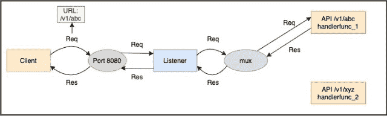
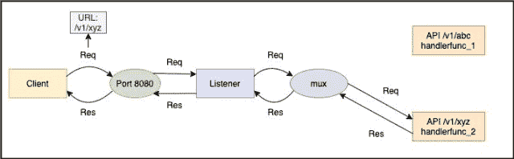
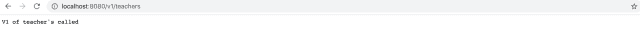

<!--yml
category: 未分类
date: 2024-10-13 06:21:52
-->

# Basic HTTP Server Implementation Using Go (Golang)

> 来源：[https://golangbyexample.com/basic-http-server-go/](https://golangbyexample.com/basic-http-server-go/)

Table of Contents

 **   [Overview](#Overview "Overview")
    *   [Request](#Request "Request")
    *   [Response](#Response "Response")
    *   [Pair of API signature and its handler](#Pair_of_API_signature_and_its_handler "Pair of API signature and its handler")
    *   [Mux](#Mux "Mux")
    *   [Listener](#Listener "Listener")
*   [Using server’s ListenAndServe function](#Using_servers_ListenAndServe_function "Using server’s ListenAndServe function")
*   [Using http's ListenAndServe function](#Using_https_ListenAndServe_function "Using http's ListenAndServe function")
*   [Conclusion](#Conclusion "Conclusion")*  *# **Overview**

HTTP (Hypertext Transfer Protocol) is an application layer protocol and works in client-server mode. HTTP server is basically a program running on a machine. It listens and responds to HTTP requests on its IP address with a particular port. As HTTP is the foundation of the World Wide Web and is used to load any web pages, every software developer comes across the situation where it is required to implement an HTTP Server to respond an HTTP request.

This article covers the HTTP server implementation in Go programming language. There is a go package **net**, that contains the utility packages to handle networking functions.

**net** package contains http package that provides both HTTP client (to make http requests) and HTTP server (listens to http requests) implementations. In this article, we will learn about HTTP server. Below is the statement to import the http package:

```
import "net/http"
```

The crux to understanding the http server implementation is understanding below things

*   **Request** – it defines the request parameters i.e, Method, Api Signature, request headers, body, query params etc

*   **Response** – defines the response parameters i.e, Status code, response body, headers

*   **Pair of API signature and its handler** – Each API signature corresponds to a handler. You can think of handler as a function which is invoked when a request is made for that particular API signature. The **mux** registers these pairs of API signature and its handler

*   **Mux**– It acts as a router. Depending upon API signature of the request, it routes the request to the registered handler for that API signature. The handler will handle that incoming request and provide the response . For eg an API call with **“/v2/teachers”** might be handled by a different function and  API call with **“/v2/students”** might be handled by some other function. So basically based upon API signature( and also request method sometimes) , it decides which handler to invoke.

*   **Listener** – It runs on the machine, which listens to a particular port. Whenever it receives the request on that port it forwards the request to the **mux**. It also handles other functionalities as well but we will not discuss those it in this article.

There is more when it comes to HTTP, but for simplicity, we talked about only the above five things. The diagram below shows the interaction for an API request originating from the client.

Let’s see an example. Below two pairs of API Signature and handlers are registered with the **mux.**

*   **“/v1/abc”**  and **handlerfunc_1**

*   **“/v1/xyz”** and **handlerfunc_2**

Client calling **“/v1/abc”** API. Listener forwards it to the **mux** and the **mux** routes it to the appropriate handler **handlerfunc_1**



Client calling **“/v1/xyz”** API. Listener forwards it to the **mux** and the **mux** routes it to the appropriate handler **handlerfunc_2**



Now we have understood the above parts so let’s move on to see how each of the above is implemented in GO and then in the end we will see a complete program with the entire end to end flow

## **Request**

In GO a request is represented by the **Request** Struct.  Here is the link to the struct – [https://golang.org/pkg/net/http/#Request](https://golang.org/pkg/net/http/#Request)

It contains the request method, Api Signature, request headers, body, query params, etc.

## **Response**

In GO a response is represented by the **ResponseWriter** Interface.  Here is the link to the interface – [https://golang.org/pkg/net/http/#ResponseWriter](https://golang.org/pkg/net/http/#ResponseWriter)ResponseWriter interface is used by an HTTP handler to construct an HTTP response. It provides three functions to set the response parameters

*   Header – For writing response header

*   Write([]byte) – For writing response body

*   WriteHeader(statusCode int) – For writing the http status code

## **Pair of API signature and its handler**

An API signature and its handler are paired. Then handler is called by the mux when it receives an API call matching the API signature. A golang handler can be either a **function** or a **type**

*   **Function** – the function should have below signature

```
func(ResponseWriter, *Request)
```

*   **Type** – the type should implement the the **Handler** interface

```
type Handler interface {
   ServeHTTP(ResponseWriter, *Request)
}
```

Let’s look at each one by one

*   **Function –** A handler can just be a simple function having below signature.

```
func(ResponseWriter, *Request)
```

It takes input has two arguments. The first one is ResponseWriter and the second one is a pointer to the Request struct. We discussed both of these earlier as well.

If an API signature and a function having signature as above are registered as a pair in the **mux**, then this function will be called when an API call is made matching the API signature.

*   **Type –** the type should implement the **Handler** Interface – [https://golang.org/pkg/net/http/#Handler](https://golang.org/pkg/net/http/#Handler)

```
type Handler interface {
   ServeHTTP(ResponseWriter, *Request)
}
```

The **Handler** interface defines a **ServeHttp** function. If an API signature and a type that implements the **Handler** interface are registered as a pair in the mux, then the **ServeHTTP** method for this type will be invoked when an API call is made matching the API signature.

If you will notice the API signature of the **function** used as a handler and **ListenAndServe** function is the same which is

```
func(ResponseWriter, *Request)
```

These functions will be called by mux depending upon the type of handler. Also to note that two different API Signature can have the same handler

## **Mux**

The job of mux or multiplexer is to route request to the registered handler based upon API signature (and also request Method sometimes). If the signature and its handler is not registered with the mux, it raises a 404

Go provides a default mux built in the language – [https://golang.org/pkg/net/http/#ServeMux](https://golang.org/pkg/net/http/#ServeMux). There are also other mux available in the market for golang. Different web frameworks such as gin provide there own mux

This is how we create a mux

```
mux := http.NewServeMux()
```

Let’s see how we register a pair of API Signature and its handler with the mux. There are two cases

*   When the handler is a **function** . It registers the pattern which is API signature and the function as a handler

```
mux.HandleFunc(pattern, handlerFunc)
```

*   When the handler is a **type** implementing the **Handler** interface

```
mux.Handle(pattern, handler)
```

## **Listener**

The listener listens to a port and the forwards the request to the **mux** and then waits for response. Once it receives the response it sends it back to the client. A listener in golang can be implemented using the server struct – [https://golang.org/pkg/net/http/#Server](https://golang.org/pkg/net/http/#Server)

This is how we create a server. There are also some other parameters that we can specify while creating a server such as ReadTimeout, WriteTimeout etc., but that is out of scope for this tutorial. All parameters which are not provided take the default zero value.

```
s := &http.Server{
  Addr:    ":8080",
  Handler: mux,
}
```

The **Addr** attribute of type string is the address of the machine on which the HTTP server will be launched.

This address is in the form of

```
{ip_address}:{port}
```

 If only :{port} is used as **addr** argument then that means HTTP server is reachable from all the ip addresses (loopback, public ip, internal ip) of the machine.

One can also use **“:http”** as the **addr** argument value for address port **“:80”** and **“:https” **for address port **“:443”**

A very important thing to note here is that **ServerMux** which is default mux built in the language also has a **ServeHttp** method  [https://golang.org/pkg/net/http/#ServeMux.ServeHTTP](https://golang.org/pkg/net/http/#ServeMux.ServeHTTP). So **ServerMux** also implements the **Handler** interface since it defines the **ServeHttp** method. While creating server as you might have noticed we have to provide a handler which is of type **Handler** interface. This is where **ServerMux** implementing the **Handler** interface comes in handy as we can pass the instance of **ServerMux** while creating server. This is important to understand that **ServerMux** is of type **Handler** interface apart from registering different pairs of API signatures and their handlers.

After the server is created we call the **ListenAndServe** method of the **server** . The server then starts listening to the provided port and upon receiving any api call on that port it calls the **ServeHttp** of the **mux** which in turns routes the request to the registered handlerHope above five things are clear now. Let’s see a working program illustrating above points

# **Using server’s ListenAndServe function**

**main.go**

```
package main

import (
	"net/http"
)

func main() {

	//Create the default mux
	mux := http.NewServeMux()

	//Handling the /v1/teachers. The handler is a function here
	mux.HandleFunc("/v1/teachers", teacherHandler)

	//Handling the /v1/students. The handler is a type implementing the Handler interface here
	sHandler := studentHandler{}
	mux.Handle("/v1/students", sHandler)

	//Create the server. 
	s := &http.Server{
		Addr:    ":8080",
		Handler: mux,
	}
	s.ListenAndServe()

}

func teacherHandler(res http.ResponseWriter, req *http.Request) {
	data := []byte("V1 of teacher's called")
	res.WriteHeader(200)
	res.Write(data)
}

type studentHandler struct{}

func (h studentHandler) ServeHTTP(res http.ResponseWriter, req *http.Request) {
	data := []byte("V1 of student's called")
	res.WriteHeader(200)
	res.Write(data)
}
```

Let’s first understand the program before running it

*   We defined a function named **teacherHandler** which has signature accepting the **http.ResponseWriter** and pointer to **http.Request**

```
func teacherHandler(res http.ResponseWriter, req *http.Request) {
	data := []byte("V1 of teacher's called")
	res.Header().Set("Content-Type", "application/text")
	res.WriteHeader(200)
	res.Write(data)
}
```

*   We define a struct named **studentHandler** which defines the **ServeHTTP** method. So **studentHandler** is a type which implements the **Handler** interface

```
type studentHandler struct{}

func (h studentHandler) ServeHTTP(res http.ResponseWriter, req *http.Request) {
	data := []byte("V1 of student's called")
	res.Header().Set("Content-Type", "application/text")
	res.WriteHeader(200)
	res.Write(data)
}
```

*   We create an instance of **ServerMux**

```
mux := http.NewServeMux()
```

*   We registered the pair of API signature  “/v1/teachers” and its handler **teacherHandler**

```
mux.HandleFunc("/v1/teachers", teacherHandler)
```

*   We registered the pair of API signature  “/v1/students” and its handler **studentHandler** which is a type implementing **Handler** interface

```
sHandler := studentHandler{}
mux.Handle("/v1/students", sHandler)
```

*   We created the server and provided it the instance of **ServerMux** and the port to listen to which is 8080\. Then the  **ListenAndServe** method on the server’s instance was called.

```
s := &http.Server{
		Addr:    ":8080",
		Handler: mux,
	}
s.ListenAndServe()
```

Let’s run the server  now

```
go run main.go
```

It will start listening to port 8080\. This program never exits and process remains locked until terminated forcefully, which is recommended as any HTTP server should be up and running all the time. Now make api calls

Calling **“v1/teachers”** api – It returns correct response – ‘**V1 of teacher’s called’** along with correct status code of 200

```
curl -v -X GET http://localhost:8080/v1/teachers
Note: Unnecessary use of -X or --request, GET is already inferred.
*   Trying ::1...
* TCP_NODELAY set
* Connected to localhost (::1) port 8080 (#0)
> GET /v1/teachers HTTP/1.1
> Host: localhost:8080
> User-Agent: curl/7.54.0
> Accept: */*
> 
< HTTP/1.1 200 OK
< Content-Type: application/text
< Date: Sat, 11 Jul 2020 16:03:33 GMT
< Content-Length: 22
< 
* Connection #0 to host localhost left intact
V1 of teacher's called
```

Calling **"v1/students"** api - It returns correct response - '**V1 of student's called'** along with correct status code of 200

```
curl -v -X GET http://localhost:8080/v1/students
Note: Unnecessary use of -X or --request, GET is already inferred.
*   Trying ::1...
* TCP_NODELAY set
* Connected to localhost (::1) port 8080 (#0)
> GET /v1/students HTTP/1.1
> Host: localhost:8080
> User-Agent: curl/7.54.0
> Accept: */*
> 
< HTTP/1.1 200 OK
< Content-Type: application/text
< Date: Sat, 11 Jul 2020 16:04:27 GMT
< Content-Length: 22
< 
* Connection #0 to host localhost left intact
V1 of student's called
```

You can also try these apis on the browser

For api **"/v1/teachers"**



For api **"/v1/students"**


# **Using http's ListenAndServe function**

So we looked at a program where we built a **mux**, then we added pairs of API signature and their handlers. Finally we created a server and started it. **net/http** package also provides a function **ListenAndServe** which creates a default server and uses the default **mux** to achieve the same what we discussed above. It is a short way of doing starting a http server

The **ListenAndServe** function has an **addr** and **handler** as its input arguments and it starts a HTTP server. It starts listening to incoming HTTP requests and serve the requests when received any.Below is the signature of the **ListenAndServe** function

```
func ListenAndServe(addr string, handler Handler) error
```

Below is way to call this function

```
http.ListenAndServe(:8080, nil)
```

If you will notice above we called **ListenAndServe** function with nil value for handler

```
http.ListenAndServe(:8080, nil)
```

In that situation a default instance of **ServeMux** ([https://golang.org/pkg/net/http/#ServeMux](https://golang.org/pkg/net/http/#ServeMux) ) will be created

```
package main

import (
	"net/http"
)

func main() {

	//Handling the /v1/teachers
	http.HandleFunc("/v1/teachers", teacherHandler)

	//Handling the /v1/students
	sHandler := studentHandler{}
	http.Handle("/v1/students", sHandler)

	http.ListenAndServe(":8080", nil)
}

func teacherHandler(res http.ResponseWriter, req *http.Request) {
	data := []byte("V1 of teacher's called")
	res.WriteHeader(200)
	res.Write(data)
}

type studentHandler struct{}

func (h studentHandler) ServeHTTP(res http.ResponseWriter, req *http.Request) {
	data := []byte("V1 of student's called")
	res.WriteHeader(200)
	res.Write(data)
}
```

net/http package provides the **HandleFunc** and **Handle.** These function works in the same way as mux's methods.

Run the server

```
go run main.go
```

The output will be same as we discussed above. This is all about basic HTTP server implementation in golang.

# **Conclusion**

We learned that we can create a HTTP server in two ways

*   Using server.ListenAndServe - [https://golang.org/pkg/net/http/#Server.ListenAndServe](https://golang.org/pkg/net/http/#Server.ListenAndServe)

*   Using http.ListenAndServe - [https://golang.org/pkg/net/http/#ListenAndServe](https://golang.org/pkg/net/http/#ListenAndServe)

Internally both of them are doing the same thing. The second one uses default for everything while the first one lets you create mux and server instance explicitly so that you can specify more options and hence first option is more flexible.

*   [go](https://golangbyexample.com/tag/go/)*   [golang](https://golangbyexample.com/tag/golang/)*