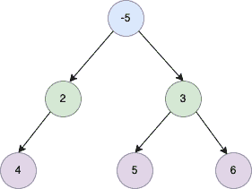

<!--yml
category: 未分类
date: 2024-10-13 06:51:28
-->

# Binary Tree Maximum Path Sum Program in Go (Golang)

> 来源：[https://golangbyexample.com/binary-tree-maximum-path-sum-golang/](https://golangbyexample.com/binary-tree-maximum-path-sum-golang/)

Table of Contents

 **   [Overview](#Overview "Overview")
*   [Program](#Program "Program")*  *# **Overview**

A  binary tree is given. The objective is to find the maximum Path Sum in that binary tree.  A path in a binary tree is a sequence of nodes that are connected to each other. Each node only appears once in the Maximum Path Sum

**Example 1**


```
Output: 16
Maximum Sum Path is: 4->2->1->3->6
```

**Example 2**



```
Output: 14
Maximum Sum Path is: 5->3->6
```

The idea is to track below four  values at every node

*   a = root.Val

*   b = root.Val + leftSubTreeMaxSum

*   c  = root.Val + rightSubTreeMaxSum

*   d =  root.Val + leftSubTreeMaxSum+  rightSubTreeMaxSum

Then

*   Max sum at a given node is given max of **(a,b,c,d)**

*   The return value in the recursive call would be a max of **(a,b,c)**.  Why? This is because only the path of a or b or c represents a path that can be taken into account at the parent node. d cannot be taken into account because it becomes an invalid path. To understand this with an example consider the binary tree in example two above. Path **5->3->6** cannot include parent node **-5** in its path because it becomes an invalid path.

# **Program**

Below is the program for the same

```
package main

import (
	"fmt"
	"math"
)

type TreeNode struct {
	Val   int
	Left  *TreeNode
	Right *TreeNode
}

func maxPathSum(root *TreeNode) int {
	res := math.MinInt64

	maxPathSumUtil(root, &res)
	return res
}

func maxPathSumUtil(root *TreeNode, res *int) int {
	if root == nil {
		return 0
	}

	l := maxPathSumUtil(root.Left, res)
	r := maxPathSumUtil(root.Right, res)

	a := root.Val
	b := root.Val + l
	c := root.Val + r
	d := root.Val + l + r

	maxReturnSum := maxOfThree(a, b, c)

	maxSumPath := maxOfTwo(maxReturnSum, d)
	if maxSumPath > *res {
		*res = maxSumPath
	}

	return maxReturnSum
}

func maxOfThree(a, b, c int) int {
	if a > b && a > c {
		return a
	}

	if b > c {
		return b
	}

	return c
}

func maxOfTwo(a, b int) int {
	if a > b {
		return a
	}
	return b
}

func main() {
	root := &TreeNode{Val: 1}
	root.Left = &TreeNode{Val: 2}
	root.Left.Left = &TreeNode{Val: 4}
	root.Right = &TreeNode{Val: 3}
	root.Right.Left = &TreeNode{Val: 5}
	root.Right.Right = &TreeNode{Val: 6}

	output := maxPathSum(root)
	fmt.Println(output)

	root = &TreeNode{Val: -10}
	root.Left = &TreeNode{Val: 2}
	root.Left.Left = &TreeNode{Val: 4}
	root.Right = &TreeNode{Val: 3}
	root.Right.Left = &TreeNode{Val: 5}
	root.Right.Right = &TreeNode{Val: 6}
	output = maxPathSum(root)
	fmt.Println(output)

}
```

**Output:**

```
16
14
```

**Note:** Check out our Golang Advanced Tutorial. The tutorials in this series are elaborative and we have tried to cover all concepts with examples. This tutorial is for those who are looking to gain expertise and a solid understanding of golang – [Golang Advance Tutorial](https://golangbyexample.com/golang-comprehensive-tutorial/)

Also if you are interested in understanding how all design patterns can be implemented in Golang. If yes, then this post is for you – [All Design Patterns Golang](https://golangbyexample.com/all-design-patterns-golang/)

Also, check out our system design tutorial series here – [System Design Tutorial Series](https://techbyexample.com/system-design-questions/)

*   [go](https://golangbyexample.com/tag/go/)*   [golang](https://golangbyexample.com/tag/golang/)*