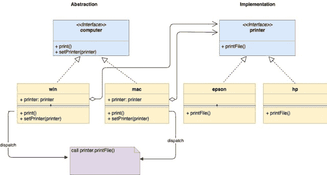
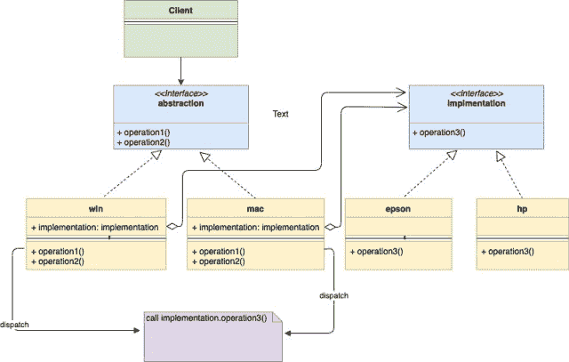

<!--yml
category: 未分类
date: 2024-10-13 06:03:16
-->

# Bridge Design Pattern in Go (Golang)

> 来源：[https://golangbyexample.com/bridge-design-pattern-in-go/](https://golangbyexample.com/bridge-design-pattern-in-go/)

Note: Interested in understanding how all other design patterns can be implemented in GO. Please see this full reference – [All Design Patterns in Go (Golang)](https://golangbyexample.com/all-design-patterns-golang/)

Table of Contents

 **   [Introduction:](#Introduction "Introduction:")
*   [UML Diagram:](#UML_Diagram "UML Diagram:")
*   [Mapping ](#Mapping "Mapping ")
*   [Practical Example](#Practical_Example "Practical Example")
*   [Full Working Code:](#Full_Working_Code "Full Working Code:")*  *## **Introduction:**

Bridge design pattern is a structural design pattern that allows the separation of abstraction from its implementation. Sounds confusing? Don’t worry, it will be more clear as we go along.

This pattern suggests dividing a large class into two separate hierarchy

*   Abstraction – It is an interface and children of the **Abstraction** are referred to as **Refined Abstraction.** The abstraction contains a reference to the implementation.
*   Implementation – It is also an interface and children’s of the **Implementation** are referred to as **Concrete Implementation**

Abstraction hierarchy is being referred to by clients without worrying about the implementation. Let’s take an example. Assume you have two types of computer **mac** and **windows.** Also, let’s say two types of printer **epson** and **hp** . Both computers and printers needs to work with each other in any combination.  The client will only access the computer without worrying about how print is happening. Instead of creating four structs for the 2*2 combination, we create two hierarchies

*   Abstraction Hierarchy
*   Implementation Hierarchy

See the below figure. These two hierarchies communicate with each other via a bridge where **Abstraction** (computer here) contains a reference to the **Implementation**(printer here). Both the abstraction and implementation can continue to develop independently without affecting each other.  Notice how **win** and **mac** embed the reference to **printer**. We can change the **Abstraction’sImplementation** (i.e., computer’s printer) at run time as abstraction refers to implementation via the interface. On calling **mac.print() or windows.print()** it dispatches the request to **printer.printFile()**. This acts as a bridge and provides a loose coupling between the two.

*   

## **UML Diagram:**

*   

## **Mapping **

The below table represents the mapping from the UML diagram actors to actual implementation actors in **“Practical Example”** below

| Abstraction | computer.go |
| Refined Abstraction 1 | win.go |
| Refined Abstraction 2 | mac.go |
| Implementation | printer.go |
| Concrete Implementation 1 | epson.go |
| Concrete Implementation 2 | hp.go |
| Client | main.go |

## **Practical Example**

**computer.go**

```
package main

type computer interface {
    print()
    setPrinter(printer)
}
```

**mac.go**

```
package main

import "fmt"

type mac struct {
    printer printer
}

func (m *mac) print() {
    fmt.Println("Print request for mac")
    m.printer.printFile()
}

func (m *mac) setPrinter(p printer) {
    m.printer = p
}
```

**windows.go**

```
package main

import "fmt"

type windows struct {
    printer printer
}

func (w *windows) print() {
    fmt.Println("Print request for windows")
    w.printer.printFile()
}

func (w *windows) setPrinter(p printer) {
    w.printer = p
}
```

**printer.go**

```
package main

type printer interface {
    printFile()
}
```

**epson.go**

```
package main

import "fmt"

type epson struct {
}

func (p *epson) printFile() {
    fmt.Println("Printing by a EPSON Printer")
}
```

**hp.go**

```
package main

import "fmt"

type hp struct {
}

func (p *hp) printFile() {
    fmt.Println("Printing by a HP Printer")
}
```

**main.go**

```
package main

import "fmt"

func main() {
    hpPrinter := &hp{}
    epsonPrinter := &epson{}
    macComputer := &mac{}
    macComputer.setPrinter(hpPrinter)
    macComputer.print()
    fmt.Println()
    macComputer.setPrinter(epsonPrinter)
    macComputer.print()
    fmt.Println()
    winComputer := &windows{}
    winComputer.setPrinter(hpPrinter)
    winComputer.print()
    fmt.Println()
    winComputer.setPrinter(epsonPrinter)
    winComputer.print()
    fmt.Println()
}
```

**Output:**

```
Print request for mac
Printing by a HP Printer

Print request for mac
Printing by a EPSON Printer

Print request for windows
Printing by a HP Printer

Print request for windows
```

## **Full Working Code:**

```
package main

import "fmt"

type computer interface {
    print()
    setPrinter(printer)
}

type mac struct {
    printer printer
}

func (m *mac) print() {
    fmt.Println("Print request for mac")
    m.printer.printFile()
}

func (m *mac) setPrinter(p printer) {
    m.printer = p
}

type windows struct {
    printer printer
}

func (w *windows) print() {
    fmt.Println("Print request for windows")
    w.printer.printFile()
}

func (w *windows) setPrinter(p printer) {
    w.printer = p
}

type printer interface {
    printFile()
}

type epson struct {
}

func (p *epson) printFile() {
    fmt.Println("Printing by a EPSON Printer")
}

type hp struct {
}

func (p *hp) printFile() {
    fmt.Println("Printing by a HP Printer")
}

func main() {
    hpPrinter := &hp{}
    epsonPrinter := &epson{}
    macComputer := &mac{}
    macComputer.setPrinter(hpPrinter)
    macComputer.print()
    fmt.Println()
    macComputer.setPrinter(epsonPrinter)
    macComputer.print()
    fmt.Println()
    winComputer := &windows{}
    winComputer.setPrinter(hpPrinter)
    winComputer.print()
    fmt.Println()
    winComputer.setPrinter(epsonPrinter)
    winComputer.print()
    fmt.Println()
}
```

**Output:**

```
Print request for mac
Printing by a HP Printer

Print request for mac
Printing by a EPSON Printer

Print request for windows
Printing by a HP Printer

Print request for windows
```

*   [bridge design pattern](https://golangbyexample.com/tag/bridge-design-pattern/)*   [design pattern](https://golangbyexample.com/tag/design-pattern/)*   [go](https://golangbyexample.com/tag/go/)*   [golang](https://golangbyexample.com/tag/golang/)*