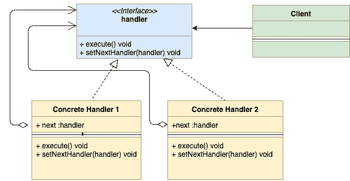
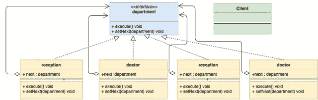

<!--yml
category: 未分类
date: 2024-10-13 06:02:54
-->

# Chain of Responsibility Design Pattern in Go (Golang)

> 来源：[https://golangbyexample.com/chain-of-responsibility-design-pattern-in-golang/](https://golangbyexample.com/chain-of-responsibility-design-pattern-in-golang/)

Note: Interested in understanding how all other design patterns can be implemented in GO. Please see this full reference – [All Design Patterns in Go (Golang)](https://golangbyexample.com/all-design-patterns-golang/)

Table of Contents

 **   [Definition: ](#Definition "Definition:  ")
*   [When to Use:](#When_to_Use "When to Use:")
*   [UML Diagram:](#UML_Diagram "UML Diagram:")
*   [Mapping ](#Mapping "Mapping ")
*   [Practical Example:](#Practical_Example "Practical Example:")
*   [Full Working Code:](#Full_Working_Code "Full Working Code:")*  *## **Definition: **

Chain of Responsibility Design Pattern is a behavioral design pattern. It lets you create a chain of request handlers. For every incoming request, it is passed through the chain and each of the handler:

1.  Processes the request or skips the processing.
2.  Decides whether to pass the request to the next handler in the chain or not

Chain of Responsibility Design pattern will be best understood with an example. Let’s take the case of a hospital. A hospital has multiple departments such as:

1.  Reception
2.  Doctor
3.  Medicine Room
4.  Cashier

Whenever any patient arrives he first goes to **Reception** then to **Doctor** then to **Medicine Room** and then to **Cashier** and so on. In a way, a patient is sent into a chain of departments which when done, sends the patient to further departments. This is where the Chain of Responsibility pattern comes into the picture.

## **When to Use:**

*   The pattern is applicable when there are multiple candidates to process the same request.

*   When you don’t want the client to choose the receiver as multiple objects can handle the request. Also, you want to decouple the client from receivers. The Client only needs to know the first element in the chain.

        -As in the example of the hospital, a patient first goes to the reception and then reception based upon a patient’s current status sends up to the next handler in the chain.

## **UML Diagram:**

*   

Below is the corresponding mapping UML diagram with the practical example given below

*   

## **Mapping **

| handler | department.go |
| Concrete Handler 1 | account.go |
| Concrete Handler 2 | doctor.go |
| Concrete Handler 3 | medical.go |
| Concrete Handler 4 | cashier.go |
| Client | main.go |

## **Practical Example:**

**department.go**

```
package main

type department interface {
    execute(*patient)
    setNext(department)
}
```

**reception.go**

```
package main

import "fmt"

type reception struct {
    next department
}

func (r *reception) execute(p *patient) {
    if p.registrationDone {
        fmt.Println("Patient registration already done")
        r.next.execute(p)
        return
    }
    fmt.Println("Reception registering patient")
    p.registrationDone = true
    r.next.execute(p)
}

func (r *reception) setNext(next department) {
    r.next = next
}
```

**doctor.go**

```
package main

import "fmt"

type doctor struct {
    next department
}

func (d *doctor) execute(p *patient) {
    if p.doctorCheckUpDone {
        fmt.Println("Doctor checkup already done")
        d.next.execute(p)
        return
    }
    fmt.Println("Doctor checking patient")
    p.doctorCheckUpDone = true
    d.next.execute(p)
}

func (d *doctor) setNext(next department) {
    d.next = next
}
```

**medical.go**

```
package main

import "fmt"

type medical struct {
    next department
}

func (m *medical) execute(p *patient) {
    if p.medicineDone {
        fmt.Println("Medicine already given to patient")
        m.next.execute(p)
        return
    }
    fmt.Println("Medical giving medicine to patient")
    p.medicineDone = true
    m.next.execute(p)
}

func (m *medical) setNext(next department) {
    m.next = next
}
```

**cashier.go**

```
package main

import "fmt"

type cashier struct {
	next department
}

func (c *cashier) execute(p *patient) {
	if p.paymentDone {
		fmt.Println("Payment Done")
	}
	fmt.Println("Cashier getting money from patient patient")
}

func (c *cashier) setNext(next department) {
	c.next = next
} 
```

**patient.go**

```
package main

type patient struct {
    name              string
    registrationDone  bool
    doctorCheckUpDone bool
    medicineDone      bool
    paymentDone       bool
}
```

**main.go**

```
package main

func main() {
    cashier := &cashier{}
    //Set next for medical department
    medical := &medical{}
    medical.setNext(cashier)
    //Set next for doctor department
    doctor := &doctor{}
    doctor.setNext(medical)
    //Set next for reception department
    reception := &reception{}
    reception.setNext(doctor)
    patient := &patient{name: "abc"}
    //Patient visiting
    reception.execute(patient)
}
```

**Output:**

```
Reception registering patient
Doctor checking patient
Medical giving medicine to patient
Cashier getting money from patient patient
```

## **Full Working Code:**

```
package main

import "fmt"

type department interface {
    execute(*patient)
    setNext(department)
}

type reception struct {
    next department
}

func (r *reception) execute(p *patient) {
    if p.registrationDone {
        fmt.Println("Patient registration already done")
        r.next.execute(p)
        return
    }
    fmt.Println("Reception registering patient")
    p.registrationDone = true
    r.next.execute(p)
}

func (r *reception) setNext(next department) {
    r.next = next
}

type doctor struct {
    next department
}

func (d *doctor) execute(p *patient) {
    if p.doctorCheckUpDone {
        fmt.Println("Doctor checkup already done")
        d.next.execute(p)
        return
    }
    fmt.Println("Doctor checking patient")
    p.doctorCheckUpDone = true
    d.next.execute(p)
}

func (d *doctor) setNext(next department) {
    d.next = next
}

type medical struct {
    next department
}

func (m *medical) execute(p *patient) {
    if p.medicineDone {
        fmt.Println("Medicine already given to patient")
        m.next.execute(p)
        return
    }
    fmt.Println("Medical giving medicine to patient")
    p.medicineDone = true
    m.next.execute(p)
}

func (m *medical) setNext(next department) {
    m.next = next
}

type cashier struct {
    next department
}

func (c *cashier) execute(p *patient) {
    if p.paymentDone {
        fmt.Println("Payment Done")
    }
    fmt.Println("Cashier getting money from patient patient")
}

func (c *cashier) setNext(next department) {
    c.next = next
}

type patient struct {
    name              string
    registrationDone  bool
    doctorCheckUpDone bool
    medicineDone      bool
    paymentDone       bool
}

func main() {
    cashier := &cashier{}

    //Set next for medical department
    medical := &medical{}
    medical.setNext(cashier)

    //Set next for doctor department
    doctor := &doctor{}
    doctor.setNext(medical)

    //Set next for reception department
    reception := &reception{}
    reception.setNext(doctor)

    patient := &patient{name: "abc"}
    //Patient visiting
    reception.execute(patient)
}
```

**Output:**

```
Reception registering patient
Doctor checking patient
Medical giving medicine to patient
Cashier getting money from patient patient
```

*   [chain of responsibility design pattern in golang](https://golangbyexample.com/tag/chain-of-responsibility-design-pattern-in-golang/)*   [chain of responsiblity](https://golangbyexample.com/tag/chain-of-responsiblity/)*   [design pattern in go](https://golangbyexample.com/tag/design-pattern-in-go/)*   [design pattern in golang](https://golangbyexample.com/tag/design-pattern-in-golang/)*