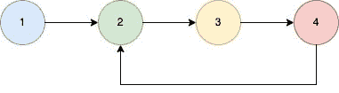

<!--yml
category: 未分类
date: 2024-10-13 06:46:34
-->

# Check if a given linked list has a cycle in Go (Golang)

> 来源：[https://golangbyexample.com/ilinked-list-cycle-golang/](https://golangbyexample.com/ilinked-list-cycle-golang/)

Table of Contents

 **   [Overview](#Overview "Overview")
*   [Program](#Program "Program")*  *## **Overview**

The objective is to if a given linked list has a cycle or not. A cycle exists in a linked list if  the last node in the linked list points to another node in the front

Example



The above linked list has a cycle. Below is the approach we can follow

*   Have two pointers. One is the slow pointer and the other is a fast pointer. Both point to the head node initially

*   Now move the slow pointer by 1 node and move the fast pointer by 2 nodes.

```
slow := slow.Next
fast := fast.Next.Next
```

*   If slow and fast pointers are the same at any point in time then the linked list has cyle.

## **Program**

Here is the program for the same.

```
package main

import "fmt"

func main() {
	first := initList()
	ele4 := first.AddFront(4)
	first.AddFront(3)
	ele2 := first.AddFront(2)
	first.AddFront(1)

	//Create cycle
	ele4.Next = ele2

	output := hasCycle(first.Head)
	fmt.Println(output)

}

type ListNode struct {
	Val  int
	Next *ListNode
}

type SingleList struct {
	Len  int
	Head *ListNode
}

func (s *SingleList) AddFront(num int) *ListNode {
	ele := &ListNode{
		Val: num,
	}
	if s.Head == nil {
		s.Head = ele
	} else {
		ele.Next = s.Head
		s.Head = ele
	}
	s.Len++
	return ele
}

func initList() *SingleList {
	return &SingleList{}
}
func hasCycle(head *ListNode) bool {

	if head == nil || head.Next == nil {
		return false
	}

	hasCycle := false
	slow := head
	fast := head

	for slow != nil && fast != nil && fast.Next != nil {
		slow = slow.Next
		fast = fast.Next.Next

		if slow == fast {
			hasCycle = true
			break
		}
	}

	return hasCycle

}
```

**Output**

```
true
```

**Note:** Check out our Golang Advanced Tutorial. The tutorials in this series are elaborative and we have tried to cover all concepts with examples. This tutorial is for those who are looking to gain expertise and a solid understanding of golang – [Golang Advance Tutorial](https://golangbyexample.com/golang-comprehensive-tutorial/)

Also if you are interested in understanding how all design patterns can be implemented in Golang. If yes, then this post is for you –[All Design Patterns Golang](https://golangbyexample.com/all-design-patterns-golang/)

*   [go](https://golangbyexample.com/tag/go/)*   [golang](https://golangbyexample.com/tag/golang/)*