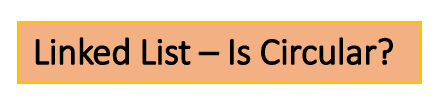

<!--yml
category: 未分类
date: 2024-10-13 06:36:23
-->

# Check if a linked list is circular in Go (Golang)

> 来源：[https://golangbyexample.com/linked-list-is-circular-go/](https://golangbyexample.com/linked-list-is-circular-go/)



Table of Contents

 **   [Overview](#Overview "Overview")
*   [Program](#Program "Program")*  *## **Overview**

Check if a linked list is circular. A linked list is circular is all nodes are connected in the form of a cylce.

## **Program**

In the below program, we first create a linked list. We then check if it is circular. It will print false first. After that, we convert the linked list into a circular linked list. We then again check if it is circular. It prints true now

```
package main
import "fmt"
type node struct {
    data string
    next *node
}
type singlyLinkedList struct {
    len  int
    head *node
}
func initList() *singlyLinkedList {
    return &singlyLinkedList{}
}
func (s *singlyLinkedList) AddFront(data string) {
    node := &node{
        data: data,
    }
    if s.head == nil {
        s.head = node
    } else {
        node.next = s.head
        s.head = node
    }
    s.len++
    return
}

func (s *singlyLinkedList) Traverse() error {
    if s.head == nil {
        return fmt.Errorf("TraverseError: List is empty")
    }
    current := s.head
    for current != nil {
        fmt.Println(current.data)
        current = current.next
    }
    return nil
}

//Function to convert singly linked list to circular linked list
func (s *singlyLinkedList) ToCircular() {
    current := s.head
    for current.next != nil {
        current = current.next
    }
    current.next = s.head
}

func (s *singlyLinkedList) IsCircular() bool {
    if s.head == nil {
        return true
    }
    current := s.head.next
    for current.next != nil && current != s.head {
        current = current.next
    }
    return current == s.head
}

func main() {
    singleList := initList()
    fmt.Printf("AddFront: D\n")
    singleList.AddFront("D")
    fmt.Printf("AddFront: C\n")
    singleList.AddFront("C")
    fmt.Printf("AddFront: B\n")
    singleList.AddFront("B")
    fmt.Printf("AddFront: A\n")
    singleList.AddFront("A")
    err := singleList.Traverse()
    if err != nil {
        fmt.Println(err.Error())
    }
    isCircular := singleList.IsCircular()
    fmt.Printf("Before: Is Circular: %t\n", isCircular)

    fmt.Printf("Size: %d\n", singleList.len)
    singleList.ToCircular()

    isCircular = singleList.IsCircular()
    fmt.Printf("After: Is Circular: %t\n", isCircular)
}
```

**Output**

```
AddFront: D
AddFront: C
AddFront: B
AddFront: A
A
B
C
D
Before: Is Circular: false
Size: 4
After: Is Circular: true
```

*   [circular](https://golangbyexample.com/tag/circular/)*   [go](https://golangbyexample.com/tag/go/)*   [golang](https://golangbyexample.com/tag/golang/)*   [single](https://golangbyexample.com/tag/single/)*