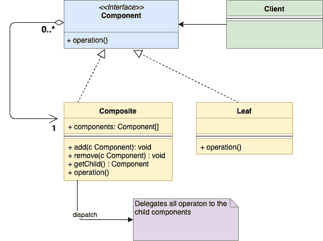
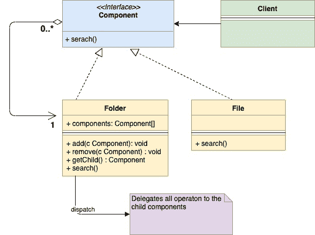

<!--yml
category: 未分类
date: 2024-10-13 06:02:22
-->

# Composite Design Pattern in Go (GoLang)

> 来源：[https://golangbyexample.com/composite-design-pattern-golang/](https://golangbyexample.com/composite-design-pattern-golang/)

Note: Interested in understanding how all other design patterns can be implemented in GO. Please see this full reference – [All Design Patterns in Go (Golang)](https://golangbyexample.com/all-design-patterns-golang/)

Table of Contents

 **   [Definition: ](#Definition "Definition:  ")
*   [When to Use](#When_to_Use " When to Use")
*   [UML Diagram](#UML_Diagram "UML Diagram")
*   [Mapping ](#Mapping "Mapping ")
*   [Practical Example](#Practical_Example "Practical Example ")*  *## **Definition: **

This is a structural design pattern. Composition design pattern is used when we want a Group of objects called ‘composite’ is treated in a similar way as a single object. It comes under structural design pattern as it allows you to compose objects into a tree structure. Each of the individual objects in the tree structure can be treated in the same way irrespective of whether they are Complex or Primitive.
Let’s try to understand it with an example of a file system of OS. In the file system, there are two types of objects **File** and **Folder.** There are cases when File and Folder are treated to be the same way. It will be more clear as we go along.

##  **When to Use**

*   Composite Design pattern makes sense to use in cases when the composite and individual object needs to be treated in the same way from a client perspective.

                – In our example above of the file system, let’s say search operation of a particular keyword needs to be executed. Now, this search operation applies to both **File** and **Folder.** For a **File,** it will just look into the contents of the file and for a **Folder,** it will go through all files in the hierarchy in that folder to find that keyword

*   Use this pattern when the composite and individual object form a tree-like structure

                –  In our example, **File** and **Folder** do form a tree structure

## **UML Diagram**

*   **Component** – It is the interface which defines the common operations for both the **Composite** and **Leaf** objects
*   **Composite –** It implements **Component** interface and embeds an array of child **Components**
*   **Leaf –** it is the primitive object in the tree. It also implements the **Component** Interface



Below is the corresponding mapping UML diagram with the example given above



## **Mapping **

The below table represents the mapping from the UML diagram actors to actual implementation actors in code.

| Component interface | component.go |
| Composite | folder.go |
| Leaf | file.go |
| client | main.go |

## **Practical Example**

In theexample below **component** is the interface and **file** and **folder** implement this interface**.**

**component.go**

```
package main

type component interface {
    search(string)
}
```

**folder.go**

```
package main

import "fmt"

type folder struct {
    components []component
    name       string
}

func (f *folder) search(keyword string) {
    fmt.Printf("Serching recursively for keyword %s in folder %s\n", keyword, f.name)
    for _, composite := range f.components {
        composite.search(keyword)
    }
}

func (f *folder) add(c component) {
    f.components = append(f.components, c)
}
```

**file.go**

```
package main

import "fmt"

type file struct {
    name string
}

func (f *file) search(keyword string) {
    fmt.Printf("Searching for keyword %s in file %s\n", keyword, f.name)
}

func (f *file) getName() string {
    return f.name
}
```

**main.go**

```
package main

func main() {
    file1 := &file{name: "File1"}
    file2 := &file{name: "File2"}
    file3 := &file{name: "File3"}
    folder1 := &folder{
        name: "Folder1",
    }
    folder1.add(file1)
    folder2 := &folder{
        name: "Folder2",
    }
    folder2.add(file2)
    folder2.add(file3)
    folder2.add(folder1)
    folder2.search("rose")
}
```

**Output:**

```
Serching recursively for keyword rose in folder Folder2
Searching for keyword rose in file File2
Searching for keyword rose in file File3
Serching recursively for keyword rose in folder Folder1
Searching for keyword rose in file File1
```

*   [composite design pattern](https://golangbyexample.com/tag/composite-design-pattern/)*   [composite design pattern in go](https://golangbyexample.com/tag/composite-design-pattern-in-go/)*   [composite design pattern in golang](https://golangbyexample.com/tag/composite-design-pattern-in-golang/)*   [design pattern](https://golangbyexample.com/tag/design-pattern/)*   [go](https://golangbyexample.com/tag/go/)*   [golang](https://golangbyexample.com/tag/golang/)*