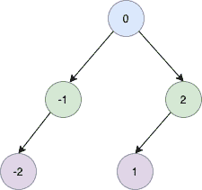

<!--yml
category: 未分类
date: 2024-10-13 06:45:25
-->

# Convert a sorted linked list to balanced BST

> 来源：[https://golangbyexample.com/sorted-linked-list-to-balanced-bst/](https://golangbyexample.com/sorted-linked-list-to-balanced-bst/)

Table of Contents

 **   [Overview](#Overview "Overview")
*   [Program](#Program "Program")*  *## **Overview**

The objective is to convert a sorted linked list to a balanced BST. A balanced BST is a BST in which the depth of the two subtrees of every node never differs by more than 1

Let’s say we have below a sorted linked list

```
-2->-1->0->1->2
```

Then it should produce a balanced BST.



## **Program**

Below is the program for the same

```
package main

import "fmt"

type ListNode struct {
	Val  int
	Next *ListNode
}

type SingleList struct {
	Len  int
	Head *ListNode
}

func (s *SingleList) AddFront(num int) {
	ele := &ListNode{
		Val: num,
	}
	if s.Head == nil {
		s.Head = ele
	} else {
		ele.Next = s.Head
		s.Head = ele
	}
	s.Len++
}

type TreeNode struct {
	Val   int
	Left  *TreeNode
	Right *TreeNode
}

func sortedListToBST(head *ListNode) *TreeNode {

	len := lenOfList(head)
	return sortedListToBSTUtil(&head, len)
}

func sortedListToBSTUtil(head **ListNode, n int) *TreeNode {

	if *head == nil {
		return nil
	}

	if n <= 0 {
		return nil
	}

	left := sortedListToBSTUtil(head, n/2)

	root := &TreeNode{Val: (*head).Val}
	*head = (*head).Next

	root.Left = left

	root.Right = sortedListToBSTUtil(head, n-n/2-1)
	return root

}

func lenOfList(head *ListNode) int {
	length := 0
	for head != nil {
		length++
		head = head.Next
	}
	return length
}

func main() {
	singleList := &SingleList{}
	fmt.Printf("AddFront: 2\n")
	singleList.AddFront(2)
	fmt.Printf("AddFront: 1\n")
	singleList.AddFront(1)
	fmt.Printf("AddFront: 0\n")
	singleList.AddFront(0)
	fmt.Printf("AddFront: -1\n")
	singleList.AddFront(-1)
	fmt.Printf("AddFront: -2\n")
	singleList.AddFront(-2)

	fmt.Println()
	root := sortedListToBST(singleList.Head)
	fmt.Printf("root: %d\n", root.Val)
	fmt.Printf("root.Left: %d\n", root.Left.Val)
	fmt.Printf("root.Left.Left: %d\n", root.Left.Left.Val)
	fmt.Printf("root.Right: %d\n", root.Right.Val)
	fmt.Printf("root.Right.Left: %d\n", root.Right.Left.Val)
}
```

**Output**

```
AddFront: 2
AddFront: 1
AddFront: 0
AddFront: -1
AddFront: -2

root: 0
root.Left: -1
root.Left.Left: -2
root.Right: 2
root.Right.Left: 1
```

**Note:** Check out our Golang Advanced Tutorial. The tutorials in this series are elaborative and we have tried to cover all concepts with examples. This tutorial is for those who are looking to gain expertise and a solid understanding of golang - [Golang Advance Tutorial](https://golangbyexample.com/golang-comprehensive-tutorial/)

Also if you are interested in understanding how all design patterns can be implemented in Golang. If yes, then this post is for you -[All Design Patterns Golang](https://golangbyexample.com/all-design-patterns-golang/)

*   [go](https://golangbyexample.com/tag/go/)*   [golang](https://golangbyexample.com/tag/golang/)*