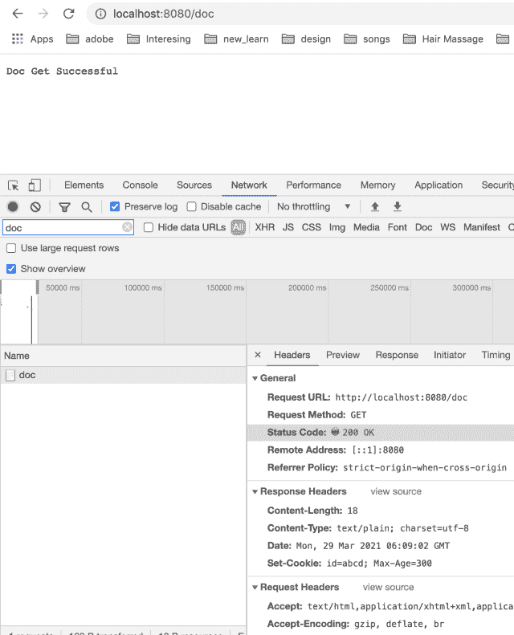

<!--yml
category: 未分类
date: 2024-10-13 06:35:34
-->

# Cookies in Go (Golang)

> 来源：[https://golangbyexample.com/cookies-golang/](https://golangbyexample.com/cookies-golang/)

Table of Contents

 **   [What is cookie](#What_is_cookie "What is cookie")
*   [Set a cookie in golang](#Set_a_cookie_in_golang "Set a cookie in golang")
    *   [Set a cookie while making a request. ](#Set_a_cookie_while_making_a_request "Set a cookie while making a request. ")
    *   [Set a cookie while responding to an incoming request](#Set_a_cookie_while_responding_to_an_incoming_request "Set a cookie while responding to an incoming request")
*   [Read a cookie in golang](#Read_a_cookie_in_golang "Read a cookie in golang")*  *## **What is cookie**

Cookies are a way to store information at the client end. The client can be a browser, a mobile application, or anything which makes an HTTP request. Cookies are basically some files that are stored in the cache memory of your browser. When you are browsing any website which supports cookies will drop some kind of information related to your activities in the cookie. This information could be anything. Cookies in short store historical information about the user activities. This information is stored on the client’s computer. Since a cookie is stored in a file,  hence this information is not lost even when the user closes a browser window or restarts the computer. A cookie can also store the login information. In fact, login information such as tokens is generally stored in cookies only. Cookies are stored per domain. Cookies stored locally belonging to a particular domain are sent in each request to that domain. They are sent in each request as part of headers. So essentially cookie is nothing but a header.

You can read about HTTP cookie in general here – [https://en.wikipedia.org/wiki/HTTP_cookie](https://en.wikipedia.org/wiki/HTTP_cookie)

Cookies can be send

*   As a Cookie header by the HTTP client

*   As a Set-cookie header in the HTTP response by the HTTP server

A cookie in golang is represented as below

[https://golang.org/src/net/http/cookie.go](https://golang.org/src/net/http/cookie.go)

```
type Cookie struct {
	Name  string
	Value string

	Path       string    // optional
	Domain     string    // optional
	Expires    time.Time // optional
	RawExpires string    // for reading cookies only

	// MaxAge=0 means no 'Max-Age' attribute specified.
	// MaxAge<0 means delete cookie now, equivalently 'Max-Age: 0'
	// MaxAge>0 means Max-Age attribute present and given in seconds
	MaxAge   int
	Secure   bool
	HttpOnly bool
	SameSite SameSite
	Raw      string
	Unparsed []string // Raw text of unparsed attribute-value pairs
}
```

See [https://tools.ietf.org/html/rfc6265](https://tools.ietf.org/html/rfc6265) for details of each of the fields of the above cookie.

Let’s see two things in details related to cookies

*   Set a cookie in golang

*   Read a cookie

## **Set a cookie in golang**

We already mentioned that a cookie is just a header.  So for setting a particular cookie, we need to just set that header. 
There are two cases

*   Set a cookie while making a request. 

*   Set a cookie while responding to an incoming request

Let’s see each of these in detail as well

### **Set a cookie while making a request. **

This is the case where golang acts as an HTTP client. **AddCookie** method of **net/http** package can be used add a cookie. If we call this method for two different names and value,  then both that name and value will be added to the resultant cookie

```
package main
import (
    "fmt"
    "log"
    "net/http"
    "net/http/cookiejar"
)
var client http.Client
func init() {
    jar, err := cookiejar.New(nil)
    if err != nil {
        log.Fatalf("Got error while creating cookie jar %s", err.Error())
    }
    client = http.Client{
        Jar: jar,
    }
}
func main() {
    cookie := &http.Cookie{
        Name:   "token",
        Value:  "some_token",
        MaxAge: 300,
    }
    cookie2 := &http.Cookie{
        Name:   "clicked",
        Value:  "true",
        MaxAge: 300,
    }
    req, err := http.NewRequest("GET", "http://google.com", nil)
    if err != nil {
        log.Fatalf("Got error %s", err.Error())
    }
    req.AddCookie(cookie)
    req.AddCookie(cookie2)
    for _, c := range req.Cookies() {
        fmt.Println(c)
    }
    resp, err := client.Do(req)
    if err != nil {
        log.Fatalf("Error occured. Error is: %s", err.Error())
    }
    defer resp.Body.Close()
    fmt.Printf("StatusCode: %d\n", resp.StatusCode)
}
```

**Output**

```
token=some_token
clicked=true
StatusCode: 200
```

In the above program, HTTP Client added two cookies. Both these cookies will be sent in the call to google.com.

HTTP client in golang also lets you specify a **CookieJar** that manages storing and sending of the cookies while making external HTTP requests. As the name suggests, think of it as a jar that contains cookies.

HTTP client uses this jar in two ways

*   Adding cookies in this Jar. You can explicitly add cookies to this jar. The cookies will also be added to the jar if the server sends the Set-Cookies header in the response headers. All the cookies specified in the Set-Cookie header will be added 

*   For consulting this jar while making any external HTTP requests. It checks this jar to know what all cookies it needs to send for a particular domain

For more information about CookieJar in golang, you can refer to this link [https://golangbyexample.com/cookiejar-golang/](https://golangbyexample.com/cookiejar-golang/)

### **Set a cookie while responding to an incoming request**

This is the case where golang acts as an HTTP server. **http.ResponseWriter** struct provides a convenient method to set a cookie. Below is the signature of the method

```
func SetCookie(w ResponseWriter, cookie *Cookie)
```

This method is used to set cookies on a ResponseWriter. It adds a Set-Cookie header to the response headers.  This Set-Cookie header is used to send the cookie that is to be set at the client end or browser end. This cookie then will be sent back to the server when the client makes subsequent calls to the server. 

Below is the program for the same.

```
package main
import (
    "net/http"
)
func main() {
    docHandler := http.HandlerFunc(docHandler)
    http.Handle("/doc", docHandler)
    http.ListenAndServe(":8080", nil)
}
func docHandler(w http.ResponseWriter, r *http.Request) {
    cookie := &http.Cookie{
        Name:   "id",
        Value:  "abcd",
        MaxAge: 300,
    }
    http.SetCookie(w, cookie)
    w.WriteHeader(200)
    w.Write([]byte("Doc Get Successful"))
    return
}
```

Run the above program using

```
go run main.go
```

The server will start running  on port 8080

Now make the API call **localhost:8080/doc** from a browser. The server is sending the below **Set-Cookie** in the response

```
Set-Cookie: id=abcd; Max-Age=300
```

The same is also visible in the response headers of the API call. See screenshot below



For more details around the Set-Cookie header please refer to this [link](https://golangbyexample.com/set-cookie-response-header/). This link contains all the details to understand the Set-Cookie header in golang.

## **Read a cookie** in golang

net/http Request struct provides a convenient method to read a particular cookie given its name. Below is the signature of that method. [https://golang.org/pkg/net/http/#Request.Cookie](https://golang.org/pkg/net/http/#Request.Cookie)

```
func (r *Request) Cookie(name string) (*Cookie, error)
```

To print all cookies,  we can iterate over the **Cookies** method of **http.Request** struct. We can use a range keyword for that.

```
for _, c := range r.Cookies() {
     fmt.Println(c)
}
```

Below is the program for the same to illustrate the **Cookie** and **Cookies** method of the **http.Request** struct

```
package main

import (
	"fmt"
	"log"
	"net/http"
)

func main() {
	docHandler := http.HandlerFunc(docHandler)
	http.Handle("/doc", docHandler)

	http.ListenAndServe(":8080", nil)
}

func docHandler(w http.ResponseWriter, r *http.Request) {
	fmt.Println("Cookies in API Call:")

	tokenCookie, err := r.Cookie("token")
	if err != nil {
		log.Fatalf("Error occured while reading cookie")
	}
	fmt.Println("\nPrinting cookie with name as token")
	fmt.Println(tokenCookie)

	fmt.Println("\nPrinting all cookies")
	for _, c := range r.Cookies() {
		fmt.Println(c)
	}
	fmt.Println()
	w.WriteHeader(200)
	w.Write([]byte("Doc Get Successful"))
	return
}
```

Run the program above and make the below curl call

```
curl -X GET localhost:8080/doc --cookie "id=abcd; token=some_token"
```

The curl call is passing two cookie name-value pairs

*   id=abcd

*   token=some_token

It will give below output

```
Cookies in API Call:

Printing cookie with name as token
token=some_token

Printing all cookies
id=abcd
token=some_token
```

This is how we print a particular cookie with a given name **“token”**

```
tokenCookie, err := r.Cookie("token")
```

It prints as seen from the output

```
token=some_token
```

This is how we print all the cookies

```
for _, c := range r.Cookies() {
     fmt.Println(c)
}
```

It outputs both the cookies name-value pairs that we had sent in the curl call

```
id=abcd
token=some_token
```

That was all about cookies in golang. Hope you have liked the tutorial. Please share feedback in the comments.

Also, check out our Golang advance tutorial Series – [Golang Advance Tutorial](https://golangbyexample.com/golang-comprehensive-tutorial/)

*   [go](https://golangbyexample.com/tag/go/)*   [golang](https://golangbyexample.com/tag/golang/)*