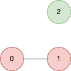
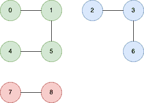

<!--yml
category: 未分类
date: 2024-10-13 06:50:31
-->

# Count unreachable pair of nodes in an undirected graph in Go (Golang)

> 来源：[https://golangbyexample.com/count-unreachable-pair-nodes-golang/](https://golangbyexample.com/count-unreachable-pair-nodes-golang/)

Table of Contents

 **   [Overview](#Overview "Overview")
*   [Program](#Program "Program")*  *# **Overview**

An integer n is given. There are n  nodes numbered 0 to n-1.  A 2D integer array **edges** is also given where **edges[i] = [ai, bi]** means that there is an undirected node from ai to bi.

The  objective is  to  find the  number of pairs of nodes that are unreachable from each other

**Example 1**

```
n=3
edges=[{0,1}]
```

**Graph**



**Output**

2

We  have  two pairs that are not connected

```
[{0,2}, {1,2}]
```

**Example 2**

```
n=9
edges=[{0,1},{0,4},{0,5},{2,3},{2,6},{7,8}]
```

**Graph**



**Output:**

**26**

We  have  26 pairs that are not connected

```
[{0,2}, {0,3}, {0,6}, {0,7}, {0,8},
{1,2}, {1,3}, {1,6}, {1,7}, {1,8},
{4,2}, {4,3}, {4,6}, {4,7}, {4,8},
{5,2}, {5,3}, {5,6}, {5,7}, {5,8},
{7,2}, {7,3}, {7,6},
{8,2}, {8,3}, {8,6}]
```

Idea is to do a DFS  from each of the nodes which are not visited to identify the number of nodes in each connected graph within the disconnected graph. For example, above, the number of nodes in each connected graph is

```
4
3
2
```

Then we simply find the number of pairs from each connected graph

# **Program**

Below is the program for the same

```
package main

import "fmt"

func countPairs(n int, edges [][]int) int64 {
	nodeMap := make(map[int][]int)

	for i := 0; i < len(edges); i++ {
		nodeMap[edges[i][0]] = append(nodeMap[edges[i][0]], edges[i][1])
		nodeMap[edges[i][1]] = append(nodeMap[edges[i][1]], edges[i][0])
	}

	visited := make(map[int]bool)

	var output int64
	var totalNodesVisited int64
	for i := 0; i < n; i++ {
		if !visited[i] {
			nodeVisited := visit(i, nodeMap, &visited)
			if totalNodesVisited != 0 {
				output += totalNodesVisited * nodeVisited
			}
			totalNodesVisited += nodeVisited
		}
	}
	return output
}

func visit(source_node int, nodeMap map[int][]int, visited *map[int]bool) int64 {
	(*visited)[source_node] = true

	var totalNodeVisited int64
	totalNodeVisited = 1
	neighbours, ok := nodeMap[source_node]
	if ok {
		for _, neighbour := range neighbours {
			if !(*visited)[neighbour] {
				nodeVisited := visit(neighbour, nodeMap, visited)
				totalNodeVisited += nodeVisited
			}
		}
	}

	return totalNodeVisited
}

func main() {

	n := 3
	edges := [][]int{{0, 1}}
	output := countPairs(n, edges)
	fmt.Println(output)

	n = 9
	edges = [][]int{{0, 1}, {0, 4}, {0, 5}, {2, 3}, {2, 6}, {7, 8}}
	output = countPairs(n, edges)
	fmt.Println(output)
}
```

**Output:**

```
2
26
```

**Note:** Check out our Golang Advanced Tutorial. The tutorials in this series are elaborative and we have tried to cover all concepts with examples. This tutorial is for those who are looking to gain expertise and a solid understanding of golang - [Golang Advance Tutorial](https://golangbyexample.com/golang-comprehensive-tutorial/)

Also if you are interested in understanding how all design patterns can be implemented in Golang. If yes, then this post is for you - [All Design Patterns Golang](https://golangbyexample.com/all-design-patterns-golang/)

Also, check out our system design tutorial series here - [System Design Tutorial Series](https://techbyexample.com/system-design-questions/)

*   [go](https://golangbyexample.com/tag/go/)*   [golang](https://golangbyexample.com/tag/golang/)*