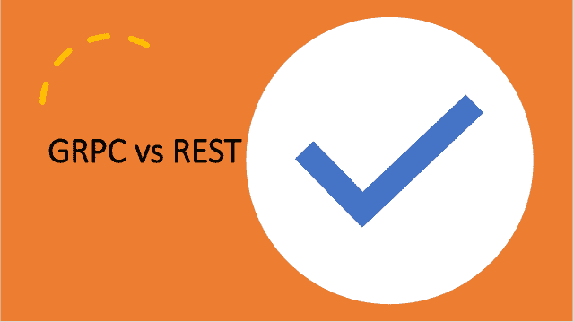

<!--yml
category: 未分类
date: 2024-10-13 06:34:28
-->

# Difference between GRPC and Rest

> 来源：[https://golangbyexample.com/grpc-vs-rest/](https://golangbyexample.com/grpc-vs-rest/)

Table of Contents

 **   [Overview](#Overview "Overview")
*   [Links](#Links "Links")
    *   [GRPC](#GRPC "GRPC")
    *   [REST](#REST "REST")
*   [Protocol](#Protocol "Protocol")
*   [Nature](#Nature "Nature")
*   [Mode of Data Transfer](#Mode_of_Data_Transfer "Mode of Data Transfer")
*   [Model](#Model "Model")
*   [Performance](#Performance "Performance")
*   [Code Generation](#Code_Generation "Code Generation")
*   [Type Safety](#Type_Safety "Type Safety")
*   [SetUP](#SetUP "SetUP")
*   [When To Use](#When_To_Use "When To Use")
*   [Conclusion](#Conclusion "Conclusion")*  *## **Overview**

REST is an architectural style built on top of HTTP/1\. GRPC is not a style instead it is an RPC framework built on top of HTTP/2 and it uses protocol buffers behind the scenes. So basically GRPC is an actual implementation or you can say it is a library whereas REST is just a set of rules and principles.

Although we are comparing a GRPC (implemented framework) with REST -( architectural styles and principles), which might sound weird. Still, it is important to understand the difference in terms of high-level architecture which you will get if you follow one approach over the other

Here are the major differences between the two. Also to mention that this article assumes that you already have some knowledge of GRPC, HTTP2, REST

## Links

### **GRPC**

Here is the link to GRPC for further reading [https://grpc.io/](https://grpc.io/)

### **REST**

Here is the link to REST for further reading – [https://en.wikipedia.org/wiki/Representational_state_transfer](https://en.wikipedia.org/wiki/Representational_state_transfer)

## **Protocol**

*   GRPC is an RPC framework and is built on top of HTTP/2

*   REST architectural style is specified on top of HTTP/1\. All the semantics of HTTP/1.1 has been retained in HTTP/2\. So REST APIs should continue to work even one using HTTP/2

## **Nature**

*   The way of thinking in GRPC is API-oriented or action-oriented. 

*   REST is resource-oriented.

## **Mode of Data Transfer**

*   GRPC supports only Protocol Buffers to transfer data between server and client.

*   REST supports JSON,  XML, and other data formats.  REST can also be made to work with Protocol Buffers trivially.

## **Model**

*   GRPC provides four different ways of communication between client and server. The four different ways are unary, server streaming, client streaming, and bi-directional streaming. So effectively in GRPC both client and server can talk to each other.
    *   Unary – This is the simplest one. The clients send a request and the server sends the response
    *   Client streaming – The client can send a stream of multiple messages while the server is expected to return only a single response to all client requests.
    *   Server Streaming- The client will send only one message while the server can send a stream of messages back to it.
    *   Bi-directional streaming – Both client and server can stream multiple messages. The streaming will be in parallel and with no order. Also, it will be nonblocking. Neither client nor server needs to wait for a response before sending the next message.

*   REST works on the Request-Response model. Basically, you send the request and then you get the response. So REST only provides a unary way of communication. In REST only the client talks to the server.

## **Performance**

*   Since GRPC inherently uses HTTP/2 so all the performance optimizations applied to HTTP/2 automatically are available in GRPC. HTTP/2 has introduced several performance optimizations over HTTP/1 such as
    *   Duplex Streaming
    *   Multiplexing
    *   Headers Compression
    *   etc

        Plus GRPC uses protocol buffers internally and since protocol buffers are binary data and have less size, they are transferred over a network fast. GRPC can utilize each TCP connection very effectively.Due to these two reasons, GRPC is very fast.

*   REST over HTTP/1 will be slower than GRPC. It uses JSON, XML which for representing the same data take more size than protocol buffers.

## **Code Generation**

*   Since GRPC is built on top of protocol buffers it provides automatic code generation. In fact with protocol buffers code generation is a must thing to use GRPC.

*   REST also provides code generation through Swagger, OPEN API but that is just an extra thing provided and it is not as effective as code generation by protocol buffers

## **Type Safety**

*   Since protocol buffers are used for code generation in the case of GRPC.  So that in a way provides type safety to GRPC. GRPC will not allow you to send int for a field where a string is expected. The API contract is defined by the proto file and is strict.

*   REST doesn’t have any such restriction. The API contract is mostly just a document using OPEN API or swagger and hence it is loose.

## **SetUP**

*   GRPC would require you to set up a client locally to be able to make a GRPC call.

*   REST call doesn’t need a client set up. You can make a call using a browser, postman, curl, etc

## **When To Use**

*   GRPC is mostly suitable for internal microservices where low latency and high throughput might be needed. It will not be suitable to currently expose your service as a GRPC as there are no APIs available for external services to integrate. It could be possible in the near future when GRPC is fully evolved.

*   REST is more suitable to expose your APIs to external services.

## **Conclusion**

These are some of the major differences between GRPC and REST. Hope you have liked this article. Please share feedback in the comments.

Note: If you are interested in learning Golang, then for that we have a golang comprehensive tutorial series. Do check it out – [Golang Comprehensive Tutorial Series](https://golangbyexample.com/golang-comprehensive-tutorial/)

*   [go](https://golangbyexample.com/tag/go/)*   [golang](https://golangbyexample.com/tag/golang/)*   [grpc](https://golangbyexample.com/tag/grpc/)*   [rest](https://golangbyexample.com/tag/rest/)*