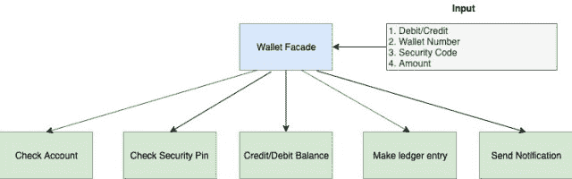
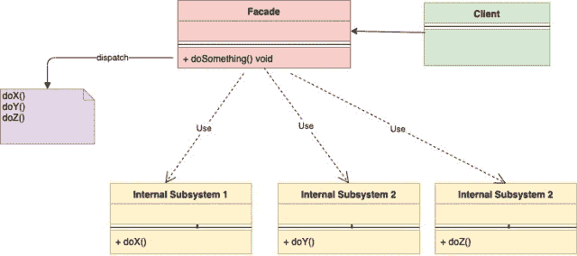
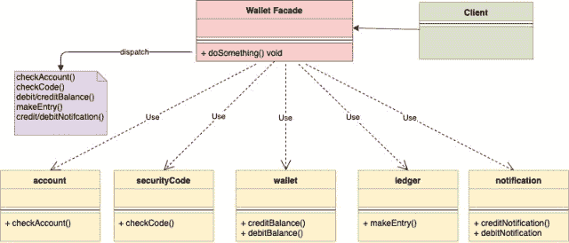

<!--yml
category: 未分类
date: 2024-10-13 06:02:59
-->

# Facade Design Pattern in Go (Golang)

> 来源：[https://golangbyexample.com/facade-design-pattern-in-golang/](https://golangbyexample.com/facade-design-pattern-in-golang/)

Note: Interested in understanding how all other design patterns can be implemented in GO. Please see this full reference – [All Design Patterns in Go (Golang)](https://golangbyexample.com/all-design-patterns-golang/)

Table of Contents

 **   [Definition: ](#Definition "Definition:  ")
*   [Problem Statement:](#Problem_Statement "Problem Statement:")
*   [When to Use:](#When_to_Use "When to Use:")
*   [UML Diagram:](#UML_Diagram "UML Diagram:")
*   [Mapping](#Mapping "Mapping")
*   [Practical Example:](#Practical_Example "Practical Example:")
*   [Full Working Code:](#Full_Working_Code "Full Working Code:")*  *## **Definition: **

Facade Pattern is classified as a structural design pattern. This design pattern is meant to hide the complexities of the underlying system and provide a simple interface to the client. It provides a unified interface to underlying many interfaces in the system so that from the client perspective it is easier to use. Basically it provides a higher level abstraction over a complicated system.

The term **Facade** itself means

**the principal front of a building, that faces on to a street or open space**

Only the front face of the building is shown all the underlying complexity is hidden behind.

Let’s understand the Facade Design Pattern with a simple example. In this era of the digital wallet, when someone actually does a wallet debit/credit there are a lot of things that are happening in the background which the client may not be aware of. Below list illustrates some of the activities which happen during the credit/debit process

*   Check Account
*   Check Security Pin
*   Credit/Debit Balance
*   Make Ledger Entry
*   Send Notification

As can be noticed, there are a lot of things that happen for a single debit/credit operation. This is where the Facade pattern comes into picture. As a client one only needs to enter the Wallet Number, Security Pin, Amount and specify the type of operation. The rest of the things are taken care of in the background. Here we create a **WalletFacade** which provides a simple interface to the client and which takes care of dealing with all underlying operations.

*   

## **Problem Statement:**

*   In order to use the complex system, the client had to know the underlying details. Need to provide a simple interface to the client so that they can use a complex system without knowing any of its inner complex details.

## **When to Use:**

*   When you want to expose a complex system in a simplified way.

          – Like in the above example of credit/debit wallet they need to know only one interface and the rest of the things should be taken care of by that interface.

## **UML Diagram:**

*   

Below is the corresponding mapping UML diagram with the practical example given below

*   

## **Mapping**

The below table represents the mapping from the UML diagram actors to actual implementation actors in code.

| Wallet Facade | walletFacade.go |
| account | account.go |
| securityCode | securityCode.go |
| wallet | wallet.go |
| ledger | ledger.go |
| notification | notification.go |
| Client | main.go |

## **Practical Example:**

**walletFacade.go**

```
package main

import "fmt"

type walletFacade struct {
    account      *account
    wallet       *wallet
    securityCode *securityCode
    notification *notification
    ledger       *ledger
}

func newWalletFacade(accountID string, code int) *walletFacade {
    fmt.Println("Starting create account")
    walletFacacde := &walletFacade{
        account:      newAccount(accountID),
        securityCode: newSecurityCode(code),
        wallet:       newWallet(),
        notification: &notification{},
        ledger:       &ledger{},
    }
    fmt.Println("Account created")
    return walletFacacde
}

func (w *walletFacade) addMoneyToWallet(accountID string, securityCode int, amount int) error {
    fmt.Println("Starting add money to wallet")
    err := w.account.checkAccount(accountID)
    if err != nil {
        return err
    }
    err = w.securityCode.checkCode(securityCode)
    if err != nil {
        return err
    }
    w.wallet.creditBalance(amount)
    w.notification.sendWalletCreditNotification()
    w.ledger.makeEntry(accountID, "credit", amount)
    return nil
}

func (w *walletFacade) deductMoneyFromWallet(accountID string, securityCode int, amount int) error {
    fmt.Println("Starting debit money from wallet")
    err := w.account.checkAccount(accountID)
    if err != nil {
        return err
    }
    err = w.securityCode.checkCode(securityCode)
    if err != nil {
        return err
    }
    err = w.wallet.debitBalance(amount)
    if err != nil {
        return err
    }
    w.notification.sendWalletDebitNotification()
    w.ledger.makeEntry(accountID, "credit", amount)
    return nil
}
```

**account.go**

```
package main

import "fmt"

type account struct {
    name string
}

func newAccount(accountName string) *account {
    return &account{
        name: accountName,
    }
}

func (a *account) checkAccount(accountName string) error {
    if a.name != accountName {
        return fmt.Errorf("Account Name is incorrect")
    }
    fmt.Println("Account Verified")
    return nil
}
```

**securityCode.go**

```
package main

import "fmt"

type securityCode struct {
    code int
}

func newSecurityCode(code int) *securityCode {
    return &securityCode{
        code: code,
    }
}

func (s *securityCode) checkCode(incomingCode int) error {
    if s.code != incomingCode {
        return fmt.Errorf("Security Code is incorrect")
    }
    fmt.Println("SecurityCode Verified")
    return nil
}
```

**wallet.go**

```
package main

import "fmt"

type wallet struct {
    balance int
}

func newWallet() *wallet {
    return &wallet{
        balance: 0,
    }
}

func (w *wallet) creditBalance(amount int) {
    w.balance += amount
    fmt.Println("Wallet balance added successfully")
    return
}

func (w *wallet) debitBalance(amount int) error {
    if w.balance < amount {
        return fmt.Errorf("Balance is not sufficient")
    }
    fmt.Println("Wallet balance is Sufficient")
    w.balance = w.balance - amount
    return nil
}
```

**ledger.go**

```
package main

import "fmt"

type ledger struct {
}

func (s *ledger) makeEntry(accountID, txnType string, amount int) {
    fmt.Printf("Make ledger entry for accountId %s with txnType %s for amount %d", accountID, txnType, amount)
    return
}
```

**notification.go**

```
package main

import "fmt"

type notification struct {
}

func (n *notification) sendWalletCreditNotification() {
    fmt.Println("Sending wallet credit notification")
}

func (n *notification) sendWalletDebitNotification() {
    fmt.Println("Sending wallet debit notification")
}
```

**main.go**

```
package main

import (
    "fmt"
    "log"
)

func main() {
    fmt.Println()
    walletFacade := newWalletFacade("abc", 1234)
    fmt.Println()
    err := walletFacade.addMoneyToWallet("abc", 1234, 10)
    if err != nil {
        log.Fatalf("Error: %s\n", err.Error())
    }
    fmt.Println()
    err = walletFacade.deductMoneyFromWallet("ab", 1234, 5)
    if err != nil {
        log.Fatalf("Error: %s\n", err.Error())
    }
}
```

**Output:**

```
Starting create account
Account created

Starting add money to wallet
Account Verified
SecurityCode Verified
Wallet balance added successfully
Sending wallet credit notification
Make ledger entry for accountId abc with txnType credit for amount 10

Starting debit money from wallet
Account Verified
SecurityCode Verified
Wallet balance is Sufficient
Sending wallet debit notification
Make ledger entry for accountId abc with txnType debit for amount 5 
```

## **Full Working Code:**

```
package main

import (
    "fmt"
    "log"
)

type walletFacade struct {
    account      *account
    wallet       *wallet
    securityCode *securityCode
    notification *notification
    ledger       *ledger
}

func newWalletFacade(accountID string, code int) *walletFacade {
    fmt.Println("Starting create account")
    walletFacacde := &walletFacade{
        account:      newAccount(accountID),
        securityCode: newSecurityCode(code),
        wallet:       newWallet(),
        notification: &notification{},
        ledger:       &ledger{},
    }
    fmt.Println("Account created")
    return walletFacacde
}

func (w *walletFacade) addMoneyToWallet(accountID string, securityCode int, amount int) error {
    fmt.Println("Starting add money to wallet")
    err := w.account.checkAccount(accountID)
    if err != nil {
        return err
    }
    err = w.securityCode.checkCode(securityCode)
    if err != nil {
        return err
    }
    w.wallet.creditBalance(amount)
    w.notification.sendWalletCreditNotification()
    w.ledger.makeEntry(accountID, "credit", amount)
    return nil
}

func (w *walletFacade) deductMoneyFromWallet(accountID string, securityCode int, amount int) error {
    fmt.Println("Starting debit money from wallet")
    err := w.account.checkAccount(accountID)
    if err != nil {
        return err
    }
    err = w.securityCode.checkCode(securityCode)
    if err != nil {
        return err
    }
    err = w.wallet.debitBalance(amount)
    if err != nil {
        return err
    }
    w.notification.sendWalletDebitNotification()
    w.ledger.makeEntry(accountID, "credit", amount)
    return nil
}

type account struct {
    name string
}

func newAccount(accountName string) *account {
    return &account{
        name: accountName,
    }
}

func (a *account) checkAccount(accountName string) error {
    if a.name != accountName {
        return fmt.Errorf("Account Name is incorrect")
    }
    fmt.Println("Account Verified")
    return nil
}

type securityCode struct {
    code int
}

func newSecurityCode(code int) *securityCode {
    return &securityCode{
        code: code,
    }
}

func (s *securityCode) checkCode(incomingCode int) error {
    if s.code != incomingCode {
        return fmt.Errorf("Security Code is incorrect")
    }
    fmt.Println("SecurityCode Verified")
    return nil
}

type wallet struct {
    balance int
}

func newWallet() *wallet {
    return &wallet{
        balance: 0,
    }
}

func (w *wallet) creditBalance(amount int) {
    w.balance += amount
    fmt.Println("Wallet balance added successfully")
    return
}

func (w *wallet) debitBalance(amount int) error {
    if w.balance < amount {
        return fmt.Errorf("Balance is not sufficient")
    }
    fmt.Println("Wallet balance is Sufficient")
    w.balance = w.balance - amount
    return nil
}

type ledger struct {
}

func (s *ledger) makeEntry(accountID, txnType string, amount int) {
    fmt.Printf("Make ledger entry for accountId %s with txnType %s for amount %d\n", accountID, txnType, amount)
    return
}

type notification struct {
}

func (n *notification) sendWalletCreditNotification() {
    fmt.Println("Sending wallet credit notification")
}

func (n *notification) sendWalletDebitNotification() {
    fmt.Println("Sending wallet debit notification")
}

func main() {
    fmt.Println()
    walletFacade := newWalletFacade("abc", 1234)
    fmt.Println()
    err := walletFacade.addMoneyToWallet("abc", 1234, 10)
    if err != nil {
        log.Fatalf("Error: %s\n", err.Error())
    }
    fmt.Println()
    err = walletFacade.deductMoneyFromWallet("abc", 1234, 5)
    if err != nil {
        log.Fatalf("Error: %s\n", err.Error())
    }
} 
```

**Output:**

```
Starting create account
Account created

Starting add money to wallet
Account Verified
SecurityCode Verified
Wallet balance added successfully
Sending wallet credit notification
Make ledger entry for accountId abc with txnType credit for amount 10

Starting debit money from wallet
Account Verified
SecurityCode Verified
Wallet balance is Sufficient
Sending wallet debit notification
Make ledger entry for accountId abc with txnType debit for amount 5 
```

*   [design pattern in go](https://golangbyexample.com/tag/design-pattern-in-go/)*   [design pattern in golang](https://golangbyexample.com/tag/design-pattern-in-golang/)*   [facade](https://golangbyexample.com/tag/facade/)*   [facade design pattern](https://golangbyexample.com/tag/facade-design-pattern/)*   [facade design pattern in go](https://golangbyexample.com/tag/facade-design-pattern-in-go/)*