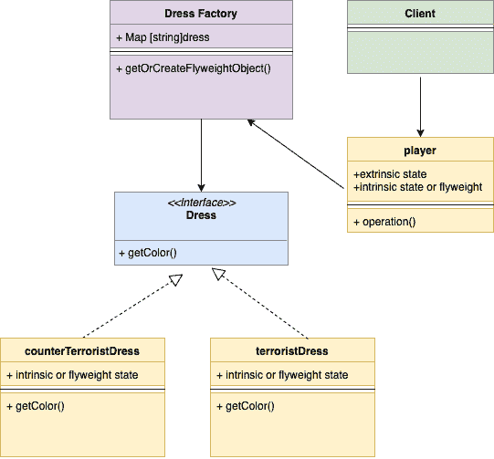

<!--yml
category: 未分类
date: 2024-10-13 06:02:30
-->

# Flyweight Design Pattern in Go (Golang)

> 来源：[https://golangbyexample.com/flyweight-design-pattern-golang/](https://golangbyexample.com/flyweight-design-pattern-golang/)

Note: Interested in understanding how all other design patterns can be implemented in GO. Please see this full reference – [All Design Patterns in Go (Golang)](https://golangbyexample.com/all-design-patterns-golang/)

Table of Contents

 **   [Definition: ](#Definition "Definition:  ")
*   [When to Use:](#When_to_Use "When to Use:")
*   [UML Diagram:](#UML_Diagram "UML Diagram:")
*   [Mapping:](#Mapping "Mapping:")
*   [Practical Example:](#Practical_Example "Practical Example:")*  *## **Definition: **

It is a structural design pattern. This pattern is used when a large number of similar objects need to be created. These objects are called flyweight objects and are immutable.

Let’s first see an example. Flyweight Pattern will be clear after this example.

In a game of Counter-Strike, Terrorist and Counter-Terrorist have a different type of dress. For simplicity, let’s assume that both Terrorist and Counter-Terrorists have one dress type each. The dress object is embedded in the player object as below

Below is the struct for a player, we can see the dress object is embedded in player struct

```
type player struct {
    dress      dress
    playerType string //Can be T or CT
    lat        int
    long       int
}
```

Let’s say there are 5 Terrorists and 5 Counter-Terrorist, so a total of 10 players. Now there are two options with respect to dress

1.  Each of the 10 player objects creates a different dress object and embed them. Total 10 dress objects will be created
2.  We create two dress object
    *   Single Terrorist Dress Object: This will be shared across 5 Terrorist
    *   Single Counter-Terrorist Dress Object: This will be shared across 5 Counter-Terrorist

As you can that in Approach 1, total of 10 dress objects are created while in approach 2 only 2 dress objects are created. The second approach is what we follow in the Flyweight design pattern. The two dress objects which we created are called the flyweight objects. Flyweight pattern takes out the common parts and creates flyweight objects. These flyweight objects (dress here)  can then be shared among multiple objects (player here). This drastically reduces the number of dress objects and the good part is that even if you create more players, still only two dress objects will be sufficient.

In the flyweight pattern, we store the flyweight objects in the map.  Whenever the other objects which share the flyweight objects are created, then flyweight objects are fetched from the map.

**Intrinsic and Extrinsic States**

*   **Intrinsic State –**Dress in the intrinsic state as it can be shared across multiple Terrorist and Counter-Terrorist Objects
*   **Extrinsic State –** Player location and the player weapon is an extrinsic state as it is different for every object.

## **When to Use**:

*   When the objects have some intrinsic properties which can be shared.
    *   As in the above example, dress is the intrinsic property that was taken out and shared.
*   Use flyweight when a large number of objects needs to be created which can cause memory issue. In case figure out all the common or intrinsic state and create flyweight objects for that.

## **UML Diagram**:


Below is the corresponding mapping UML diagram with the example given above



## **Mapping:**

The below table represents the mapping from the UML diagram actors to actual implementation actors in code.

| Flyweight Factory | dressFactory.go |
| Flyweight Interface | dress.go |
| Concrete Flyweight Object 1 | terroristDress.go |
| Concrete Flyweight Object 1 | counterTerroristDress.go |
| Context | player.go |
| Client | main.go |

## **Practical Example**:

**dressFactory.go**

```
package main

import "fmt"

const (
    //TerroristDressType terrorist dress type
    TerroristDressType = "tDress"
    //CounterTerrroristDressType terrorist dress type
    CounterTerrroristDressType = "ctDress"
)

var (
    dressFactorySingleInstance = &dressFactory{
        dressMap: make(map[string]dress),
    }
)

type dressFactory struct {
    dressMap map[string]dress
}

func (d *dressFactory) getDressByType(dressType string) (dress, error) {
    if d.dressMap[dressType] != nil {
        return d.dressMap[dressType], nil
    }
    if dressType == TerroristDressType {
        d.dressMap[dressType] = newTerroristDress()
        return d.dressMap[dressType], nil
    }
    if dressType == CounterTerrroristDressType {
        d.dressMap[dressType] = newCounterTerroristDress()
        return d.dressMap[dressType], nil
    }
    return nil, fmt.Errorf("Wrong dress type passed")
}

func getDressFactorySingleInstance() *dressFactory {
    return dressFactorySingleInstance
}
```

**dress.go**

```
package main

type dress interface {
    getColor() string
}
```

**terroristDress.go**

```
package main

type terroristDress struct {
	color string
}

func (t *terroristDress) getColor() string {
	return t.color
}

func newTerroristDress() *terroristDress {
	return &terroristDress{color: "red"}
} 
```

**counterTerroristDress.go**

```
package main

type counterTerroristDress struct {
    color string
}

func (c *counterTerroristDress) getColor() string {
    return c.color
}

func newCounterTerroristDress() *counterTerroristDress {
    return &counterTerroristDress{color: "green"}
}
```

**player.go**

```
package main

type player struct {
    dress      dress
    playerType string
    lat        int
    long       int
}

func newPlayer(playerType, dressType string) *player {
    dress, _ := getDressFactorySingleInstance().getDressByType(dressType)
    return &player{
        playerType: playerType,
        dress:      dress,
    }
}

func (p *player) newLocation(lat, long int) {
    p.lat = lat
    p.long = long
}
```

**main.go**

```
package main

import "fmt"

func main() {
    game := newGame()
    //Add Terrorist
    game.addTerrorist(TerroristDressType)
    game.addTerrorist(TerroristDressType)
    game.addTerrorist(TerroristDressType)
    game.addTerrorist(TerroristDressType)
    //Add CounterTerrorist
    game.addCounterTerrorist(CounterTerrroristDressType)
    game.addCounterTerrorist(CounterTerrroristDressType)
    game.addCounterTerrorist(CounterTerrroristDressType)
    dressFactoryInstance := getDressFactorySingleInstance()
    for dressType, dress := range dressFactoryInstance.dressMap {
        fmt.Printf("DressColorType: %s\nDressColor: %s\n", dressType, dress.getColor())
    }
}
```

**Output:**

```
DressColorType: ctDress
DressColor: green
DressColorType: tDress
DressColor: red
```

*   [design pattern](https://golangbyexample.com/tag/design-pattern/)*   [flyweight design pattern](https://golangbyexample.com/tag/flyweight-design-pattern/)*   [go](https://golangbyexample.com/tag/go/)*