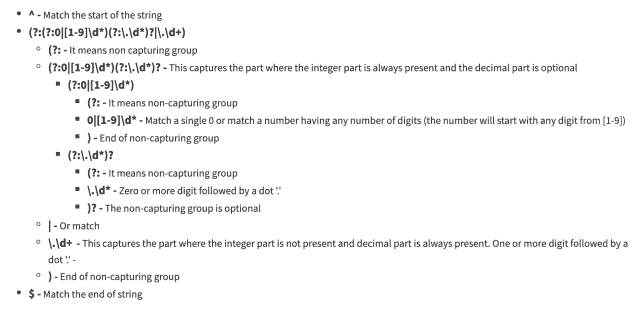

<!--yml
category: 未分类
date: 2024-10-13 06:38:19
-->

# Golang Regex: Match a floating-point number in Regular Expression

> 来源：[https://golangbyexample.com/golang-regex-floating-point-number/](https://golangbyexample.com/golang-regex-floating-point-number/)

Table of Contents

 **   [Overview](#Overview "Overview")
*   [Program](#Program "Program")*  *## **Overview**

A floating-point number could have below properties

*   It could have a negative and positive sign

*   The integer part could be optional when the decimal part is present

*   The dot and decimal part could be optional if the integer part is present

*   It could have an exponent or not

So below are valid floating-point numbers

```
1.2
.12
12
12.
+1.2
-1.2
1.2e3
```

Below are invalid floating points 

*   An empty string

*   + or – sign only

*   A single dot

*   A prefix of multiple 0\. For eg 00.1 or 001

*   Anything like +. or –

*   A dot just before exponent.  Eg 1.e2

*   Any other char before or after the floating-point number. Eg a1.3 or a1.3b or 1.3b

Below are examples of invalid floats

```
""
.
00.1
001
+
-
+.
-.
1.e2
a1.2
1.2b
a1.2b
```

Let’s first see a simple regex which only matches only the integer, dot, and decimal parts.

```
^(?:(?:0|[1-9]\d*)(?:\.\d*)?|\.\d+)$
```

On a high level, the entire regex has two parts which are in OR relation

*   **(?:0|[1-9]\d*)(?:\.\d*)? –** This captures the part where the integer part is always present and the decimal part is optional

*   **\.\d+ –** This captures the part where the integer part is not present and the decimal part is always present.

Let’s dissect this regex



Let’s make it more complex by having it accept a negative or a positive sign. Note that negative or positive sign is optional

```
^[+\-]?(?:(?:0|[1-9]\d*)(?:\.\d*)?|\.\d+)$
```

The regex is the same as the earlier regex. We just added the optional positive negative sign in front

*   **[+\-] –** Match either positive or negative sign.

*   **?** – Matching either positive or negative sign is optional

Let’s also add an exponent part to the regex. Again note that the exponent part is optional. This regex is the same as the previous regex. We just added the exponent part at the end

```
^[+\-]?(?:(?:0|[1-9]\d*)(?:\.\d*)?|\.\d+)(?:\d[eE][+\-]?\d+)?$
```

Let’s dissect the exponent part

*   **(?: –** It means non-capturing group
*   **\d** – Match one digit. This is to prevent numbers like 1.e2
*   **[eE]** – Match either lowercase e or uppercase E
*   **[+\-] –** Match either positive or negative sign. The matching either positive or negative sign is optional
*   **\d+ –** Match zero or more digits
*   **)? –** Entire regex  expression is optional

## **Program**

Now see an example of this regular expression in action

```
package main

import (
	"fmt"
	"regexp"
)

func main() {
	sampleRegex := regexp.MustCompile(`^[+\-]?(?:(?:0|[1-9]\d*)(?:\.\d*)?|\.\d+)(?:\d[eE][+\-]?\d+)?$`)

	fmt.Println("Valid Inputs")
	match := sampleRegex.MatchString("1.2")
	fmt.Printf("For 1.2: %t\n", match)

	match = sampleRegex.MatchString(".12")
	fmt.Printf("For .12: %t\n", match)

	match = sampleRegex.MatchString("12")
	fmt.Printf("For 12: %t\n", match)

	match = sampleRegex.MatchString("12.")
	fmt.Printf("For 12.: %t\n", match)

	match = sampleRegex.MatchString("+1.2")
	fmt.Printf("For +1.2.: %t\n", match)

	match = sampleRegex.MatchString("-1.2")
	fmt.Printf("For -1.2.: %t\n", match)

	match = sampleRegex.MatchString("1.2e3")
	fmt.Printf("For 1.2e3.: %t\n", match)

	fmt.Println("\nInValid Inputs")
	match = sampleRegex.MatchString(".")
	fmt.Printf("For .: %t\n", match)

	match = sampleRegex.MatchString("")
	fmt.Printf("For empty string: %t\n", match)

	match = sampleRegex.MatchString("00.1")
	fmt.Printf("For 00.1: %t\n", match)

	match = sampleRegex.MatchString("001")
	fmt.Printf("For 001 %t\n", match)

	match = sampleRegex.MatchString("+")
	fmt.Printf("For +: %t\n", match)

	match = sampleRegex.MatchString("-")
	fmt.Printf("For -: %t\n", match)

	match = sampleRegex.MatchString("+.")
	fmt.Printf("For +.: %t\n", match)

	match = sampleRegex.MatchString("-.")
	fmt.Printf("For -.: %t\n", match)

	match = sampleRegex.MatchString("1.e2")
	fmt.Printf("For 1.e2: %t\n", match)

	match = sampleRegex.MatchString(".e2")
	fmt.Printf("For .e2: %t\n", match)

	match = sampleRegex.MatchString("a1.2")
	fmt.Printf("For a1.2 %t\n", match)

	match = sampleRegex.MatchString("1.2b")
	fmt.Printf("For 1.2b %t\n", match)

	match = sampleRegex.MatchString("a1.2b")
	fmt.Printf("For a1.2b %t\n", match)
}
```

**Output**

```
Valid Inputs
For 1.2: true
For .12: true
For 12: true
For 12.: true
For +1.2.: true
For -1.2.: true
For 1.2e3.: true

InValid Inputs
For .: false
For empty string: false
For 00.1: false
For 001 false
For +: false
For -: false
For +.: false
For -.: false
For 1.e2: false
For .e2: false
For a1.2 false
For 1.2b false
For a1.2b false
```

For all the valid inputs discussed above the program prints true

```
Valid Inputs
For 1.2: true
For .12: true
For 12: true
For 12.: true
For +1.2.: true
For -1.2.: true
For 1.2e3.: true
```

And for all the invalid inputs discussed above it gives false

```
InValid Inputs
For .: false
For empty string: false
For 00.1: false
For 001 false
For +: false
For -: false
For +.: false
For -.: false
For 1.e2: false
For .e2: false
For a1.2 false
For 1.2b false
For a1.2b false
```

Please try it out and post in the comments if in any case, this regex doesn’t work.

The above regex is used to validate if a given string is a number. If you want to find if an input string contains a number as a substring then we need to remove the anchor characters at the start and the end which is removing the **caret (^)** at the start and the dollar **($)** character at the end

So the regex will be

```
[+\-]?(?:(?:0|[1-9]\d*)(?:\.\d*)?|\.\d+)(?:\d[eE][+\-]?\d+)?
```

This is all about matching floating point numbers through regex in golang. Hope you have liked this article. Please share feedback in the comments.

Also, check out our Golang advance tutorial Series – [Golang Advance Tutorial](https://golangbyexample.com/golang-comprehensive-tutorial/)

*   [floating](https://golangbyexample.com/tag/floating/)*   [go](https://golangbyexample.com/tag/go/)*   [golang](https://golangbyexample.com/tag/golang/)*   [number](https://golangbyexample.com/tag/number/)*   [point](https://golangbyexample.com/tag/point/)*   [regex](https://golangbyexample.com/tag/regex/)*