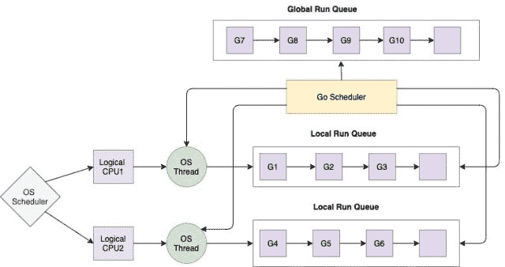

<!--yml
category: 未分类
date: 2024-10-13 06:23:18
-->

# Goroutines in Go (Golang)

> 来源：[https://golangbyexample.com/goroutines-golang/](https://golangbyexample.com/goroutines-golang/)

This is the  chapter 23 of the golang comprehensive tutorial series. Refer to this link for other chapters of the series – [Golang Comprehensive Tutorial Series](https://golangbyexample.com/golang-comprehensive-tutorial/)

**Next Tutorial** – [Channel](https://golangbyexample.com/channel-golang/)
**Previous Tutorial** – [Iota](https://golangbyexample.com/iota-in-golang)

Now let’s check out the current tutorial. Below is the table of contents for current tutorial.

Table of Contents

 **   [Overview](#Overview "Overview")
*   [Start a go routine](#Start_a_go_routine "Start a go routine")
*   [Main goroutine](#Main_goroutine "Main goroutine")
*   [Creating Multiple Goroutines](#Creating_Multiple_Goroutines "Creating Multiple Goroutines")
*   [Scheduling of the goroutines](#Scheduling_of_the_goroutines "Scheduling of the goroutines")
    *   [Local run queue](#Local_run_queue "Local run queue ")
    *   [Global Run Queue](#Global_Run_Queue "Global Run Queue")
*   [Golang scheduler is a Cooperative Scheduler](#Golang_scheduler_is_a_Cooperative_Scheduler "Golang scheduler is a Cooperative Scheduler")
*   [Advantages of goroutines over threads](#Advantages_of_goroutines_over_threads "Advantages of goroutines over threads")
*   [Anonymous Goroutines](#Anonymous_Goroutines "Anonymous Goroutines")
*   [Conclusion](#Conclusion "Conclusion")*  *# **Overview**

Goroutines can be thought of as a lightweight thread that has a separate independent execution and which can execute concurrently with other goroutines. It is a function or method that is executing concurrently with other goroutines. It is entirely managed by the GO runtime. Golang is a concurrent language. Each goroutine is an independent execution.  It is goroutine that helps achieve concurrency in golang

# **Start a go routine**

Golang uses a special keyword **‘go’**  for starting a goroutine. To start one just add **go** keyword before a function or method call. That function or method will now be executed in the goroutine.  Note that it is not the function or method which determines if it is a goroutine. If we call that method or function with a go keyword then that function or method is said to be executing in a goroutine.

Let’s understand the difference between normal running a function and running a function as a goroutine.

*   Normal Running a function

```
statment1
start()
statement2
```

In the normal running of a function for the above scenario.

1.  First, **statement1** will be executed
2.  Then **start()** function will be called
3.  Once the start() function finishes then **statement2** will be executed

*   Running a function as a goroutine

```
statment1
go start()
statement2
```

In running a function as a goroutine for the above scenario

1.  First, statement1 will be executed
2.  Then function start() will be called as a goroutine which will execute asynchronously.
3.  **statement2** will be executed immediately. It will not wait for **start()** function to complete. The start function will be executed concurrently as a goroutine while the rest of the program continues its execution.

So basically when calling a function as a goroutine, call will return immediately the execution will continue from the next line while the goroutine will be executed concurrently in the background. Also note that any return value from the goroutine will be ignored.

Let’s see a program to understand the above point

```
package main

import (
    "fmt"
    "time"
)

func main() {
    go start()
    fmt.Println("Started")
    time.Sleep(1 * time.Second)
    fmt.Println("Finished")
}

func start() {
    fmt.Println("In Goroutine")
}
```

**Output**

```
Started
In Goroutine
Finished
```

In above program we use the ‘go’ keyword before a function call to start a goroutine.

```
go start()
```

The above line will start a goroutine which will run the **start()** function. The program first prints “Started”. Notice that the line in which we print “Started” is after the goroutine is started. This illustrates the point mentioned above that after a goroutine is started the call is continued from the next line. We then put a timeout. The timeout is there so that the goroutine gets scheduled before the main goroutine has existed.  So now goroutine executes and it prints

```
In Goroutine
```

Then it prints

```
Finished
```

What happens when we remove the timeout.  Let’s see a program. 

```
package main
import (
    "fmt"
)
func main() {
    go start()
    fmt.Println("Started")
    fmt.Println("Finished")
}
func start() {
    fmt.Println("In Goroutine")
}
```

**Output**

```
Started
Finished
```

The program above never prints

```
In Goroutine
```

That means that the goroutine never got executed . This is because the main goroutine or the program exited before the goroutine can be scheduled. That brings into discussion about the main goroutine

# **Main goroutine**

The **main** function in the **main** package is the main goroutine. All  goroutines are started from the main goroutine. These goroutines can then start multiple other goroutine and so on.

The main goroutine represents the main program. Once it exits then it means that the program has exited.

Goroutines don’t have parents or children. When you start a goroutine it just executes alongside all other running goroutines. Each goroutine exits only when its function returns. The only exception to that is that all goroutines exit when the main goroutine (the one that runs function **main**) exits.

Let’s see a program to demonstrate that goroutines don’t have parents or children.

```
package main

import (
    "fmt"
    "time"
)

func main() {
    go start()
    fmt.Println("Started")
    time.Sleep(1 * time.Second)
    fmt.Println("Finished")
}

func start() {
    go start2()
    fmt.Println("In Goroutine")
}
func start2() {
    fmt.Println("In Goroutine2")
}
```

**Output**

```
Started
In Goroutine
In Goroutine2
Finished
```

In the above program, the first goroutine starts the second goroutine. The first goroutine then prints **“In Goroutine”** and then it exits. The second goroutine then starts and prints **“In Goroutine2”**. It shows that goroutines don’t have parents or children and they exist as an independent execution. 

Also, please note that Timeout was just for illustration and should never be used in a production environment. 

# **Creating Multiple Goroutines**

Let’s see below program to start multiple goroutines. This example will also demonstrate that goroutines are executed concurrently

```
package main

import (
    "fmt"
    "time"
)

func execute(id int) {
    fmt.Printf("id: %d\n", id)
}

func main() {
    fmt.Println("Started")
    for i := 0; i < 10; i++ {
        go execute(i)
    }
    time.Sleep(time.Second * 2)
    fmt.Println("Finished")
}
```

**Output**

```
Started
id: 4
id: 9
id: 1
id: 0
id: 8
id: 2
id: 6
id: 3
id: 7
id: 5
Finished
```

The above program will spawn 10 goroutines in a loop. Every time you will run the program it will give different outputs since the goroutines will be run concurrently and it is not deterministic which will run first.

Lets understand the working of go scheduler. Understanding goroutines will be much easier after that.

# **Scheduling of the goroutines**

Once the go program starts,  go runtime will launch OS threads equivalent to the number of number of logical CPUs usable by the current process.  There is one logical CPU per virtual core where virtual core means

```
virtual_cores = x*number_of_physical_cores
```

where x=number of hardware threads per core

The **runtime.Numcpus** function can be used to get the the number of logical processors available to the GO program. See below program

```
package main
import (
    "fmt"
    "runtime"
)
func main() {
    fmt.Println(runtime.NumCPU())
}
```

On my machine it prints 16 . My machine has 8 physical cores with 2 hardware thread per core. Hence 2*8 = 16.

The go program will launch OS threads equal to the number of logical CPUs available to it or the output of runtime.NumCPU(). These threads will be managed by the OS and scheduling of these threads onto CPU cores is the responsibility of OS only. 

The go runtime has its own scheduler that will multiplex the groutines on the OS level threads in the go runtime. So essentially each goroutine is running on an OS thread that is assigned to a logical CPU

There are two queues involved for managing the goroutines and assigning it to the OS threads

## **Local run queue**

Within go runtime each of this OS thread will have one queue associated with it. It is called Local Run Queue. It contains all the goroutines that will be executed in the context of that thread. The go runtime will be doing the scheduling and context switching of the goroutines belonging to a particular LRQ to the corresponding OS level thread which owns this LRQ

## **Global Run Queue**

It contains all the goroutines that haven't been moved to any LRQ of any OS thread. The Go scheduler will assign a goroutine from this queue to the Local Run Queue of any OS thread

Below diagram depicits how the scheduler works.



# **Golang scheduler is a Cooperative Scheduler**

The go scheduler is a cooperative scheduler. Means that is non-preemptive one.  There is no time based preemption that is happening which is the case with a preemptive scheduler.  In a cooperative scheduler threads have to explicitly yield execution. There are some specific check points where goroutine can yield its execution to other goroutine.

The runtime calls the scheduler on function calls to decide weather a new goroutine needs to be scheduled . So basically when a goroutine makes any function call, in that case scheduler will be called and context switch might happen meaning a new goroutine might be scheduled . It is also possible that existing goroutine also continues execution.  The scheduler also gets the opportunity for contexts switch on below events too

1.  Functions Call
2.  Garbage Collection
3.  Network Calls
4.  Channel operations
5.  On using go keyword
6.  Blocking on primitives such as mutex etc

It is to mention that scheduler runs during above events but it doesn't mean that context switch will happen. It is just that the scheduler gets the opportunity. It is up to the scheduler then weather to do a context switch or not.

# **Advantages of goroutines over threads**

*   Goroutines starts with 8kb in size and its size can grow or shrink based upon runtime requirements.  Whereas OS threads are more than 1 mb in size. So goroutines are extremely cheap to allocate. Hence a large number of goroutines can be launched at once. The shrinking and growing of a goroutine is managed by the go runtime internally. Since goroutines are cheap you can launch hundred thousands of go routines while you can only launch few thousands threads.

*   Goroutine scheduling is by go runtime. As discussed above, the go runtime internally launches os threads equivalent to the number of logical CPU.  Then it reschedules the goroutines onto each of OS threads. So the scheduling of goroutines is done by go runtime and hence it is quite faster. In case of threads the the scheduling of threads is done by OS runtime. Hence the context switching time of goroutines is much faster than context switching time of threads. So thousand of goroutines are multiplexed on one or two OS threads. If you launch 1000 threads in JAVA then it would consume lot of resources and these 1000 threads needs to be managed by OS. Moreover each of these threads will be more than 1 MB in size

*   Goroutines communicate through built in primivate channel which are built to handle race conditions. Hence the communication between go routines is safe and prevent explicit locking. So the data structure that is shared between goroutines doesn't have to be locked. Threaded programming uses locks in order to access a shared variable. These can to lead to deadlocks and race conditions which are difficult to detect.  As compared goroutines uses channel for communication and the entire synchronization is managed by go runtime. In this way deadlocks and race conditons are avoided. Infact go believes in the mantra

```
"Don't share memory for communication, instead share memory by communicating"
```

# **Anonymous Goroutines**

Anonymous functions in golang can also be called using goroutine. Refer to this article for understanding more about anonymous functions - [https://golangbyexample.com/go-anonymous-function/](https://golangbyexample.com/go-anonymous-function/)

Below is the format for calling a anonymous function in a goroutine

```
go func(){
   //body
}(args..)
```

There is no difference in behaviour though when calling a anonymous function using goroutine or calling a normal function using goroutine

Let's see an example:

```
package main

import (
    "fmt"
    "time"
)

func main() {
    go func() {
        fmt.Println("In Goroutine")
    }()

    fmt.Println("Started")
    time.Sleep(1 * time.Second)
    fmt.Println("Finished")
}
```

**Output**

```
Started
In Goroutine
Finished
```

# **Conclusion**

This was all about goroutines in golang. Hope you have liked this tutorial. Please share feedback/improvements/mistakes in comments

**Next Tutorial** – [Channel](https://golangbyexample.com/channel-golang/)
**Previous Tutorial** – [Iota](https://golangbyexample.com/iota-in-golang)

*   [go](https://golangbyexample.com/tag/go/)*   [golang](https://golangbyexample.com/tag/golang/)*