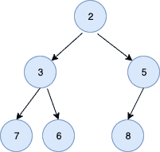

<!--yml
category: 未分类
date: 2024-10-13 06:06:01
-->

# HeapSort in Golang

> 来源：[https://golangbyexample.com/heapsort-in-golang/](https://golangbyexample.com/heapsort-in-golang/)

Table of Contents

 **   [Introduction](#Introduction "Introduction")
*   [Steps for HeapSort:](#Steps_for_HeapSort "Steps for HeapSort:")
*   [Full Working Code](#Full_Working_Code "Full Working Code")
*   [Time Complexity](#Time_Complexity "Time Complexity")*  *# **Introduction**

HeapSort is a comparison-based sorting algorithm that uses the Heap Data Structure. Please refer to this link for more information about Heap –[https://golangbyexample.com/heap-in-golang/](https://golangbyexample.com/heap-in-golang/)

We demonstrate the heapsort in this article using min-heap. The same can be achieved using max heap as well.

*   Left Child – 2*i + 1
*   Right Child – 2*i + 2

Below is a representation of a minheap



# **Steps for HeapSort:**

*   Build minheap. After the minheap is built, the first element becomes the smallest

*   Move the first element to the last in the array. Call heapify again with size-1\. Repeat it for the size of the array

*   The final array is sorted from largest to smallest

# **Full Working Code**

```
package main

import "fmt"

type minheap struct {
    arr []int
}

func newMinHeap(arr []int) *minheap {
    minheap := &minheap{
        arr: arr,
    }
    return minheap
}

func (m *minheap) leftchildIndex(index int) int {
    return 2*index + 1
}

func (m *minheap) rightchildIndex(index int) int {
    return 2*index + 2
}

func (m *minheap) swap(first, second int) {
    temp := m.arr[first]
    m.arr[first] = m.arr[second]
    m.arr[second] = temp
}

func (m *minheap) leaf(index int, size int) bool {
    if index >= (size/2) && index <= size {
        return true
    }
    return false
}

func (m *minheap) downHeapify(current int, size int) {
    if m.leaf(current, size) {
        return
    }
    smallest := current
    leftChildIndex := m.leftchildIndex(current)
    rightRightIndex := m.rightchildIndex(current)
    if leftChildIndex < size && m.arr[leftChildIndex] < m.arr[smallest] {
        smallest = leftChildIndex
    }
    if rightRightIndex < size && m.arr[rightRightIndex] < m.arr[smallest] {
        smallest = rightRightIndex
    }
    if smallest != current {
        m.swap(current, smallest)
        m.downHeapify(smallest, size)
    }
    return
}

func (m *minheap) buildMinHeap(size int) {
    for index := ((size / 2) - 1); index >= 0; index-- {
        m.downHeapify(index, size)
    }
}

func (m *minheap) sort(size int) {
    m.buildMinHeap(size)
    for i := size - 1; i > 0; i-- {
        // Move current root to end
        m.swap(0, i)
        m.downHeapify(0, i)
    }
}

func (m *minheap) print() {
    for _, val := range m.arr {
        fmt.Println(val)
    }
}

func main() {
    inputArray := []int{6, 5, 3, 7, 2, 8, -1}
    minHeap := newMinHeap(inputArray)
    minHeap.sort(len(inputArray))
    minHeap.print()
    fmt.Scanln()
}
```

**Output:**

```
8
7
6
5
3
2
-1
```

# **Time Complexity**

Time Complexity of Heap Sort is  O(nLogn).

*   [go](https://golangbyexample.com/tag/go/)*   [heapsort](https://golangbyexample.com/tag/heapsort/)*   [heapsort in go](https://golangbyexample.com/tag/heapsort-in-go/)*