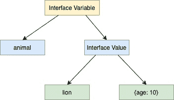

<!--yml
category: 未分类
date: 2024-10-13 06:22:01
-->

# Interface in Go (Golang)

> 来源：[https://golangbyexample.com/interface-in-golang/](https://golangbyexample.com/interface-in-golang/)

This is the  chapter 21 of the golang comprehensive tutorial series. Refer to this link for other chapters of the series – [Golang Comprehensive Tutorial Series](https://golangbyexample.com/golang-comprehensive-tutorial/)

**Next Tutorial** – [Iota](https://golangbyexample.com/iota-in-golang)
**Previous Tutorial** – [Method](https://golangbyexample.com/method-in-golang/)

Now let’s check out the current tutorial. Below is the table of contents for current tutorial.

Table of Contents

 **   [Overview](#Overview "Overview")
*   [Implementing an Interface](#Implementing_an_Interface "Implementing an Interface")
*   [Interface are implemented implicitly](#Interface_are_implemented_implicitly "Interface are implemented implicitly")
*   [Interface types as argument to a function](#Interface_types_as_argument_to_a_function "Interface types as argument to a function")
*   [Why Interface](#Why_Interface "Why Interface")
*   [Pointer Receiver  while implementing an interface](#Pointer_Receiver_while_implementing_an_interface "Pointer Receiver  while implementing an interface")
*   [Non-struct Custom Type Implementing an interface](#Non-struct_Custom_Type_Implementing_an_interface "Non-struct Custom Type Implementing an interface")
*   [Type Implementing multiple interfaces](#Type_Implementing_multiple_interfaces "Type Implementing multiple interfaces")
*   [Zero Value of Interface](#Zero_Value_of_Interface "Zero Value of Interface")
*   [Inner Working of Interface](#Inner_Working_of_Interface "Inner Working of Interface")
*   [Embedding Interfaces](#Embedding_Interfaces "Embedding Interfaces")
    *   [Embedding interface in other interface](#Embedding_interface_in_other_interface "Embedding interface in other interface")
    *   [Embedding interface in a struct](#Embedding_interface_in_a_struct "Embedding interface in a struct")
*   [Access Underlying Variable of Interface](#Access_Underlying_Variable_of_Interface "Access Underlying Variable of Interface")
    *   [Type Assertion](#Type_Assertion "Type Assertion")
    *   [Type Switch](#Type_Switch "Type Switch")
*   [Empty interface](#Empty_interface "Empty interface")
*   [Conclusion](#Conclusion "Conclusion")*  *# **Overview**

Interface is a type in Go which is a collection of method signatures. These collections of method signatures are meant to represent certain behaviour. The interface declares only the method set and any type which implements all methods of the interface is of that interface type.

Interface lets you use duck typing in golang. Now, what is duck typing?

Duck typing is a way in computer programming which lets you do duck test where we do not check type instead we check the only presence of some attributes or methods. So what really matters is whether an object has certain attributes and methods and not its type.

Duck typing comes from the below phrase

```
If it walks like a duck and quack like a duck then it must be duck
```

Coming back to interface again. So what is interface?  As mentioned before also it is a collection of method signatures. It defines the exact set of methods that a type might have. Below is the signature of an interface, it has only method signatures

```
type name_of_interface interface{
//Method signature 1
//Method signature 2
}
```

Let’s understand the concept with the help of an example. Things will be more clear then. Let’s define an interface named **animal.** The **animal** interface has two methods **breathe** and **walk**. It defines only the method signatures and nothing else.

```
type animal interface {
    breathe()
    walk()
}
```

A method signature would include

*   Name of the method

*   Number of arguments and type of each argument

*   Number of return values and type of each return value

With the above declaration, we created a new interface type i.e **animal.** It is ok to define a variable of **animal** type.

Let’s create a variable of **animal** interface type.

```
package main

import "fmt"

type animal interface {
    breathe()
    walk()
}

func main() {
    var a animal
    fmt.Println(a)
}
```

**Output**

```
nil
```

As seen in the above program it is ok to create a variable of interface type. It prints nil as the default zero value of an interface is nil.

# **Implementing an Interface**

Any type which implements the breathe and walk method then it is said to implement the **animal** interface. So if we define a **lion** struct and implements the breathe and walk method then it will implement the animal interface.

```
package main

import "fmt"

type animal interface {
    breathe()
    walk()
}

type lion struct {
    age int
}

func (l lion) breathe() {
    fmt.Println("Lion breathes")
}

func (l lion) walk() {
    fmt.Println("Lion walk")
}

func main() {
    var a animal
    a = lion{age: 10}
    a.breathe()
    a.walk()
}
```

**Output**

```
Lion breathes
Lion walk
```

We declare a variable of animal interface type

```
var a animal
```

Then we assign an instance of lion struct to it.

```
a = lion{}
```

Assigning an instance of **lion** struct to a variable of **animal** interface type works because **lion** struct implements both **breathe** and **walk** method of the animal. The type is not checked during this assignment, instead, it is enough to check that the type assigned does implement **breathe** and **walk** method.  The concept is similar to duck typing,  a **lion** can **breathe** and **walk** like an **animal** and hence it is an **animal**.

If you notice that there is no explicit declaration that the lion type implements the animal interface. This brings a very important property related to interface – ‘Interface are implemented implicitly

# **Interface are implemented implicitly**

There is no explicit declaration that a type implements an interface. In fact, in Go there doesn’t exist any **“implements”** keyword similar to Java.  A type implements an interface if it implements all the methods of the interface.

As seen above, It is correct to define a variable of an interface type and we can assign any concrete type value to this variable if the concrete type implements all the methods of the interface.

There is no explicit declaration that says that **lion** struct implements the **animal** interface. During compilation, go notices that **lion** struct implements all methods of **animal** interface hence it is allowed. Any other type which implements all methods of the **animal** interface becomes of that interface type.

Let’s see a more complex example of another type implementing the animal interface.

If we define a **dog** struct and it implements the **breathe** and **walk** method then it will also be an animal.

```
package main

import "fmt"

type animal interface {
    breathe()
    walk()
}

type lion struct {
     age int
}

func (l lion) breathe() {
    fmt.Println("Lion breathes")
}

func (l lion) walk() {
    fmt.Println("Lion walk")
}

type dog struct {
     age int
}

func (l dog) breathe() {
    fmt.Println("Dog breathes")
}

func (l dog) walk() {
    fmt.Println("Dog walk")
}

func main() {
    var a animal

    a = lion{age: 10}
    a.breathe()
    a.walk()

    a = dog{age: 5}
    a.breathe()
    a.walk()
}
```

**Output**

```
Lion breathes
Lion walk
Dog breathes
Dog walk
```

Both **lion** and **dog** implement the breathe and walk method hence they are of animal type and can correctly be assigned to a variable of interface type.

The **animal** interface variable a was assigned a **lion** instance first and then the same variable was assigned a **dog** instance. So the type which interface variable refers to is dynamic.  It dynamically holds a reference to the underlying type.

Two important points to note:

*   The interface static check is done during compile time – means that if a type doesn’t implement all the methods of an interface, then assigning the type instance to a variable of that interface type will raise an error during compile time. Eg. on deleting the walk method defined on lion struct, below error will be raised during the assignment

```
cannot use lion literal (type lion) as type animal in assignment:
```

*   The correct method based on the type of instance is called at run time – means that the method of either lion or dog is called depending upon whether interface variable refers to an instance of lion or dog. If it refers to an instance of lion, then lion’s method is called and if it refers to an instance of dog, then dog’s method is called. That is also proven from the output. This is a way to achieve runtime polymorphism in Go.

It is also to be noted that the methods defined by the type,  should match the entire signature of methods in the interface ie., it should match

*   Name of the method

*   Number of arguments and type of each argument

*   Number of return values and type of each return value

Imagine that **animal** interface has another method **speed** which returns the int value of speed of the animal

```
type animal interface {
    breathe()
    walk()
    speed() int
}
```

If the **lion** struct has **speed** method as below which does not return the int value, then the **lion** struct will not implement **animal** interface

```
func (l lion) speed()
```

Below compilation error will be raised on assigning the lion instance to a variable of type animal

```
cannot use lion literal (type lion) as type animal in assignment:
        lion does not implement animal (wrong type for speed method)
                have speed()
                want speed() int
```

So in essence, method signatures are important while implementing an interface

# **Interface types as argument to a function**

A function can accept an argument of an interface type. Any type which implements that interface can be passed as that argument to that function. For example, in the below code, we have **callBreathe** and **callWalk** function which accept an argument of **animal** interface type. Both **lion** and **dog** instance can be passed to this function. We create an instance of both lion and dog type and pass it to the function.

It works similarly to the assignment we discussed above. During compilation no type is checked while calling the function,  instead, it is enough to check that the type passed to the function does implement **breathe** and **walk** method.

```
package main

import "fmt"

type animal interface {
	breathe()
	walk()
}

type lion struct {
     age int
}

func (l lion) breathe() {
	fmt.Println("Lion breathes")
}

func (l lion) walk() {
	fmt.Println("Lion walk")
}

type dog struct {
     age int
}

func (l dog) breathe() {
	fmt.Println("Dog breathes")
}

func (l dog) walk() {
	fmt.Println("Dog walk")
}

func main() {
	l := lion{age: 10}
	callBreathe(l)
	callWalk(l)

	d := dog{age: 5}
	callBreathe(d)
	callWalk(d)
}

func callBreathe(a animal) {
	a.breathe()
}

func callWalk(a animal) {
	a.breathe()
}
```

**Output**

```
Lion breathes
Lion walk
Dog breathes
Dog walk
```

In the above code, we have **callBreathe** and **callWalk** function which accept an argument of **animal** interface type. Both **lion** and **dog** instance can be passed to this function. We create an instance of both **lion** and **dog** type and pass it to the function. During compilation no type is checked while calling the function, instead, it is enough to check that the type passed to the function does implement **breathe** and **walk** method.

# **Why Interface**

Below are some benefits of using interface.

*   Helps write more modular and decoupled code between different parts of codebase – It can help reduce dependency between different parts of codebase and provide loose coupling.

For eg imagine an application interacting with a database layer. If the application interacts with the database using the interface, then it never gets to know about what kind of database is being used in the background. You can change the type of database in the background, let’s say from arango db to mongo db without any change in the application layer as it interacts with the database layer via an interface which both arango db and mongo db implement.

*   Interface can be used to achieve run time polymorphism in golang. RunTime Polymorphism means that a call is resolved at runtime. Let’s understand how interface can be used to achieve runtime polymorphism with an example

Different countries have different ways of calculating the tax. This can be represented by means of an interface.

```
type taxCalculator interface{
    calculateTax()
}
```

Now different countries can have their own struct and can implement the **calculateTax()** method. The same **calculateTax** method is used in different contexts to calculate tax. When the compiler sees this call it delays which exact method to be called at run time.

```
package main

import "fmt"

type taxSystem interface {
    calculateTax() int
}
type indianTax struct {
    taxPercentage int
    income        int
}
func (i *indianTax) calculateTax() int {
    tax := i.income * i.taxPercentage / 100
    return tax
}
type singaporeTax struct {
    taxPercentage int
    income        int
}
func (i *singaporeTax) calculateTax() int {
    tax := i.income * i.taxPercentage / 100
    return tax
}
type usaTax struct {
    taxPercentage int
    income        int
}
func (i *usaTax) calculateTax() int {
    tax := i.income * i.taxPercentage / 100
    return tax
}
func main() {
    indianTax := &indianTax{
        taxPercentage: 30,
        income:        1000,
    }
    singaporeTax := &singaporeTax{
        taxPercentage: 10,
        income:        2000,
    }

    taxSystems := []taxSystem{indianTax, singaporeTax}
    totalTax := calculateTotalTax(taxSystems)

    fmt.Printf("Total Tax is %d\n", totalTax)
}
func calculateTotalTax(taxSystems []taxSystem) int {
    totalTax := 0
    for _, t := range taxSystems {
        totalTax += t.calculateTax() //This is where runtime polymorphism happens
    }
    return totalTax
}
```

**Output:**

```
Total Tax is 300
```

Now below is the line where run time polymorphism happens. 

```
 totalTax += t.calculateTax() //This is where runtime polymorphism happens
```

The correct **calculateTax()** method is called based upon weather the instance is of type **singaporeTax** struct tax or **indianTax** struct

# **Pointer Receiver  while implementing an interface**

Amethod of a type can either have a pointer receiver or a value receiver. In the above examples, we only worked with the value receiver. It is to be noted that the pointer receiver can also be used to implement an interface. But there is a caveat here

*   If a type implements all methods of an interface using value receiver, then both variable of that type as well pointer to the variable of that type can be used while assigning to that interface or while passing to a function which accepts an argument as that interface.
*   If a type implements all methods of an interface using pointer receiver, then the only pointer to the variable of that type can be used while assigning to that interface or while passing to a function that accepts an argument as that interface.

Example to demonstrate the first point above

```
package main

import "fmt"

type animal interface {
    breathe()
    walk()
}

type lion struct {
    age int
}

func (l lion) breathe() {
    fmt.Println("Lion breathes")
}

func (l lion) walk() {
    fmt.Println("Lion walk")
}

func main() {
    var a animal

    a = lion{age: 10}
    a.breathe()
    a.walk()

    a = &lion{age: 5}
    a.breathe()
    a.walk()
}
```

**Output**

```
Lion breathes
Lion walk
Lion breathes
Lion walk
```

The **lion** structs implements the **animal** interface using value receiver. Hence it works for both variable of type **lion** as well as pointer to variable of type **lion**.

This works

```
a = lion{age: 10}
```

as well as this

```
a = &lion{age: 5}
```

Example to demonstrate the second point above. The **lion** structs implements the **animal** interface using pointer receiver. Hence it  works for only for pointer to variable of type **lion**.

So this works

```
 a = &lion{age: 5}
```

but this raises compilation error

```
a = lion{age: 10}
```

```
cannot use lion literal (type lion) as type animal in assignment:
        lion does not implement animal (breathe method has pointer receiver)
```

See full working code

```
package main

import "fmt"

type animal interface {
	breathe()
	walk()
}

type lion struct {
	age int
}

func (l *lion) breathe() {
	fmt.Println("Lion breathes")
}

func (l *lion) walk() {
	fmt.Println("Lion walk")
}

func main() {
	var a animal

	//a = lion{age: 10}
	a.breathe()
	a.walk()

	a = &lion{age: 5}
	a.breathe()
	a.walk()
}
```

Uncomment the line

```
a = lion{age: 10}
```

and it will raise compilation error

```
cannot use lion literal (type lion) as type animal in assignment:
        lion does not implement animal (breathe method has pointer receiver)
```

# **Non-struct Custom Type Implementing an interface**

So far we have only seen examples of struct type implementing an interface.  It is also perfectly ok for any non-struct custom type to implement an interface. Let’s see an example

```
package main

import "fmt"

type animal interface {
	breathe()
	walk()
}

type cat string

func (c cat) breathe() {
	fmt.Println("Cat breathes")
}

func (c cat) walk() {
	fmt.Println("Cat walk")
}

func main() {
	var a animal

	a = cat("smokey")
	a.breathe()
	a.walk()
}
```

**Output**

```
Cat breathes
Cat walk
```

The above program illustrates the concept that any custom type can also implement an interface. The **cat** is of string type and it implements the **breathe** and **walk** method hence it is correct to assign an instance of **cat** type to a variable of **animal** type.

# **Type Implementing multiple interfaces**

A type implements an interface if it defines all methods of an interface. If that defines all methods of another interface then it implements that interface. In essence, a type can implement multiple interfaces.

In below program, we have a mammal interface that has a feed method. The lion struct defines this method too hence it implements the mammal interface.

```
package main

import "fmt"

type animal interface {
    breathe()
    walk()
}

type mammal interface {
    feed()
}

type lion struct {
     age int
}
func (l lion) breathe() {
    fmt.Println("Lion breathes")
}
func (l lion) walk() {
    fmt.Println("Lion walk")
}
func (l lion) feed() {
    fmt.Println("Lion feeds young")
}
func main() {
    var a animal
    l := lion{}
    a = l
    a.breathe()
    a.walk()
    var m mammal
    m = l
    m.feed()
}
```

**Output**

```
Lion breathes
Lion walk
Lion feeds young
```

# **Zero Value of Interface**

Default or zero value of an interface is nil. Below program demonstrates that

```
package main

import "fmt"
type animal interface {
    breathe()
    walk()
}

func main() {
    var a animal
    fmt.Println(a)
}
```

**Output**

```
nil
```

# **Inner Working of Interface**

Like any other variable, an interface variable is represented by a type and value. Interface value, in turn under the hood, consists of two tuple

*   Underlying Type
*   Underlying Value

See below diagram which illustrates what we mentioned above


For eg in case of lion struct implementing the animal interface would be like below



Golang provides format identifiers to print the underlying type and underlying value represented by the interface value.

*   %T can be used to print the concrete type of the interface value

*   %v can be used to print the concrete value of the interface value.

```
package main

import "fmt"

type animal interface {
    breathe()
    walk()
}

type lion struct {
    age int
}

func (l lion) breathe() {
    fmt.Println("Lion breathes")
}

func (l lion) walk() {
    fmt.Println("Lion walk")
}

func main() {
    var a animal
    a = lion{age: 10}
    fmt.Printf("Underlying Type: %T\n", a)
    fmt.Printf("Underlying Value: %v\n", a)
}
```

**Output**

```
Concrete Type: main.lion
Concrete Value: {10}
```

An interface can be embedded in other interface as well as it can be embedded in a struct. Let’s look at each one by one

# **Embedding Interfaces**

An interface can be embedded in other interface as well as it can be embedded in a struct. Let’s look at each one by one

## **Embedding interface in other interface**

An interface can embed any number of interfaces in it as well as it can be embedded in any interface. All the methods of the embedded interface become part of the embedding interface. It is a way of creating a new interface by merging some small interfaces. Let’s understand it with an example

Assume we have an interface **animal** as below

```
type animal interface {
    breathe()
    walk()
}
```

Let’s say there is another interface named **human** which embeds the **animal** interface

```
type human interface {
    animal
    speak()
}
```

So if any type needs to implement the **human** interface, then it has to define

*   **breathe()** and **walk()** method of animal interfaces animal is  embedded in human

*   **speak()** method of human interface

```
package main

import "fmt"

type animal interface {
	breathe()
	walk()
}

type human interface {
	animal
	speak()
}

type employee struct {
	name string
}

func (e employee) breathe() {
	fmt.Println("Employee breathes")
}

func (e employee) walk() {
	fmt.Println("Employee walk")
}

func (e employee) speak() {
	fmt.Println("Employee speaks")
}

func main() {
	var h human

	h = employee{name: "John"}
	h.breathe()
	h.walk()
	h.speak()
}
```

**Output**

```
Employee breathes
Employee walk
Employee speaks
```

As an other example, the ReaderWriter interface of the **io** package of golang ([https://golang.org/pkg/io/#ReadWriter](https://golang.org/pkg/io/#ReadWriter)) embeds two other interfaces

*   The reader interface  – [https://golang.org/pkg/io/#Reader](https://golang.org/pkg/io/#Reader)

*   The writer interface   – [https://golang.org/pkg/io/#Writer](https://golang.org/pkg/io/#Writer)

```
type ReadWriter interface {
    Reader
    Writer
}
```

## **Embedding interface in a struct**

Aninterface can be embedded in a struct as well.  All the methods of the embedded interface can be called via that struct. How these methods will be called will depend upon whether the embedded interface is a named field or an unnamed/anonymous field. 

*   If the embedded interface is a named field, then interface methods has to be called via the named interface name

*   If the embedded interface is unnamed/anonymous field then interface methods can be referred directly or via the interface name

Let’s see a program illustrating above points

```
package main

import "fmt"

type animal interface {
    breathe()
    walk()
}

type dog struct {
    age int
}

func (d dog) breathe() {
    fmt.Println("Dog breathes")
}

func (d dog) walk() {
    fmt.Println("Dog walk")
}

type pet1 struct {
    a    animal
    name string
}

type pet2 struct {
    animal
    name string
}

func main() {
    d := dog{age: 5}
    p1 := pet1{name: "Milo", a: d}

    fmt.Println(p1.name)
    // p1.breathe()
    // p1.walk()
    p1.a.breathe()
    p1.a.walk()

    p2 := pet2{name: "Oscar", animal: d}
    fmt.Println(p1.name)
    p2.breathe()
    p2.walk()
    p1.a.breathe()
    p1.a.walk()
}
```

**Output**

```
Milo
Dog breathes
Dod walk

Oscar
Dog breathes
Dog walk
Dog breathes
Dog walk
```

We declared two struct **pet1** and **pet2**.  **pet1** struct has named **animal** interface in it

```
type pet1 struct {
    a    animal
    name string
}
```

**pet2** has unnamed/anonymous **animal** interface embedded

```
type pet2 struct {
    animal
    name string
}
```

For an instance of **pet1** struct we call the **breathe()** and **walk()** method like this

```
p1.a.breathe()
p1.a.walk()
```

Directly calling these methods with raise compilation error

```
p1.breathe()
p1.walk()
```

```
p1.breathe undefined (type pet1 has no field or method breathe)
p1.walk undefined (type pet1 has no field or method walk)
```

For an instance of **pet2** struct we can call the **breathe()** and **walk()** method like directly

```
p2.breathe()
p2.walk()
```

We can directly access the methods of embedded interface if the embedded interface is anonymous or unnamed.

Below is also valid and another way fo called methods of unnamed/anonymous embedded interface

```
p2.animal.breathe()
p2.animal.walk()
```

Also note that while creating the instance of either the **pet1** or **pet2** struct, the embedded interface i.e **animal** is initialised with a type implementing  it i.e **dog** .

```
p1 := pet1{name: "Milo", a: d}
p2 := pet2{name: "Oscar", animal: d}
```

If we don’t initialise the embedded interface **animal**, then it will be intialised with the zero value of the interface which is nil. Calling **breathe()** and **walk()** method  on such an instance of **pet1** or **pet2** struct will create a panic.

# **Access Underlying Variable of Interface**

The underlying variable can be accessed in two ways

*   Type Assertion

*   Type Switch

## **Type Assertion**

Type assertion provides a way to access the underlying variable inside the interface value of the interface by asserting the correct type of underlying value. Below is the syntax for that where **i** is an interface.

```
val := i.({type})
```

The above statement is asserting that the type of underlying value in the interface is of type {type}. If this is true then the underlying value is assigned to **val.** If not then the above statement panics.

```
package main

import "fmt"

type animal interface {
	breathe()
	walk()
}

type lion struct {
	age int
}

func (l lion) breathe() {
	fmt.Println("Lion breathes")
}

func (l lion) walk() {
	fmt.Println("Lion walk")
}

type dog struct {
	age int
}

func (d dog) breathe() {
	fmt.Println("Dog breathes")
}

func (d dog) walk() {
	fmt.Println("Dog walk")
}

func main() {
	var a animal

	a = lion{age: 10}
	print(a)

}

func print(a animal) {
	l := a.(lion)
	fmt.Printf("Age: %d\n", l.age)

	//d := a.(dog)
	//fmt.Printf("Age: %d\n", d.age)
}
```

**Output**

```
Age: 10
```

This is how we assert the variable **a** of type **animal** to have underlying type as **lion**.

```
l := a.(lion)
```

Below line will create a panic as underlying type is **lion** and not **dog**. Uncomment the line to check it out

```
//d := a.(dog)
```

Type assertion provides another way to get the underlying value and which also prevents a panic. The syntax for that is

```
val, ok := i.(<type>)</type>
```

In this case type assertion returns two values, the first value is the same as discussed above, the other value is boolean indicating whether the type assertion was correct or not. This value is

*   true if the type assertion is correct meaning the type asserted is same as the underlying type

*   false if the type assertion fails.

So the second is a good way of doing type assertion since it prevents a panic. Let’s see an example

```
package main

import "fmt"

type animal interface {
	breathe()
	walk()
}

type lion struct {
	age int
}

func (l lion) breathe() {
	fmt.Println("Lion breathes")
}

func (l lion) walk() {
	fmt.Println("Lion walk")
}

type dog struct {
	age int
}

func (d dog) breathe() {
	fmt.Println("Dog breathes")
}

func (d dog) walk() {
	fmt.Println("Dog walk")
}

func main() {
	var a animal

	a = lion{age: 10}
	print(a)

}

func print(a animal) {
	l, ok := a.(lion)
	if ok {
		fmt.Println(l)
	} else {
		fmt.Println("a is not of type lion")
	}

	d, ok := a.(dog)
	if ok {
		fmt.Println(d)
	} else {
		fmt.Println("a is not of type lion")
	}
}
```

**Output:**

```
{10}
a is not of type lion
```

Let’s move on to type switch now.

## **Type Switch**

Type switch enables us to do above type assertion in series. See below code example for the same

```
package main

import "fmt"

type animal interface {
	breathe()
	walk()
}

type lion struct {
	age int
}

func (l lion) breathe() {
	fmt.Println("Lion breathes")
}

func (l lion) walk() {
	fmt.Println("Lion walk")
}

type dog struct {
	age int
}

func (d dog) breathe() {
	fmt.Println("Dog breathes")
}

func (d dog) walk() {
	fmt.Println("Dog walk")
}

func main() {
	var a animal

	x = lion{age: 10}
	print(x)

}

func print(a animal) {
	switch v := a.(type) {
	case lion:
		fmt.Println("Type: lion")
	case dog:
		fmt.Println("Type: dog")
	default:
		fmt.Printf("Unknown Type %T", v)
	}
}
```

**Output:**

```
Type: lion
```

In the code above, using the type switch we determine the type of value contained in interface variable x is **lion** or **dog** or some other type. It is also ok to add more different types in case statement

# **Empty interface**

An empty interface has no methods , hence by default all concrete types implement the empty interface. If you write a function that accepts an empty interface then you can pass any type to that function. See working code below

```
package main

import "fmt"

func main() {
    test("thisisstring")
    test("10")
    test(true)
}

func test(a interface{}) {
    fmt.Printf("(%v, %T)\n", a, a)
}
```

**Output**

```
(thisisstring, string)
(10, string)
(true, bool)
```

# **Conclusion**

This is all about interface in go. Hope you have liked this article. Please share feedback/improvemets/mistakes in comments.

**Next Tutorial** – [Iota](https://golangbyexample.com/iota-in-golang)
**Previous Tutorial** – [Method](https://golangbyexample.com/method-in-golang/)

*   [go](https://golangbyexample.com/tag/go/)*