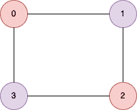
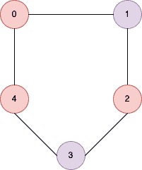

<!--yml
category: 未分类
date: 2024-10-13 06:51:34
-->

# Is Graph Bipartite Program in Go (Golang)

> 来源：[https://golangbyexample.com/graph-bipartite-golang/](https://golangbyexample.com/graph-bipartite-golang/)

Table of Contents

 **   [Overview](#Overview "Overview")

*   [Program](#Program "Program")*  *## **Overview**

An undirected graph is given. A  graph is said to be bipartite if the nodes of the graph can be partitioned into two subsets such that every edge connects one node in the first subset to some other node in the second subset.

The graph contains n nodes numbered from **0** to **n-1**. Input is a matrix named **graph** which is a 2D  matrix where graph[i] contains the node to which **ith** node is connected. For eg if

**graph[0] = [1,3]**

this means **node 0** is connected to **node 1** and **node 3**

**Example 1**



```
Input: [[1,3],[0,2],[1,3],[0,2]]
Output: true
```

**Example 2**



```
Input: [[1,4],[0,2],[1,3],[2,4],[0,3]
Output: false
```

Idea is to use DFS  here. We will try to assign either red or black color to each of the nodes. If a node is colored red then its neighbors must be colored black.

*   We are able to color  in this  way then the graph is bipartite

*   If while coloring we  find  that two nodes connected by  an edge have the same color then the graph is not bipartite

Let’s see the program for the same

# **Program**

Below is the program for the same

```
package main

import "fmt"

func isBipartite(graph [][]int) bool {
	nodeMap := make(map[int][]int)

	numNodes := len(graph)

	if numNodes == 1 {
		return true
	}
	for i := 0; i < numNodes; i++ {
		nodes := graph[i]
		for j := 0; j < len(nodes); j++ {
			nodeMap[i] = append(nodeMap[i], nodes[j])
		}
	}

	color := make(map[int]int)

	for i := 0; i < numNodes; i++ {
		if color[i] == 0 {
			color[i] = 1
			isBiPartite := visit(i, nodeMap, &color)
			if !isBiPartite {
				return false
			}
		}
	}

	return true

}

func visit(source int, nodeMap map[int][]int, color *map[int]int) bool {

	for _, neighbour := range nodeMap[source] {
		if (*color)[neighbour] == 0 {
			if (*color)[source] == 1 {
				(*color)[neighbour] = 2
			} else {
				(*color)[neighbour] = 1
			}
			isBipartite := visit(neighbour, nodeMap, color)
			if !isBipartite {
				return false
			}
		} else {
			if (*color)[source] == (*color)[neighbour] {
				return false
			}
		}
	}

	return true
}

func main() {
	output := isBipartite([][]int{{1, 3}, {0, 2}, {1, 3}, {0, 2}})
	fmt.Println(output)

	output = isBipartite([][]int{{1, 4}, {0, 2}, {1, 3}, {2, 4}, {0, 3}})
	fmt.Println(output)

}
```

**[Output:](http://Output:)**

```
true
false
```

**Note:** Check out our Golang Advanced Tutorial. The tutorials in this series are elaborative and we have tried to cover all concepts with examples. This tutorial is for those who are looking to gain expertise and a solid understanding of golang - [Golang Advance Tutorial](https://golangbyexample.com/golang-comprehensive-tutorial/)

Also if you are interested in understanding how all design patterns can be implemented in Golang. If yes, then this post is for you - [All Design Patterns Golang](https://golangbyexample.com/all-design-patterns-golang/)

Also, check out our system design tutorial series here - [System Design Tutorial Series](https://techbyexample.com/system-design-questions/)

*   [go](https://golangbyexample.com/tag/go/)*