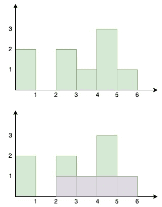

<!--yml
category: 未分类
date: 2024-10-13 06:46:54
-->

# Largest Rectangular Area in a Histogram in Go (Golang)

> 来源：[https://golangbyexample.com/largest-rectangular-area-histogram-go/](https://golangbyexample.com/largest-rectangular-area-histogram-go/)

Table of Contents

 **   [Overview](#Overview "Overview")
*   [Program](#Program "Program")*  *## **Overview**

There is a set of bars each of 1 unit width but different heights placed alongside. The height of the bars is represented using an array

```
[2, 0 , 2, 1, 3, 1]
```

The array represents that

*   The total number of bars is 5

*   The first bar is of height 2

*   The second bar is of height 0

*   The third bar is of height 2

*   The fourth bar is of height 1

*   The fifth bar is of height 3

*   The sixth bar is of height 1

The objective is to find the maximum rectangular area in the histogram. As seen from the diagram the maximum rectangular area is 4.



Below is the approach we can take to solve this question. We will use the stack and will find out the area at every index of the bar assuming that the bar is fully included in the largest rectangle.

*   Push the first element of the given array to the stack. Traverse through the given array. For every bar, we need to find out the nearest smaller bar on the left side and the nearest smaller bar on the right side

*   For the current element, check if the height of the top element is greater than the height of the current element

*   If yes then the current element is the nearest smaller bar on the right side. And the element in the stack after the top element is the nearest smaller bar on the left side.

*   Pop this element and calculate the largest rectangular area assuming that the bar is included fully. Keep track of the maximum rectangular area

*   Repeat the above two steps till the stack is empty or the height of the top element is less than the current element

*   Push the current element to the stack

*   Return the maximum rectangular area at the end.

## **Program**

Below is the program for the same.

```
package main

import "fmt"

type customStack struct {
	stack []int
}

func (c *customStack) Push(num int) {
	c.stack = append(c.stack, num)
}

func (c *customStack) Pop() (int, error) {
	length := len(c.stack)
	poppedItem := 0
	if length > 0 {
		poppedItem = c.stack[length-1]
		c.stack = c.stack[:length-1]
		return poppedItem, nil
	}
	return 0, fmt.Errorf("stack is empty")
}

func (c *customStack) Front() (int, error) {
	length := len(c.stack)
	if length > 0 {
		return c.stack[length-1], nil
	}
	return 0, fmt.Errorf("stack is empty")
}

func (c *customStack) Size() int {
	return len(c.stack)
}

func largestRectangleArea(heights []int) int {
	customStack := &customStack{}

	lenHeights := len(heights)

	customStack.Push(0)

	maxRectangleSize := heights[0]

	for i := 1; i < lenHeights; i++ {

		for customStack.Size() != 0 {
			current, _ := customStack.Front()
			if heights[current] > heights[i] {
				var rectangleUsingCurrentBar int
				current, _ := customStack.Pop()
				//Calcualte max rectangle using the current front
				previous, err := customStack.Front()
				if err != nil {
					previous = -1
				}
				rectangleUsingCurrentBar = (i - previous - 1) * heights[current]
				if rectangleUsingCurrentBar > maxRectangleSize {
					maxRectangleSize = rectangleUsingCurrentBar
				}
			} else {
				break
			}
		}
		customStack.Push(i)
	}

	front, err := customStack.Front()
	if err != nil {
		return maxRectangleSize
	}
	var rectangleUsingCurrentBar int
	for customStack.Size() != 0 {
		current, _ := customStack.Pop()
		previous, err := customStack.Front()
		if err != nil {
			previous = -1
		}
		rectangleUsingCurrentBar = (front - previous) * heights[current]
		if rectangleUsingCurrentBar > maxRectangleSize {
			maxRectangleSize = rectangleUsingCurrentBar
		}
	}
	return maxRectangleSize
}

func main() {
	output := largestRectangleArea([]int{2, 0, 2, 1, 3, 1})
	fmt.Println(output)
} 
```

**Output**

```
4
```

**Note:** Check out our Golang Advanced Tutorial. The tutorials in this series are elaborative and we have tried to cover all concepts with examples. This tutorial is for those who are looking to gain expertise and a solid understanding of golang – [Golang Advance Tutorial](https://golangbyexample.com/golang-comprehensive-tutorial/)

Also if you are interested in understanding how all design patterns can be implemented in Golang. If yes, then this post is for you –[All Design Patterns Golang](https://golangbyexample.com/all-design-patterns-golang/)

*   [go](https://golangbyexample.com/tag/go/)*   [golang](https://golangbyexample.com/tag/golang/)*