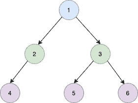

<!--yml
category: 未分类
date: 2024-10-13 06:45:04
-->

# Level Order Traversal of a binary tree in Go (Golang)

> 来源：[https://golangbyexample.com/level-order-traversal-binary-tree-golang/](https://golangbyexample.com/level-order-traversal-binary-tree-golang/)

Table of Contents

 **   [Overview](#Overview "Overview")
*   [Program](#Program "Program")*  *## **Overview**

The objective is to print the binary tree level by level. For example, if let’s say we have below binary tree



Here we have

*   Node 1 on level 1

*   Node 2 and node 3 on level 2

*   Node 4, node 5, and node 6 on level 3

So the output should be

```
[[1] [2 3] [4 5 6]]
```

## **Program**

Below is the program for the same

```
package main

import (
	"fmt"
)

type TreeNode struct {
	Val   int
	Left  *TreeNode
	Right *TreeNode
}

func levelOrder(root *TreeNode) [][]int {
	levelMapNode := make(map[int][]int)
	visit(root, 0, &levelMapNode)

	output := make([][]int, 0)

	i := 0
	for true {
		_, ok := levelMapNode[i]

		if ok {
			output = append(output, levelMapNode[i])
		} else {
			break
		}
		i = i + 1

	}
	return output

}

func visit(root *TreeNode, level int, levelMapNode *map[int][]int) {
	if root == nil {
		return
	}
	_, ok := (*levelMapNode)[level]
	if ok {
		(*levelMapNode)[level] = append((*levelMapNode)[level], root.Val)
	} else {
		(*levelMapNode)[level] = []int{root.Val}
	}

	if root.Left != nil {
		visit(root.Left, level+1, levelMapNode)
	}

	if root.Right != nil {
		visit(root.Right, level+1, levelMapNode)
	}
	return
}

func main() {
	root := TreeNode{Val: 1}
	root.Left = &TreeNode{Val: 2}
	root.Right = &TreeNode{Val: 3}
	root.Right.Left = &TreeNode{Val: 4}
	root.Right.Right = &TreeNode{Val: 5}

	output := levelOrder(&root)
	fmt.Println(output)

}
```

**Output**

```
[[1] [2 3] [4 5 6]]
```

**Note:** Check out our Golang Advanced Tutorial. The tutorials in this series are elaborative and we have tried to cover all concepts with examples. This tutorial is for those who are looking to gain expertise and a solid understanding of golang – [Golang Advance Tutorial](https://golangbyexample.com/golang-comprehensive-tutorial/)

Also if you are interested in understanding how all design patterns can be implemented in Golang. If yes, then this post is for you –[All Design Patterns Golang](https://golangbyexample.com/all-design-patterns-golang/)

*   [go](https://golangbyexample.com/tag/go/)*   [golang](https://golangbyexample.com/tag/golang/)*