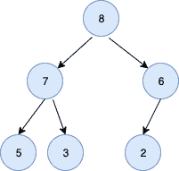

<!--yml
category: 未分类
date: 2024-10-13 06:05:42
-->

# MaxHeap in Golang

> 来源：[https://golangbyexample.com/maxheap-in-golang/](https://golangbyexample.com/maxheap-in-golang/)

Table of Contents

 **   [Introduction](#Introduction "Introduction")
*   [Operations on Maxheap](#Operations_on_Maxheap "Operations on Maxheap")
*   [Implementation](#Implementation "Implementation")*  *# **Introduction**

A MaxHeap is a complete binary tree in which the value of the parent node is greater than or equal to the value of its left and right child. A complete binary tree is a binary tree in which all levels are full except the last level.

We use an array to represent a maxheap. The root element is arr[0]. For an index i we have

*   Left Child – 2*i + 1
*   Right Child – 2*i + 2

Below is a representation of a maxheap



The corresponding array would be [8, 7, 6, 5, 3, 2]

For 0 index we have

*   Left Child – 2*0 + 1 = 1
*   Right Child – 2*0 + 2 = 2

Thus arr[0] i.e 8 has left child as arr[1] i.e, 7 and right child as arr[2] i.e 6

Since each node value is greater or equal to the value of its children, therefore, value at the root is the largest value.

# **Operations on Maxheap**

*   **Insert an Element**– takes O(log n) time. If the inserted value is larger than its parent, then we need to traverse up. This traversal continues up till the inserted value is smaller than its parent or the inserted value becomes the root itself. The second case will happen when the inserted value is the largest.

*   **Remove Maximum Element** – takes O(log n) time. It saves the root value and then replaces it with the last value in the array. It then maxheapifies the root which takes O(log n) time as it traverses down until it is more than its parent.

*   **Get Maximum** – takes O(1) times. Returns the root value

# **Implementation**

```
package main

import "fmt"

type maxheap struct {
    heapArray []int
    size      int
    maxsize   int
}

func newMaxHeap(maxsize int) *maxheap {
    maxheap := &maxheap{
        heapArray: []int{},
        size:      0,
        maxsize:   maxsize,
    }
    return maxheap
}

func (m *maxheap) leaf(index int) bool {
    if index >= (m.size/2) && index <= m.size {
        return true
    }
    return false
}

func (m *maxheap) parent(index int) int {
    return (index - 1) / 2
}

func (m *maxheap) leftchild(index int) int {
    return 2*index + 1
}

func (m *maxheap) rightchild(index int) int {
    return 2*index + 2
}

func (m *maxheap) insert(item int) error {
    if m.size >= m.maxsize {
        return fmt.Errorf("Heap is full")
    }
    m.heapArray = append(m.heapArray, item)
    m.size++
    m.upHeapify(m.size - 1)
    return nil
}

func (m *maxheap) swap(first, second int) {
    temp := m.heapArray[first]
    m.heapArray[first] = m.heapArray[second]
    m.heapArray[second] = temp
}

func (m *maxheap) upHeapify(index int) {
    for m.heapArray[index] > m.heapArray[m.parent(index)] {
        m.swap(index, m.parent(index))
        index = m.parent(index)
    }
}

func (m *maxheap) downHeapify(current int) {
    if m.leaf(current) {
        return
    }
    largest := current
    leftChildIndex := m.leftchild(current)
    rightRightIndex := m.rightchild(current)
    //If current is smallest then return
    if leftChildIndex < m.size && m.heapArray[leftChildIndex] > m.heapArray[largest] {
        largest = leftChildIndex
    }
    if rightRightIndex < m.size && m.heapArray[rightRightIndex] > m.heapArray[largest] {
        largest = rightRightIndex
    }
    if largest != current {
        m.swap(current, largest)
        m.downHeapify(largest)
    }
    return
}

func (m *maxheap) buildMaxHeap() {
    for index := ((m.size / 2) - 1); index >= 0; index-- {
        m.downHeapify(index)
    }
}

func (m *maxheap) remove() int {
    top := m.heapArray[0]
    m.heapArray[0] = m.heapArray[m.size-1]
    m.heapArray = m.heapArray[:(m.size)-1]
    m.size--
    m.downHeapify(0)
    return top
}

func main() {
    inputArray := []int{6, 5, 3, 7, 2, 8}
    maxHeap := newMaxHeap(len(inputArray))
    for i := 0; i < len(inputArray); i++ {
        maxHeap.insert(inputArray[i])
    }
    maxHeap.buildMaxHeap()
    fmt.Println("The Max Heap is ")
    for i := 0; i < len(inputArray); i++ {
        fmt.Println(maxHeap.remove())
    }
}
```

**Output:**

```
8
7
6
5
3
2
```

*   [go](https://golangbyexample.com/tag/go/)*   [maxheap](https://golangbyexample.com/tag/maxheap/)*   [maxheap in go](https://golangbyexample.com/tag/maxheap-in-go/)*