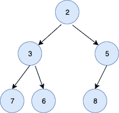

<!--yml
category: 未分类
date: 2024-10-13 06:05:37
-->

# MinHeap in Golang

> 来源：[https://golangbyexample.com/minheap-in-golang/](https://golangbyexample.com/minheap-in-golang/)

Table of Contents

 **   [Introduction](#Introduction "Introduction")
*   [Operations on Minheap](#Operations_on_Minheap "Operations on Minheap")
*   [Implementation](#Implementation "Implementation")*  *# **Introduction**

A MinHeap is a complete binary tree in which the value of the parent node is less than or equal to the value of its left and right child. A complete binary tree is a binary tree in which all levels are full except the last level.

We use an array to represent a minheap. The root element is arr[0]. For an index i we have

*   Left Child – 2*i + 1
*   Right Child – 2*i + 2

Below is a representation of a minheap



The corresponding array would be [2, 3, 5, 7, 6, 8]

For 0 index we have

*   Left Child – 2*0 + 1 = 1
*   Right Child – 2*0 + 2 = 2

Thus arr[0] i.e 2 has left child as arr[1] i.e, 3 and right child as arr[2] i.e 5

Since each node value is less or equal to the value of its children, therefore, value at the root is the smallest value.

# **Operations on Minheap**

*   **Insert an Element**– takes O(log n) time. If the inserted value is smaller than its parent, then we need to traverse up to fix. This traversal continues up till the inserted value is greater than its parent or the inserted value becomes the root itself. The second case will happen when the inserted value is the smallest.

*   **Remove Minimum Element** – takes O(log n) time. It saves the root value and then replaces it with the last value in the array. It then minheapifies the root which takes O(log n) time as it traverses down until it is less than its parent.

*   **Get Minimum** – takes O(1) times. Returns the root value

# **Implementation**

```
package main

import "fmt"

type minheap struct {
    heapArray []int
    size      int
    maxsize   int
}

func newMinHeap(maxsize int) *minheap {
    minheap := &minheap{
        heapArray: []int{},
        size:      0,
        maxsize:   maxsize,
    }
    return minheap
}

func (m *minheap) leaf(index int) bool {
    if index >= (m.size/2) && index <= m.size {
        return true
    }
    return false
}

func (m *minheap) parent(index int) int {
    return (index - 1) / 2
}

func (m *minheap) leftchild(index int) int {
    return 2*index + 1
}

func (m *minheap) rightchild(index int) int {
    return 2*index + 2
}

func (m *minheap) insert(item int) error {
    if m.size >= m.maxsize {
        return fmt.Errorf("Heap is full")
    }
    m.heapArray = append(m.heapArray, item)
    m.size++
    m.upHeapify(m.size - 1)
    return nil
}

func (m *minheap) swap(first, second int) {
    temp := m.heapArray[first]
    m.heapArray[first] = m.heapArray[second]
    m.heapArray[second] = temp
}

func (m *minheap) upHeapify(index int) {
    for m.heapArray[index] < m.heapArray[m.parent(index)] {
        m.swap(index, m.parent(index))
        index = m.parent(index)
    }
}

func (m *minheap) downHeapify(current int) {
    if m.leaf(current) {
        return
    }
    smallest := current
    leftChildIndex := m.leftchild(current)
    rightRightIndex := m.rightchild(current)
    //If current is smallest then return
    if leftChildIndex < m.size && m.heapArray[leftChildIndex] < m.heapArray[smallest] {
        smallest = leftChildIndex
    }
    if rightRightIndex < m.size && m.heapArray[rightRightIndex] < m.heapArray[smallest] {
        smallest = rightRightIndex
    }
    if smallest != current {
        m.swap(current, smallest)
        m.downHeapify(smallest)
    }
    return
}
func (m *minheap) buildMinHeap() {
    for index := ((m.size / 2) - 1); index >= 0; index-- {
        m.downHeapify(index)
    }
}

func (m *minheap) remove() int {
    top := m.heapArray[0]
    m.heapArray[0] = m.heapArray[m.size-1]
    m.heapArray = m.heapArray[:(m.size)-1]
    m.size--
    m.downHeapify(0)
    return top
}

func main() {
    inputArray := []int{6, 5, 3, 7, 2, 8}
    minHeap := newMinHeap(len(inputArray))
    for i := 0; i < len(inputArray); i++ {
        minHeap.insert(inputArray[i])
    }
    minHeap.buildMinHeap()
    for i := 0; i < len(inputArray); i++ {
        fmt.Println(minHeap.remove())
    }
    fmt.Scanln()
}
```

**Output:**

```
2
3
5
6
7
8
```

*   [go](https://golangbyexample.com/tag/go/)*   [meanheap in go](https://golangbyexample.com/tag/meanheap-in-go/)*