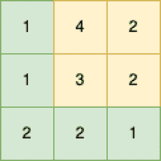

<!--yml
category: 未分类
date: 2024-10-13 06:48:40
-->

# Minimum Path Sum Program in Go (Golang)

> 来源：[https://golangbyexample.com/minimum-path-sum-golang/](https://golangbyexample.com/minimum-path-sum-golang/)

Table of Contents

 **   [Overview](#Overview "Overview")
*   [Program](#Program "Program")*  *## **Overview**

There is an m*n matrix that contains non-negative integers. The objective is to find a minimum sum path moving from Top-Left to Bottom-Right. You can only move right or down.

For example, let’s say we have below matrix



Then minimum sum path is below the path. It has a sum of 1+1+2+2+1 = 7

```
[{0,0}, {1,0}, {1,1}, {2,1}, {2,2}
```

It is a dynamic programming question as it has an optimal substructure. Let’s say the name of the matrix is input

*   minPath[0][0] = input[0][0]

*   minPath[i][j] = ming(minPath[i-1][j], minPath[i][j-1])) + input[i][j]

where minPath[i][j] represents the minimum sum from {0,0} to {i,j}

## **Program**

Here is the program for the same.

```
package main

import "fmt"

func minPathSum(grid [][]int) int {
	rows := len(grid)
	columns := len(grid[0])
	sums := make([][]int, rows)

	for i := 0; i < rows; i++ {
		sums[i] = make([]int, columns)
	}

	sums[0][0] = grid[0][0]

	for i := 1; i < rows; i++ {
		sums[i][0] = grid[i][0] + sums[i-1][0]
	}

	for i := 1; i < columns; i++ {
		sums[0][i] = grid[0][i] + sums[0][i-1]
	}

	for i := 1; i < rows; i++ {
		for j := 1; j < columns; j++ {
			if sums[i-1][j] < sums[i][j-1] {
				sums[i][j] = grid[i][j] + sums[i-1][j]
			} else {
				sums[i][j] = grid[i][j] + sums[i][j-1]
			}
		}
	}

	return sums[rows-1][columns-1]

}

func main() {
	input := [][]int{{1, 4, 2}, {1, 3, 2}, {2, 2, 1}}
	output := minPathSum(input)
	fmt.Println(output)
}
```

**Output**

```
7
```

**Note:** Check out our Golang Advanced Tutorial. The tutorials in this series are elaborative and we have tried to cover all concepts with examples. This tutorial is for those who are looking to gain expertise and a solid understanding of golang - [Golang Advance Tutorial](https://golangbyexample.com/golang-comprehensive-tutorial/)

Also if you are interested in understanding how all design patterns can be implemented in Golang. If yes, then this post is for you -[All Design Patterns Golang](https://golangbyexample.com/all-design-patterns-golang/)

*   [go](https://golangbyexample.com/tag/go/)*   [golang](https://golangbyexample.com/tag/golang/)*