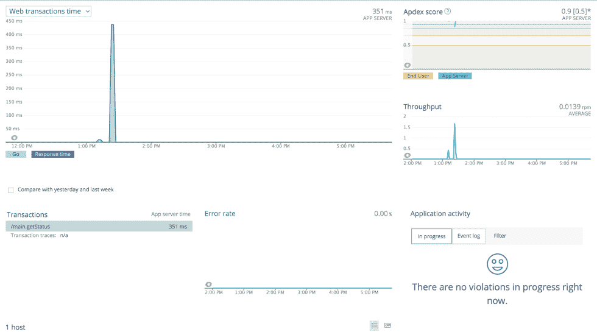
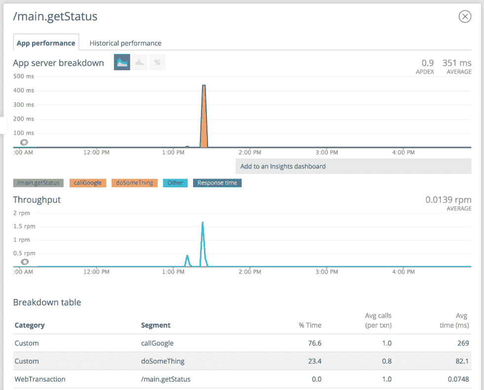

<!--yml
category: 未分类
date: 2024-10-13 06:00:28
-->

# New Relic Example in GoLang with Deep Instrumentation

> 来源：[https://golangbyexample.com/go-new-relic-example-in-golang-with-deep-instrumentation/](https://golangbyexample.com/go-new-relic-example-in-golang-with-deep-instrumentation/)

It is easy to integrate newrelic in GoLang. We just need one of the middleware to use the newrelic. Application. For eg in GIN framework of GO we can do something like this

```
nrConfig := newrelic.NewConfig("test", "somekey")
nrapp, err = newrelic.NewApplication(nrConfig)
r := gin.Default()
r.Use(nrgin.Middleware(nrapp))
```

With this change, you will able to see your application in new relic something like this



But you will not be able to see the breakdown of api in “Transaction” because Go is a compiled language. Hence unlike JAVA to see the breakup of the API you have to do explicit deep instrumentation in golang. Below is a simple example of how to use newrelic in the GIN web framework of go with deep instrumentation and using context.

**main.go**

```
package main

import (
	"context"
	"net/http"
	"time"

	"github.com/gin-gonic/gin"
	nr "github.com/newrelic/go-agent"
	"github.com/newrelic/go-agent/_integrations/nrgin/v1"
)

type key int

const (
   keyNrID key = iota
)

var (
    nrapp newrelic.Application
)

func main() {
	initNewRelic()
	r := gin.Default()
	r.Use(nrgin.Middleware(nrapp))
	r.Use(setNewRelicInContext())

	setUpRoutes(r)
	// Listen and Server in 0.0.0.0:8080
	s := &http.Server{
		Addr:         ":8080",
		Handler:      r,
	}
	s.ListenAndServe()
}

//populateNewRelicInContext get the request context populated
func setNewRelicInContext() gin.HandlerFunc {

	return func(c *gin.Context) {
		//Setup context
		ctx := c.Request.Context()

		//Set newrelic context
		var txn nr.Transaction
		//newRelicTransaction is the key populated by nrgin Middleware
		value, exists := c.Get("newRelicTransaction")
		if exists {
			if v, ok := value.(nr.Transaction); ok {
				txn = v
			}
			ctx = context.WithValue(ctx, keyNrID, txn)
		}
		c.Request = c.Request.WithContext(ctx)
		c.Next()
	}
}

func initNewRelic() {
	var err error
	nrConfig := newrelic.NewConfig("test", "somekey")
	nrapp, err = newrelic.NewApplication(nrConfig)
	if err != nil {
		panic("Failed to setup NewRelic: " + err.Error())
	}
} 
```

**routes.go**

```
package main

import (
	"context"
	"fmt"
	"net/http"
	"time"
	"github.com/gin-gonic/gin"
	nr "github.com/newrelic/go-agent"
)

//setUpRoutes set all the routes
func setUpRoutes(r *gin.Engine) {
	r.GET("/app/status", getStatus)
}

func getStatus(c *gin.Context) {
	ctx := c.Request.Context()
	err := callGoogle(ctx)
	if err != nil {
		c.Writer.WriteHeader(400)
		return
	}
	doSomeThing(ctx)
	c.Writer.WriteHeader(200)
}

func callGoogle(ctx context.Context) error {
	if t := ctx.Value(keyNrID); t != nil {
		txn := t.(nr.Transaction)
		defer nr.StartSegment(txn, "callGoogle").End()
	}
	resp, err := http.Get("http://google.com/")
	if err != nil {
		return fmt.Errorf("Some error occuerd %s", err.Error())
	}
	defer resp.Body.Close()
	return nil
}

func doSomeThing(ctx context.Context) {
	if t := ctx.Value(keyNrID); t != nil {
		txn := t.(nr.Transaction)
		defer nr.StartSegment(txn, "doSomeThing").End()
	}
	time.Sleep(time.Millisecond * 100)
}
```

This is how the breakdown is visible in NewRelic. See it is showing how much average time is spent in “callGoogle” and “doSomeThing” function.

*   [context](https://golangbyexample.com/tag/context/)*   [go](https://golangbyexample.com/tag/go/)*   [golang](https://golangbyexample.com/tag/golang/)*   [intrumentation](https://golangbyexample.com/tag/intrumentation/)*   [newrelic](https://golangbyexample.com/tag/newrelic/)