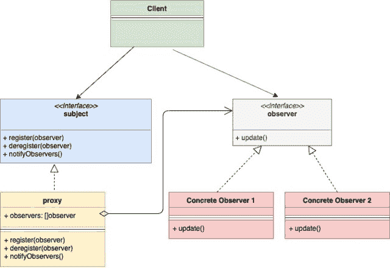

<!--yml
category: 未分类
date: 2024-10-13 06:03:59
-->

# Observer Design Pattern in Go (Golang)

> 来源：[https://golangbyexample.com/observer-design-pattern-golang/](https://golangbyexample.com/observer-design-pattern-golang/)

Note: Interested in understanding how all other design patterns can be implemented in GO. Please see this full reference – [All Design Patterns in Go (Golang)](https://golangbyexample.com/all-design-patterns-golang/)

Table of Contents

 **   [Introduction:](#Introduction "Introduction:")
*   [UML Diagram:](#UML_Diagram "UML Diagram:")
*   [Mapping:](#Mapping "Mapping:")
*   [Practical Example:](#Practical_Example "Practical Example:")
*   [Full Working Code:](#Full_Working_Code "Full Working Code:")*  *# **Introduction:**

Observer Design Pattern is a behavioral design pattern. This pattern allows an instance **(called subject)** to publish events to other multiple instances **(called observers).**  These **observers** subscribe to the **subject** and hence get notified by events in case of any change happening in the **subject.**

Let’s take an example. In the E-Commerce website, many items go out of stock. There can be customers, who are interested in a particular item that went out of stock. There are three solutions to this problem

1.  The customer keeps checking the availability of the item at some frequency.
2.  E-Commerce bombard customers with all new items available which are in stock
3.  The customer subscribes only to the particular item he is interested in and gets notified in the case that item is available. Also, multiple customers can subscribe to the same product

Option 3 is most viable, and this is what Observer Patter is all about. The major components of the observer pattern are:

1.  **Subject** – It is the instance to which publishes an event when anything changes. 
2.  **Observer** – It subscribes to the subject and gets notified by the events.

Generally, **Subject** and **Observer** are implemented as an interface. Concrete implementation of both are used

# **UML Diagram:**



# **Mapping:**

The below table represents the mapping from the UML diagram actors to actual implementation actors in **“Practical Example”** below

| Subject | subject.go |
| Concrete Subject | item.go |
| observer | observer.go |
| Concrete Observer 1 | customer.go |
| Client | main.go |

# **Practical Example:**

**subject.go**

```
package main

type subject interface {
    register(Observer observer)
    deregister(Observer observer)
    notifyAll()
}
```

**item.go**

```
package main

import "fmt"

type item struct {
    observerList []observer
    name         string
    inStock      bool
}

func newItem(name string) *item {
    return &item{
        name: name,
    }
}

func (i *item) updateAvailability() {
    fmt.Printf("Item %s is now in stock\n", i.name)
    i.inStock = true
    i.notifyAll()
}

func (i *item) register(o observer) {
    i.observerList = append(i.observerList, o)
}

func (i *item) deregister(o observer) {
    i.observerList = removeFromslice(i.observerList, o)
}

func (i *item) notifyAll() {
    for _, observer := range i.observerList {
        observer.update(i.name)
    }
}

func removeFromslice(observerList []observer, observerToRemove observer) []observer {
    observerListLength := len(observerList)
    for i, observer := range observerList {
        if observerToRemove.getID() == observer.getID() {
            observerList[observerListLength-1], observerList[i] = observerList[i], observerList[observerListLength-1]
            return observerList[:observerListLength-1]
        }
    }
    return observerList
}
```

**observer.go**

```
package main

type observer interface {
    update(string)
    getID() string
}
```

**customer.go**

```
package main

import "fmt"

type customer struct {
    id string
}

func (c *customer) update(itemName string) {
    fmt.Printf("Sending email to customer %s for item %s\n", c.id, itemName)
}

func (c *customer) getID() string {
    return c.id
}
```

**main.go**

```
package main

func main() {
    shirtItem := newItem("Nike Shirt")
    observerFirst := &customer{id: "abc@gmail.com"}
    observerSecond := &customer{id: "xyz@gmail.com"}
    shirtItem.register(observerFirst)
    shirtItem.register(observerSecond)
    shirtItem.updateAvailability()
}
```

**Output:**

```
Item Nike Shirt is now in stock
Sending email to customer abc@gmail.com for item Nike Shirt
Sending email to customer xyz@gmail.com for item Nike Shirt
```

# **Full Working Code:**

```
package main

import "fmt"

type subject interface {
    register(Observer observer)
    deregister(Observer observer)
    notifyAll()
}

type item struct {
    observerList []observer
    name         string
    inStock      bool
}

func newItem(name string) *item {
    return &item{
        name: name,
    }
}

func (i *item) updateAvailability() {
    fmt.Printf("Item %s is now in stock\n", i.name)
    i.inStock = true
    i.notifyAll()
}

func (i *item) register(o observer) {
    i.observerList = append(i.observerList, o)
}

func (i *item) deregister(o observer) {
    i.observerList = removeFromslice(i.observerList, o)
}

func (i *item) notifyAll() {
    for _, observer := range i.observerList {
        observer.update(i.name)
    }
}

func removeFromslice(observerList []observer, observerToRemove observer) []observer {
    observerListLength := len(observerList)
    for i, observer := range observerList {
        if observerToRemove.getID() == observer.getID() {
            observerList[observerListLength-1], observerList[i] = observerList[i], observerList[observerListLength-1]
            return observerList[:observerListLength-1]
        }
    }
    return observerList
}

type observer interface {
    update(string)
    getID() string
}

type customer struct {
    id string
}

func (c *customer) update(itemName string) {
    fmt.Printf("Sending email to customer %s for item %s\n", c.id, itemName)
}

func (c *customer) getID() string {
    return c.id
}

func main() {
    shirtItem := newItem("Nike Shirt")
    observerFirst := &customer{id: "abc@gmail.com"}
    observerSecond := &customer{id: "xyz@gmail.com"}
    shirtItem.register(observerFirst)
    shirtItem.register(observerSecond)
    shirtItem.updateAvailability()
}
```

**Output:**

```
Item Nike Shirt is now in stock
Sending email to customer abc@gmail.com for item Nike Shirt
Sending email to customer xyz@gmail.com for item Nike Shirt
```

*   [design](https://golangbyexample.com/tag/design/)*   [golang](https://golangbyexample.com/tag/golang/)*   [observer](https://golangbyexample.com/tag/observer/)*   [observer design pattern in go](https://golangbyexample.com/tag/observer-design-pattern-in-go/)*   [pattern](https://golangbyexample.com/tag/pattern/)*