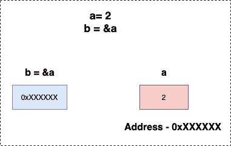

<!--yml
category: 未分类
date: 2024-10-13 06:28:47
-->

# Pointer in Go (Golang)

> 来源：[https://golangbyexample.com/pointer-golang/](https://golangbyexample.com/pointer-golang/)

This is the  chapter 15 of the golang comprehensive tutorial series. Refer to this link for other chapters of the series – [Golang Comprehensive Tutorial Series](https://golangbyexample.com/golang-comprehensive-tutorial/)

**Next Tutorial** – [Struct](https://golangbyexample.com/struct-in-golang-complete-guide/)
**Previous Tutorial** – [Defer keyword](https://golangbyexample.com/defer-golang)

Now let’s check out the current tutorial. Below is the table of contents for current tutorial.

Table of Contents

 **   [Overview](#Overview "Overview")
*   [Declaration of a Pointer](#Declaration_of_a_Pointer "Declaration of a Pointer")
*   [Initialization of a Pointer](#Initialization_of_a_Pointer "Initialization of a Pointer")
    *   [Using the new operator](#Using_the_new_operator "Using the new operator")
    *   [Using the ambersand ‘&’ operator](#Using_the_ambersand_operator "Using the ambersand ‘&’ operator")
*   [About * or dereferencing pointer](#About_or_dereferencing_pointer "About * or dereferencing pointer")
*   [Pointer to a Pointer](#Pointer_to_a_Pointer "Pointer to a Pointer")
*   [Pointer Arithmetic](#Pointer_Arithmetic "Pointer Arithmetic")
*   [Default Zero Value of Pointer](#Default_Zero_Value_of_Pointer "Default Zero Value of Pointer")
*   [Conclusion](#Conclusion "Conclusion")*  *# **Overview**

Pointer is a variable that holds a memory address of another variable.

# **Declaration of a Pointer**

In the below example, **ex** is the pointer of **T** type.

```
var ex *T
```

In declaration the pointer value is set to its default zero value which is nil.

# **Initialization of a Pointer**

There are two ways to initialize a pointer

*   Using the **new** operator

*   Using the ambersand **‘&’** operator

## **Using the new operator**

Pointers can  be initialized using **new** operator

```
a := new(int)
*a = 10
fmt.Println(*a) //Output will be 10
```

***** operator can be used to dereference a pointer which means getting the value at address stored in the pointer

```
fmt.Println(*a) //Print the value stored at address a
```

## Using the ambersand **‘&’** operator

**&** used to get the address of a variable

```
a := 2
b := &a
fmt.Println(*b) //Output will be 2
```



Let’s see a working code covering all above points

```
package main

import "fmt"

func main() {
    //Declare
    var b *int
    a := 2
    b = &a

    //Will print a address. Output will be different everytime.
    fmt.Println(b)
    fmt.Println(*b)
    b = new(int)
    *b = 10
    fmt.Println(*b) 
}
```

**Output:**

```
2
10
0xc0000b0018
```

# **About * or dereferencing pointer**

***** operator can be used to:

*   Dereference a pointer which means getting the value at address stored in the pointer.

*   Change the value at that pointer location as well

```
package main

import "fmt"

func main() {
	a := 2
	b := &a
	fmt.Println(a)
	fmt.Println(*b)

	*b = 3
	fmt.Println(a)
	fmt.Println(*b)

	a = 4
	fmt.Println(a)
	fmt.Println(*b)
}
```

**Output**

```
2
2
3
3
4
4
```

Both **a** and ***b** refer to same variable internally.  Hence changing value of one reflects in another . Also ***** and **&** can be used together as well. But they will  cancel out each other.

Hence below two are equivalent and will print 2

*   a
*   *&a

Also below three are equivalent and will print the address of variable a which is stored in b variable

*   b
*   *&b
*   &*b

Note:  *a is not a valid operation as a is not a pointer

# **Pointer to a Pointer**

It is also possible to create a pointer to a pointer in go

```
a := 2
b := &a
c := &b
```

**c** is a pointer to a pointer here. It stores the address of **b** which in turn stores the address of **a**. Double dereferencing using the ***** operator the can be used to print the value at pointer to pointer. Hence****c** will print the value at which 2

Below diagram depicits pointer to pointer.

*   **b** contains the address of **a**

*   **c** contains the address of **b**


Let’s see. a program depicting pointer to pointer

```
package main

import "fmt"

func main() {
	a := 2
	b := &a
	c := &b

	fmt.Printf("a: %d\n", a)
	fmt.Printf("b: %x\n", b)
	fmt.Printf("c: %x\n", c)

	fmt.Println()
	fmt.Printf("a: %d\n", a)
	fmt.Printf("*&a: %d\n", *&a)
	fmt.Printf("*b: %d\n", *b)
	fmt.Printf("**c: %d\n", **c)

	fmt.Println()
	fmt.Printf("&a: %d\n", &a)
	fmt.Printf("b: %d\n", b)
	fmt.Printf("&*b: %d\n", &*b)
	fmt.Printf("*&b: %d\n", *&b)
	fmt.Printf("*c: %d\n", *c)

	fmt.Println()
	fmt.Printf("b: %d\n", &b)
	fmt.Printf("*c: %d\n", c)
}
```

**Output**

```
a: 2
b: c000018078
c: c00000e028

a: 2
*&a: 2
*b: 2
**c: 2

&a: 824633819256
b: 824633819256
&*b: 824633819256
*&b: 824633819256
*c: 824633819256

b: 824633778216
*c: 824633778216
```

From output is clear that

Below are equivalent and equal to value of variable a which is 2

*   a
*   *&a
*   *b
*   **c

**Below are equivalent and equal to value of variable b which is address of a**

 ***   &a
*   b
*   &*b
*   *&b
*   *c

****Below are equivalent and equal to value of variable c which is address of b****

 *****   b
*   *c

# **Pointer Arithmetic**

Pointer arithmetic is not possible in golang unlike C language. It raises compilation error.

```
package main
func main() {
    a := 1
    b := &a
    b = b + 1
}
```

**Output**

Above program raises compilation error

```
invalid operation: b + 1 (mismatched types *int and int)
```

# **Default Zero Value of Pointer**

Default zero value of a pointer is nil.. Let’s see a program for it

```
package main

import "fmt"

func main() {
    var a *int
    fmt.Print("Default Zero Value of a pointer: ")
    fmt.Println(a)
}
```

**Output:**

```
Default value of pointer: 
```

# **Conclusion**

This is all about pointers in golang. Hope you have liked this article. Please share feedback/improvements/mistakes in comments

**Next Tutorial** – [Struct](https://golangbyexample.com/struct-in-golang-complete-guide/)
**Previous Tutorial** – [Defer keyword](https://golangbyexample.com/defer-golang)

*   [go](https://golangbyexample.com/tag/go/)*   [golang](https://golangbyexample.com/tag/golang/)*******