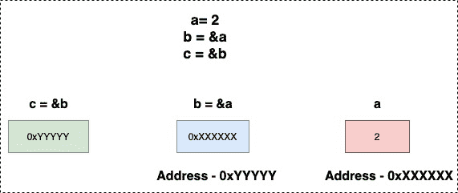

<!--yml
category: 未分类
date: 2024-10-13 06:28:51
-->

# Pointer to a Pointer in Go (Golang)

> 来源：[https://golangbyexample.com/pointer-to-pointer-golang/](https://golangbyexample.com/pointer-to-pointer-golang/)

Table of Contents

 **   [Overview](#Overview "Overview")
*   [Program](#Program "Program")*  *# **Overview**

It is also possible to create a pointer to a pointer in go

```
a := 2
b := &a
c := &b
```

**c** is a pointer to a pointer here. It stores the address of **b** which in turn stores the address of **a**. Double dereferencing using the ***** operator the can be used to print the value at pointer to pointer. Hence****c** will print the value at which 2

Below diagram depicits  pointer to pointer.

*   **b** contains the address of **a**

*   **c** contains the address of **b**



# **Program**

Let’s see a program depicting pointer to pointer

```
package main

import "fmt"

func main() {
	a := 2
	b := &a
	c := &b

	fmt.Printf("a: %d\n", a)
	fmt.Printf("b: %x\n", b)
	fmt.Printf("c: %x\n", c)

	fmt.Println()
	fmt.Printf("a: %d\n", a)
	fmt.Printf("*&a: %d\n", *&a)
	fmt.Printf("*b: %d\n", *b)
	fmt.Printf("**c: %d\n", **c)

	fmt.Println()
	fmt.Printf("&a: %d\n", &a)
	fmt.Printf("b: %d\n", b)
	fmt.Printf("&*b: %d\n", &*b)
	fmt.Printf("*&b: %d\n", *b)
	fmt.Printf("*c: %d\n", *c)

	fmt.Println()
	fmt.Printf("b: %d\n", &b)
	fmt.Printf("*c: %d\n", c)
}
```

**Output**

```
a: 2
b: c000018078
c: c00000e028

a: 2
*&a: 2
*b: 2
**c: 2

&a: 824633819256
b: 824633819256
&*b: 824633819256
*&b: 824633819256
*c: 824633819256

b: 824633778216
*c: 824633778216
```

From output is clear that

Below are equivalent and equal to value of variable **a** which is 2

*   a
*   *&a
*   *b
*   **c

**Below are equivalent and equal to value of variable **b** which is address of **a****

 ***   &a
*   b
*   &*b
*   *&b
*   *c

****Below are equivalent and equal to value of variable **c** which is address of **b******

 *****   b
*   *c

*   [go](https://golangbyexample.com/tag/go/)*   [golang](https://golangbyexample.com/tag/golang/)*******